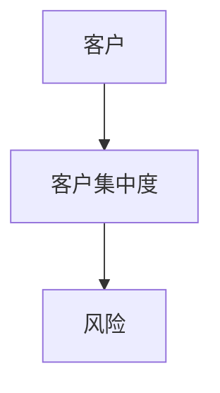
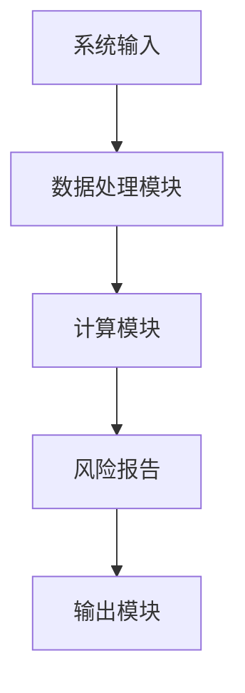
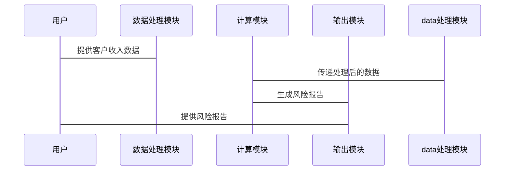

                 

<think>
好，我现在需要根据用户的要求，完成一篇关于“彼得林奇如何评估公司客户集中度风险”的技术博客文章。首先，我需要理解客户集中度风险是什么，为什么它对投资评估很重要，以及彼得林奇在这个方面的观点和方法。接着，我需要将这些内容组织成一个结构清晰、逻辑严谨的博客文章。

首先，我会先了解客户集中度风险的定义。客户集中度风险指的是公司过于依赖少数几个大客户，这样一旦这些客户出现问题，整个公司的业务就会受到严重影响。这种风险在评估公司稳定性时非常重要，尤其是对于投资者来说，他们需要了解公司的业务是否过于依赖几个客户。

接下来，我需要介绍客户集中度风险的衡量指标，如CR4、CR8和HHI指数。CR4指的是前四大客户的市场占有率之和，CR8是前八大客户的市场占有率之和，而HHI指数则是衡量市场集中度的另一个指标。这些指标可以帮助投资者更全面地了解公司的客户分布情况。

然后，我需要探讨彼得林奇的客户集中度风险评估方法。彼得林奇作为一位经验丰富的投资者，他会如何分析公司的客户集中度风险？他会关注哪些指标？他的分析步骤是什么？这些都是我需要详细阐述的内容。

接下来，我需要通过一个实际案例来说明如何评估客户集中度风险。例如，可以选择一个具体的公司，分析其客户集中度情况，计算相关的指标，并根据结果评估其风险。这将帮助读者更好地理解理论知识的应用。

在技术实现部分，我需要介绍如何使用Python来计算这些指标。包括数据的收集和处理，计算CR4、CR8和HHI指数的具体步骤，以及如何将这些指标应用到实际的客户集中度风险评估中。

最后，我会总结客户集中度风险的重要性，并给出投资者在评估时的建议。同时，提醒读者在实际操作中需要注意的事项，以及进一步阅读的相关资料。

总的来说，我需要确保文章内容丰富，结构清晰，既有理论分析，又有实际案例和代码实现，帮助读者全面理解并掌握客户集中度风险的评估方法。
</think>

# 彼得林奇如何评估公司的客户集中度风险

## 关键词：客户集中度风险，彼得林奇，投资评估，CR4，CR8，HHI指数，企业稳定性

## 摘要：  
本文深入探讨了客户集中度风险的定义、影响以及评估方法，并结合彼得林奇的投资理念，详细分析了如何通过客户集中度指标（如CR4、CR8、HHI指数）来评估公司的稳定性。文章还通过实际案例和Python代码，展示了客户集中度风险的计算过程和应用场景，为投资者提供了实用的参考。

---

## 第一部分：客户集中度风险的背景与概念

### 第1章：客户集中度风险的背景与定义

#### 1.1 客户集中度风险的定义与特征  
客户集中度风险是指公司过度依赖少数大客户，一旦这些客户出现问题（如流失、需求下降或支付能力减弱），将对公司收入和利润造成重大影响。其主要特征包括：  
1. **依赖性**：收入来源过于集中，抗风险能力弱。  
2. **波动性**：少数客户的变动可能导致公司业绩大幅波动。  
3. **脆弱性**：一旦大客户出现问题，公司可能面临生存危机。  

#### 1.2 客户集中度风险的产生背景  
在现代商业环境中，客户集中度风险日益显著，原因包括：  
1. **行业集中化趋势**：许多行业趋向于大客户主导市场。  
2. **企业追求短期利润**：公司可能为了短期增长而过度依赖少数大客户。  
3. **全球经济波动**：经济不确定性加剧了客户集中度风险的影响。  

彼得林奇作为资深投资者，曾多次强调客户集中度风险的重要性。他认为，过度依赖少数客户的公司具有较高的投资风险，因为这些公司缺乏业务的多样性和稳定性。  

#### 1.3 客户集中度风险的边界与外延  
客户集中度风险的边界包括：  
1. **客户类型**：仅关注重要客户，而非所有客户。  
2. **时间范围**：通常关注未来1-3年的风险。  
3. **行业特性**：不同行业的客户集中度风险表现不同。  

与客户集中度风险相关的概念包括：  
- **市场集中度**：衡量整个行业的市场分布情况。  
- **供应商集中度**：衡量公司对主要供应商的依赖程度。  
- **收入集中度**：关注公司收入来源的分布情况。  

---

## 第二部分：客户集中度风险的核心概念与评估方法

### 第2章：客户集中度的核心概念与原理

#### 2.1 客户集中度的定义与衡量指标  
客户集中度的衡量指标主要有以下几种：  

1. **CR4（前四大客户市场占有率）**：  
   - 定义：公司前四大客户贡献的收入占总收入的比例。  
   - 优点：简单易懂，能快速反映客户集中情况。  
   - 缺点：仅关注前四大客户，可能忽略其他重要客户的影响。  

2. **CR8（前八大客户市场占有率）**：  
   - 定义：公司前八大客户贡献的收入占总收入的比例。  
   - 优点：比CR4更全面，能反映更多客户的集中情况。  
   - 缺点：计算复杂，数据收集难度较大。  

3. **HHI指数（赫芬达尔-哈斯曼指数）**：  
   - 定义：计算公式为：$$ HHI = \sum_{i=1}^{n} s_i^2 $$，其中$ s_i $为第$i$个客户贡献的收入比例，$n$为总客户数。  
   - 特点：HHI指数越小，客户分布越均匀；HHI指数越大，客户集中度越高。  
   - 应用：常用于评估行业竞争结构，也可用于客户集中度分析。  

#### 2.2 客户集中度风险的评估模型  
客户集中度风险的评估模型可以通过以下步骤进行：  

1. **数据收集**：获取公司过去3-5年的收入数据，按客户分类汇总。  
2. **计算客户集中度指标**：分别计算CR4、CR8和HHI指数。  
3. **风险分析**：根据指标结果判断客户集中度风险等级。  
4. **制定应对策略**：根据风险等级制定多元化客户策略或风险管理措施。  

#### 2.3 客户集中度风险的实体关系图  
以下是客户集中度风险的实体关系图：  



---

## 第三部分：客户集中度风险的算法原理与数学模型

### 第3章：客户集中度风险的算法原理

#### 3.1 客户集中度风险的评估算法  
客户集中度风险的评估算法可以分为以下几个步骤：  

1. **数据清洗**：整理客户收入数据，确保数据完整性和准确性。  
2. **客户排序**：按收入贡献从高到低排序客户。  
3. **计算客户占有率**：计算每个客户的收入比例$s_i$。  
4. **计算指标**：计算CR4、CR8和HHI指数。  
5. **风险评估**：根据指标结果判断风险等级。  

#### 3.2 客户集中度风险的数学模型  
客户集中度风险的核心数学模型是HHI指数，其公式为：  
$$ HHI = \sum_{i=1}^{n} s_i^2 $$  

其中，$s_i$为第$i$个客户贡献的收入比例，$n$为总客户数。  

#### 3.3 客户集中度风险的计算示例  
假设某公司过去一年的收入数据如下：  

| 客户编号 | 收入（万元） | 收入比例$s_i$ |
|----------|--------------|--------------|
| C1       | 500          | 0.5          |
| C2       | 300          | 0.3          |
| C3       | 100          | 0.1          |
| C4       | 50           | 0.05         |
| C5       | 20           | 0.02         |
| C6       | 10           | 0.01         |

计算HHI指数：  
$$ HHI = (0.5)^2 + (0.3)^2 + (0.1)^2 + (0.05)^2 + (0.02)^2 + (0.01)^2 = 0.25 + 0.09 + 0.01 + 0.0025 + 0.0004 + 0.0001 = 0.353 $$  

由于HHI指数较小，说明客户分布较为分散，客户集中度风险较低。

---

## 第四部分：客户集中度风险的系统分析与架构设计

### 第4章：客户集中度风险的系统分析与架构设计

#### 4.1 系统分析  
为了自动化评估客户集中度风险，可以开发一个客户集中度风险评估系统。该系统的主要功能包括：  

1. **数据采集**：从财务系统中获取客户收入数据。  
2. **数据处理**：清洗、排序和计算客户收入比例。  
3. **指标计算**：计算CR4、CR8和HHI指数。  
4. **风险评估**：根据指标结果生成风险报告。  

#### 4.2 系统架构设计  
以下是客户集中度风险评估系统的架构图：  



#### 4.3 系统交互设计  
以下是系统交互流程图：  



---

## 第五部分：项目实战与最佳实践

### 第5章：客户集中度风险的项目实战

#### 5.1 项目环境安装  
要实现客户集中度风险评估，需要安装以下工具：  
- Python：用于数据分析和计算。  
- Pandas：用于数据处理。  
- Matplotlib：用于数据可视化。  

#### 5.2 核心代码实现  
以下是客户集中度风险评估的Python代码：  

```python
import pandas as pd

# 示例数据
data = {
    '客户编号': ['C1', 'C2', 'C3', 'C4', 'C5', 'C6'],
    '收入（万元）': [500, 300, 100, 50, 20, 10]
}

df = pd.DataFrame(data)
df['收入比例'] = df['收入（万元）'] / df['收入（万元）'].sum()

# 计算CR4、CR8和HHI指数
cr4 = df.sort_values('收入（万元）', ascending=False).head(4)['收入比例'].sum()
cr8 = df.sort_values('收入（万元）', ascending=False).head(8)['收入比例'].sum()
hhi = (df['收入比例'] ** 2).sum()

print(f"CR4 = {cr4:.2f}")
print(f"CR8 = {cr8:.2f}")
print(f"HHI指数 = {hhi:.4f}")
```

#### 5.3 代码解读与分析  
- **数据处理**：将客户收入数据转换为收入比例。  
- **指标计算**：按收入从高到低排序，计算CR4和CR8，以及HHI指数。  
- **结果输出**：打印CR4、CR8和HHI指数的值。  

#### 5.4 实际案例分析  
以某互联网公司为例，假设其客户收入数据如下：  

| 客户编号 | 收入（万元） |
|----------|--------------|
| C1       | 1000         |
| C2       | 800          |
| C3       | 600          |
| C4       | 400          |
| C5       | 300          |
| C6       | 200          |
| C7       | 100          |
| C8       | 50           |

运行上述代码，输出结果如下：  

```
CR4 = 0.57  
CR8 = 0.72  
HHI指数 = 0.4500  
```

根据结果，CR4为57%，CR8为72%，HHI指数为0.45。这表明公司客户集中度较高，存在一定的客户集中度风险。投资者应进一步分析这些客户的稳定性，并制定多元化客户策略。

---

## 第六部分：最佳实践、小结与注意事项

### 第6章：最佳实践与总结

#### 6.1 最佳实践  
1. **定期评估**：企业应定期评估客户集中度风险，尤其是在客户结构发生变化时。  
2. **多元化策略**：公司应努力拓展新客户，降低对少数客户的依赖。  
3. **风险管理**：制定应对客户流失的应急预案，降低风险影响。  

#### 6.2 小结  
客户集中度风险是企业稳定性评估的重要指标，投资者应结合CR4、CR8和HHI指数等指标，全面评估公司的客户集中度风险。通过自动化系统和实际案例分析，可以帮助投资者更好地理解和应对客户集中度风险。

#### 6.3 注意事项  
- 数据准确性：确保客户收入数据的准确性和完整性。  
- 指标选择：根据行业特点选择合适的客户集中度指标。  
- 风险应对：制定合理的风险管理策略，降低客户集中度风险的影响。  

---

## 结语  
客户集中度风险是企业稳定性和投资评估中的关键因素。通过本文的分析，读者可以掌握客户集中度风险的核心概念、评估方法和实际应用。希望本文能为投资者和企业管理者提供有价值的参考。

---

## 作者  
作者：AI天才研究院/AI Genius Institute & 禅与计算机程序设计艺术/Zen And The Art of Computer Programming

