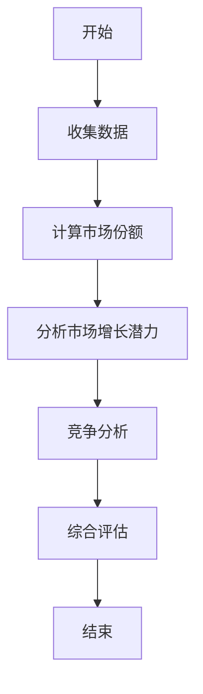
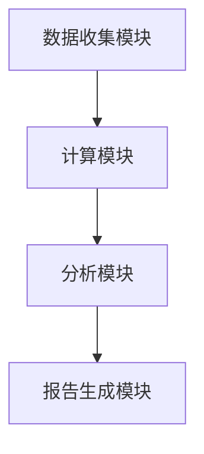
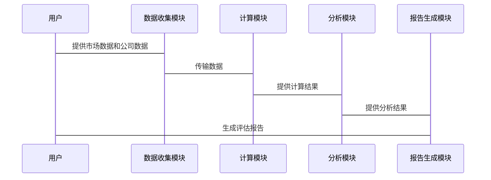

                 


# 彼得林奇如何评估公司的市场份额

> 关键词：彼得·林奇，市场份额，投资评估，市场分析，企业竞争力

> 摘要：本文详细探讨了彼得·林奇如何评估公司的市场份额。通过分析他的投资理念、市场份额的定义、评估方法以及实际案例，帮助读者理解如何在投资决策中应用这些评估方法。

---

## 第1章：彼得·林奇与市场份额评估概述

### 1.1 彼得·林奇的基本情况

彼得·林奇（Peter Lynch）是美国著名的投资经理人，被誉为“最伟大的共同基金经理”。他在富达投资管理公司管理麦哲伦基金期间，取得了令人瞩目的成绩，年化回报率高达29%，远超市场平均水平。林奇的成功不仅在于他的投资业绩，更在于他独到的投资理念和分析方法，尤其是他对公司市场份额的深刻理解。

### 1.2 彼得·林奇的投资理念

彼得·林奇的投资哲学强调深入研究公司基本面，尤其是公司的市场份额和竞争优势。他认为，市场份额是衡量一家公司竞争力的重要指标，也是预测公司未来增长潜力的关键因素。林奇主张投资者应该像老板一样思考，深入分析公司的商业模式、竞争优势和市场地位。

### 1.3 评估市场份额的重要性

市场份额是指一家公司在特定市场中所占的销售量或销售额的比例。评估市场份额可以帮助投资者判断公司的市场地位、竞争优势以及未来的增长潜力。彼得·林奇认为，市场份额的变化往往预示着公司未来的盈利能力的变化，因此他对市场份额的分析非常重视。

---

## 第2章：市场份额评估的核心概念

### 2.1 市场份额的定义与影响因素

市场份额的定义是公司在特定市场中销售的产品或服务的总量与整个市场的总量的比率。影响市场份额的主要因素包括：

1. **产品质量**：产品的性能、功能和创新性直接影响消费者的购买决策。
2. **价格策略**：合理的价格定位可以吸引更多的消费者，扩大市场份额。
3. **品牌影响力**：强大的品牌可以帮助公司在竞争中占据优势。
4. **市场竞争格局**：行业内的竞争状况直接影响市场份额的分配。
5. **销售渠道**：公司产品的销售渠道是否广泛且高效，直接影响其市场覆盖能力。

### 2.2 彼得·林奇的市场份额评估方法

彼得·林奇的市场份额评估方法以定性和定量分析相结合为特点。他不仅关注市场数据和财务指标，还注重对公司管理层、竞争对手和行业趋势的深入研究。

#### 2.2.1 定量分析

定量分析主要依赖于市场数据和财务指标。以下是彼得·林奇常用的几个定量指标：

- **市场份额占有率**：公司销售额与市场总销售额的比率。
- **市场增长速度**：市场总量的年增长率。
- **竞争对手分析**：竞争对手的市场份额变化和市场策略。

#### 2.2.2 定性分析

定性分析关注公司的内在因素和行业环境。主要包括：

- **竞争优势分析**：公司是否拥有独特的竞争优势，如技术、品牌、成本优势等。
- **管理层能力**：公司管理层的战略眼光和执行能力。
- **行业趋势**：行业的发展方向和潜在机会。

### 2.3 彼得·林奇的市场份额评估模型

彼得·林奇的市场份额评估模型将定量和定性分析结合起来，分为以下几个步骤：

1. **收集数据**：收集公司的财务数据、市场数据以及竞争对手的信息。
2. **计算市场份额占有率**：通过公式计算公司当前的市场份额。
3. **分析市场增长潜力**：评估市场的增长空间和公司的增长潜力。
4. **竞争分析**：分析竞争对手的市场份额和策略。
5. **综合评估**：结合定量和定性分析，得出公司市场份额的综合评估结果。

---

## 第3章：彼得·林奇市场份额评估算法

### 3.1 算法概述

彼得·林奇的市场份额评估算法是一种结合定量和定性分析的综合方法。其核心步骤包括数据收集、市场份额计算、市场增长潜力分析、竞争分析和综合评估。

### 3.2 算法流程图

以下是彼得·林奇市场份额评估算法的流程图：



### 3.3 数学模型

市场份额的计算公式如下：

$$\text{市场份额} = \frac{\text{公司销售额}}{\text{市场总销售额}}$$

市场增长潜力的计算公式如下：

$$\text{市场增长潜力} = \text{市场增长率} \times \text{公司市场份额}$$

---

## 第4章：系统分析与架构设计方案

### 4.1 问题场景介绍

在实际投资分析中，评估公司市场份额需要考虑多个因素。以下是一个典型的场景：

- 公司A在市场中占据一定的市场份额，但最近竞争对手推出新产品，市场增长放缓。投资者需要评估公司A的市场份额是否会受到冲击，以及公司是否具备竞争优势。

### 4.2 系统功能设计

为了方便投资者评估公司市场份额，我们可以设计一个市场份额评估系统，包括以下几个功能模块：

1. **数据收集模块**：收集公司的财务数据、市场数据和竞争对手信息。
2. **计算模块**：计算公司的市场份额和市场增长潜力。
3. **分析模块**：分析市场趋势和竞争对手策略。
4. **报告生成模块**：生成评估报告，提供综合评估结果。

### 4.3 系统架构设计

以下是市场份额评估系统的架构图：



### 4.4 系统接口设计

以下是系统的主要接口：

1. **数据输入接口**：接收市场数据和公司数据。
2. **计算接口**：计算市场份额和市场增长潜力。
3. **分析接口**：分析市场趋势和竞争对手策略。
4. **报告生成接口**：生成评估报告。

### 4.5 系统交互设计

以下是系统交互序列图：



---

## 第5章：项目实战

### 5.1 环境安装与配置

为了运行市场份额评估系统，需要安装以下工具：

1. Python编程语言
2. 数据分析库（如Pandas、NumPy）
3. 图形绘制工具（如Matplotlib或Seaborn）
4. Mermaid工具（用于绘制流程图和交互图）

### 5.2 核心代码实现

以下是市场份额评估系统的核心代码实现：

```python
import pandas as pd
import numpy as np

# 数据收集模块
def collect_data(company_sales, market_sales):
    return company_sales / market_sales

# 计算模块
def calculate_share(company_sales, market_sales):
    return company_sales / market_sales

# 分析模块
def analyze_growth(market_growth, company_share):
    return market_growth * company_share

# 报告生成模块
def generate_report(company_share, growth_potential):
    return f"公司市场份额为：{company_share}\n市场增长潜力为：{growth_potential}"

# 主程序
def main():
    company_sales = 100
    market_sales = 500
    market_growth = 0.1

    share = calculate_share(company_sales, market_sales)
    growth = analyze_growth(market_growth, share)
    report = generate_report(share, growth)
    print(report)

if __name__ == "__main__":
    main()
```

### 5.3 代码解读与分析

1. **数据收集模块**：`collect_data`函数接收公司销售额和市场销售额，返回公司市场份额。
2. **计算模块**：`calculate_share`函数计算公司市场份额。
3. **分析模块**：`analyze_growth`函数计算市场增长潜力。
4. **报告生成模块**：`generate_report`函数生成评估报告。

### 5.4 案例分析与详细讲解

假设我们有一个公司A，其销售额为100，市场总销售额为500，市场增长率为10%。我们可以通过上述代码计算公司的市场份额和市场增长潜力：

运行代码后，输出如下：

```
公司市场份额为：0.2
市场增长潜力为：0.02
```

这表明公司A在市场中占据20%的份额，市场增长潜力为2%。

### 5.5 项目小结

通过这个案例，我们可以看到彼得·林奇的市场份额评估方法在实际应用中的效果。公司A虽然目前占据一定的市场份额，但市场增长潜力较小，可能需要进一步分析其竞争优势和市场策略。

---

## 第6章：最佳实践与小结

### 6.1 小结

彼得·林奇的市场份额评估方法是一种结合定量和定性分析的综合方法。通过深入分析公司的市场份额、竞争优势和市场趋势，投资者可以更好地评估公司的投资价值。

### 6.2 注意事项

1. **数据准确性**：评估市场份额需要准确的数据支持，尤其是市场总销售额和竞争对手的数据。
2. **动态调整**：市场环境和竞争对手策略可能会发生变化，需要定期更新分析。
3. **综合分析**：市场份额评估需要结合公司财务状况、行业趋势和宏观经济环境进行综合分析。

### 6.3 拓展阅读

1. 彼得·林奇的书籍《彼得·林奇的成功投资》
2. 投资分析相关的书籍和文章
3. 市场份额分析的工具和方法

---

## 作者信息

作者：AI天才研究院/AI Genius Institute & 禅与计算机程序设计艺术/Zen And The Art of Computer Programming

