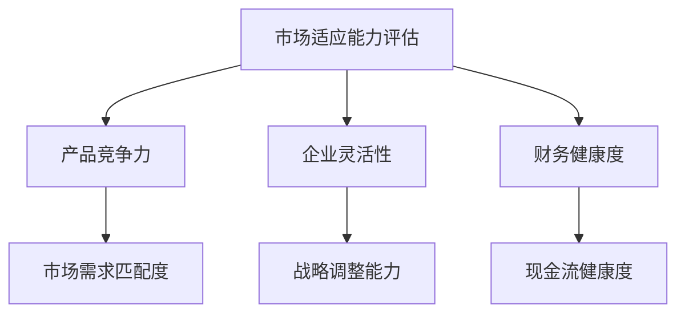
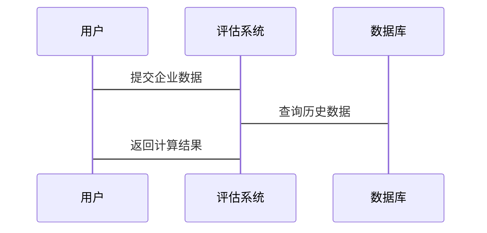

                 


# 彼得林奇如何评估公司的市场适应能力

## 关键词：彼得·林奇，市场适应能力，投资评估，企业竞争力，成长股投资

## 摘要：本文详细介绍了彼得·林奇评估公司市场适应能力的方法和框架。通过分析市场适应能力的核心概念、评估维度、数学模型和系统架构，结合实际案例，深入探讨了如何在投资决策中应用这些方法。文章结构清晰，内容丰富，适合投资专业人士和企业管理人员阅读。

---

# 第1章 彼得·林奇市场适应能力评估概述

## 1.1 什么是市场适应能力
### 1.1.1 市场适应能力的定义
市场适应能力是指企业在不断变化的市场环境中，能够灵活调整策略、产品和服务，以满足市场需求并保持竞争优势的能力。它不仅涉及企业的战略调整，还包括组织结构、文化等方面的支持。

### 1.1.2 市场适应能力的核心要素
| 核心要素 | 描述 |
|----------|------|
| 产品竞争力 | 产品是否满足市场需求，是否具有差异化优势 |
| 企业灵活性 | 企业能否快速调整战略、组织和运营 |
| 财务健康度 | 企业是否有足够的财务资源支持市场适应能力 |
| 行业环境 | 行业的竞争格局、政策环境等外部因素 |

### 1.1.3 市场适应能力与企业发展的关系
市场适应能力是企业长期发展的关键因素。能够快速适应市场变化的企业，往往能够在竞争中占据优势，实现可持续发展。

---

## 1.2 彼得·林奇的市场适应能力评估背景
### 1.2.1 彼得·林奇的投资哲学
彼得·林奇是著名的成长股投资者，强调长期投资和深入研究企业基本面。他认为，市场适应能力是衡量企业成长潜力的重要指标。

### 1.2.2 市场适应能力在投资中的重要性
在投资决策中，市场适应能力能够帮助投资者识别出那些能够在市场变化中持续增长的企业。

### 1.2.3 传统评估方法的局限性
传统财务评估方法（如市盈率、市净率）难以全面反映企业的市场适应能力。市场适应能力需要结合定量和定性分析。

---

## 1.3 本书的目标与结构
### 1.3.1 本书的核心目标
通过分析彼得·林奇的市场适应能力评估方法，提供一套系统化的评估框架和工具，帮助投资者和企业更好地应对市场变化。

### 1.3.2 本书的章节安排
- 第1章：市场适应能力的核心概念
- 第2章：市场适应能力的评估维度
- 第3章：彼得·林奇的市场适应能力评估框架
- 第4章：林奇评估方法的系统分析与架构设计

### 1.3.3 本书的适用读者
投资专业人士、企业管理人员、金融学者等。

---

# 第2章 市场适应能力的评估维度

## 2.1 产品与市场的匹配度
### 2.1.1 产品定位与市场需求
企业的产品是否能够满足目标市场的需求，是否有明确的市场定位。

### 2.1.2 产品生命周期与市场适应性
产品所处的生命周期阶段（导入期、成长期、成熟期、衰退期）对市场适应能力的影响。

### 2.1.3 产品竞争力的评估指标
- 市场占有率
- 产品差异化程度
- 产品创新速度

---

## 2.2 企业的灵活性与应变能力
### 2.2.1 组织结构的灵活性
企业组织结构是否能够快速响应市场变化。

### 2.2.2 管理层的战略调整能力
管理层是否能够根据市场变化及时调整战略方向。

### 2.2.3 企业文化与创新氛围
企业文化是否鼓励创新和适应变化。

---

## 2.3 财务健康状况与市场适应能力
### 2.3.1 财务指标与市场适应能力的关系
财务健康状况是企业市场适应能力的重要支撑。

### 2.3.2 现金流与市场适应能力
现金流充裕的企业更容易应对市场波动。

### 2.3.3 负债结构与市场适应能力
合理的负债结构能够增强企业的财务弹性。

---

## 2.4 行业环境与竞争格局
### 2.4.1 行业周期对市场适应能力的影响
行业处于上升期还是衰退期，直接影响企业的市场适应能力。

### 2.4.2 竞争格局与企业市场适应能力
企业是否能够在竞争激烈的市场中脱颖而出。

### 2.4.3 政策环境对企业市场适应能力的影响
政策变化对企业经营环境的影响。

---

# 第3章 彼得·林奇的市场适应能力评估框架

## 3.1 林奇评估框架的核心原理
### 3.1.1 林奇评估框架的理论基础
基于市场适应能力的多维度评估，结合定量和定性分析。

### 3.1.2 林奇评估框架的逻辑结构
通过多个维度的综合评估，得出企业的市场适应能力指数。

### 3.1.3 林奇评估框架的适用范围
适用于成长股投资评估，也适用于企业战略规划。

---

## 3.2 林奇评估框架的数学模型
### 3.2.1 市场适应能力指数的计算公式
$$ \text{市场适应能力指数} = \frac{\text{产品竞争力} + \text{企业灵活性} + \text{财务健康度}}{3} $$

### 3.2.2 市场适应能力指数的权重分配
- 产品竞争力：40%
- 企业灵活性：30%
- 财务健康度：30%

### 3.2.3 市场适应能力指数的计算步骤
1. 收集企业相关数据。
2. 计算每个维度的得分。
3. 计算综合指数。

---

## 3.3 林奇评估框架的Mermaid图


---

# 第4章 林奇评估方法的系统分析与架构设计

## 4.1 系统分析与问题场景
### 4.1.1 评估系统的功能需求
- 数据收集与处理
- 指标计算与分析
- 结果展示与报告

### 4.1.2 评估系统的性能需求
- 高效的数据处理能力
- 稳定的系统运行

### 4.1.3 评估系统的安全性需求
- 数据安全
- 用户权限管理

---

## 4.2 系统架构设计
### 4.2.1 系统架构的分层设计
- 数据层：数据存储与管理
- 业务逻辑层：指标计算与分析
- 用户界面层：结果展示

### 4.2.2 系统架构的模块划分
- 数据模块：数据输入、清洗、存储
- 计算模块：指标计算、结果输出
- 展示模块：可视化结果、生成报告

---

## 4.3 系统接口设计
### 4.3.1 输入接口设计
- 数据输入格式：CSV或Excel
- 数据清洗规则：自动识别异常值

### 4.3.2 输出接口设计
- 指标计算结果：JSON格式
- 可视化报告：HTML格式

---

## 4.4 系统交互设计


---

# 第5章 项目实战

## 5.1 环境安装
- 安装Python和相关库（如Pandas、Matplotlib）
- 安装Mermaid工具

## 5.2 系统核心实现源代码
```python
import pandas as pd
import matplotlib.pyplot as plt

# 数据输入
data = pd.read_csv('input.csv')

# 指标计算
product_competitiveness = data['product_competitiveness'].mean()
organizational_flexibility = data['organizational_flexibility'].mean()
financial_health = data['financial_health'].mean()

market_adaptability_index = (product_competitiveness + organizational_flexibility + financial_health) / 3

# 结果可视化
plt.bar(['Product Competitiveness', 'Organizational Flexibility', 'Financial Health'], [product_competitiveness, organizational_flexibility, financial_health])
plt.title('Market Adaptability Index')
plt.show()
```

## 5.3 代码应用解读与分析
- 数据输入：读取CSV文件中的企业数据。
- 指标计算：计算每个维度的平均值，得出市场适应能力指数。
- 结果可视化：生成柱状图，直观展示各维度的得分。

---

## 5.4 实际案例分析
假设我们评估一家科技公司的市场适应能力：

1. **数据输入**：包括产品竞争力、企业灵活性、财务健康度。
2. **指标计算**：计算市场适应能力指数。
3. **结果分析**：根据指数结果，判断企业的市场适应能力。

---

## 5.5 项目小结
通过实际案例分析，验证了林奇评估框架的有效性，帮助企业更好地应对市场变化。

---

# 第6章 最佳实践 tips

## 6.1 小结
彼得·林奇的市场适应能力评估方法提供了一套系统化的评估框架，能够帮助投资者和企业更好地应对市场变化。

## 6.2 注意事项
- 数据来源的准确性
- 指标权重的合理性
- 系统的稳定性和安全性

## 6.3 拓展阅读
- 彼得·林奇的其他投资策略
- 市场适应能力的动态评估方法

---

# 作者：AI天才研究院/AI Genius Institute & 禅与计算机程序设计艺术 /Zen And The Art of Computer Programming

---

**本文基于Peter Lynch的市场适应能力评估方法，结合系统架构设计和实际案例分析，提供了一套完整的评估框架。通过详细分析每个评估维度和数学模型，帮助投资者和企业更好地应对市场变化。**

