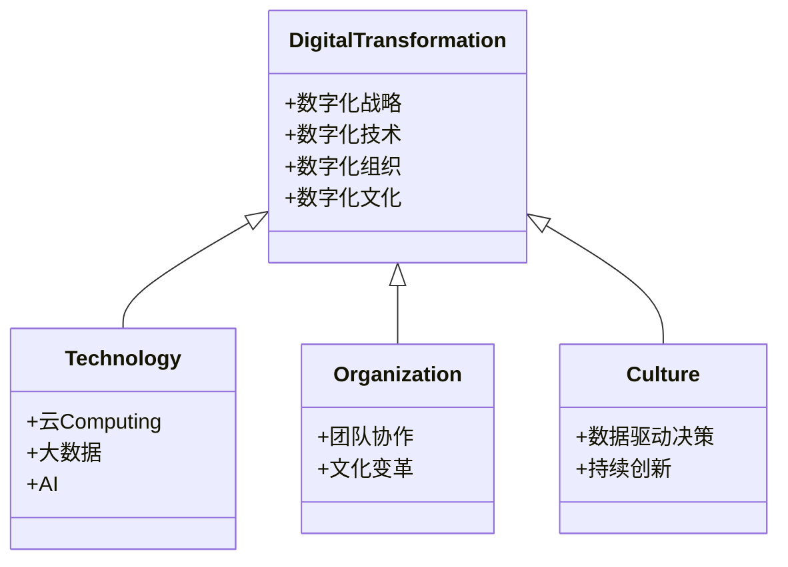
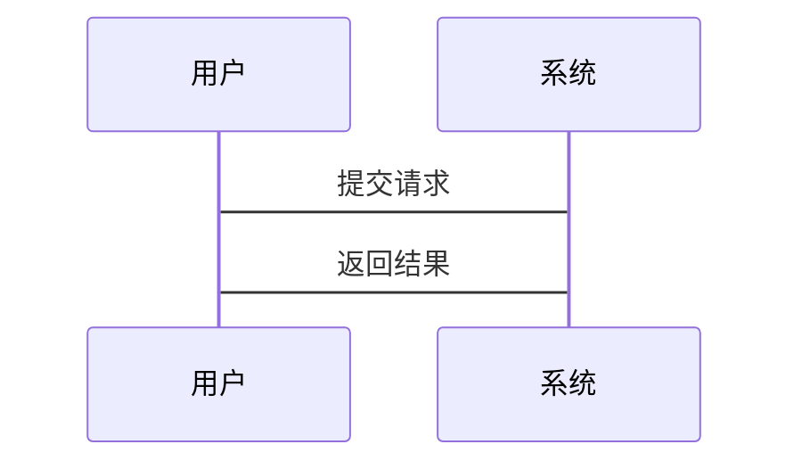

                 


# 彼得林奇如何评估公司的数字化转型能力

## 关键词：
数字化转型，彼得·林奇，企业评估，投资方法，技术能力

## 摘要：
本文将探讨如何将彼得·林奇的投资评估方法应用于公司的数字化转型能力评估。通过分析数字化转型的核心要素、评估框架和具体方法，结合彼得·林奇的投资哲学，为企业提供一套系统化的评估体系，帮助企业在数字化转型过程中做出更明智的决策。

---

## 第一部分: 数字化转型与彼得·林奇的评估方法

### 第1章: 引言

#### 1.1 什么是数字化转型
- 数字化转型的定义
  - 数字化转型是指企业利用数字技术改变业务模式、流程、文化、思维方式，并实现业务创新的过程。
  - 数字化转型不仅仅是技术升级，更是一种战略性的业务重构。
- 数字化转型的核心目标
  - 提高企业的运营效率
  - 创新商业模式
  - 增强客户体验
  - 提升数据驱动的决策能力
- 数字化转型与企业竞争力的关系
  - 数字化转型是企业适应数字时代竞争的必经之路。
  - 数字化能力已成为企业核心竞争力的重要组成部分。

#### 1.2 彼得·林奇与投资分析方法
- 彼得·林奇的背景介绍
  - 彼得·林奇是美国著名投资经理人，曾管理富达麦哲伦基金，创造了辉煌的投资业绩。
  - 他以深入分析企业基本面、挖掘优质投资标的而闻名。
- 彼得·林奇的投资哲学
  - 长期投资，价值投资。
  - 重视企业的财务状况、管理层能力和竞争优势。
  - 关注企业的成长性和可持续性。
- 彼得·林奇方法对企业数字化转型的启示
  - 企业数字化转型需要像投资一样，关注核心能力、竞争优势和长期价值。
  - 数字化转型不仅是技术问题，更是企业战略和管理能力的全面提升。

---

## 第2章: 数字化转型的背景与现状

### 2.1 数字化转型的背景分析
#### 2.1.1 数字化转型的驱动因素
- 技术驱动
  - 云计算、大数据、人工智能、物联网等技术的快速发展。
- 业务驱动
  - 企业需要通过数字化转型提升效率、创新商业模式。
- 竞争驱动
  - 数字化能力成为企业竞争的核心要素。

#### 2.1.2 数字化转型的行业分布
- 传统行业数字化转型的现状
  - 制造业：智能化生产、供应链优化。
  - 零售业：线上线下融合、个性化体验。
  - 金融行业：数字化支付、智能风控。
- 数字化转型的未来趋势
  - 更多行业的深度融合。
  - 数字化与绿色化、智能化的结合。

#### 2.1.3 数字化转型的挑战与机遇
- 挑战
  - 技术选型复杂。
  - 数据隐私和安全问题。
  - 组织变革的困难。
- 机遇
  - 提升企业效率和竞争力。
  - 开创新的业务模式。

### 2.2 数字化转型的现状分析
#### 2.2.1 全球数字化转型的趋势
- 全球范围内，数字化转型已成为企业发展的必选项。
- 数字化转型的成熟度差异显著，发达国家和地区领先。

#### 2.2.2 中国企业的数字化转型现状
- 中国企业在数字化转型方面投入巨大，尤其是在互联网和科技行业。
- 传统企业转型较慢，但正在加速。

#### 2.2.3 数字化转型的未来展望
- 技术融合：AI、大数据与云计算的结合将更加紧密。
- 业务创新：数字化能力将推动更多商业模式的创新。
- 全球化与本地化：数字化转型需要兼顾全球视野和本地化策略。

---

## 第3章: 数字化转型能力的核心概念

### 3.1 数字化转型能力的定义
#### 3.1.1 数字化转型能力的内涵
- 数字化转型能力是指企业在数字化环境下，利用数字技术实现业务创新和优化的能力。
- 包括技术能力、组织能力、数据能力和创新能力。

#### 3.1.2 数字化转型能力的外延
- 技术层面：云 computing、大数据、AI等技术的应用。
- 组织层面：组织架构调整、文化变革。
- 业务层面：商业模式创新、客户体验优化。

#### 3.1.3 数字化转型能力的评估维度
- 技术能力：数字化基础设施、系统集成能力。
- 组织能力：团队协作、文化适应性。
- 数据能力：数据采集、分析和利用能力。
- 创新能力：新产品、新服务的开发能力。

### 3.2 数字化转型能力的核心要素
#### 3.2.1 数字化战略
- 数字化战略的制定
  - 明确目标：数字化转型的目标是什么？
  - 制定路径：如何实现目标？
  - 资源分配：人、财、物如何配置？
- 关键成功因素
  - 战略的清晰性和可执行性。
  - 高层领导的支持和参与。

#### 3.2.2 数字化技术
- 关键技术：云 computing、大数据、AI、物联网等。
- 技术架构设计
  - 系统设计：模块化设计、高可用性。
  - 数据管理：数据存储、数据安全、数据治理。
- 技术选型
  - 根据业务需求选择合适的技术。
  - 技术的可扩展性和可维护性。

#### 3.2.3 数字化组织
- 组织结构调整
  - 设立数字化转型领导小组。
  - 重组部门，形成跨部门协作机制。
- 团队能力提升
  - 技术培训。
  - 数字化思维的培养。
- 组织文化
  - 鼓励创新。
  - 促进数据驱动的决策文化。

#### 3.2.4 数字化文化
- 文化内涵
  - 数字化文化是指企业中与数字技术应用相关的文化和价值观。
  - 包括数据驱动决策、持续创新、客户为中心等。
- 文化建设的关键
  - 领导层的示范作用。
  - 员工的参与和认同。
  - 文化的传播和固化。

---

## 第4章: 数字化转型能力的评估框架

### 4.1 评估框架的构建
#### 4.1.1 评估框架的设计原则
- 全面性：覆盖技术、组织、数据、文化等各个方面。
- 可操作性：评估指标可量化、可测量。
- 动态性：适应企业发展的变化。

#### 4.1.2 评估框架的组成部分
- 战略层：评估数字化战略的制定和执行情况。
- 技术层：评估数字化技术的应用和系统集成能力。
- 组织层：评估组织结构和团队能力。
- 数据层：评估数据采集、分析和利用能力。

#### 4.1.3 评估框架的适用范围
- 适用于各类企业，特别是希望提升数字化能力的企业。
- 也可用于企业内部的自我评估和外部评估。

### 4.2 评估指标体系
#### 4.2.1 战略层评估指标
- 数字化战略的清晰度
  - 是否有明确的数字化目标？
  - 是否有详细的实施计划？
- 高层支持
  - 是否有高层领导的明确支持？
  - 是否有资源保障？

#### 4.2.2 技术层评估指标
- 技术架构的合理性
  - 是否有合理的技术选型？
  - 是否有良好的系统设计？
- 技术能力
  - 是否有技术团队？
  - 技术团队的能力如何？

#### 4.2.3 组织层评估指标
- 组织结构的合理性
  - 是否有专门的数字化转型团队？
  - 是否有跨部门协作机制？
- 员工能力
  - 员工是否接受过数字化培训？
  - 员工是否具备数字化思维？

#### 4.2.4 数据层评估指标
- 数据采集能力
  - 是否有完善的数据采集渠道？
  - 数据采集的完整性如何？
- 数据分析能力
  - 是否有数据分析团队？
  - 数据分析工具是否先进？

---

## 第5章: 数字化转型能力的评估方法

### 5.1 定性评估方法
#### 5.1.1 SWOT分析法
- SWOT分析法是一种常用的定性分析方法。
- 通过分析企业优势、劣势、机会和威胁，帮助企业制定战略。

#### 5.1.2 PEST分析法
- PEST分析法用于分析企业外部环境。
- 包括政治、经济、社会和技术因素。

#### 5.1.3 竞争对手分析法
- 分析竞争对手的数字化能力。
- 找出自身的优势和劣势。

### 5.2 定量评估方法
#### 5.2.1 KPI指标法
- 制定数字化转型相关的KPI。
- 例如：数字化项目按时完成率、数字化投入回报率等。

#### 5.2.2 数据分析法
- 通过数据分析评估数字化能力。
- 例如：数据分析企业的数据处理能力、系统运行效率等。

#### 5.2.3 模型评估法
- 使用数学模型进行评估。
- 例如：通过回归分析评估数字化能力对业绩的影响。

---

## 第6章: 数字化转型能力的提升策略

### 6.1 数字化战略的制定
#### 6.1.1 数字化战略的目标设定
- 明确数字化转型的目标。
- 例如：提升客户体验、优化运营效率等。

#### 6.1.2 数字化战略的实施路径
- 制定详细的实施计划。
- 确保资源的合理分配。

#### 6.1.3 数字化战略的监控与调整
- 定期评估战略执行情况。
- 根据评估结果进行调整。

### 6.2 数字化技术的提升
#### 6.2.1 技术架构的优化
- 持续优化技术架构。
- 例如：从单体架构向微服务架构转型。

#### 6.2.2 数据管理能力的提升
- 加强数据治理。
- 提高数据安全和隐私保护能力。

#### 6.2.3 技术创新
- 关注新技术的发展。
- 例如：AI、区块链等技术的应用。

### 6.3 数字化组织的构建
#### 6.3.1 组织结构的优化
- 建立专门的数字化转型团队。
- 促进跨部门协作。

#### 6.3.2 员工能力的提升
- 提供数字化培训。
- 鼓励员工学习新技能。

#### 6.3.3 数字化文化的建设
- 倡导数据驱动的决策文化。
- 鼓励创新和试错。

---

## 第7章: 数字化转型能力的系统分析与架构设计

### 7.1 问题场景介绍
- 某企业希望提升其数字化转型能力。
- 当前存在技术选型复杂、组织协作困难等问题。

### 7.2 系统功能设计
#### 7.2.1 领域模型


#### 7.2.2 系统架构设计


#### 7.2.3 系统接口设计
- API接口设计：
  - 数据接口：数据的采集、存储和分析。
  - 业务接口：业务流程的数字化。

#### 7.2.4 系统交互设计


---

## 第8章: 数字化转型能力的项目实战

### 8.1 环境安装
- 安装必要的软件：
  - Python: pip install numpy pandas matplotlib
  - 数据库：MySQL或MongoDB
  - 开发工具：VS Code或PyCharm

### 8.2 核心代码实现
```python
import numpy as np
import pandas as pd

# 数据加载
data = pd.read_csv('transform.csv')

# 数据预处理
data.dropna(inplace=True)
data['label'] = data['label'].astype(int)

# 模型训练
from sklearn.model

