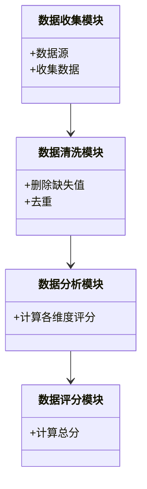
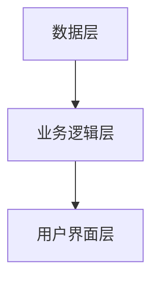

                 


# 彼得林奇如何评估公司的数据治理能力

## 关键词：数据治理，彼得林奇，数据治理能力，企业风险管理，数据管理

## 摘要：数据治理能力是企业风险管理的重要组成部分。本文结合彼得·林奇的投资哲学，探讨如何评估公司的数据治理能力，涵盖核心概念、算法原理、系统架构和项目实战等。

---

## 第一部分：数据治理能力评估的背景与重要性

### 第1章：数据治理能力评估的背景介绍

#### 1.1 数据治理的定义与核心概念

数据治理是企业对数据进行管理的过程，确保数据的准确性、完整性和安全性。核心要素包括数据质量、数据安全、数据可用性和数据管理能力。

#### 1.2 彼得·林奇的评估方法

彼得·林奇通过基本面分析评估企业，关注财务数据和管理能力。将此方法应用于数据治理，企业需分析自身的数据管理能力。

#### 1.3 数据治理能力评估的边界与外延

数据治理的边界包括数据的收集、存储和处理，外延涉及企业战略和风险管理。与其他管理领域的关联主要体现在企业整体管理能力的提升。

---

## 第二部分：数据治理能力评估的核心概念与联系

### 第2章：数据治理能力评估的核心概念

#### 2.1 数据治理能力的评估维度

数据治理能力从数据质量、数据安全、数据可用性和数据管理能力四个维度进行评估。

#### 2.2 数据治理能力评估的核心要素

核心要素包括数据架构、数据政策、数据团队和数据技术。通过对比表格和ER图，可以更清晰地理解这些要素之间的关系。

---

## 第三部分：数据治理能力评估的算法原理

### 第3章：数据治理能力评估的算法原理

#### 3.1 数据治理能力评估的流程

评估流程包括数据收集、清洗、分析和评分。例如，使用Python代码进行数据清洗：

```python
import pandas as pd

# 加载数据
data = pd.read_csv('data.csv')

# 删除缺失值
data.dropna(inplace=True)

# 去重
data = data.drop_duplicates()
```

#### 3.2 数据治理能力评估的权重分配

各维度的权重分配：数据质量（40%）、数据安全（30%）、数据可用性（20%）、数据管理能力（10%）。

#### 3.3 数据治理能力评估的数学模型

使用加权平均公式进行评分：

$$总分 = 0.4s1 + 0.3s2 + 0.2s3 + 0.1s4$$

其中，s1、s2、s3、s4是各维度的评分。

---

## 第四部分：数据治理能力评估的系统分析与架构设计

### 第4章：数据治理能力评估的系统架构

#### 4.1 系统功能设计

系统功能模块包括数据收集、清洗、分析和评分。领域模型类图展示各模块的关系：



#### 4.2 系统架构设计

采用分层架构，包括数据层、业务逻辑层和用户界面层：



---

## 第五部分：数据治理能力评估的项目实战

### 第5章：数据治理能力评估的实战应用

#### 5.1 项目环境与安装

安装Python和相关库：

```bash
pip install pandas numpy matplotlib
```

#### 5.2 核心实现代码

编写数据处理和分析的Python代码：

```python
import pandas as pd
import numpy as np

# 数据加载
data = pd.read_csv('data.csv')

# 删除缺失值
data.dropna(inplace=True)

# 去重
data = data.drop_duplicates()

# 计算各维度评分
s1 = data['质量'].mean()
s2 = data['安全'].mean()
s3 = data['可用性'].mean()
s4 = data['管理能力'].mean()

# 总分计算
total_score = 0.4*s1 + 0.3*s2 + 0.2*s3 + 0.1*s4

print(f"总分: {total_score}")
```

#### 5.3 案例分析

通过具体案例，展示如何应用上述方法评估某公司的数据治理能力，解释评分过程和结果。

---

## 第六部分：数据治理能力评估的最佳实践与总结

### 第6章：最佳实践与总结

#### 6.1 最佳实践

企业应定期评估数据治理能力，结合实际业务需求制定策略。

#### 6.2 小结

数据治理能力评估是企业风险管理的重要部分，彼得·林奇的方法提供了有效工具。

#### 6.3 注意事项

企业在评估过程中需注意数据隐私和合规性。

#### 6.4 拓展阅读

推荐书籍：《数据治理：构建企业级数据治理体系》、《彼得·林奇的投资哲学》。

---

## 作者：AI天才研究院 & 禅与计算机程序设计艺术

通过以上内容，我们详细探讨了彼得·林奇如何评估公司的数据治理能力，从背景介绍到系统设计，再到项目实战，提供了全面的分析和指导。

