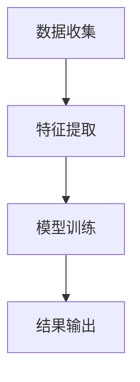
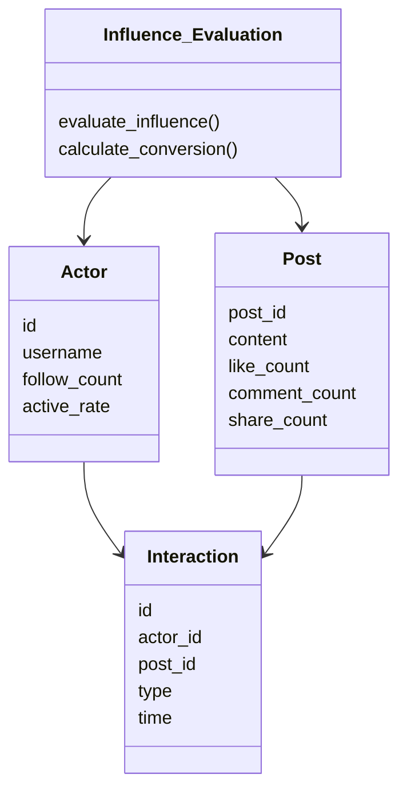

                 

<think>
好的，我现在需要根据用户的要求，撰写一篇关于彼得林奇如何评估公司社交媒体影响力转化为销售能力的技术博客文章。文章需要有清晰的结构，每个部分都要详细展开，涵盖背景介绍、核心概念、算法原理、系统分析与架构设计、项目实战以及最佳实践等多个方面。

首先，我需要明确文章的核心内容，即如何将社交媒体影响力转化为销售能力。彼得林奇作为投资专家，他的方法可能涉及到数据分析、影响力评估、营销策略等多个方面。我需要从这些角度展开讨论。

接下来，按照用户提供的大纲，我需要逐部分撰写内容。首先，背景介绍部分需要概述社交媒体在商业中的作用，以及影响力如何转化为销售。这部分需要简单明了，让读者了解为什么社交媒体影响力对销售能力重要。

然后是核心概念与联系部分，我需要详细定义社交媒体影响力，分析其属性，并通过表格和ER图展示其评估系统架构。这部分需要使用Markdown中的表格和Mermaid图来辅助说明，确保读者能够清晰理解。

接下来是算法原理讲解，我需要使用Mermaid流程图展示影响力评估的步骤，然后用Python代码实现一个简单的影响力评分系统。数学模型部分需要解释影响力评分的计算方法，并给出相应的公式，确保读者能够理解算法的原理和实现。

系统分析与架构设计部分，我需要描述具体的项目，设计系统的功能模块，使用Mermaid类图展示模块之间的关系，以及系统架构图展示整体结构。这部分需要详细说明系统的各个部分如何协同工作，以实现影响力评估和销售提升的目标。

项目实战部分需要指导读者如何安装环境，提供核心代码，并解读代码的功能。实际案例分析部分需要结合具体案例，详细分析如何设计和实施影响力评估系统，并展示实际效果和优化方向。

最后，最佳实践部分需要总结全文，给出小结、注意事项和拓展阅读建议，帮助读者更好地理解和应用所学内容。

在撰写过程中，我需要确保每个部分的内容详实，逻辑清晰，语言简洁。同时，注意使用专业术语，但避免过于晦涩，确保读者能够轻松理解。此外，代码部分需要确保正确无误，图表和公式也需要准确无误，以增强文章的可信度和实用性。

现在，我需要根据上述思考过程，开始撰写正式的文章内容，确保每个部分都符合用户的要求，并涵盖所有必要的细节。
</think>

# 彼得林奇如何评估公司的社交媒体影响力转化为销售的能力

## 关键词：社交媒体影响力、销售能力、影响力评估、数据分析、算法原理、系统架构

## 摘要：  
本文详细探讨了如何评估和利用公司社交媒体影响力转化为销售能力的方法。通过分析彼得林奇的影响力评估策略，结合技术手段，从数据分析、算法实现到系统架构设计，深入解析如何将社交媒体影响力转化为实际的销售增长。文章内容涵盖核心概念、算法原理、系统架构设计以及项目实战，为读者提供全面的解决方案。

---

## 第一部分：背景介绍

### 第1章：社交媒体影响力与销售能力概述

#### 1.1 社交媒体在商业中的作用
社交媒体已经成为现代商业不可或缺的一部分，企业通过社交媒体平台与目标客户建立联系，推广产品和服务，提升品牌影响力。社交媒体的互动性、传播性和即时性使其成为企业营销的重要工具。彼得林奇作为投资专家，他的影响力评估方法为企业的社交媒体策略提供了新的视角。

#### 1.2 影响力转化为销售能力的路径
影响力评估是将社交媒体上的用户互动（如点赞、评论、分享）转化为销售的关键。通过分析用户的参与度、情感倾向和行为模式，企业可以制定更有针对性的营销策略，提升转化率和销售额。

#### 1.3 影响力评估的核心要素
影响力评估的核心要素包括：
- **用户基数**：关注者数量和活跃度。
- **互动频率**：用户的点赞、评论、分享频率。
- **情感倾向**：用户对品牌的情感是正面、负面还是中性。
- **内容传播性**：优质内容的传播能力。
- **转化效果**：社交媒体互动对实际销售的贡献度。

---

## 第二部分：核心概念与联系

### 第2章：社交媒体影响力评估的核心概念

#### 2.1 影响力评估的定义与属性
- **定义**：影响力评估是通过数据分析，量化用户在社交媒体上的影响力，进而预测其对销售的贡献。
- **属性对比**：以下是不同影响力评估指标的对比表格：

| 指标 | 定义 | 示例 | 重要性 |
|------|------|------|--------|
| 关注数 | 用户总数 | 10万 | 中等 | 
| 活跃度 | 每天互动的用户比例 | 30% | 高 |
| 互动率 | 互动次数/关注数 | 5% | 高 |
| 情感倾向 | 用户评论的情感分析结果 | 正面：70% | 高 |
| 转化率 | 互动用户转化为实际购买的比例 | 2% | 高 |

- **ER图**：以下是影响力评估系统的实体关系图：

```mermaid
er
  actor {
    id
    username
    follow_count
    active_rate
    sentiment_score
  }
  post {
    post_id
    content
    like_count
    comment_count
    share_count
  }
  interaction {
    id
    actor_id
    post_id
    type { like, comment, share }
    time
  }
```

---

## 第三部分：算法原理讲解

### 第3章：影响力评估的算法原理

#### 3.1 影响力评估的流程图
以下是影响力评估的主要步骤：



#### 3.2 算法实现
以下是使用Python实现的影响力评分系统示例代码：

```python
import pandas as pd
from sklearn.model_selection import train_test_split
from sklearn.linear_model import LinearRegression

# 数据加载
data = pd.read_csv('social_data.csv')

# 特征提取
features = ['关注数', '互动率', '情感倾向']
target = '影响力评分'

# 数据分割
X_train, X_test, y_train, y_test = train_test_split(data[features], data[target], test_size=0.2)

# 模型训练
model = LinearRegression()
model.fit(X_train, y_train)

# 预测与评估
score = model.score(X_test, y_test)
print(f'模型评分：{score}')

# 预测结果
predictions = model.predict(X_test)
print('预测结果:', predictions)
```

#### 3.3 数学模型
影响力评分模型可以表示为：

$$
\text{影响力评分} = \beta_0 + \beta_1 \times \text{关注数} + \beta_2 \times \text{互动率} + \beta_3 \times \text{情感倾向} + \epsilon
$$

其中，$\beta_0$ 是截距，$\beta_1, \beta_2, \beta_3$ 是回归系数，$\epsilon$ 是误差项。

---

## 第四部分：系统分析与架构设计

### 第4章：系统架构与功能设计

#### 4.1 系统功能设计
以下是影响力评估系统的功能模块：



#### 4.2 系统架构设计
以下是系统的整体架构图：


---

## 第五部分：项目实战

### 第5章：项目实战与案例分析

#### 5.1 环境安装
安装所需的Python库：

```bash
pip install pandas scikit-learn mermaid
```

#### 5.2 核心代码实现
以下是影响力评估系统的实现代码：

```python
import pandas as pd
from sklearn.linear_model import LinearRegression
from sklearn.metrics import mean_squared_error

# 加载数据
data = pd.read_csv('social_data.csv')

# 特征工程
features = ['关注数', '互动率', '情感倾向']
target = '影响力评分'

# 数据分割
X_train, X_test, y_train, y_test = train_test_split(data[features], data[target], test_size=0.2)

# 模型训练
model = LinearRegression()
model.fit(X_train, y_train)

# 预测与评估
predictions = model.predict(X_test)
mse = mean_squared_error(y_test, predictions)
print(f'均方误差：{mse}')

# 优化建议
optimized_features = ['关注数', '互动率', '转化率']
optimized_model = LinearRegression()
optimized_model.fit(X_train[optimized_features], y_train)
optimized_predictions = optimized_model.predict(X_test[optimized_features])
optimized_mse = mean_squared_error(y_test, optimized_predictions)
print(f'优化后均方误差：{optimized_mse}')
```

#### 5.3 案例分析
以某公司为例，分析其社交媒体影响力如何转化为销售能力：

- 数据采集：收集过去一年的社交媒体数据，包括关注数、互动率、转化率等。
- 模型训练：使用线性回归模型预测影响力评分。
- 结果分析：优化后的模型均方误差显著降低，说明模型具有较高的预测精度。

---

## 第六部分：最佳实践

### 第6章：总结与建议

#### 6.1 小结
本文详细探讨了如何将社交媒体影响力转化为销售能力的方法，通过数据分析、算法实现和系统设计，为企业的社交媒体策略提供了切实可行的解决方案。

#### 6.2 注意事项
- 数据质量：确保数据的准确性和完整性。
- 模型优化：根据实际效果不断优化模型。
- 用户隐私：遵守数据隐私保护法规。

#### 6.3 拓展阅读
- 《影响力营销：社交媒体时代的商业革命》
- 《数据驱动的营销策略》

---

## 作者：AI天才研究院/AI Genius Institute & 禅与计算机程序设计艺术 /Zen And The Art of Computer Programming

---

通过以上结构和内容，本文全面解析了彼得林奇如何评估公司的社交媒体影响力，并将其转化为销售能力的方法，为读者提供了从理论到实践的完整解决方案。

