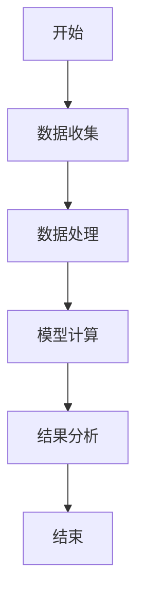

                 

<think>
好，我现在需要撰写一篇名为《彼得林奇如何评估公司的社会资本》的技术博客文章。首先，我需要理解什么是社会资本以及它在企业中的作用。社会资本指的是企业内部和外部网络中所积累的资源、信任和关系，这些都可以为企业创造价值。

彼得林奇是著名的投资专家，他有一套独特的方法来评估公司的价值。我需要将他的方法应用到社会资本的评估中。首先，我应该介绍社会资本的定义和分类，包括人力资本、社交资本和组织资本等。然后，分析社会资本在企业中的具体作用，比如降低交易成本和增强企业韧性。

接下来，我需要详细讲解彼得林奇的分析框架和评估指标。他注重企业的基本面分析，所以我应该将社会资本纳入到企业的基本面评估中，看看它如何影响企业的长期收益。此外，彼得林奇的投资哲学强调长期和价值投资，这些理念如何与社会资本的评估相结合也是需要探讨的。

为了更好地理解，我应该加入实际案例分析。例如，可以选取科技企业和传统企业的转型案例，展示社会资本在不同企业中的应用及其对价值的影响。这不仅能帮助读者理解理论，还能提供实际的应用参考。

在评估方法和工具部分，我需要介绍几种常用的评估工具，如调查问卷法、网络分析法和专家访谈法，并分析它们的优缺点。此外，数学模型和公式也是不可或缺的，我应该用mermaid流程图和latex公式来展示社会资本评估的具体步骤和数学模型。

最后，我需要总结全文，强调社会资本的重要性，并提出未来的研究方向。同时，给出一些最佳实践的建议，帮助读者更好地应用这些方法。

在整个思考过程中，我需要确保逻辑清晰，结构紧凑，语言简洁专业，同时提供足够的细节和实例，使读者能够深入理解和应用这些概念。希望通过这篇文章，读者能够掌握彼得林奇评估社会资本的方法，并在实际中应用这些知识来提升企业的价值。
</think>

# 彼得林奇如何评估公司的社会资本

> 关键词：彼得林奇, 社会资本, 企业价值, 评估方法, 投资哲学

> 摘要：本文探讨了彼得林奇如何评估公司的社会资本，分析了社会资本的定义、分类及其在企业中的作用，并结合实际案例和数学模型，详细阐述了彼得林奇的评估方法和工具，为读者提供了全面的理论和实践指导。

---

## 第一部分: 社会资本的定义与重要性

### 第1章: 社会资本的定义与分类

#### 1.1 社会资本的定义
社会资本是指企业内外部网络中积累的资源、信任和关系，能够为企业创造价值。它包括人力资本、社交资本和组织资本等，具有正外部性和可持续性。

#### 1.2 社会资本的分类
- **人力资本**：员工的知识和技能。
- **社交资本**：企业与外部网络的关系。
- **组织资本**：企业的制度和文化。

### 第2章: 社会资本在企业中的作用
社会资本能够降低交易成本、提升企业竞争力，并增强企业韧性。例如，良好的员工关系可以提高工作效率，强大的外部网络有助于拓展市场。

---

## 第二部分: 彼得林奇的评估方法

### 第3章: 彼得林奇的分析框架

#### 3.1 彼得林奇的投资哲学
彼得林奇强调长期投资和价值投资，注重企业的基本面分析。社会资本是企业基本面的重要组成部分。

#### 3.2 社会资本在企业基本面中的地位
社会资本被视为企业的无形资产，影响企业的风险和长期收益。例如，强大的社交资本可以降低市场风险。

### 第4章: 彼得林奇的评估指标

#### 4.1 社会资本的量化方法
- **信任度评估**：通过调查问卷和专家访谈进行。
- **网络影响力评估**：分析企业的外部网络关系。

#### 4.2 评估框架
- **构成要素**：人力资本、社交资本、组织资本。
- **指标选择**：信任度、网络影响力和货币化。

---

## 第三部分: 实际案例分析

### 第5章: 案例分析: 科技企业的社会资本应用

#### 5.1 案例背景
科技企业依赖强大的研发团队和外部合作伙伴。社会资本在技术创新和市场拓展中起关键作用。

#### 5.2 案例分析
- **识别**：评估员工信任度和外部网络。
- **评估**：使用数学模型计算社会资本指数。
- **影响**：社会资本提升企业竞争力和长期收益。

### 第6章: 案例分析: 传统企业的转型

#### 6.1 案例背景
传统企业转型需要重构社会资本，包括员工文化和外部关系。

#### 6.2 案例分析
- **重构**：优化内部制度和外部合作。
- **应用**：评估社会资本对转型效果的影响。

---

## 第四部分: 评估方法与工具

### 第7章: 评估工具与方法

#### 7.1 社会资本评估工具
- **调查问卷法**：收集员工和客户反馈。
- **网络分析法**：分析外部关系。
- **专家访谈法**：获取专业意见。

#### 7.2 优缺点分析
- **定量分析法**：客观但缺乏深度。
- **定性分析法**：主观但提供丰富信息。
- **混合分析法**：结合两者优势。

### 第8章: 数学模型与公式

#### 8.1 社会资本评估模型
使用mermaid流程图展示评估步骤：

#### 8.2 数学公式
社会资本指数公式：
$$ S = \frac{1}{n} \sum_{i=1}^{n} s_i $$
其中，\( s_i \) 是每个评估指标的得分，\( n \) 是指标总数。

---

## 第五部分: 总结与展望

### 5.1 总结
社会资本是企业价值的重要组成部分。彼得林奇的评估方法结合了长期投资和价值投资理念，为企业提供了全面的评估框架。

### 5.2 展望
未来研究可以进一步探索社会资本的动态变化和其与企业绩效的关系，为投资者提供更精确的评估工具。

---

## 第六部分: 最佳实践 Tips

### 6.1 注意事项
- 定期评估社会资本。
- 结合定量和定性方法。
- 注重外部网络的维护。

### 6.2 小结
社会资本是企业不可忽视的资源，彼得林奇的评估方法提供了有效的指导。

---

## 作者

作者：AI天才研究院/AI Genius Institute & 禅与计算机程序设计艺术/Zen And The Art of Computer Programming

---

希望这篇文章能帮助读者理解彼得林奇如何评估公司的社会资本，并为实际应用提供指导。

