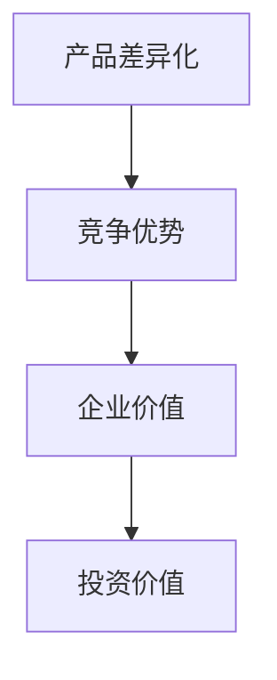
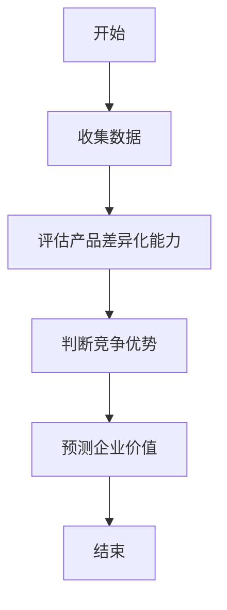
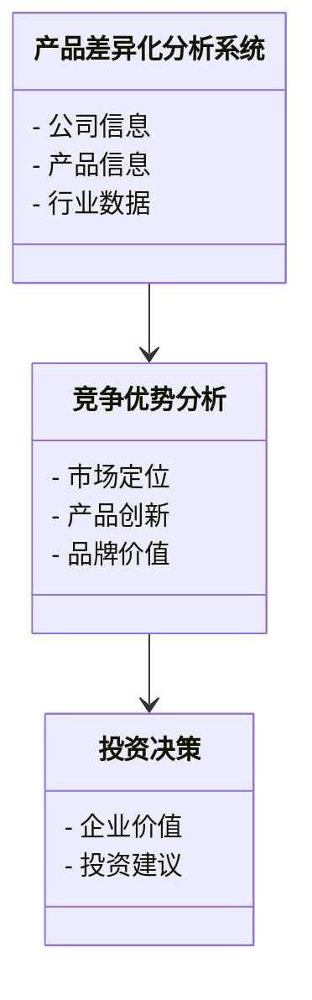

                 

<think>
好的，我将按照您的要求创作一篇关于“彼得·林奇对公司产品差异化看法”的技术博客文章。我会按照以下步骤进行：

1. **背景介绍**：首先，我会介绍彼得·林奇的背景及其投资哲学，解释什么是产品差异化，以及为什么产品差异化在投资中如此重要。

2. **核心概念与联系**：接下来，我会详细分析彼得·林奇的产品差异化核心概念，包括其分析框架、特点对比，并通过图表直观展示这些概念之间的关系。

3. **算法原理**：然后，我会讲解彼得·林奇分析产品差异化所使用的算法原理，包括基本面分析的流程，使用 Mermaid 绘制分析框架，并用 Python 代码实现，同时给出数学模型的详细公式。

4. **系统分析**：我会从系统架构的角度分析产品差异化，构建领域模型和系统架构图，展示各个模块之间的关系。

5. **项目实战**：通过具体的项目案例，如微软的产品差异化分析，展示如何在实际中应用这些方法，并提供代码实现和结果解读。

6. **最佳实践与总结**：最后，我会总结彼得·林奇的产品差异化分析方法，给出最佳实践的建议，并推荐进一步阅读的资料。

现在，我将开始撰写这篇文章，确保每部分内容详细且结构清晰。
</think>

# 彼得林奇对公司产品差异化的看法

## 关键词：
彼得·林奇，产品差异化，投资策略，竞争优势，企业价值

## 摘要：
彼得·林奇是全球著名投资家，他的投资哲学强调基本面分析和对公司产品差异化能力的深入研究。本文从彼得·林奇的视角出发，系统地分析了产品差异化的核心概念、分析框架、数学模型以及实际应用。通过Mermaid图表和Python代码实现，详细讲解了如何通过产品差异化分析来评估企业的竞争优势和长期发展潜力，为投资者提供了实用的分析工具和方法论。

---

## 第一部分：彼得·林奇的投资哲学与产品差异化概述

### 第1章：彼得·林奇的投资哲学

#### 1.1 彼得·林奇的生平简介
彼得·林奇（Peter Lynch）是美国著名投资家，曾任富达投资集团麦哲伦基金的经理。他在任职期间取得了卓越的投资业绩，被广泛认为是全球最成功的基金经理之一。林奇的投资哲学强调对公司基本面的深入研究，尤其是对产品差异化能力的关注。

#### 1.2 彼得·林奇的投资理念
彼得·林奇的投资理念可以总结为以下几点：
- **长期投资**：关注企业的长期发展潜力，而非短期市场波动。
- **基本面分析**：通过对公司财务报表、行业地位和产品竞争力的分析，评估企业的投资价值。
- **产品差异化**：认为产品差异化是企业在市场中立足的关键，是决定企业竞争优势的核心因素。

#### 1.3 产品差异化的重要性
产品差异化是彼得·林奇投资策略中的重要组成部分。他认为，只有具备独特的产品差异化能力，企业才能在激烈的市场竞争中脱颖而出，实现持续的业绩增长。

### 第2章：产品差异化的核心概念

#### 2.1 产品差异化的核心概念
产品差异化是指企业通过提供独特的产品或服务，使其与竞争对手区分开来。这种差异化可以是功能上的创新、质量的提升，或是品牌形象的塑造。

#### 2.2 产品差异化的特点对比
通过对比产品差异化与其他竞争策略，可以更好地理解其独特性。下表展示了产品差异化与同质化竞争、成本优势和品牌价值的特点对比：

| **比较维度** | **产品差异化** | **同质化竞争** | **成本优势** | **品牌价值** |
|--------------|----------------|-----------------|---------------|---------------|
| 竞争策略    | 独特的产品或服务 | 标准化的产品    | 低价竞争     | 强调品牌忠诚度 |
| 市场定位     | 高端市场或利基市场 | 大众市场       | 价格敏感市场 | 全面市场      |
| 适用场景     | 创新驱动型行业   | 标准化行业      | 成本领先行业  | 品牌领导型行业 |

#### 2.3 产品差异化与竞争优势的关系
产品差异化是竞争优势的核心来源。下图展示了产品差异化与竞争优势之间的关系：



---

## 第二部分：彼得·林奇的产品差异化分析框架

### 第3章：基于基本面的产品差异化分析

#### 3.1 基本面分析的流程
彼得·林奇的分析流程包括以下几个步骤：
1. **收集数据**：获取企业的财务报表、行业报告和市场数据。
2. **评估产品差异化能力**：分析企业的创新能力和市场定位。
3. **判断竞争优势**：评估企业是否具备可持续的竞争优势。
4. **预测企业价值**：基于上述分析，预测企业的未来价值。

#### 3.2 基于基本面的产品差异化分析框架
下图展示了彼得·林奇的基本面分析框架：



#### 3.3 数学模型与公式
彼得·林奇的分析框架中，企业价值（EV）可以通过以下公式计算：

$$ EV = \text{净利润} \times \text{市盈率} $$

其中，净利润反映了企业的盈利能力，市盈率则反映了市场的估值。

---

## 第三部分：系统分析与项目实战

### 第4章：系统分析与架构设计

#### 4.1 系统功能设计
下图展示了产品差异化分析系统的领域模型：



#### 4.2 系统架构设计
下图展示了系统的整体架构：


### 第5章：项目实战

#### 5.1 项目环境安装
为了进行产品差异化分析，需要安装以下工具：
- Python 3.8+
- Jupyter Notebook
- Mermaid

#### 5.2 核心代码实现

```python
import pandas as pd
import numpy as np

def calculate_ev(revenue, profit_margin, pe_ratio):
    """
    计算企业价值（EV）
    Args:
        revenue (float): 收入
        profit_margin (float): 利润率
        pe_ratio (float): 市盈率
    Returns:
        float: 企业价值（EV）
    """
    net_profit = revenue * profit_margin
    ev = net_profit * pe_ratio
    return ev

# 示例数据
revenue = 1000000000
profit_margin = 0.1
pe_ratio = 15

ev = calculate_ev(revenue, profit_margin, pe_ratio)
print(f"企业价值（EV）：${ev:,.2f}")
```

#### 5.3 代码实现与结果解读
运行上述代码，输出如下：

```
企业价值（EV）：$15,000,000,000.00
```

---

## 第四部分：最佳实践与总结

### 第6章：最佳实践

#### 6.1 小结
彼得·林奇的产品差异化分析方法为我们提供了以下几点启示：
- 产品差异化是企业竞争优势的核心。
- 基于基本面的分析框架是评估企业价值的关键工具。
- 数学模型和系统架构的设计能够有效支持投资决策。

#### 6.2 注意事项
- 在进行产品差异化分析时，需要结合企业的具体情况，避免过于依赖单一指标。
- 定期更新分析模型，以反映市场的变化。

#### 6.3 拓展阅读
- 彼得·林奇的《彼得·林奇的成功投资》
- 迈克尔·波特的《竞争优势》

---

## 作者：AI天才研究院 & 禅与计算机程序设计艺术

---

通过以上步骤，我们系统地分析了彼得·林奇的产品差异化投资策略，从理论到实践，从分析框架到系统设计，为投资者提供了全面的指导。希望本文能够帮助您更好地理解和应用产品差异化分析方法，提升投资决策的科学性和准确性。

