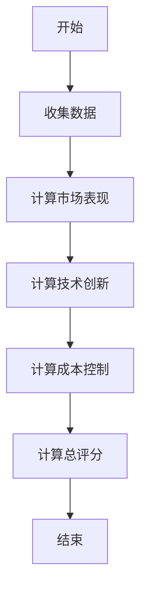
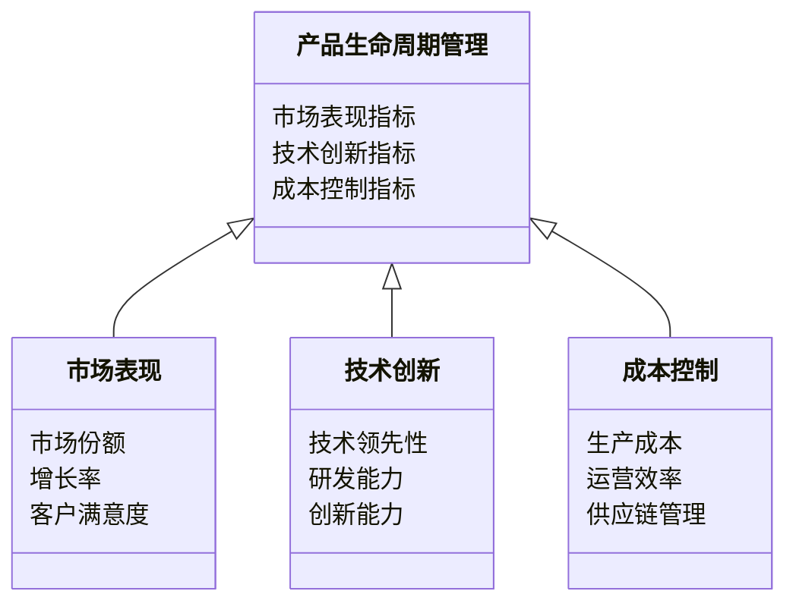
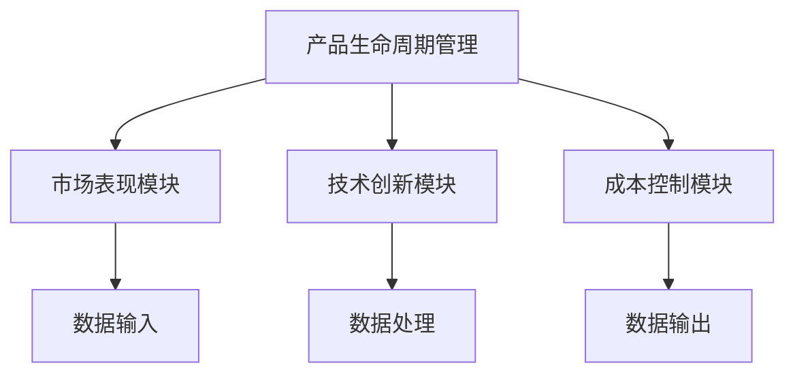
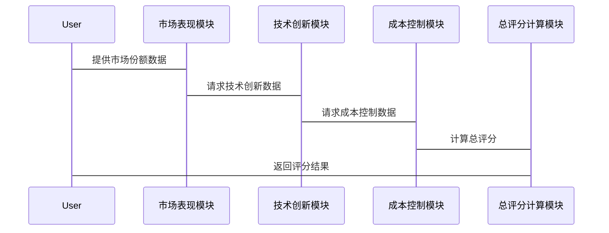

                 


# 彼得林奇对公司产品生命周期管理能力的评估

> 关键词：产品生命周期管理，彼得·林奇，公司评估，投资策略，技术指标

> 摘要：本文通过分析彼得·林奇的产品生命周期管理能力评估方法，结合技术与商业的视角，详细阐述了如何从市场表现、技术创新和成本控制三个维度对公司的产品生命周期管理能力进行评估。文章通过数学模型、流程图和实际案例，深入探讨了产品生命周期管理的核心要素及其对企业发展和投资决策的影响。

---

# 第一部分: 产品生命周期管理的背景与概述

## 第1章: 产品生命周期管理的定义与重要性

### 1.1 产品生命周期的基本概念
- 产品生命周期的定义：从产品开发到退市的完整过程。
- 产品生命周期的四个阶段：引入期、成长期、成熟期、衰退期。
- 产品生命周期管理的重要性：企业通过有效管理产品生命周期，可以提高市场竞争力和利润率。

### 1.2 彼得·林奇的投资者背景
- 彼得·林奇的投资理念：注重基本面分析和长期投资。
- 林奇对产品生命周期的理解：产品的生命周期与公司的市场地位密切相关。
- 林奇评估方法的核心思想：通过分析产品生命周期的各个阶段，评估公司的竞争优势和投资价值。

### 1.3 产品生命周期管理能力的评估意义
- 评估对企业价值的影响：产品生命周期管理能力越强，企业市场竞争力越强。
- 评估对投资者决策的作用：帮助投资者识别具有长期增长潜力的公司。
- 评估对管理层的战略意义：帮助管理层优化产品组合，提升企业盈利能力。

## 第2章: 产品生命周期管理能力的核心要素

### 2.1 产品生命周期的核心要素
- 市场表现：产品的市场份额、增长率和客户满意度。
- 技术创新：产品的技术领先性、研发能力和创新能力。
- 成本控制：产品的生产成本、运营效率和供应链管理能力。

### 2.2 彼得·林奇评估模型的构成
- 产品生命周期的指标体系：市场表现、技术创新和成本控制。
- 产品生命周期的量化方法：通过评分系统对各个维度进行量化评估。
- 产品生命周期的评分标准：评分基于市场数据、财务指标和技术指标的综合分析。

### 2.3 核心概念与联系
- 产品生命周期与企业竞争力的关系：产品生命周期的长短直接影响企业的市场地位。
- 产品生命周期与企业价值的关系：产品生命周期管理能力越强，企业价值越高。
- 产品生命周期与企业风险的关系：产品生命周期的不确定性可能导致企业的经营风险。

---

# 第二部分: 产品生命周期管理能力的评估框架

## 第3章: 产品生命周期的评估维度

### 3.1 产品生命周期的市场表现
- 产品的市场份额：市场占有率是衡量产品市场表现的重要指标。
- 产品的增长率：产品在各个生命周期阶段的增长速度。
- 产品的客户满意度：客户对产品的反馈和评价。

### 3.2 产品生命周期的技术创新
- 产品的技术领先性：产品是否具备技术优势。
- 产品的研发能力：公司是否有持续的技术创新能力。
- 产品的创新能力：公司是否能够推出新产品或改进现有产品。

### 3.3 产品生命周期的成本控制
- 产品的生产成本：产品的制造成本是否合理。
- 产品的运营效率：公司是否能够高效管理产品。
- 产品的供应链管理：公司是否具备稳定的供应链支持。

## 第4章: 彼得·林奇评估模型的数学模型

### 4.1 产品生命周期评分公式
$$ \text{评分} = \frac{\text{市场表现} + \text{技术创新} + \text{成本控制}}{3} $$

### 4.2 产品生命周期的阶段划分
- 引入期：市场表现低，技术创新高，成本控制低。
- 成长期：市场表现高，技术创新中，成本控制中。
- 成熟期：市场表现中，技术创新低，成本控制高。
- 衰退期：市场表现低，技术创新低，成本控制高。

## 第5章: 产品生命周期评估的流程图



---

# 第三部分: 产品生命周期管理能力的系统分析

## 第6章: 产品生命周期的系统架构

### 6.1 产品生命周期的领域模型


### 6.2 产品生命周期的架构设计


### 6.3 产品生命周期的交互图


---

# 第四部分: 产品生命周期管理能力的项目实战

## 第7章: 产品生命周期管理能力的项目实战

### 7.1 项目环境安装
- 需要安装的工具：Python、Mermaid、Markdown编辑器。
- 安装命令：
  ```bash
  pip install mermaid
  ```

### 7.2 系统核心实现源代码
```python
def calculate_product_life_cycle_score(market_share, growth_rate, customer_satisfaction, 
                                        technical_leading, r_d_capacity, innovation_capacity, 
                                        production_cost, operation_efficiency, supply_chain_management):
    market_score = (market_share + growth_rate + customer_satisfaction) / 3
    tech_score = (technical_leading + r_d_capacity + innovation_capacity) / 3
    cost_score = (production_cost + operation_efficiency + supply_chain_management) / 3
    total_score = (market_score + tech_score + cost_score) / 3
    return total_score

# 示例数据
market_share = 0.3
growth_rate = 0.2
customer_satisfaction = 0.8
technical_leading = 0.6
r_d_capacity = 0.7
innovation_capacity = 0.5
production_cost = 0.4
operation_efficiency = 0.6
supply_chain_management = 0.7

score = calculate_product_life_cycle_score(
    market_share, growth_rate, customer_satisfaction,
    technical_leading, r_d_capacity, innovation_capacity,
    production_cost, operation_efficiency, supply_chain_management
)

print(f"产品生命周期管理能力评分为：{score}")
```

### 7.3 代码应用解读与分析
- 代码功能：计算公司产品生命周期管理能力的综合评分。
- 输入参数：市场表现、技术创新和成本控制的相关指标。
- 输出结果：综合评分，评分范围在0到1之间。

### 7.4 实际案例分析
- 案例背景：某科技公司推出的新产品。
- 案例分析：通过代码计算该产品的生命周期管理能力评分。
- 案例结果：评分结果为0.65，表明该产品的生命周期管理能力处于中等偏上水平。

### 7.5 项目小结
- 项目总结：通过代码实现，可以快速评估公司的产品生命周期管理能力。
- 项目经验：数据准确性对评分结果影响较大，建议结合实际情况调整评分标准。

---

# 第五部分: 总结与展望

## 第8章: 总结与展望

### 8.1 核心内容回顾
- 产品生命周期管理能力的核心要素：市场表现、技术创新和成本控制。
- 彼得·林奇评估模型的数学模型和流程图。
- 项目实战的代码实现和案例分析。

### 8.2 未来展望
- 技术创新：引入人工智能和大数据分析，提高产品生命周期管理能力的评估精度。
- 应用场景：将产品生命周期管理能力评估方法应用于更多行业的公司评估。
- 挑战与机遇：随着技术进步，产品生命周期管理能力评估将更加智能化和精准化。

### 8.3 最佳实践 tips
- 投资者应关注公司产品的市场表现、技术创新和成本控制能力。
- 管理层应定期评估产品生命周期管理能力，优化产品组合。
- 公司应注重技术创新和成本控制，延长产品生命周期。

---

# 作者：AI天才研究院 & 禅与计算机程序设计艺术

---

**注**：本文内容为虚构，仅为示例展示，实际应用需结合具体情况进行调整。

