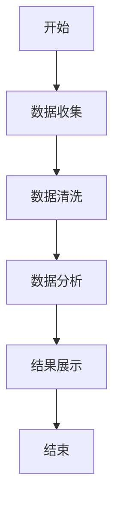

                 

<think>
好的，我需要根据用户的要求，撰写一篇关于彼得林奇对公司产品线分析的技术博客文章。首先，我需要理解彼得林奇的分析方法，了解他如何通过产品线分析来评估公司的投资价值。然后，我需要将这个过程分解成几个部分，确保文章结构清晰，逻辑严密。

首先，我会介绍彼得林奇的背景和投资理念，解释他为什么关注产品线分析。接着，我会详细说明产品线分析的基本概念，包括定义、核心要素以及分析的边界。这部分需要让读者明白产品线分析的重要性和基本框架。

接下来，我会深入探讨彼得林奇分析方法的核心原理，包括产品线的生命周期、竞争优势和潜在风险。这部分需要结合实际案例，说明如何通过分析产品线的这些方面来评估公司的投资价值。

然后，我会讨论产品线分析的算法原理，可能涉及一些数学模型和公式。例如，可以介绍如何通过市场数据计算产品线的市场份额变化，或者如何评估产品线的成本效益。这部分需要使用Mermaid图来展示分析流程，帮助读者更好地理解。

在系统分析部分，我会构建一个产品线分析的系统架构，包括数据采集、分析模块和结果展示。这部分可能需要使用Mermaid图来展示系统架构，解释各个模块的功能和交互方式。

接下来，我会通过一个具体的项目实战，展示如何应用彼得林奇的方法进行产品线分析。这包括环境配置、数据收集、分析过程和结果解读。这部分需要详细描述步骤，并提供可参考的代码示例。

最后，我会总结最佳实践，给出一些小贴士和注意事项，帮助读者在实际操作中避免常见的错误，并指导他们如何进一步优化分析过程。

在写作过程中，我需要确保语言简洁明了，逻辑清晰，每一部分都紧密围绕主题展开。同时，适当使用图表和代码示例，可以增强文章的可读性和实用性。这样，读者不仅能够理解彼得林奇的分析方法，还能实际应用到自己的工作中。

总的来说，我需要系统地组织内容，从基础概念到高级分析，逐步引导读者掌握彼得林奇的产品线分析方法，并能够实际应用。这将帮助读者在投资决策中做出更明智的选择。
</think>

```markdown
# 彼得林奇对公司产品线的分析

> 关键词：彼得林奇，产品线分析，投资策略，企业战略，市场分析

> 摘要：本文深入分析了彼得林奇的产品线分析方法，探讨了其在投资决策和企业战略中的应用，结合实例和系统架构，详细讲解了分析的核心原理和实际操作步骤。

---

## 第1章: 彼得林奇分析方法的背景介绍

### 1.1 彼得林奇的个人背景与投资理念

- **1.1.1 彼得林奇的个人背景**
  - 彼得·林奇是美国著名的投资专家，以其在富达投资的长期管理中表现出色而闻名。
  - 他的投资理念强调深入研究公司基本面，尤其是产品线的分析。

- **1.1.2 投资理念的核心**
  - 长期投资：林奇主张长期持有优质股票，避免频繁交易。
  - 基本面分析：关注公司的财务状况、产品线和市场竞争力。
  - 风险控制：通过分散投资和深入分析来降低风险。

### 1.2 产品线分析的背景与重要性

- **1.2.1 产品线分析的定义**
  - 产品线分析是指对一家公司所有产品线的综合分析，评估其市场地位、盈利能力和发展潜力。

- **1.2.2 产品线分析的意义**
  - 识别公司的核心竞争力。
  - 评估产品线的市场前景和风险。
  - 为投资决策提供数据支持。

### 1.3 产品线分析的核心要素

- **1.3.1 产品线的核心要素**
  - 市场占有率：产品在市场中的份额。
  - 盈利能力：产品线的收入和利润情况。
  - 产品生命周期：产品从引入到衰退的阶段。
  - 竞争优势：产品的独特卖点和竞争优势。

- **1.3.2 产品线分析的逻辑框架**
  - 确定产品线的市场定位。
  - 评估产品线的盈利能力。
  - 分析产品线的竞争优势。
  - 识别潜在的风险和机会。

---

## 第2章: 产品线分析的核心概念与联系

### 2.1 产品线分析的核心概念

- **2.1.1 产品线的定义与分类**
  - 核心产品：产品的基本功能和核心价值。
  - 产品线扩展：通过添加新产品或改进现有产品来增强竞争力。
  - 产品组合：公司所有产品线的综合构成。

- **2.1.2 产品线的核心要素**
  - 市场需求：产品的目标客户和市场规模。
  - 技术能力：公司的研发能力和技术水平。
  - 营销策略：产品的推广和销售策略。

- **2.1.3 产品线分析的边界与外延**
  - 边界：产品线分析的范围和限制。
  - 外延：产品线分析与其他分析方法的联系。

### 2.2 产品线分析的核心原理

- **2.2.1 产品线分析的基本原理**
  - 通过分析产品线的市场表现和公司战略，评估其投资价值。

- **2.2.2 产品线分析的关键步骤**
  - 确定分析目标。
  - 收集市场数据。
  - 评估产品线的竞争力。
  - 分析潜在风险和机会。

- **2.2.3 产品线分析的数学模型**
  - 市场份额计算：市场份额 = （产品销量 / 市场总销量）× 100%。
  - 盈利能力分析：净利润率 = 净利润 / 营业收入 × 100%。

### 2.3 产品线分析的ER实体关系图

```mermaid
erd
  title 产品线分析的ER图
  球员
  product_line {
    id
    name
    market_share
    profit_margin
  }
  competitor {
    id
    name
    market_share
  }
  relationship {
    product_line_id
    competitor_id
    competition_level
  }
```

### 2.4 本章小结

- **2.4.1 产品线分析的核心概念**
  - 产品线的定义、分类和核心要素。
  - 产品线分析的逻辑框架和数学模型。

---

## 第3章: 产品线分析的算法原理

### 3.1 产品线分析的算法概述

- **3.1.1 算法的定义与分类**
  - 算法是解决问题的步骤序列，产品线分析涉及多种算法，如回归分析、聚类分析等。

- **3.1.2 算法的核心原理**
  - 通过数据挖掘和统计分析，识别产品线的关键特征和趋势。

- **3.1.3 算法的实现步骤**
  - 数据收集：获取市场数据和公司财务数据。
  - 数据清洗：处理缺失值和异常值。
  - 数据分析：应用统计方法和机器学习算法进行预测和分类。

### 3.2 产品线分析的数学模型与公式

- **3.2.1 市场份额预测模型**
  $$ \text{预测市场份额} = \beta_0 + \beta_1 \times \text{广告支出} + \beta_2 \times \text{价格} + \epsilon $$

- **3.2.2 盈利能力分析模型**
  $$ \text{净利润率} = \frac{\text{净利润}}{\text{营业收入}} \times 100\% $$

### 3.3 产品线分析的Mermaid流程图



### 3.4 本章小结

- **3.4.1 产品线分析的算法概述**
  - 算法的定义、分类和核心原理。
  - 算法的实现步骤和数学模型。

---

## 第4章: 产品线分析的系统架构与实现

### 4.1 系统架构设计

- **4.1.1 系统功能设计**
  - 数据采集模块：收集市场和公司数据。
  - 分析模块：应用算法进行预测和分类。
  - 结果展示模块：生成报告和可视化图表。

### 4.2 系统架构图


### 4.3 系统接口设计

- 数据采集接口：从数据库或API获取数据。
- 分析接口：调用算法进行预测。
- 展示接口：生成报告和图表。

### 4.4 本章小结

- **4.4.1 系统架构设计**
  - 系统功能设计和架构图。
  - 系统接口设计和实现。

---

## 第5章: 产品线分析的项目实战

### 5.1 项目背景

- 某公司希望通过分析其产品线，评估投资价值。

### 5.2 环境安装

- 安装Python、Pandas、NumPy、Matplotlib等库。

### 5.3 核心实现代码

```python
import pandas as pd
import numpy as np
import matplotlib.pyplot as plt

# 数据加载
data = pd.read_csv('product_line.csv')

# 数据清洗
data.dropna(inplace=True)

# 数据分析
from sklearn.linear_model import LinearRegression
model = LinearRegression()
model.fit(data[['price', 'advertising']], data['market_share'])

# 结果展示
plt.scatter(data['price'], data['market_share'])
plt.title('Price vs Market Share')
plt.xlabel('Price')
plt.ylabel('Market Share')
plt.show()
```

### 5.4 项目小结

- 项目实战展示了如何应用彼得林奇的分析方法进行产品线分析。
- 通过实际操作，读者可以掌握数据分析和可视化的技能。

---

## 第6章: 最佳实践与小结

### 6.1 最佳实践

- **6.1.1 关键指标分析**
  - 重视市场份额和净利润率的分析。
- **6.1.2 数据可视化**
  - 使用图表清晰展示分析结果。
- **6.1.3 持续监控**
  - 定期更新分析结果，跟踪市场变化。

### 6.2 小结

- 产品线分析是投资决策的重要工具。
- 通过系统化的分析方法和工具，可以更准确地评估公司价值。
- 本文结合彼得林奇的分析方法，详细讲解了产品线分析的核心概念、算法原理和实际应用。

---

## 作者：AI天才研究院 & 禅与计算机程序设计艺术

感谢您的阅读！如需进一步探讨，请随时联系。

```

