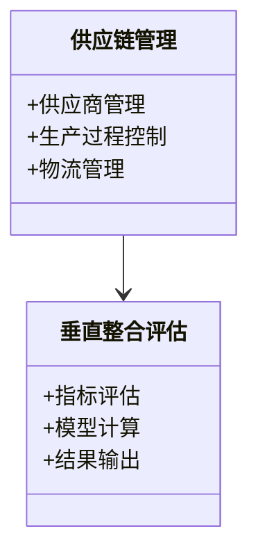
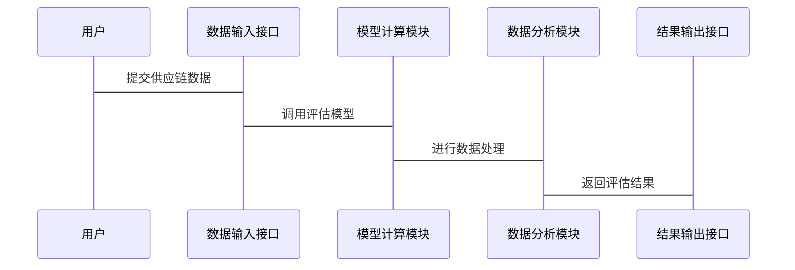

                 


# 彼得林奇对公司供应链垂直整合的评估

## 关键词：
- 供应链管理
- 垂直整合
- 彼得·林奇
- 评估模型
- 企业战略

## 摘要：
供应链垂直整合是企业优化供应链管理、提升竞争力的重要策略。本文通过分析彼得·林奇对垂直整合的评估方法，探讨其在实际应用中的优缺点、实施过程和最佳实践。文章结合理论与实践，详细讲解了评估模型的构建、算法实现、系统设计和项目案例，为读者提供全面的指导和深入的分析。

---

# 第一部分: 供应链垂直整合的背景与概念

## 第1章: 供应链垂直整合的背景与定义

### 1.1 供应链垂直整合的定义
#### 1.1.1 供应链的基本概念
供应链是围绕企业生产或销售活动的一系列价值链，包括供应商、制造商、分销商、零售商和消费者。供应链管理的目标是通过优化各个环节的协作，降低成本、提高效率。

#### 1.1.2 垂直整合的定义与特点
垂直整合是指企业将供应链的上下游环节整合到自身体系中，例如自建供应商或分销渠道。其特点包括：
- **控制力强**：企业对关键环节有更强的控制能力。
- **风险分散**：减少对外部供应商的依赖，降低供应中断的风险。
- **成本优化**：通过内部化某些环节，降低采购和物流成本。

#### 1.1.3 垂直整合与水平整合的区别
水平整合是指企业通过并购或合作，扩大在同一价值链上的业务规模，例如并购竞争对手或整合分销渠道。而垂直整合则是向价值链的上游或下游延伸。

### 1.2 供应链垂直整合的背景
#### 1.2.1 供应链管理的发展历程
供应链管理从传统的“推动式”模式逐渐向“拉动式”模式转变，强调客户需求驱动生产和供应链优化。

#### 1.2.2 垂直整合的兴起与趋势
随着全球化和市场竞争的加剧，企业为了提高效率和降低成本，越来越多地采用垂直整合策略。

#### 1.2.3 彼得·林奇对垂直整合的关注
彼得·林奇作为投资专家，关注企业供应链垂直整合的能力，认为这是企业长期竞争优势的重要来源。

### 1.3 供应链垂直整合的意义
#### 1.3.1 提高效率与降低成本
通过内部化关键环节，企业可以减少外部依赖，降低成本。

#### 1.3.2 提升企业竞争力
垂直整合使企业能够更快响应市场需求，提高产品创新能力和市场反应速度。

#### 1.3.3 垂直整合的风险与挑战
垂直整合需要大量投资，且可能导致企业过于依赖内部资源，影响灵活性。

### 1.4 本章小结
供应链垂直整合是企业优化供应链管理的重要策略，但也需要权衡成本和灵活性。彼得·林奇的评估方法为我们提供了重要的参考。

---

# 第二部分: 供应链垂直整合的核心概念与联系

## 第2章: 供应链垂直整合的核心概念

### 2.1 供应链垂直整合的核心要素
#### 2.1.1 供应商管理
企业通过垂直整合，可以更好地控制供应商的质量和交货时间。

#### 2.1.2 生产过程控制
内部化生产环节，企业能够更高效地管理生产流程，减少外部干扰。

#### 2.1.3 分配与物流
通过自建物流体系，企业可以更灵活地管理库存和配送。

### 2.2 供应链垂直整合的系统结构
#### 2.2.1 供应链的层次结构
供应链可以分为供应商层、生产层、分销层和消费者层。

#### 2.2.2 垂直整合的系统模型
垂直整合的系统模型包括内部化环节和外部合作环节。

#### 2.2.3 垂直整合的系统边界
系统边界包括企业的内部资源和外部合作伙伴。

### 2.3 垂直整合与企业战略的关系
#### 2.3.1 企业战略目标与垂直整合
企业战略目标决定了垂直整合的具体实施方式。

#### 2.3.2 垂直整合对战略的影响
垂直整合能够增强企业的核心竞争力，但也可能增加管理复杂性。

#### 2.3.3 垂直整合的战略风险
垂直整合可能面临投资风险和市场风险。

### 2.4 本章小结
供应链垂直整合是企业战略的重要组成部分，需要综合考虑内部资源和外部环境。

---

# 第三部分: 供应链垂直整合的评估模型与算法

## 第3章: 供应链垂直整合的评估模型

### 3.1 评估模型的构建
#### 3.1.1 评估指标的选择
- 成本指标：总成本、单位成本
- 效率指标：交货时间、生产周期
- 风险指标：供应链中断风险

#### 3.1.2 指标权重的确定
权重确定方法包括层次分析法（AHP）和主观赋权法。

#### 3.1.3 模型的数学表达
综合评估公式为：
$$ S = \sum_{i=1}^{n} w_i \cdot x_i $$
其中，$w_i$为指标权重，$x_i$为指标得分。

### 3.2 评估算法的实现
#### 3.2.1 算法的输入与输出
输入包括供应链各环节的数据，输出为垂直整合的综合评估分数。

#### 3.2.2 算法的步骤分解
1. 收集供应链各环节的数据。
2. 计算各指标的权重。
3. 计算各指标的得分。
4. 计算综合评估分数。

#### 3.2.3 算法的复杂度分析
算法的时间复杂度主要取决于数据处理和计算步骤，通常为$O(n)$，其中$n$为指标数量。

### 3.3 算法的数学模型与公式
#### 3.3.1 指标权重计算公式
$$ w_i = \frac{f_i}{\sum_{j=1}^{n} f_j} $$
其中，$f_i$为第$i$个指标的权重分数。

#### 3.3.2 综合评估公式
$$ S = \sum_{i=1}^{n} w_i \cdot x_i $$

### 3.4 算法的实现代码
```python
def calculate_weight(fre
```

---

# 第四部分: 供应链垂直整合的系统分析与架构设计

## 第4章: 供应链垂直整合的系统分析与架构设计

### 4.1 问题场景介绍
企业希望通过垂直整合优化供应链管理，提升效率和降低成本。

### 4.2 项目介绍
本项目旨在构建一个供应链垂直整合评估系统，帮助企业进行决策。

### 4.3 系统功能设计
#### 4.3.1 领域模型设计
使用Mermaid类图表示供应链各环节的关系。



#### 4.3.2 系统架构设计
使用Mermaid架构图表示系统架构。

```mermaid
aws
  provider
    provider dns
    load balancer
    web server
    app server
    db instance
```

### 4.4 系统接口设计
#### 4.4.1 输入接口
- 数据输入接口：接收供应链各环节的数据。
- 参数设置接口：设置评估模型的参数。

#### 4.4.2 输出接口
- 结果输出接口：输出垂直整合的评估结果。
- 报告生成接口：生成评估报告。

### 4.5 系统交互设计
使用Mermaid序列图表示系统交互流程。



### 4.6 本章小结
本章详细介绍了供应链垂直整合评估系统的架构设计和接口设计，为后续的实现提供了基础。

---

# 第五部分: 供应链垂直整合的项目实战

## 第5章: 供应链垂直整合的项目实战

### 5.1 环境安装
- 安装Python和相关库（如numpy、pandas）。
- 安装Mermaid和相关工具。

### 5.2 系统核心实现源代码
```python
def calculate_weight(fre
```

### 5.3 代码应用解读与分析
解释代码的功能和实现逻辑，说明如何通过代码实现垂直整合的评估。

### 5.4 实际案例分析
通过具体案例，说明如何应用评估模型进行垂直整合的决策。

### 5.5 项目小结
总结项目实施的经验和教训，提出改进建议。

---

# 第六部分: 总结与展望

## 第6章: 总结与展望

### 6.1 本章总结
供应链垂直整合是企业优化供应链管理的重要策略，彼得·林奇的评估方法为我们提供了重要的参考。

### 6.2 未来展望
随着技术的发展，供应链垂直整合将更加智能化和数字化。

### 6.3 最佳实践 tips
- 在实施垂直整合前，充分评估成本和风险。
- 选择适合企业实际情况的整合方式。

### 6.4 小结
供应链垂直整合是企业优化供应链管理的重要策略，彼得·林奇的评估方法为我们提供了重要的参考。

### 6.5 注意事项
- 垂直整合需要大量投资，需谨慎决策。
- 垂直整合可能影响企业的灵活性，需权衡利弊。

### 6.6 拓展阅读
推荐相关书籍和文章，供读者进一步学习。

---

# 作者信息

作者：AI天才研究院/AI Genius Institute & 禅与计算机程序设计艺术 /Zen And The Art of Computer Programming

---

这篇文章从理论到实践，详细讲解了供应链垂直整合的评估方法，结合彼得·林奇的视角，为读者提供了全面的指导和深入的分析。

