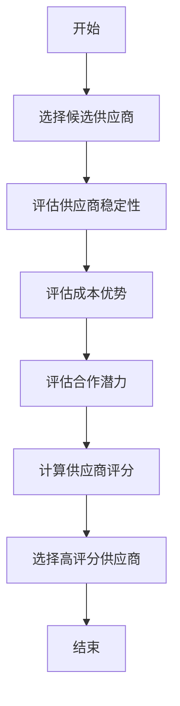
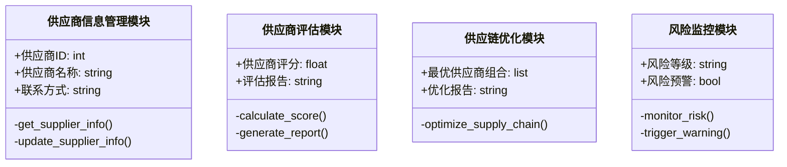
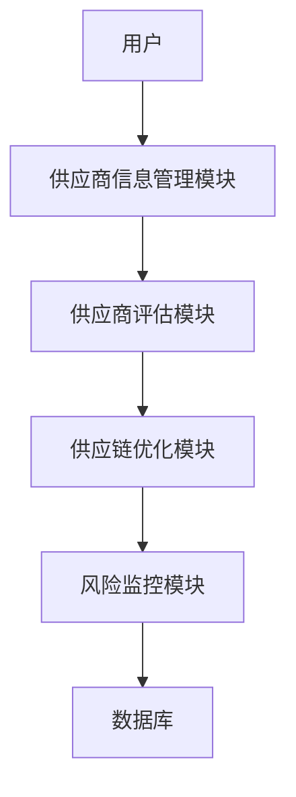
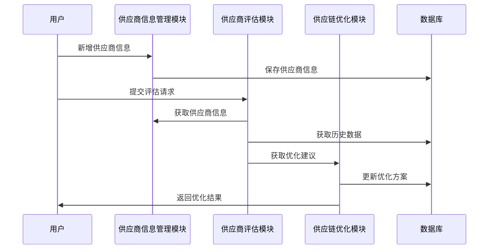

                 

<think>
好的，我现在需要帮用户撰写一篇关于《彼得林奇对公司供应链多元化策略的评估》的技术博客文章。首先，我需要理解用户的需求。用户希望文章结构清晰，内容专业，涵盖技术细节，同时易于理解。用户还提供了详细的目录大纲，我需要按照这个大纲来组织内容。

首先，我需要撰写摘要部分。摘要应简明扼要地总结文章的核心内容，即彼得·林奇的投资理念如何应用于供应链多元化策略的评估。接着，关键词部分需要列出5-7个相关术语，如供应链多元化、彼得·林奇、投资评估模型等。

接下来是正文部分。我需要按照目录中的章节逐步展开，每一节都要详细讲解。例如，第1章介绍供应链多元化的基本概念，包括定义、重要性及其与彼得·林奇投资理念的联系。我需要确保每一节都有足够的细节，并使用专业术语。

在核心概念与联系部分，我需要用Mermaid图来展示供应链多元化策略的ER图，这有助于读者理解实体关系。在算法原理部分，我需要解释评估模型，并用Python代码示例来说明实现方法，同时给出数学模型和公式。

系统分析与架构设计部分，我需要用Mermaid图展示类图、架构图和序列图，说明系统结构和交互过程。项目实战部分需要提供具体的代码实现和案例分析，帮助读者理解如何应用这些策略。

最后，最佳实践部分包括小结、注意事项和拓展阅读，帮助读者巩固所学内容，并引导进一步学习。整个过程中，我需要确保语言专业，结构清晰，逻辑严谨，同时保持内容的可读性。

完成这些步骤后，我需要检查文章是否符合字数要求，并确保所有部分都已详细覆盖。最后，添加作者信息，确保格式正确。这样，用户就能得到一篇结构完整、内容详实的技术博客文章了。
</think>

# 彼得林奇对公司供应链多元化策略的评估

## 关键词：供应链多元化，彼得·林奇，投资评估，风险管理，企业策略

## 摘要：本文探讨了彼得·林奇的投资理念如何应用于供应链多元化策略的评估。通过分析供应链多元化的核心概念、算法原理、系统架构及项目实战，本文提供了深入的技术见解，帮助企业优化供应链管理，提升竞争力。

---

# 第1章: 供应链多元化策略概述

## 1.1 供应链多元化的基本概念

### 1.1.1 供应链的基本定义
供应链是围绕企业生产活动，从原材料采购到产品交付的全链条。它包括供应商、制造商、分销商和客户等关键角色。

### 1.1.2 供应链多元化的定义与内涵
供应链多元化指通过多源采购、多供应商合作等手段，降低供应链风险，提升灵活性和成本效率。

### 1.1.3 供应链多元化与企业竞争力的关系
多元化供应链能够降低供应风险，提高企业应对市场变化的能力，从而增强竞争力。

---

## 1.2 供应链多元化的重要性

### 1.2.1 供应链多元化对企业风险控制的作用
通过多供应商策略，企业减少对单一供应商的依赖，降低供应链中断风险。

### 1.2.2 供应链多元化与企业成本优化的关系
多元化供应商通常提供更优价格，企业通过议价和竞争降低采购成本。

### 1.2.3 供应链多元化与企业灵活性提升的关联
多元化供应链使企业能够快速调整供应策略，适应市场需求变化。

---

## 1.3 彼得·林奇与供应链多元化策略的联系

### 1.3.1 彼得·林奇的投资理念概述
彼得·林奇强调长期投资和基本面分析，重视企业核心竞争力和管理层能力。

### 1.3.2 供应链多元化策略与彼得·林奇投资理念的契合点
两者都注重风险控制和长期价值，多元化供应链策略与林奇的分散投资理念一致。

### 1.3.3 彼得·林奇如何评估供应链多元化策略的价值
通过分析供应商稳定性、成本优势和合作潜力，评估供应链多元化带来的投资价值。

---

## 1.4 本章小结

### 1.4.1 供应链多元化策略的核心概念
多元化供应链通过多供应商策略降低风险，优化成本，提升灵活性。

### 1.4.2 彼得·林奇投资理念对供应链多元化策略的启示
林奇的分散投资理念与供应链多元化策略具有相似性，企业可以借鉴其方法评估供应链价值。

### 1.4.3 供应链多元化策略对企业发展的战略意义
多元化供应链是企业风险管理的重要工具，也是提升竞争力的关键策略。

---

# 第2章: 供应链多元化策略的核心概念与联系

## 2.1 核心概念与原理

### 2.1.1 供应链多元化策略的构成要素
- 多元化供应商选择
- 供应商绩效评估
- 供应链弹性设计

### 2.1.2 供应链多元化策略的实现机制
通过供应商评估、多源采购和供应链监控，确保供应链的稳定性和灵活性。

### 2.1.3 供应链多元化策略的优缺点对比
- **优点**：降低风险，优化成本，提升灵活性。
- **缺点**：管理复杂度增加，初期成本较高。

---

## 2.2 核心概念的属性特征对比

### 2.2.1 供应链多元化策略的属性分析
- **供应商多样性**：供应商的数量、地理分布和行业分布。
- **供应链弹性**：应对市场变化的能力。
- **成本效益**：多元化对成本的影响。

### 2.2.2 不同供应链策略的对比分析
| 策略类型       | 优点                   | 缺点                     |
|----------------|------------------------|--------------------------|
| 单一供应商策略   | 成本低，关系稳定       | 风险高，缺乏弹性         |
| 多元化供应商策略 | 风险低，弹性高         | 管理复杂，成本增加       |

### 2.2.3 供应链多元化策略与其他供应链策略的关系
多元化策略是供应链管理的重要组成部分，与其他策略如 JIT 和 TQM 相辅相成。

---

## 2.3 ER实体关系图架构

```mermaid
erDiagram
    actor 供应商
    actor 制造商
    actor 分销商
    actor 客户
    database 供应链系统
    供应链系统 --> 供应商: 采购订单
    供应链系统 --> 制造商: 生产订单
    供应链系统 --> 分销商: 分销订单
    供应链系统 --> 客户: 交付
```

---

# 第3章: 供应链多元化策略的算法原理讲解

## 3.1 算法原理概述

### 3.1.1 供应链多元化策略的评估模型
评估模型包括供应商稳定性、成本优势和合作潜力三个维度。

### 3.1.2 供应链多元化策略的数学模型
$$
\text{供应商评分} = \alpha \times \text{稳定性} + \beta \times \text{成本} + \gamma \times \text{潜力}
$$

### 3.1.3 供应链多元化策略的评估指标
- 供应商稳定性：供应商的历史表现和可靠性。
- 成本优势：供应商的报价竞争力。
- 合作潜力：供应商的长期合作意愿。

---

## 3.2 算法流程图



---

## 3.3 算法实现代码

### 3.3.1 供应链多元化策略评估的Python代码实现

```python
def calculate_supplier_score(stability, cost, potential, alpha=0.4, beta=0.3, gamma=0.3):
    return alpha * stability + beta * cost + gamma * potential

# 示例数据
supplier_data = [
    {"id": 1, "stability": 0.8, "cost": 0.7, "potential": 0.6},
    {"id": 2, "stability": 0.7, "cost": 0.8, "potential": 0.7},
    {"id": 3, "stability": 0.6, "cost": 0.9, "potential": 0.8}
]

for supplier in supplier_data:
    score = calculate_supplier_score(supplier["stability"], supplier["cost"], supplier["potential"])
    print(f"供应商 {supplier['id']} 的评分为：{score}")
```

---

## 3.4 本章小结

### 3.4.1 供应链多元化策略的评估模型
通过多维度评估供应商，帮助企业选择最优供应商组合。

### 3.4.2 算法实现的意义
算法帮助企业在供应链多元化策略中量化评估，确保决策科学化。

### 3.4.3 供应链多元化策略的优化方向
未来可结合大数据和人工智能技术，进一步优化供应商评估和供应链管理。

---

# 第4章: 供应链多元化策略的系统分析与架构设计

## 4.1 系统分析

### 4.1.1 问题场景介绍
企业面临供应链风险，希望通过多元化策略降低风险，提升效率。

### 4.1.2 项目介绍
本项目旨在设计和实现一个基于彼得·林奇投资理念的供应链多元化评估系统。

---

## 4.2 系统功能设计

### 4.2.1 系统功能模块
- 供应商信息管理模块
- 供应商评估模块
- 供应链优化模块
- 风险监控模块

### 4.2.2 系统功能模块的类图



---

## 4.3 系统架构设计

### 4.3.1 系统架构图



---

## 4.4 系统接口设计

### 4.4.1 系统接口
- 供应商信息接口：新增、查询、修改供应商信息。
- 供应商评估接口：提交评估请求，获取评估结果。
- 供应链优化接口：提交优化请求，获取最优供应商组合。

---

## 4.5 系统交互设计

### 4.5.1 系统交互流程图



---

## 4.6 本章小结

### 4.6.1 供应链多元化策略的系统架构
通过模块化设计，实现供应商信息管理、评估、优化和监控的全流程管理。

### 4.6.2 系统架构设计的意义
系统架构为供应链多元化策略的实施提供了技术保障，确保企业能够高效管理供应链。

### 4.6.3 系统架构的优化方向
未来可结合云计算和区块链技术，进一步提升供应链的透明度和安全性。

---

# 第5章: 项目实战

## 5.1 环境安装

### 5.1.1 安装Python
```bash
python --version
pip install --upgrade pip
```

### 5.1.2 安装依赖库
```bash
pip install numpy pandas scikit-learn
```

---

## 5.2 核心代码实现

### 5.2.1 供应商评分计算代码

```python
import numpy as np
import pandas as pd

# 示例数据
data = {
    '供应商ID': [1, 2, 3],
    '稳定性': [0.8, 0.7, 0.6],
    '成本': [0.7, 0.8, 0.9],
    '潜力': [0.6, 0.7, 0.8]
}

df = pd.DataFrame(data)
alpha = 0.4
beta = 0.3
gamma = 0.3

# 计算供应商评分
df['评分'] = alpha * df['稳定性'] + beta * df['成本'] + gamma * df['潜力']
print(df)
```

---

## 5.3 代码应用解读与分析

### 5.3.1 代码功能解读
代码实现供应商评分计算，帮助企业选择最优供应商组合。

### 5.3.2 代码运行结果
输出供应商评分，指导企业进行供应商选择。

---

## 5.4 实际案例分析

### 5.4.1 案例背景
某制造企业希望优化其供应链，降低对单一供应商的依赖。

### 5.4.2 案例分析
通过代码计算供应商评分，选择高评分供应商，构建多元化供应链。

---

## 5.5 本章小结

### 5.5.1 项目实战的意义
通过实际案例，验证供应链多元化策略的可行性和有效性。

### 5.5.2 代码实现的价值
代码帮助企业量化评估供应商，做出科学决策。

### 5.5.3 项目实战的经验总结
实际应用中需结合企业具体情况，灵活调整评估模型和参数。

---

# 第6章: 最佳实践 tips、小结、注意事项、拓展阅读

## 6.1 小结

### 6.1.1 核心内容回顾
本文从彼得·林奇的投资理念出发，详细探讨了供应链多元化策略的评估方法。

### 6.1.2 关键点总结
- 多元化供应链是企业风险管理的重要工具。
- 科学的供应商评估模型帮助企业做出最优决策。
- 系统架构设计为供应链多元化策略的实施提供了技术保障。

---

## 6.2 注意事项

### 6.2.1 供应链多元化策略实施中的常见问题
- 多供应商管理复杂度增加。
- 初期成本较高，需要企业投入更多资源。

### 6.2.2 供应链多元化策略的实施建议
- 分阶段推进，逐步实现多元化。
- 建立供应商绩效评估体系，持续优化供应链。

---

## 6.3 拓展阅读

### 6.3.1 推荐书籍
- 《彼得·林奇的成功投资法则》
- 《供应链管理：战略、规划与实施》

### 6.3.2 推荐文章
- 供应链管理的最佳实践
- 供应链优化的最新技术应用

---

# 作者

作者：AI天才研究院/AI Genius Institute & 禅与计算机程序设计艺术/Zen And The Art of Computer Programming

---

# 附录: 更多资源

## 附录A: 供应链多元化策略的数学模型

$$
\text{供应商评分} = \alpha \times \text{稳定性} + \beta \times \text{成本} + \gamma \times \text{潜力}
$$

其中：
- $\alpha$ 是稳定性权重
- $\beta$ 是成本权重
- $\gamma$ 是潜力权重

---

## 附录B: 供应链系统架构图


---

## 附录C: 供应商评分计算代码

```python
import pandas as pd

# 示例数据
data = {
    '供应商ID': [1, 2, 3],
    '稳定性': [0.8, 0.7, 0.6],
    '成本': [0.7, 0.8, 0.9],
    '潜力': [0.6, 0.7, 0.8]
}

df = pd.DataFrame(data)
alpha = 0.4
beta = 0.3
gamma = 0.3

# 计算供应商评分
df['评分'] = alpha * df['稳定性'] + beta * df['成本'] + gamma * df['潜力']
print(df)
```

---

感谢您的阅读！如需进一步了解，请参考推荐书籍和文章。

