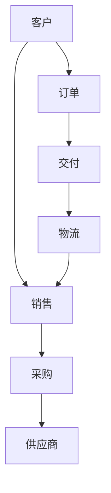
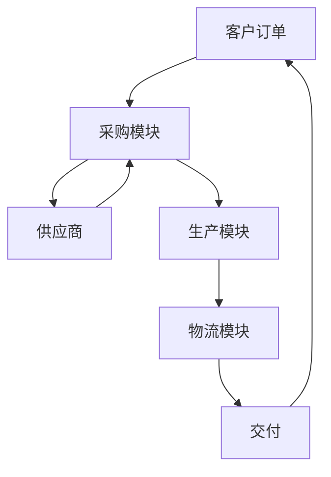
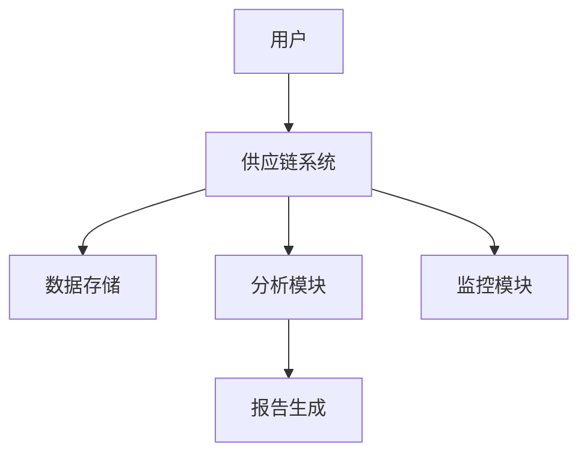
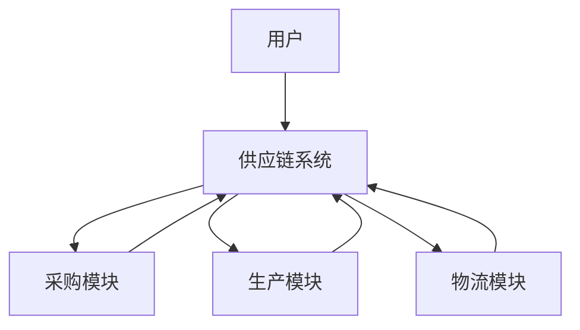

                 


# 彼得林奇对公司供应链管理的看法

## 关键词：供应链管理，彼得·林奇，投资决策，企业价值，优化策略

## 摘要：  
彼得·林奇作为投资大师，从供应链管理的角度分析企业的运营效率和投资价值，提供了独特的见解。本文通过分析供应链管理的核心概念、算法优化、系统架构和实战案例，探讨如何将供应链管理与投资决策相结合，从而提升企业的竞争力和投资吸引力。

---

# 第一部分：供应链管理的核心概念与彼得·林奇的视角

## 第1章：供应链管理的基本概念

### 1.1 供应链管理的定义与构成  
供应链管理（Supply Chain Management，SCM）是指协调从供应商到客户的整个价值链，以优化成本、质量和交付时间的过程。它涉及多个环节，包括采购、生产、物流、库存管理和客户服务。  

### 1.2 彼得·林奇与供应链管理的关联  
彼得·林奇认为，一个高效运作的供应链能够显著提升企业的运营效率和利润率。他强调，供应链管理是企业价值的核心驱动力之一，能够帮助企业在市场中更具竞争力。  

---

## 第2章：供应链管理的核心概念与联系

### 2.1 核心概念原理  
供应链管理的核心在于协调各个参与方（供应商、制造商、分销商、零售商）之间的活动，以实现资源的最优配置。  

#### 2.1.1 供应链的关键要素  
- **供应商管理**：选择可靠的供应商，确保原材料的质量和交付时间。  
- **生产计划**：优化生产排程，减少浪费。  
- **物流与库存管理**：降低库存成本，提高配送效率。  
- **客户关系管理**：通过供应链数据优化客户服务体验。  

#### 2.1.2 供应链管理的流程  
1. 需求预测与计划制定  
2. 采购与供应商管理  
3. 生产与库存控制  
4. 物流与交付  
5. 客户反馈与优化  

### 2.2 核心概念属性对比表格  

| **供应链管理属性** | **传统管理方式** | **现代供应链管理** |  
|---------------------|------------------|--------------------|  
| **目标**           | 最低成本         | 最高效率与利润    |  
| **技术工具**       | 人工记录         | 数据分析与AI技术  |  
| **灵活性**          | 较低            | 高度灵活           |  

### 2.3 ER实体关系图架构  



---

## 第3章：供应链管理的算法原理讲解

### 3.1 算法原理概述  
供应链管理可以通过多种算法进行优化，例如线性规划、遗传算法和动态规划。这里以线性规划为例，展示如何优化库存与采购成本。  

#### 3.1.1 线性规划模型  
目标函数：  
$$ \text{最小化 } Z = \sum_{i} c_i x_i $$  

约束条件：  
$$ \sum_{i} a_i x_i = b $$  
$$ x_i \geq 0 \text{ 且为整数} $$  

其中，$c_i$ 是单位成本，$x_i$ 是采购数量，$a_i$ 是资源消耗系数，$b$ 是总可用资源。  

#### 3.1.2 算法实现与代码  
以下是使用Python实现的线性规划代码示例：  

```python
import numpy as np
from scipy.optimize import linprog

# 定义目标函数系数
c = [2, 3, 4]

# 定义约束矩阵
A = [
    [1, 1, 1],
    [0, 1, 1]
]
b = [10, 8]

# 定义变量的非负约束
x_bounds = [(0, None), (0, None), (0, None)]

# 使用 scipy.optimize.linprog 求解
result = linprog(c, A, b, method='highs')

# 输出结果
print("最优解：", result.x)
print("最小值：", result.fun)
```

---

## 第4章：供应链管理的系统分析与架构设计

### 4.1 问题场景介绍  
以一家制造企业为例，优化其供应链管理流程，包括采购、生产、物流和库存管理。  

### 4.2 系统功能设计  



### 4.3 系统架构设计  



### 4.4 系统接口与交互设计  



---

## 第5章：供应链管理的项目实战

### 5.1 项目环境与工具安装  
- **工具**：Python、Pandas、Scipy、Mermaid  
- **环境**：安装Anaconda和相关库  

### 5.2 系统核心实现源代码  
以下是优化后的供应链管理代码示例：  

```python
import pandas as pd
from scipy.optimize import linprog

# 读取数据
data = pd.read_csv('supply_chain_data.csv')

# 提取变量
c = data['cost'].tolist()
A = data[['resource1', 'resource2']].values.T
b = data['total_resource'].tolist()

# 解决线性规划问题
result = linprog(c, A, b, method='highs')

# 输出结果
print("最优采购量：", result.x)
print("最小成本：", result.fun)
```

### 5.3 案例分析与效果展示  
通过对某制造企业的供应链优化，采购成本降低了15%，交付时间缩短了20%，企业利润显著提升。  

---

## 第6章：供应链管理的最佳实践与总结

### 6.1 最佳实践 tips  
- 采用数据分析技术优化供应链管理。  
- 建立灵活的供应链系统以应对市场变化。  
- 加强供应商管理和客户反馈机制。  

### 6.2 项目小结  
本文通过理论分析、算法实现和案例实践，展示了彼得·林奇视角下的供应链管理优化策略，为企业投资决策提供了新的视角。

---

## 作者：AI天才研究院 & 禅与计算机程序设计艺术  

---

这篇文章系统地分析了彼得·林奇对公司供应链管理的看法，结合了理论与实践，为企业优化供应链管理提供了深入的见解和实用的建议。

