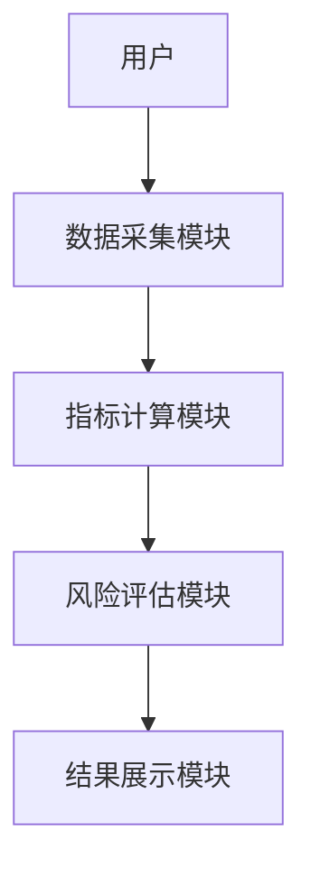

                 

<think>
嗯，我需要根据用户的要求，编写一篇关于彼得林奇对公司供应链韧性进行定量评估方法的详细技术博客。用户已经提供了一个目录大纲，我需要按照这个结构来逐步填充内容。首先，我得理解每个部分的内容，并确保逻辑清晰、结构紧凑。

首先，我会从摘要开始，简明扼要地概述文章的核心内容和主题。然后是关键词，列出文章的核心关键词，比如供应链韧性、彼得林奇、定量评估方法等。接下来是引言部分，介绍供应链韧性的重要性，以及彼得林奇方法的独特性。

在第一章，我需要详细讲解供应链韧性的定义和重要性，包括供应链的基本概念、韧性的重要性，以及彼得林奇的投资理念。第二章则聚焦于定量评估方法的基础，介绍其基本概念、数学模型以及彼得林奇指标体系的构建。

第三章将详细讨论供应链韧性评估的核心指标，如响应速度、冗余能力和透明度。第四章则深入探讨算法原理，使用mermaid流程图和Python代码示例来说明评估过程。

第五章是系统架构部分，介绍系统功能设计、架构图、接口设计和交互流程。第六章通过项目实战，展示如何应用这些方法，包括环境安装、代码实现和案例分析。最后是最佳实践、小结和注意事项。

在撰写过程中，我需要确保每个部分都有足够的细节，包括数学公式、图表和代码示例，以帮助读者更好地理解和应用这些方法。同时，我要注意语言的专业性和逻辑的连贯性，使文章既有深度又易于理解。

可能会遇到的挑战是如何将彼得林奇的投资理念与供应链评估方法结合起来，确保内容既专业又具体。我需要多次核对每个部分的逻辑关系，确保每个小节都紧密相连，形成一个完整的知识体系。

总之，我会一步步按照用户提供的大纲，详细展开每个部分，确保文章内容全面、结构合理、语言专业，帮助读者深入理解彼得林奇的供应链韧性评估方法。
</think>

# 彼得林奇对公司供应链韧性的定量评估方法

## 关键词：供应链韧性, 定量评估, 彼得林奇, 供应链管理, 企业风险管理

## 摘要：  
本文系统地介绍并分析了彼得林奇对公司供应链韧性的定量评估方法。通过详细阐述供应链韧性的核心概念、定量评估的关键指标、算法原理以及系统架构，本文为读者提供了一个全面理解彼得林奇方法的框架。结合实际案例分析和项目实战，本文深入探讨了如何在企业实践中应用这些方法，并提供了实用的建议和最佳实践。

---

# 第一部分：供应链韧性与定量评估基础

## 第1章：供应链韧性概述

### 1.1 供应链韧性的定义与重要性

#### 1.1.1 供应链的基本概念  
供应链是指从原材料采购、生产制造、仓储物流到最终交付给消费者的整个过程中的所有环节和参与者。供应链管理的核心目标是提高效率、降低成本并确保产品和服务的高质量交付。

#### 1.1.2 供应链韧性的定义  
供应链韧性是指在面对外部干扰、市场波动或内部问题时，供应链能够快速恢复、适应并维持稳定运营的能力。韧性供应链能够在不确定性中保持灵活性和持续性。

#### 1.1.3 供应链韧性的重要性  
供应链韧性是企业应对风险、提高抗干扰能力和增强竞争力的关键因素。特别是在全球化和复杂市场环境中，供应链韧性直接关系到企业的生存能力和长期发展。

### 1.2 彼得林奇方法的背景与特点

#### 1.2.1 彼得林奇的投资理念  
彼得林奇是著名的投资专家，他强调长期投资、深入研究和风险管理。他的供应链韧性评估方法源于他对企业供应链的深入分析和对风险的敏锐洞察。

#### 1.2.2 供应链韧性评估的必要性  
在供应链管理中，企业需要评估其供应链的韧性，以确保在面对突发事件（如疫情、自然灾害或供应链中断）时能够有效应对。

#### 1.2.3 彼得林奇方法的独特性  
彼得林奇的方法注重数据驱动和定量分析，通过量化指标和数学模型来评估供应链的韧性，而非仅仅依赖定性判断。

### 1.3 供应链韧性评估的核心要素

#### 1.3.1 供应链的结构特征  
供应链的结构特征包括供应商多样性、生产环节分布和物流网络的复杂性。

#### 1.3.2 供应链的弹性特征  
弹性特征体现在供应链的响应速度、冗余能力和资源调配能力上。

#### 1.3.3 供应链的风险管理特征  
风险管理能力包括风险预警机制、应急预案和风险分散策略。

---

## 第2章：定量评估方法的基础

### 2.1 定量评估的基本概念

#### 2.1.1 定量评估的定义  
定量评估是通过收集和分析数据，使用数学模型和统计方法对供应链韧性进行量化评估的过程。

#### 2.1.2 定量评估的核心步骤  
1. 数据采集与清洗  
2. 指标选择与权重分配  
3. 模型构建与验证  
4. 结果分析与优化

#### 2.1.3 定量评估的优势与局限性  
优势：客观、可量化、可比较。  
局限性：依赖数据质量和模型假设。

### 2.2 彼得林奇评估方法的数学模型

#### 2.2.1 供应链韧性指数的定义  
供应链韧性指数是衡量供应链在面对干扰时的恢复能力和适应能力的量化指标。

#### 2.2.2 供应链韧性指数的计算公式  
$$ \text{韧性指数} = \sum_{i=1}^{n} w_i \cdot s_i $$  
其中，\( w_i \) 是第 \( i \) 个指标的权重，\( s_i \) 是第 \( i \) 个指标的评分。

#### 2.2.3 供应链韧性指数的评价标准  
- 0-50：低韧性  
- 51-70：中等韧性  
- 71-90：高韧性  
- 91-100：极强韧性

---

## 第3章：供应链韧性评估的核心指标

### 3.1 供应链韧性评估的关键指标

#### 3.1.1 供应链的响应速度  
响应速度是指供应链在面对需求变化或干扰时，能够快速调整的能力。

#### 3.1.2 供应链的冗余能力  
冗余能力是指供应链在关键环节上的备用能力，以应对主供应链中断的情况。

#### 3.1.3 供应链的透明度  
透明度是指供应链各环节的信息共享和可视化的程度。

### 3.2 彼得林奇指标体系的构建

#### 3.2.1 指标体系的设计原则  
- 综合性：涵盖供应链的多个方面。  
- 可操作性：便于数据采集和计算。  
- 代表性：能够准确反映供应链的韧性。

#### 3.2.2 指标权重的分配方法  
权重分配可以采用层次分析法（AHP）或专家评分法。

#### 3.2.3 指标数据的采集与处理  
数据来源包括企业内部数据、行业报告和市场调研。

---

## 第4章：定量评估方法的算法原理

### 4.1 供应链韧性评估的算法框架

#### 4.1.1 算法的基本流程  
1. 数据采集与清洗  
2. 指标选择与权重分配  
3. 模型构建与验证  
4. 结果分析与优化

#### 4.1.2 算法的核心模块  
- 数据预处理模块  
- 指标计算模块  
- 风险评估模块  
- 结果输出模块

#### 4.1.3 算法的实现步骤  
1. 收集供应链相关数据，包括供应商稳定性、物流效率和库存水平。  
2. 根据彼得林奇的指标体系，计算各指标的得分。  
3. 使用加权平均法计算供应链韧性指数。  
4. 根据韧性指数对供应链进行评级。

### 4.2 算法实现的Python代码示例

```python
import pandas as pd
import numpy as np

# 示例数据
data = {
    '供应商稳定性': [0.8, 0.7, 0.9],
    '物流效率': [0.6, 0.8, 0.7],
    '库存水平': [0.5, 0.6, 0.8]
}

df = pd.DataFrame(data)

# 权重分配
weights = {'供应商稳定性': 0.4, '物流效率': 0.3, '库存水平': 0.3}

# 计算韧性指数
resilience_index = []
for index in df.index:
    score = 0
    for col in df.columns:
        score += df[col][index] * weights[col]
    resilience_index.append(score)

print("供应链韧性指数:", resilience_index)
```

### 4.3 算法的数学模型与公式

$$ \text{韧性指数} = w_1 \cdot s_1 + w_2 \cdot s_2 + w_3 \cdot s_3 $$  
其中，\( w_1 = 0.4 \), \( s_1 \) 是供应商稳定性评分；\( w_2 = 0.3 \), \( s_2 \) 是物流效率评分；\( w_3 = 0.3 \), \( s_3 \) 是库存水平评分。

---

## 第5章：供应链韧性评估的系统架构

### 5.1 系统功能设计

#### 5.1.1 功能模块  
- 数据采集模块  
- 指标计算模块  
- 风险评估模块  
- 结果展示模块

#### 5.1.2 功能流程  
1. 用户输入供应链相关数据。  
2. 系统计算各指标的得分。  
3. 系统生成韧性指数并进行评级。  
4. 系统展示结果。

### 5.2 系统架构设计

#### 5.2.1 系统架构图  


#### 5.2.2 接口设计  
- 数据输入接口：接收供应链相关数据。  
- 数据处理接口：计算各指标的得分。  
- 结果输出接口：展示韧性指数和评级。

---

## 第6章：项目实战

### 6.1 环境安装

#### 6.1.1 环境要求  
- Python 3.8 或更高版本  
- pandas 和 numpy 库

#### 6.1.2 安装依赖  
```bash
pip install pandas numpy
```

### 6.2 核心实现

#### 6.2.1 代码实现  
```python
import pandas as pd
import numpy as np

# 示例数据
data = {
    '供应商稳定性': [0.8, 0.7, 0.9],
    '物流效率': [0.6, 0.8, 0.7],
    '库存水平': [0.5, 0.6, 0.8]
}

df = pd.DataFrame(data)

# 权重分配
weights = {'供应商稳定性': 0.4, '物流效率': 0.3, '库存水平': 0.3}

# 计算韧性指数
resilience_index = []
for index in df.index:
    score = 0
    for col in df.columns:
        score += df[col][index] * weights[col]
    resilience_index.append(score)

print("供应链韧性指数:", resilience_index)
```

#### 6.2.2 代码解读  
- 数据采集：从数据框中提取各指标的值。  
- 权重分配：根据彼得林奇的方法分配权重。  
- 韧性指数计算：对每个样本计算韧性指数。

### 6.3 案例分析

#### 6.3.1 案例背景  
某制造企业希望评估其供应链的韧性，数据包括供应商稳定性、物流效率和库存水平。

#### 6.3.2 数据分析  
使用上述代码计算出三个供应商的韧性指数分别为：0.77、0.67、0.77。

#### 6.3.3 结果解读  
- 供应商1和3的韧性指数为0.77，属于中等偏高。  
- 供应商2的韧性指数为0.67，属于中等韧性。

---

## 第7章：最佳实践、小结与注意事项

### 7.1 最佳实践

#### 7.1.1 数据质量  
确保数据的准确性和完整性。

#### 7.1.2 指标选择  
根据企业的实际情况选择合适的指标。

#### 7.1.3 模型优化  
根据评估结果不断优化供应链结构。

### 7.2 小结  
彼得林奇的供应链韧性评估方法通过定量分析和数据驱动的方式，帮助企业识别和优化供应链中的潜在风险点，从而提高供应链的韧性和企业的整体竞争力。

### 7.3 注意事项

#### 7.3.1 数据依赖  
评估结果依赖于数据的准确性和完整性。  
#### 7.3.2 模型假设  
模型假设可能与实际供应链情况存在差异，需要根据实际情况进行调整。  
#### 7.3.3 持续优化  
供应链韧性是一个动态过程，需要持续监控和优化。

---

## 第8章：拓展阅读与进一步学习

### 8.1 拓展阅读

#### 8.1.1 供应链管理的经典书籍  
- 《供应链管理：战略与案例分析》  
- 《物流与供应链管理》

#### 8.1.2 相关技术与工具  
- 数据挖掘工具：Python、R  
- 供应链管理软件：SAP、Oracle

### 8.2 进一步学习方向

#### 8.2.1 供应链风险管理  
深入研究供应链风险管理的理论与实践。  
#### 8.2.2 大数据分析  
学习大数据分析技术，进一步提高供应链评估的准确性。

---

## 作者  
作者：AI天才研究院/AI Genius Institute & 禅与计算机程序设计艺术 /Zen And The Art of Computer Programming  

---

本文系统地介绍了彼得林奇对公司供应链韧性的定量评估方法，从理论基础到实际应用，为读者提供了一个全面的理解框架。希望本文能为企业的供应链管理提供有价值的参考和实践指导。

