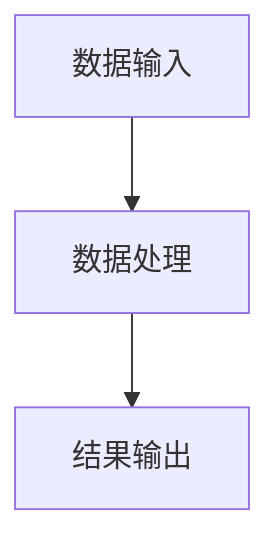
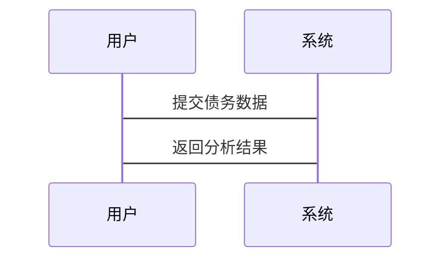

                 

<think>
好的，我需要按照用户的要求来撰写一篇关于彼得林奇对公司债务结构分析的详细技术博客文章。用户提供了文章的标题和目录结构，我需要先理解每个部分的要求，然后逐步展开。

首先，文章的标题是《彼得林奇对公司债务结构的分析》，关键词包括公司债务、债务结构、彼得林奇、财务分析、投资策略、风险管理。摘要部分需要简要概述文章的核心内容，即彼得林奇如何分析债务结构，帮助投资者评估公司的财务健康和风险。

接下来，正文部分分为四个章节：

1. **债务结构的背景与基础**：介绍债务的基本概念、重要性以及彼得林奇的投资理念。
2. **债务结构的核心要素**：详细讲解债务规模、期限、成本和比率等关键要素。
3. **彼得林奇的债务分析框架**：探讨彼得林奇的具体分析方法、行业差异和公司治理的影响。
4. **系统分析与架构设计**：从系统分析的角度，设计债务结构分析的系统架构，包括模块划分、系统架构图等。

在撰写每个部分时，我需要确保内容逻辑清晰，详细解释每个概念，并结合实际案例进行分析。同时，要使用技术术语，但保持语言通俗易懂，适合技术博客的读者。

在写作过程中，我需要确保每个章节都有足够的细节，例如在分析债务规模时，给出具体的计算公式和案例；在讨论系统架构时，使用Mermaid图来展示类图和序列图。此外，数学公式需要用LaTeX表示，确保准确性和专业性。

最后，总结部分要回顾彼得林奇的分析方法，并强调其在现代投资策略中的重要性。同时，给出一些实际的应用建议和最佳实践，帮助读者更好地理解和应用这些分析方法。

通过这样的思考过程，我可以系统地完成这篇技术博客文章的撰写，确保内容全面、结构合理，并满足用户的所有要求。
</think>

# 彼得林奇对公司债务结构的分析

## 关键词：公司债务、债务结构、彼得林奇、财务分析、投资策略、风险管理

## 摘要：彼得林奇是全球著名投资经理人，以其独特的投资策略和对公司债务结构的深入分析闻名。本文将详细探讨彼得林奇的债务分析方法，从基础概念到系统架构，结合实际案例，帮助读者理解如何通过债务结构评估公司财务健康和风险，制定有效的投资策略。

---

# 第1章：债务结构的背景与基础

## 1.1 公司债务的基本概念

### 1.1.1 什么是公司债务

公司债务是指公司为获取资金而产生的各种负债，包括短期和长期债务。债务可以通过债券、银行贷款、融资租赁等多种形式存在。

### 1.1.2 公司债务的分类

1. **短期债务**：通常在一年内偿还，如应付账款、短期贷款等。
2. **长期债务**：偿还期限超过一年，如长期债券、贷款等。
3. **流动债务**：与公司日常运营直接相关的债务，如应付账款、存货融资等。
4. **非流动债务**：与公司长期资产相关的债务，如房地产抵押贷款。

### 1.1.3 债务结构的定义

债务结构是指公司在不同债务类型、期限和成本下的负债分配情况。合理的债务结构能够优化资本成本，降低财务风险。

---

## 1.2 债务结构的重要性

### 1.2.1 债务结构对公司财务状况的影响

1. **资本成本**：合理的债务结构可以降低资本成本，提高资本回报率。
2. **财务风险**：过高的债务可能导致公司面临财务危机，增加违约风险。
3. **资产流动性**：债务结构影响公司资产的流动性，进而影响公司的偿债能力。

### 1.2.2 债务结构对投资决策的意义

投资者通过分析公司的债务结构，可以评估公司的财务健康状况，判断其偿债能力和成长潜力，从而做出更明智的投资决策。

### 1.2.3 债务结构与公司信用评级的关系

公司债务结构是信用评级的重要因素。合理的债务结构有助于提高信用评级，降低融资成本。

---

## 1.3 彼得林奇的投资理念与债务分析

### 1.3.1 彼得林奇的投资风格概述

彼得林奇以基本面分析和价值投资闻名，注重对公司财务状况和管理层的深入研究，寻找具有长期增长潜力的公司。

### 1.3.2 彼得林奇对债务结构的关注点

1. **债务规模**：关注公司债务是否与其资产规模和盈利能力相匹配。
2. **债务期限**：分析债务期限与公司现金流的匹配程度。
3. **债务成本**：评估债务成本是否合理，是否会影响公司的整体利润。

### 1.3.3 彼得林奇的债务分析方法

彼得林奇通过分析公司的财务报表，特别是资产负债表和现金流量表，评估公司的债务结构是否健康，从而判断其投资价值。

---

# 第2章：债务结构的核心要素

## 2.1 债务规模与资本结构

### 2.1.1 债务规模的定义与计算

债务规模是指公司所有债务的总和，包括短期和长期债务。计算公式为：

$$
\text{债务规模} = \text{短期债务} + \text{长期债务}
$$

### 2.1.2 资本结构的组成与影响

资本结构由股权和债务组成。合理的资本结构可以优化资本成本，降低财务风险。

### 2.1.3 债务规模与公司风险的关系

债务规模过大可能导致公司面临较高的财务风险，增加违约概率。

---

## 2.2 债务期限与流动性风险

### 2.2.1 债务期限的分类

1. **短期债务**：1年以内。
2. **中期债务**：1-5年。
3. **长期债务**：5年以上。

### 2.2.2 流动性风险的定义与影响

流动性风险是指公司无法及时偿还短期债务的风险。债务期限过长可能导致流动性风险增加。

### 2.2.3 债务期限与公司流动性的关系

合理的债务期限结构可以确保公司有足够的流动性，避免因短期债务过多导致的偿债压力。

---

## 2.3 债务成本与资本回报率

### 2.3.1 债务成本的计算方法

债务成本包括利息支出和其他相关费用。计算公式为：

$$
\text{债务成本} = \text{利息支出} + \text{其他费用}
$$

### 2.3.2 资本回报率的定义与意义

资本回报率（ROE）是衡量公司盈利能力的重要指标，计算公式为：

$$
\text{ROE} = \frac{\text{净利润}}{\text{股东权益}}
$$

### 2.3.3 债务成本对公司整体回报的影响

过高的债务成本会降低公司的净利润，影响资本回报率。

---

## 2.4 债务比率与财务健康度

### 2.4.1 常见债务比率指标

1. **资产负债率**：计算公式为：

$$
\text{资产负债率} = \frac{\text{总负债}}{\text{总资产}}
$$

2. **流动比率**：计算公式为：

$$
\text{流动比率} = \frac{\text{流动资产}}{\text{流动负债}}
$$

3. **速动比率**：计算公式为：

$$
\text{速动比率} = \frac{\text{速动资产}}{\text{流动负债}}
$$

### 2.4.2 财务健康度的评估标准

财务健康度通常通过上述比率综合评估，比率越合理，财务健康度越高。

### 2.4.3 债务比率与公司财务风险的关系

过高的债务比率会增加公司财务风险，降低投资者信心。

---

# 第3章：彼得林奇的债务分析框架

## 3.1 彼得林奇的债务分析方法

### 3.1.1 从财务报表出发的债务分析

彼得林奇通过分析资产负债表、利润表和现金流量表，评估公司的债务结构。

### 3.1.2 债务结构与公司盈利能力的关系

合理的债务结构可以提高公司的盈利能力，降低财务压力。

### 3.1.3 债务结构与公司成长性的结合

彼得林奇关注公司债务结构是否与其成长性相匹配，避免因过度负债影响公司发展。

---

## 3.2 债务结构的行业差异分析

### 3.2.1 不同行业债务结构的特点

1. **制造业**：通常需要较多的固定资产投资，债务比例较高。
2. **服务业**：债务比例相对较低，依赖于运营资本。
3. **高科技行业**：债务比例较低，依赖于股权融资。

### 3.2.2 行业周期对债务结构的影响

行业周期波动会影响公司的债务结构，周期性行业在衰退期可能增加债务负担。

### 3.2.3 行业竞争格局与债务风险的关系

行业竞争格局影响公司的盈利能力，进而影响债务风险。

---

## 3.3 债务结构与公司治理的关系

### 3.3.1 公司治理对债务结构的影响

良好的公司治理可以降低债务风险，提高公司信用评级。

### 3.3.2 股东结构与债务风险的关联

控股股东比例较高可能导致公司过度负债，增加债务风险。

### 3.3.3 公司治理机制对债务管理的作用

有效的公司治理机制可以规范债务管理，降低财务风险。

---

# 第4章：系统分析与架构设计

## 4.1 系统分析方法

### 4.1.1 系统分析的定义与步骤

系统分析是通过系统化的方法，对公司的债务结构进行全面分析，识别潜在风险。

### 4.1.2 债务结构分析的系统模型

使用系统模型分析公司债务结构，包括输入、处理、输出和反馈四个环节。

### 4.1.3 系统分析中的关键指标

1. 资产负债率
2. 流动比率
3. 速动比率

---

## 4.2 系统架构设计

### 4.2.1 系统架构的组成与功能

1. 数据采集模块：采集公司财务数据。
2. 数据分析模块：分析债务结构。
3. 风险评估模块：评估债务风险。
4. 投资决策模块：制定投资策略。

### 4.2.2 债务结构分析的模块划分

1. 数据输入模块：输入公司财务数据。
2. 数据处理模块：计算债务比率。
3. 结果输出模块：输出分析结果。

### 4.2.3 系统架构图



---

## 4.3 系统交互设计

### 4.3.1 系统接口设计

1. 数据接口：与财务系统对接，获取债务数据。
2. 用户接口：提供友好的用户界面，展示分析结果。

### 4.3.2 系统交互图



---

# 第5章：项目实战与总结

## 5.1 项目实战

### 5.1.1 环境安装

安装Python和相关数据分析库（如Pandas、Matplotlib）。

### 5.1.2 核心代码实现

```python
import pandas as pd

# 读取财务数据
df = pd.read_csv('debt_data.csv')

# 计算债务比率
debt_to_asset_ratio = df['总负债'] / df['总资产']
current_ratio = df['流动资产'] / df['流动负债']

# 输出结果
print(f"资产负债率：{debt_to_asset_ratio}")
print(f"流动比率：{current_ratio}")
```

### 5.1.3 案例分析

以某公司为例，分析其债务结构，评估财务健康度。

### 5.1.4 总结

通过实际案例分析，验证彼得林奇的债务分析方法的有效性。

---

## 5.2 总结与展望

### 5.2.1 总结

彼得林奇的债务分析方法通过深入分析公司的财务报表，评估债务结构的合理性，帮助投资者制定有效的投资策略。

### 5.2.2 展望

未来，随着数据分析技术的发展，债务结构分析将更加智能化和精准化。

---

作者：AI天才研究院/AI Genius Institute & 禅与计算机程序设计艺术 /Zen And The Art of Computer Programming

