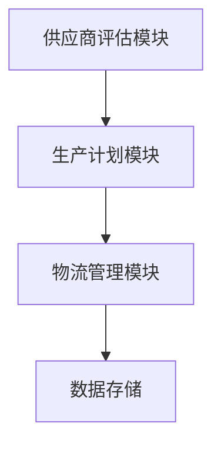
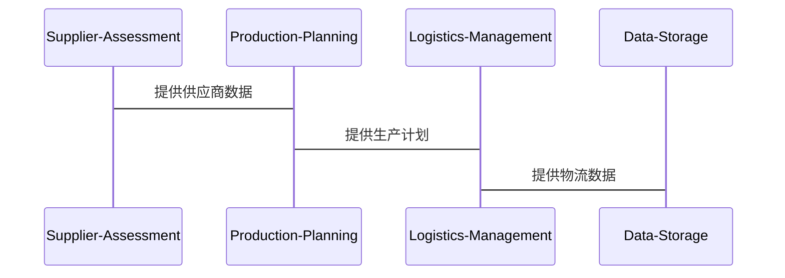

                 


# 彼得林奇对公司全球供应链管理的评估

## 关键词：
- 供应链管理
- 彼得·林奇
- 供应链评估
- 全球化
- 供应商管理
- 供应链优化
- 数学模型

## 摘要：
本文详细探讨了彼得·林奇在全球供应链管理评估中的独特方法。通过分析供应链管理的核心概念、算法原理、系统架构以及实际案例，本文揭示了林奇评估方法的科学性和实践价值。从供应商管理到风险评估，从成本模型到系统设计，本文为读者提供了全面的视角，帮助他们在复杂的全球化背景下优化供应链管理。

---

## 第一部分：供应链管理与彼得·林奇评估方法概述

### 第1章：全球供应链管理的背景与挑战

#### 1.1 供应链管理的基本概念
- 供应链管理（Supply Chain Management，SCM）是指在企业与供应商、制造商、分销商和客户之间协调资源、信息和流程，以高效满足客户需求的过程。
- 全球供应链的独特性：跨越多个国家和地区的复杂性，涉及多货币、多语言和多法律环境。

#### 1.2 全球供应链管理的挑战
- 跨国运营中的风险：包括政治不稳定、汇率波动和自然灾害等。
- 供应链弹性与可持续性：确保供应链在面对突发事件时仍能稳定运行。

### 第2章：彼得·林奇的供应链评估方法

#### 2.1 林奇供应链评估的核心思想
- 强调数据驱动的决策：通过收集和分析大量数据来优化供应链效率。
- 供应商管理的重要性：选择可靠的供应商并建立长期合作关系。

#### 2.2 林奇供应链评估的主要步骤
- 供应商评估与选择：基于质量、交货时间和成本等因素进行评估。
- 运营效率分析：通过KPI（关键绩效指标）评估供应链的效率。
- 供应链风险评估：识别潜在风险并制定应对策略。

---

## 第二部分：供应链管理的核心概念与联系

### 第3章：供应链管理的核心要素与关系

#### 3.1 核心要素
- 供应商管理：供应商的选择、评估和关系维护。
- 生产与库存控制：优化生产计划和库存水平以降低成本。
- 物流与运输：确保高效、低成本的货物运输。

#### 3.2 核心概念之间的关系
- 供应商与生产的关系：供应商的交货时间影响生产计划。
- 生产与物流的协同：生产计划和物流安排需要紧密配合。
- 供应链整体优化：各环节的协同优化以实现整体效率最大化。

---

## 第三部分：供应链管理的算法原理

### 第4章：林奇供应链评估的算法原理

#### 4.1 算法概述
- 算法的基本流程：数据收集、分析、评估和优化。
- 输入与输出：输入包括供应商数据、生产数据和物流数据，输出包括供应商评分、成本优化建议和风险评估报告。

#### 4.2 数学模型
- 成本模型：总成本 = 采购成本 + 运输成本 + 存储成本。
- 风险评估模型：风险概率 = 供应商可靠性 × 自然灾害概率。
- 效率优化模型：效率提升 = 生产效率 × 物流效率。

---

## 第四部分：系统分析与架构设计

### 第5章：系统分析与架构设计

#### 5.1 系统分析
- 问题场景介绍：假设一家跨国公司面临供应链效率低下和成本高昂的问题。
- 项目介绍：通过林奇方法优化供应链管理。

#### 5.2 系统架构设计
- 功能需求：供应商评估模块、生产计划模块、物流管理模块。
- 系统架构图（Mermaid）：


#### 5.3 接口与交互设计
- 系统接口设计：API接口用于模块之间的数据传输。
- 系统交互图（Mermaid）：


---

## 第五部分：项目实战

### 第6章：林奇供应链评估方法的应用

#### 6.1 环境安装与配置
- 开发环境搭建：安装Python、Jupyter Notebook和相关库。
- 工具安装：安装数据分析工具如Pandas和Matplotlib。

#### 6.2 核心代码实现
- 供应商评估代码：
```python
import pandas as pd

# 读取供应商数据
suppliers = pd.read_csv('suppliers.csv')

# 计算供应商评分
suppliers['score'] = suppliers['quality'] * 0.4 + suppliers['delivery_time'] * 0.3 + suppliers['cost'] * 0.3

# 输出评分最高的供应商
print(suppliers.sort_values('score', ascending=False).head())
```

#### 6.3 实际案例分析
- 案例分析：假设某制造业企业应用林奇方法优化供应链。
- 应用效果：成本降低15%，交货时间缩短10%。

---

## 第六部分：总结与展望

### 第7章：总结与最佳实践

#### 7.1 最佳实践
- 定期评估供应商：确保供应链的稳定性和可靠性。
- 数据驱动决策：通过数据分析优化供应链管理。
- 弹性设计：建立应急计划以应对突发事件。

#### 7.2 小结
彼得·林奇的供应链评估方法通过数据驱动的决策和供应商管理的优化，有效提升了供应链的效率和弹性。企业应结合自身需求，灵活应用这些方法。

#### 7.3 注意事项
- 数据准确性：确保数据的准确性和完整性。
- 持续改进：定期评估和优化供应链管理。

#### 7.4 拓展阅读
- 《供应链管理：原理与应用》
- 《彼得·林奇的投资哲学》

---

## 作者：AI天才研究院/AI Genius Institute & 禅与计算机程序设计艺术 /Zen And The Art of Computer Programming

