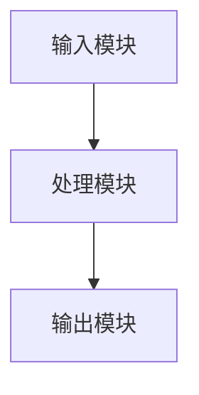
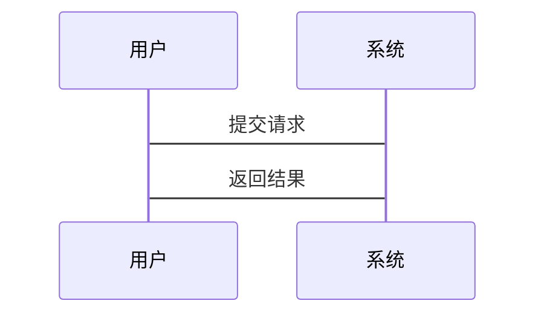

                 


```markdown
# 彼得林奇对公司全球化战略执行力的评估

> 关键词：彼得林奇、全球化战略、执行力、投资评估、战略管理

> 摘要：本文探讨彼得林奇如何评估公司全球化战略的执行力。通过分析其投资理念、评估框架和数学模型，结合实际案例，深入解析如何有效执行全球化战略，确保企业在全球化市场中取得成功。

---

# 第1章: 全球化战略与执行力概述

## 1.1 全球化战略的背景与重要性
### 1.1.1 全球化战略的定义
### 1.1.2 全球化战略的核心要素
### 1.1.3 全球化战略对企业的影响

## 1.2 执行力在企业战略中的作用
### 1.2.1 执行力的定义
### 1.2.2 执行力与企业绩效的关系
### 1.2.3 彼得林奇对执行力的重视

## 1.3 本章小结

---

# 第2章: 彼得林奇的全球化战略评估方法

## 2.1 彼得林奇的投资理念
### 2.1.1 价值投资的核心思想
### 2.1.2 彼得林奇的选股标准
### 2.1.3 彼得林奇的长期投资策略

## 2.2 彼得林奇的全球化战略评估框架
### 2.2.1 全球化战略的评估维度
### 2.2.2 企业资源分配的合理性分析
### 2.2.3 全球化战略的风险管理

## 2.3 本章小结

---

# 第3章: 全球化战略执行力的核心要素

## 3.1 战略目标的明确性
### 3.1.1 战略目标的设定原则
### 3.1.2 战略目标与企业文化的契合
### 3.1.3 战略目标的分解与执行

## 3.2 资源分配的合理性
### 3.2.1 资源分配的评估标准
### 3.2.2 资源分配的优化策略
### 3.2.3 资源分配的动态调整

## 3.3 风险管理与应对策略
### 3.3.1 全球化战略中的主要风险
### 3.3.2 风险管理的组织架构
### 3.3.3 风险应对的具体措施

## 3.4 本章小结

---

# 第4章: 彼得林奇评估模型的数学分析

## 4.1 模型概述
### 4.1.1 模型的构成
### 4.1.2 模型的适用范围
### 4.1.3 模型的评估标准

## 4.2 数学模型与公式
### 4.2.1 全球化战略执行力的评估公式
$$ E = \sum_{i=1}^{n} w_i \cdot S_i $$
其中，E为执行力评分，w_i为各因素权重，S_i为各因素评分。

## 4.3 模型的验证与优化
### 4.3.1 模型的验证方法
### 4.3.2 模型的优化策略
### 4.3.3 模型的实际应用案例

## 4.4 本章小结

---

# 第5章: 全球化战略执行力的系统分析与架构设计

## 5.1 系统分析
### 5.1.1 问题场景介绍
### 5.1.2 项目介绍
### 5.1.3 系统功能设计（领域模型）

## 5.2 系统架构设计
### 5.2.1 系统架构图


### 5.2.2 系统接口设计
### 5.2.3 系统交互设计


## 5.3 本章小结

---

# 第6章: 项目实战——彼得林奇评估模型的应用

## 6.1 环境安装与配置
### 6.1.1 开发环境的选择
### 6.1.2 工具的安装与配置

## 6.2 核心实现源代码
### 6.2.1 评估模型的实现
```python
def calculate_execution_score(weights, scores):
    return sum(w * s for w, s in zip(weights, scores))
```

### 6.2.2 代码的结构与功能

## 6.3 代码应用解读与分析
### 6.3.1 代码的功能分析
### 6.3.2 代码的优化建议

## 6.4 实际案例分析
### 6.4.1 案例背景介绍
### 6.4.2 案例分析与解读
### 6.4.3 案例的总结与启示

## 6.5 本章小结

---

# 第7章: 最佳实践与总结

## 7.1 总结与反思
### 7.1.1 全球化战略执行力的关键点

---

作者：AI天才研究院/AI Genius Institute & 禅与计算机程序设计艺术 /Zen And The Art of Computer Programming
```

