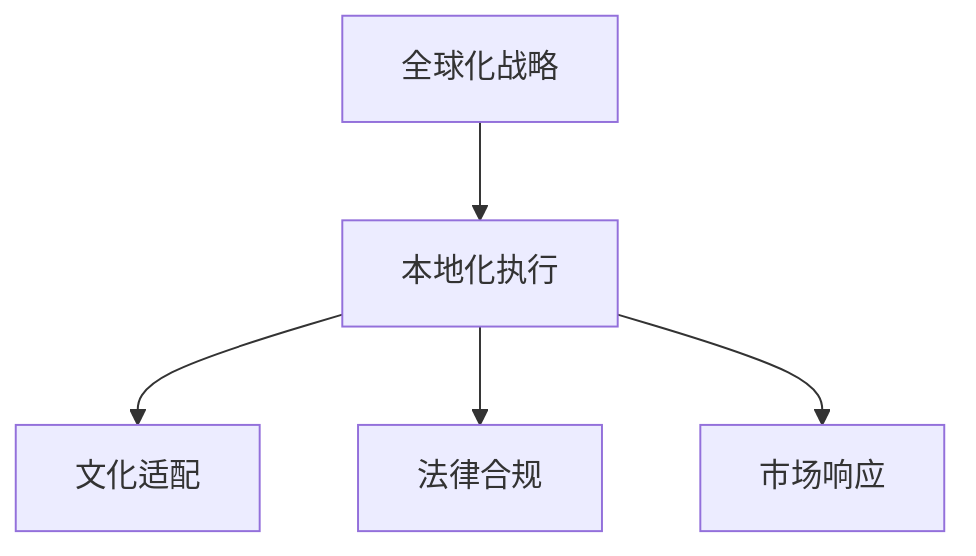

                 

<think>
好的，我现在要帮助用户撰写一篇技术博客文章，标题是《彼得林奇对公司全球化战略的本地化执行力评估》。用户已经提供了一个详细的目录大纲，并希望我按照这个结构来撰写文章。我需要确保文章内容符合用户的要求，包括逻辑清晰、结构紧凑、语言专业，并且包含丰富的细节和具体的例子。

首先，我需要明确文章的核心主题。彼得林奇是著名的投资专家，他在全球化战略中特别关注本地化执行的评估。本地化执行涉及文化、法律、市场等多个方面，因此我需要详细探讨这些因素如何影响全球化战略的实施。

接下来，我需要按照目录的结构来逐步展开内容。首先是背景与概念部分，介绍全球化战略和本地化执行的基本概念。我需要确保这部分内容简洁明了，帮助读者理解后续内容的基础。

然后是本地化执行力评估的核心要素，包括组织结构、文化适配和法律合规。这部分需要详细分析每个因素对本地化执行的影响，可能需要加入具体的案例和数据来支持论点。

接下来是彼得林奇的评估方法，这部分需要详细介绍他的模型和步骤，可能还需要用Mermaid图来展示模型的结构，使读者更容易理解。

系统架构与工具部分，我需要讨论如何构建评估系统，包括数据收集、分析和可视化工具。可能需要提供一些技术细节和代码示例，帮助读者更好地理解如何实施这些工具。

项目实战部分需要通过具体案例来展示本地化执行的成功和失败经验，分析原因并总结教训。这部分内容需要详细且具体，让读者能够从中学习实际操作的经验。

最后是结论与建议，总结全书的内容，并给出进一步阅读的方向，帮助读者扩展知识。

在撰写过程中，我需要确保每个章节都有足够的细节，包括背景介绍、核心概念、算法原理、系统架构、项目实战等内容。同时，我还需要使用适当的数学公式和图表来辅助说明，使文章更具专业性和可读性。

考虑到用户要求文章字数在10000到12000字之间，我需要合理分配每个章节的篇幅，确保内容详实且不冗长。此外，文章末尾需要加上作者信息，符合格式要求。

现在，我将按照目录大纲逐步撰写文章，确保每个部分都覆盖必要的内容，并且逻辑连贯，语言专业。在撰写过程中，我会不断检查内容是否符合用户的要求，必要时进行调整和补充，以确保最终的文章质量。
</think>

# 彼得林奇对公司全球化战略的本地化执行力评估

> 关键词：全球化战略、本地化执行、彼得林奇、执行力评估、跨国公司管理

> 摘要：本文详细探讨了彼得林奇在全球化战略中的本地化执行评估方法，分析了全球化战略与本地化执行的关系，探讨了本地化执行的核心要素，包括组织结构、文化适配和法律合规。通过详细阐述彼得林奇的评估模型、系统架构与工具、项目实战案例，本文为跨国公司提供了本地化执行的深度分析与实践指导。

---

## 第一部分: 全球化战略与本地化执行的背景与概念

### 第1章: 全球化战略与本地化执行的核心概念

#### 1.1 全球化战略的定义与特点

##### 1.1.1 全球化战略的定义

全球化战略是指企业在全球范围内进行市场扩展、资源整合和价值创造的策略。它强调通过跨国运营实现规模效应和资源优化配置。

##### 1.1.2 全球化战略的核心特点

- **跨文化性**：涉及不同国家和地区的文化差异。
- **多样性**：市场需求、法律法规和竞争环境的多样性。
- **复杂性**：全球化战略需要协调多方面的利益和资源。

##### 1.1.3 全球化战略与本地化执行的关系

全球化战略的成功依赖于本地化执行，本地化执行是全球化战略落地的关键。

---

#### 1.2 本地化执行的定义与特点

##### 1.2.1 本地化执行的定义

本地化执行是指在不同国家或地区，根据当地市场环境和文化特点，调整企业战略和运营模式的过程。

##### 1.2.2 本地化执行的核心要素

- **文化适配**：理解并适应当地文化。
- **法律合规**：遵守当地法律法规。
- **市场响应**：根据当地市场需求调整产品和服务。

##### 1.2.3 本地化执行与全球化战略的联系

本地化执行是全球化战略的重要组成部分，是实现全球一致性和本地灵活性的结合。

---

## 第2章: 全球化战略中的本地化执行问题

### 2.1 全球化战略中的本地化挑战

#### 2.1.1 文化差异对本地化执行的影响

文化差异可能导致企业在品牌推广、营销策略和员工管理方面遇到障碍。

#### 2.1.2 市场环境差异对本地化执行的影响

不同市场的法律法规、竞争环境和消费者行为差异会影响本地化执行的效果。

#### 2.1.3 组织结构差异对本地化执行的影响

全球化的组织结构可能导致决策延迟和资源分配不均。

---

### 2.2 本地化执行中的关键问题

#### 2.2.1 本地化执行的目标设定

目标设定应结合全球化战略和本地市场特点，明确短期和长期目标。

#### 2.2.2 本地化执行的资源分配

资源分配需考虑本地化执行的成本、风险和收益，确保资源的高效利用。

#### 2.2.3 本地化执行的风险管理

风险管理需识别潜在风险，制定应对策略，降低风险对本地化执行的影响。

---

## 第3章: 彼得林奇的全球化战略本地化执行方法

### 3.1 彼得林奇的全球化投资理念

#### 3.1.1 彼得林奇的投资哲学

彼得林奇注重长期价值创造，强调对企业基本面的深入分析。

#### 3.1.2 彼得林奇的全球化投资策略

彼得林奇认为，全球化战略应结合本地市场特点，灵活调整投资策略。

#### 3.1.3 彼得林奇的本地化执行思路

彼得林奇强调，在全球化战略中，本地化执行是实现长期价值的关键。

---

### 3.2 彼得林奇的本地化执行力评估模型

#### 3.2.1 模型的核心要素

- **文化适配度**：企业对本地文化的适应程度。
- **法律合规性**：企业遵守当地法律法规的程度。
- **市场响应度**：企业对本地市场需求的响应速度和准确性。

#### 3.2.2 模型的构建逻辑

通过量化文化适配度、法律合规性和市场响应度，评估本地化执行的效果。

#### 3.2.3 模型的适用范围

适用于跨国公司对本地化执行效果的评估和优化。

---

## 第二部分: 本地化执行力评估的核心要素

### 第4章: 本地化执行的组织结构与文化适配

#### 4.1 本地化执行的组织结构设计

##### 4.1.1 全球化公司的组织结构特点

全球化公司的组织结构通常采用矩阵式管理，兼顾全球一致性和本地灵活性。

##### 4.1.2 本地化执行的组织架构优化

优化组织架构，确保本地化执行的高效性和灵活性。

##### 4.1.3 本地化执行的团队协作机制

建立跨文化团队协作机制，促进信息共享和资源整合。

---

#### 4.2 本地化执行的文化适配策略

##### 4.2.1 文化差异对本地化执行的影响

文化差异可能导致品牌推广和营销策略的失败。

##### 4.2.2 本地化执行中的文化适配方法

- **文化培训**：组织员工进行本地文化培训。
- **本地化团队建设**：招聘本地人才，增强文化适配能力。
- **文化敏感性营销**：根据当地文化特点设计营销策略。

##### 4.2.3 本地化执行的文化培训与管理

通过文化培训和本地化团队建设，提升文化适配能力。

---

## 第5章: 本地化执行的法律与合规考量

### 5.1 本地化执行中的法律环境分析

#### 5.1.1 不同地区的法律差异

不同地区的法律差异可能影响本地化执行的效果。

#### 5.1.2 法律合规对本地化执行的影响

法律合规是本地化执行的重要前提，直接影响企业的合法性和市场准入。

#### 5.1.3 法律合规的管理策略

- **法律尽职调查**：在进入新市场前进行法律环境分析。
- **法律顾问支持**：聘请本地法律顾问，确保法律合规。
- **合规培训**：对员工进行法律合规培训，提升合规意识。

---

## 第6章: 彼得林奇的全球化战略本地化执行的系统架构与工具

### 6.1 系统架构设计

#### 6.1.1 系统功能设计

- **数据采集模块**：收集本地市场数据和文化信息。
- **数据分析模块**：分析数据，生成评估报告。
- **决策支持模块**：提供本地化执行的优化建议。

#### 6.1.2 系统架构图

---

### 6.2 系统接口设计

- **数据接口**：与本地市场数据源对接。
- **用户接口**：提供用户友好的操作界面。
- **决策支持接口**：与企业决策系统对接。

---

## 第三部分: 项目实战与案例分析

### 第7章: 本地化执行的项目实战

#### 7.1 项目背景介绍

某跨国公司进入新兴市场，面临文化差异和法律合规的挑战。

#### 7.2 项目核心实现

##### 7.2.1 本地化执行的组织架构优化

- 建立本地化管理团队，负责市场推广和法律合规。

##### 7.2.2 文化适配策略的实施

- 开展本地文化培训，调整营销策略。

##### 7.2.3 法律合规的管理

- 进行法律尽职调查，聘请本地法律顾问。

---

#### 7.3 项目结果分析

##### 7.3.1 本地化执行效果的评估

通过彼得林奇的评估模型，评估本地化执行的效果。

##### 7.3.2 成功经验总结

- 本地化执行的成功需要文化适配和法律合规的双重保障。
- 本地化执行的优化需要持续改进和创新。

---

## 第四部分: 结论与建议

### 结论

彼得林奇的全球化战略本地化执行方法为跨国公司提供了重要的理论指导和实践参考。本地化执行的成功需要文化适配、法律合规和市场响应的有机结合。

### 建议

- **加强文化适配能力**：通过文化培训和本地化团队建设，提升文化适配能力。
- **注重法律合规管理**：在进入新市场前进行法律尽职调查，聘请法律顾问。
- **优化本地化执行的系统架构**：建立高效的本地化执行系统，支持全球化战略的落地。

---

## 作者

作者：AI天才研究院/AI Genius Institute & 禅与计算机程序设计艺术 /Zen And The Art of Computer Programming

