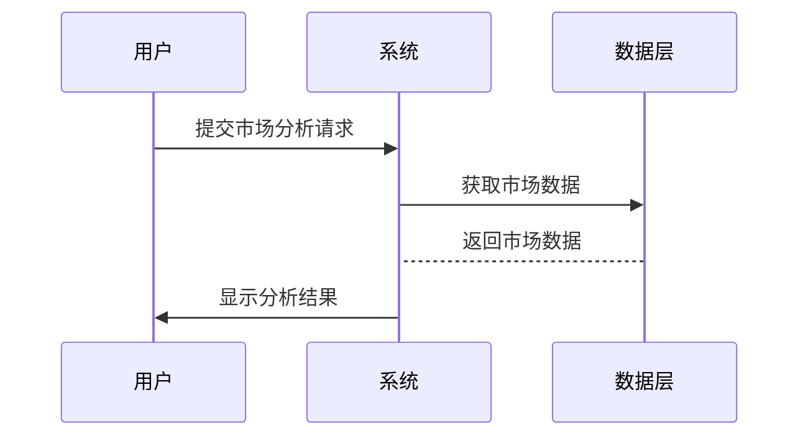

                 


# 彼得林奇对公司全球化战略的风险收益评估

## 关键词：彼得林奇，全球化战略，风险收益，投资评估，系统架构设计

## 摘要：
本文深入探讨了彼得林奇在全球化战略中的风险收益评估方法。通过分析全球化战略的核心概念、评估理论与方法，结合系统架构设计和实战案例，展示了如何在实际项目中应用这些评估方法。文章详细介绍了定性和定量分析的步骤，并通过具体案例验证了评估的有效性，总结了最佳实践和注意事项。

---

# 第1章: 全球化战略的基本概念

## 1.1 全球化战略的定义与特点

### 1.1.1 全球化战略的定义
全球化战略是指企业在全球范围内扩展业务，利用国际市场的资源、技术和劳动力，以实现更高的增长和利润。这种战略强调跨国协作和资源整合，旨在最大化企业的全球影响力。

### 1.1.2 全球化战略的核心特点
- **跨国性**：业务覆盖多个国家和地区。
- **多样性**：面对不同的市场环境和消费者需求。
- **复杂性**：涉及多方面的协调和管理。
- **风险性**：存在政治、经济和文化等多种风险。

### 1.1.3 全球化战略与本地化战略的区别
本地化战略强调适应特定市场的文化和需求，而全球化战略则寻求在全球范围内实现标准化和规模经济。两者在资源配置和市场进入策略上存在显著差异。

## 1.2 彼得林奇的全球化战略视角

### 1.2.1 彼得林奇的个人投资哲学
彼得林奇以其价值投资理念闻名，强调深入分析企业和市场，寻找具有长期增长潜力的投资标的。

### 1.2.2 彼得林奇对全球化战略的理解
他认为全球化为企业提供了更大的市场和增长机会，但也带来了复杂的管理挑战。因此，全球化战略需要谨慎评估和选择。

### 1.2.3 彼得林奇全球化战略的独特性
彼得林奇注重基本面分析和风险管理，主张在全球化过程中保持对市场风险的敏感性，避免过度扩张。

## 1.3 全球化战略的风险收益评估的重要性

### 1.3.1 风险收益评估的定义
通过分析潜在风险和收益，评估决策的可行性和效果。

### 1.3.2 全球化战略中风险收益评估的必要性
全球化涉及多方面的不确定性，评估可以帮助企业制定有效的应对策略。

### 1.3.3 本书的研究目标与意义
通过分析彼得林奇的方法，提供实用的全球化战略评估框架，帮助企业有效应对全球化挑战。

---

# 第2章: 全球化战略的核心概念与联系

## 2.1 全球化战略的核心要素

### 2.1.1 市场分析
研究目标市场的规模、增长潜力和竞争状况，识别市场机会。

### 2.1.2 竞争分析
分析竞争对手的策略、优势和劣势，制定差异化竞争策略。

### 2.1.3 资源配置
优化资源分配，确保在关键市场和业务领域的有效投入。

## 2.2 全球化战略的风险收益评估模型

### 2.2.1 模型的构成
模型包括输入变量、评估过程和输出结果三部分。

### 2.2.2 模型的输入变量
- 市场增长率
- 投资成本
- 风险因素

### 2.2.3 模型的输出结果
- 投资回报率
- 风险等级

## 2.3 全球化战略与企业架构的关系

### 2.3.1 企业架构的定义
企业架构是企业系统结构和组件的蓝图，包括功能、数据和接口设计。

### 2.3.2 全球化战略对企业架构的影响
全球化战略要求企业架构具备灵活性和扩展性，以适应不同市场的变化。

### 2.3.3 架构与风险收益评估的关联
良好的企业架构有助于提高风险评估的准确性和效率。

---

# 第3章: 全球化战略的风险收益评估理论与方法

## 3.1 风险收益评估的基本理论

### 3.1.1 风险与收益的定义
- 风险：可能的损失或负面结果。
- 收益：投资带来的回报。

### 3.1.2 风险与收益的相互关系
高风险可能带来高收益，但也存在低风险低收益的情况。

### 3.1.3 风险收益评估的基本原则
- 全面性：考虑所有相关因素。
- 客观性：基于数据和事实。
- 动态性：随市场变化调整。

## 3.2 定性分析方法

### 3.2.1 定性分析的步骤
1. 确定目标。
2. 收集信息。
3. 分析和评估。

### 3.2.2 定性分析的工具与方法
- SWOT分析：评估优势、劣势、机会和威胁。
- PEST分析：分析政治、经济、社会和技术因素。

## 3.3 定量分析方法

### 3.3.1 定量分析的数学模型
$$ ROI = \frac{净利润}{投资成本} \times 100\% $$

### 3.3.2 风险收益评估的公式
$$ 风险调整后的收益 = 收益 - 风险调整值 $$

### 3.3.3 定量分析的案例
假设某项目的预期收益为100万元，风险调整值为20%，则风险调整后的收益为80万元。

## 3.4 彼得林奇的风险收益评估方法

### 3.4.1 彼得林奇的评估步骤
1. 分析企业的基本面。
2. 评估市场前景。
3. 考虑风险因素。

### 3.4.2 彼得林奇的评估工具
- 财务比率分析：如市盈率、利润率等。
- 行业趋势分析：研究行业的发展趋势。

### 3.4.3 彼得林奇方法的优缺点
优点：注重基本面分析，避免短期波动。缺点：可能忽略市场突发事件的影响。

---

# 第4章: 全球化战略的系统分析与架构设计

## 4.1 系统分析的基本步骤

### 4.1.1 问题识别
识别全球化战略中的关键问题，如市场进入策略和风险管理。

### 4.1.2 数据收集
收集相关的市场、竞争和财务数据，为分析提供支持。

### 4.1.3 数据分析
使用统计方法和模型分析数据，识别关键因素。

## 4.2 系统架构设计

### 4.2.1 架构设计的原则
- 简洁性：模块化设计。
- 可扩展性：适应未来变化。
- 可维护性：方便后续修改和优化。

### 4.2.2 架构设计的步骤
1. 确定系统目标。
2. 分析需求。
3. 设计模块。
4. 验证和调整。

### 4.2.3 架构设计的工具
- UML图：展示系统结构。
- 流程图：描述业务流程。

## 4.3 系统接口设计

### 4.3.1 接口设计的基本原则
- 明确接口职责。
- 标准化接口定义。
- 便于集成和维护。

### 4.3.2 接口设计的步骤
1. 确定接口需求。
2. 设计接口规范。
3. 测试接口兼容性。

## 4.4 系统交互设计

### 4.4.1 交互设计的基本原则
- 用户友好：简化操作流程。
- 明确反馈：及时告知用户操作结果。
- 安全性：保护用户数据和隐私。

### 4.4.2 交互设计的步骤
1. 研究用户需求。
2. 设计用户界面。
3. 测试用户体验。

---

# 第5章: 全球化战略的项目实战

## 5.1 项目介绍

### 5.1.1 项目背景
假设一家科技公司计划进入新兴市场，需评估全球化战略的风险收益。

## 5.2 系统功能设计

### 5.2.1 领域模型（Mermaid类图）


### 5.2.2 系统架构设计（Mermaid架构图）


## 5.3 系统接口设计

### 5.3.1 接口设计
- RESTful API：用于数据交换和系统集成。

## 5.4 系统交互设计

### 5.4.1 交互流程（Mermaid序列图）


## 5.5 代码实现与分析

### 5.5.1 环境安装
- 安装必要的开发工具和库，如Python、Django框架。

### 5.5.2 核心代码实现
```python
def risk_assessment(risk_factors):
    risk_score = 0
    for factor in risk_factors:
        risk_score += factor['weight'] * factor['value']
    return risk_score

def calculate_roi(investment, risk_score):
    return (investment - risk_score) / investment * 100
```

### 5.5.3 代码应用解读
- `risk_assessment`函数计算风险评分。
- `calculate_roi`函数计算投资回报率。

## 5.6 案例分析与结果解读

### 5.6.1 案例分析
假设投资金额为100万元，风险评分为20%，则 ROI 为 80%。

### 5.6.2 结果解读
该案例表明，尽管存在一定的风险，但投资回报率较高，具有可行性。

## 5.7 项目小结

### 5.7.1 成功经验
- 详细的市场分析和风险评估。
- 有效的系统架构设计。

### 5.7.2 挑战与改进
- 如何应对不可预见的风险。
- 提高模型的准确性。

---

# 第6章: 最佳实践、小结与注意事项

## 6.1 最佳实践 tips

### 6.1.1 风险管理
定期监控和评估风险，及时调整策略。

### 6.1.2 持续优化
根据市场变化和项目进展，持续优化全球化战略。

## 6.2 小结

通过分析彼得林奇的全球化战略和风险收益评估方法，我们得出结论：科学的评估和系统的架构设计是确保全球化战略成功的关键。

## 6.3 注意事项

- 全球化战略需要长期投入和耐心。
- 考虑到政治和经济环境的不确定性，应制定灵活的应对策略。

## 6.4 拓展阅读

建议读者阅读彼得林奇的其他著作，深入理解其投资哲学和全球化战略。

---

# 作者：AI天才研究院 & 禅与计算机程序设计艺术

---

这篇文章通过系统的分析和详细的案例，展示了彼得林奇全球化战略的风险收益评估方法，并提供了实用的工具和步骤，帮助企业在全球化进程中做出明智的决策。

