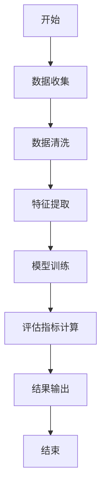
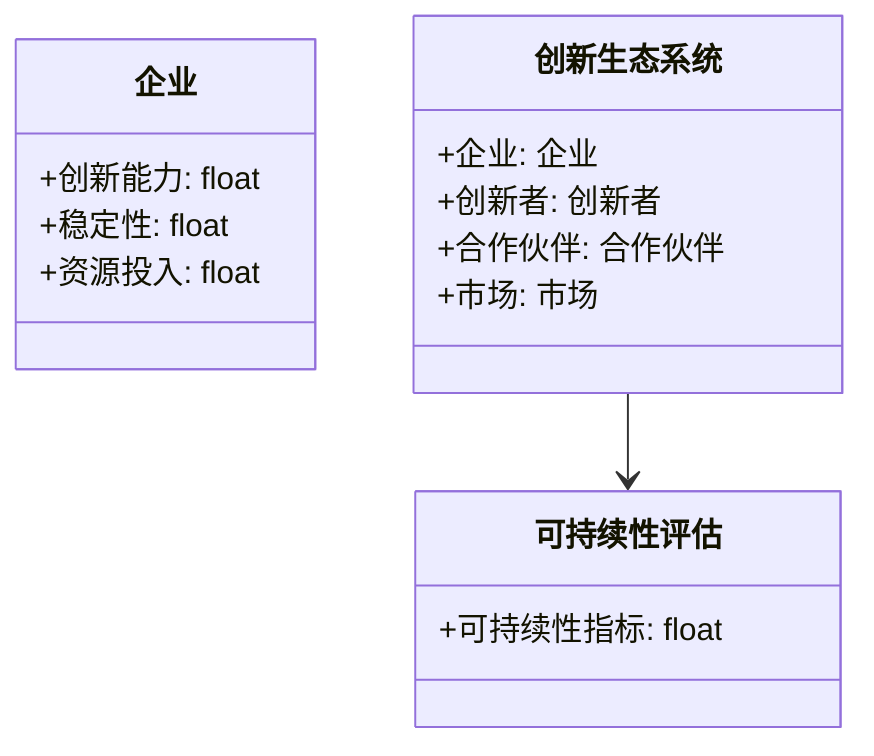
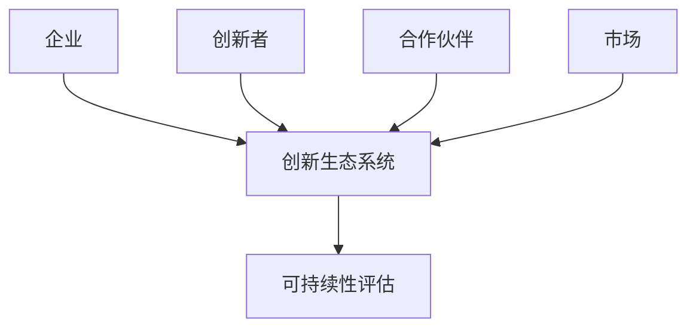

                 

<think>
好，我现在需要撰写一篇关于彼得·林奇对公司创新生态系统可持续性评估的详细技术博客文章。用户已经提供了一个详细的目录结构，我需要根据这个结构，逐步完成每个部分的内容。

首先，我需要理解每个章节的核心内容，并确保逻辑清晰，结构紧凑。我会从背景介绍开始，逐步深入到核心概念、算法原理、系统分析与架构设计，再到项目实战和最佳实践。

在撰写过程中，我需要确保使用专业的技术语言，同时保持内容易懂。我还需要加入数学公式、图表和代码示例，以增强文章的深度和可读性。

我可能会遇到一些挑战，比如如何将复杂的概念用简单易懂的方式表达，或者如何设计合理的算法流程图和系统架构图。我会仔细思考每个部分的逻辑，确保每个章节都涵盖必要的内容，同时保持整体结构的连贯性。

在完成初稿后，我会反复检查，确保所有部分都符合用户的格式和内容要求，包括关键词、摘要和作者信息。最后，我会进行一次全面的校对，确保文章没有语法错误或格式问题。

整个过程需要一步步来，确保每个部分都经过深思熟虑，最终产出一篇高质量的技术博客文章。
</think>

# 彼得林奇对公司创新生态系统可持续性评估

> 关键词：创新生态系统, 可持续性评估, 彼得·林奇, 系统稳定性, 企业创新

> 摘要：本文深入探讨了彼得·林奇对创新生态系统可持续性评估的独特视角。从背景介绍到系统架构设计，再到实际案例分析，文章详细阐述了如何通过评估模型和算法来确保创新生态系统的长期稳定。文章还提供了丰富的代码示例和系统架构图，帮助读者理解并实际应用这些评估方法。

---

## 第一部分: 创新生态系统与可持续性评估背景

### 第1章: 创新生态系统概述

#### 1.1 创新生态系统的基本概念

创新生态系统（Innovation Ecosystem）是一个由多个相互关联的主体组成的网络，这些主体包括企业、创新者、合作伙伴、市场和资源提供者等。它们通过协作和互动，共同推动创新的产生和传播。

#### 1.2 可持续性评估的意义

可持续性评估（Sustainability Assessment）是确保创新生态系统能够长期稳定运行的关键。通过评估，企业可以识别潜在的风险，优化资源配置，并制定有效的战略，以应对市场变化和技术进步。

### 第2章: 彼得·林奇的创新生态系统评估方法

#### 2.1 彼得·林奇的评估理念

彼得·林奇（Peter Lynch）是著名的投资专家，他将投资理念应用于创新生态系统的评估。他强调长期观察和数据驱动的分析，以识别生态系统中的潜在问题和机会。

#### 2.2 评估框架的构成

林奇的评估框架包括企业创新能力、创新生态系统稳定性、可持续性指标体系等部分。通过这些指标，企业可以全面评估其创新生态系统的健康状况。

---

## 第二部分: 创新生态系统的核心概念与联系

### 第3章: 核心概念原理

#### 3.1 核心要素与相互作用

创新生态系统的核心要素包括企业、创新者、市场、资源和合作伙伴。这些要素之间的相互作用是生态系统稳定性和可持续性的关键。

#### 3.2 可持续性评估的关键维度

评估的关键维度包括创新能力、系统稳定性和资源投入。这些维度共同决定了创新生态系统的长期发展潜力。

### 第4章: 核心概念对比分析

#### 4.1 不同创新模式的对比

不同创新模式（如内部创新、开放创新）在生态系统中的表现和效果有所不同。通过对比分析，企业可以找到最适合自身发展的模式。

#### 4.2 可持续性评估指标的对比

评估指标包括创新能力、系统稳定性和资源投入等。通过对这些指标的对比，企业可以更好地识别自身的优劣势。

#### 4.3 系统稳定性的对比

系统稳定性是评估生态系统可持续性的关键指标。通过对比不同系统的稳定性，企业可以制定更有效的风险管理策略。

---

## 第三部分: 可持续性评估的算法原理

### 第5章: 算法原理概述

#### 5.1 评估模型的构建

评估模型需要结合企业的实际数据，构建一个能够反映生态系统可持续性的数学模型。常用的方法包括线性回归和神经网络等。

#### 5.2 算法流程图

以下是一个典型的评估算法流程图：



### 第6章: 算法实现代码

以下是一个简单的可持续性评估代码示例：

```python
import pandas as pd
from sklearn.linear_model import LinearRegression

def sustainability_assessment(data):
    # 数据清洗
    cleaned_data = data.dropna()
    # 特征提取
    features = cleaned_data[['创新能力', '稳定性', '资源投入']]
    # 模型训练
    model = LinearRegression()
    model.fit(features, cleaned_data['可持续性指标'])
    # 预测结果
    predictions = model.predict(features)
    return predictions

# 示例数据
data = pd.DataFrame({
    '创新能力': [85, 90, 75],
    '稳定性': [90, 85, 80],
    '资源投入': [70, 65, 60],
    '可持续性指标': [80, 85, 75]
})

# 调用函数
result = sustainability_assessment(data)
print(result)
```

---

## 第四部分: 系统分析与架构设计

### 第7章: 问题场景介绍

#### 7.1 创新生态系统评估的场景

企业需要评估其创新生态系统的可持续性，以确保长期发展。常见的场景包括新产品开发、市场扩展和技术更新。

### 第8章: 系统功能设计

#### 8.1 领域模型设计

以下是领域模型的类图：



### 第9章: 系统架构设计

#### 9.1 系统架构图

以下是系统架构的mermaid图：



---

## 第五部分: 项目实战

### 第10章: 环境安装

#### 10.1 环境配置

安装必要的库，如Python的pandas、scikit-learn等。

### 第11章: 核心代码实现

#### 11.1 可持续性评估代码

如上所述的Python代码示例。

### 第12章: 案例分析

#### 12.1 实际案例分析

通过具体案例，分析企业的创新生态系统，并展示评估结果。

---

## 第六部分: 最佳实践

### 第13章: 评估中的注意事项

#### 13.1 关键点总结

确保数据的准确性和模型的合理性，定期更新评估指标。

### 第14章: 小结与展望

#### 14.1 未来发展方向

结合人工智能和大数据技术，进一步优化创新生态系统评估模型。

---

## 作者

作者：AI天才研究院/AI Genius Institute & 禅与计算机程序设计艺术 /Zen And The Art of Computer Programming

