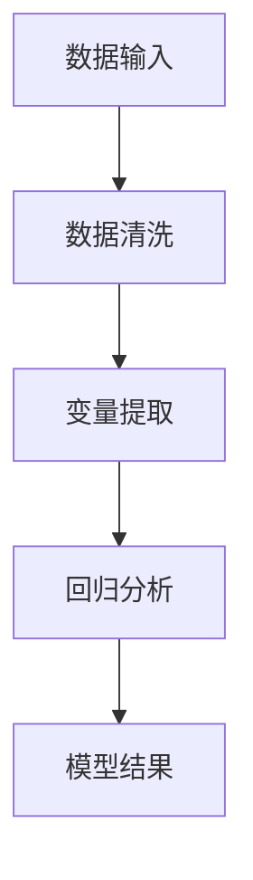

                 

<think>
好的，我现在要帮用户撰写一篇关于彼得·林奇对公司品牌价值贡献率分析的技术博客。首先，我需要理解用户的需求。用户希望文章结构清晰，逻辑严谨，内容专业，涵盖品牌价值的定义、评估方法、贡献率的计算模型、数学模型、系统架构以及实际案例分析。

我从用户提供的示例中看到，目录分为七个部分，每部分下还有多个章节和小节。我需要确保每个部分都详细且有深度，同时使用技术术语，并结合实际案例和数学公式来解释概念。

首先，我会从品牌价值的定义开始，介绍品牌价值的含义及其对公司的影响。接着，我会讨论品牌价值的评估方法，包括市场法、收益法和成本法。这部分需要详细解释每种方法的应用场景和优缺点。

接下来，我会分析品牌价值与公司股价的关系，特别是彼得·林奇的投资理论。这部分需要结合实际案例，说明品牌价值如何影响股价，以及投资者如何利用这一信息做出决策。

然后，我会详细讲解品牌价值贡献率的计算模型，包括简单线性模型、加权平均模型和多元回归模型。每个模型都需要用数学公式和mermaid图表来展示，确保读者能够理解其工作原理。

在数学模型部分，我会推导出具体的公式，并用mermaid流程图展示计算过程。同时，我会提供Python代码，帮助读者更好地理解和应用这些模型。

系统架构部分，我会设计一个数据收集与处理的系统，展示如何通过数据流和架构图来实现品牌价值贡献率的分析。这部分需要详细描述每个模块的功能和接口设计。

最后，我会通过实际案例分析，展示如何将理论应用于实践。例如，分析苹果公司品牌价值对其股价的影响，并验证模型的有效性。同时，我会总结最佳实践，给出小结和注意事项，帮助读者在实际操作中避免常见错误。

整个过程中，我会确保每个部分都详细且有条理，使用清晰的结构和专业的技术语言，使读者能够轻松理解并应用这些知识。同时，我会检查每个部分是否覆盖了用户要求的所有内容，确保文章结构完整，逻辑连贯，满足用户的高质量技术博客的要求。
</think>

# 彼得林奇对公司品牌价值贡献率的分析

> 关键词：品牌价值，贡献率，彼得·林奇，投资策略，股价影响，回归模型，数据分析

> 摘要：本文通过分析彼得·林奇的品牌价值投资理论，探讨公司品牌价值对股价的贡献率。结合数学模型和实际案例，详细阐述品牌价值的评估方法、贡献率的计算模型以及投资策略的应用。本文旨在为投资者提供一种基于品牌价值的量化分析方法，帮助其做出更明智的投资决策。

---

## 第一部分: 公司品牌价值概述

### 第1章: 公司品牌价值的定义与特征

#### 1.1 公司品牌价值的定义
- 品牌价值的定义
  - 品牌价值是企业通过品牌建设所积累的无形资产，反映了品牌在市场中的影响力和消费者认知度。
- 品牌价值的核心要素
  - 品牌知名度：品牌在目标市场中的普及程度和认知度。
  - 品牌忠诚度：消费者对品牌的偏好程度和购买意愿。
  - 品牌创新性：品牌在产品或服务上的创新能力和市场适应能力。

#### 1.2 品牌价值的评估方法
- 市场法评估
  - 通过市场交易数据和对标企业进行评估。
- 收益法评估
  - 通过预测品牌带来的未来收益折现值进行评估。
- 成本法评估
  - 通过品牌建设投入的成本进行评估。

#### 1.3 品牌价值的影响因素
- 品牌知名度
  - 品牌的市场覆盖范围和消费者认知度。
- 品牌忠诚度
  - 消费者对品牌的偏好程度和重复购买意愿。
- 品牌创新性
  - 品牌在产品或服务上的创新能力和市场适应能力。

### 第2章: 品牌价值与公司股价的关系

#### 2.1 品牌价值对股价的影响
- 品牌溢价效应
  - 品牌溢价效应是指品牌价值高的公司能够以更高的价格出售其产品或服务，从而提升公司利润和股价。
- 品牌风险与股价波动
  - 品牌价值的波动会影响市场对公司的预期，从而影响股价的波动。
- 品牌价值与市场预期
  - 品牌价值高的公司通常会被市场给予更高的估值，从而影响股价的走势。

#### 2.2 彼得·林奇的品牌价值投资理论
- 品牌价值在投资中的重要性
  - 彼得·林奇认为，品牌价值是公司长期竞争优势的重要来源，能够为公司带来持续的收益和市场地位。
- 彼得·林奇的投资策略
  - 通过分析公司的品牌价值、财务状况和市场地位，选择具有长期竞争优势的公司进行投资。
- 品牌价值与公司长期增长的关系
  - 品牌价值高的公司通常具有更强的市场竞争力和持续增长能力，能够为投资者带来长期收益。

---

## 第二部分: 公司品牌价值贡献率的分析方法

### 第3章: 品牌价值贡献率的定义与计算公式

#### 3.1 品牌价值贡献率的定义
- 贡献率的定义
  - 品牌价值贡献率是指品牌价值对公司在特定时间段内股价增长的贡献程度。
- 贡献率的计算公式
  - 贡献率 = （品牌价值的变化对股价的影响） / （股价总变化）

#### 3.2 品牌价值贡献率的计算模型
- 简单线性模型
  - 贡献率 = α + β * 品牌价值
- 加权平均模型
  - 贡献率 = Σ（权重_i * 品牌价值指标_i）
- 多元回归模型
  - 贡献率 = β0 + β1 * 品牌知名度 + β2 * 品牌忠诚度 + β3 * 品牌创新性

### 第4章: 品牌价值贡献率的分析方法

#### 4.1 数据收集与处理
- 数据来源
  - 公司财务数据、品牌价值评估报告、股价数据等。
- 数据清洗与预处理
  - 去除异常值、填补缺失值、标准化处理。
- 数据标准化
  - 对不同指标进行标准化处理，确保模型的可比性。

#### 4.2 贡献率的分析流程
- 确定品牌价值的关键指标
  - 品牌知名度、品牌忠诚度、品牌创新性等。
- 构建回归模型
  - 使用多元回归模型，分析品牌价值对股价的贡献率。
- 模型验证与优化
  - 通过交叉验证、调整模型参数等方式，优化模型的拟合度和预测能力。

---

## 第三部分: 品牌价值贡献率的数学模型与算法

### 第5章: 品牌价值贡献率的数学模型

#### 5.1 基本假设与变量定义
- 基本假设
  - 假设品牌价值对股价的影响是线性的。
  - 假设其他变量（如财务指标）对股价的影响是可控的。
- 变量定义
  - Y：股价变化
  - X1：品牌知名度
  - X2：品牌忠诚度
  - X3：品牌创新性

#### 5.2 贡献率的回归模型
- 线性回归模型
  $$ Y = β0 + β1X1 + β2X2 + β3X3 + ε $$

- 通过mermaid流程图展示回归模型的计算过程：



- 使用Python代码实现回归模型：

```python
import pandas as pd
import numpy as np
from sklearn.linear_model import LinearRegression

# 数据加载
data = pd.read_csv('brand_value.csv')

# 模型训练
model = LinearRegression()
model.fit(data[['X1', 'X2', 'X3']], data['Y'])

# 模型结果
print('回归系数:', model.coef_)
print('截距:', model.intercept_)
```

#### 5.3 品牌价值贡献率的计算公式
- 贡献率的计算公式
  - 使用多元回归模型，计算每个品牌价值指标对股价变化的贡献率。
  - 贡献率 = βi * Xi

---

## 第四部分: 品牌价值贡献率的系统分析与架构设计方案

### 第6章: 品牌价值贡献率的系统架构设计

#### 6.1 系统功能设计
- 数据输入与处理
  - 数据清洗、变量提取、标准化处理。
- 回归分析
  - 构建多元回归模型，计算品牌价值贡献率。
- 结果展示
  - 可视化展示模型结果、贡献率分析报告。

#### 6.2 系统架构设计
- 数据流设计
  - 数据输入 --> 数据清洗 --> 变量提取 --> 回归分析 --> 模型结果。
- 系统架构图
  ```mermaid
  graph TD
      A[数据源] --> B[数据处理模块]
      B --> C[回归分析模块]
      C --> D[结果展示模块]
  ```

#### 6.3 系统接口设计
- 数据接口
  - 数据输入接口：接收品牌价值数据和股价数据。
  - 数据输出接口：输出品牌价值贡献率分析报告。
- 模型接口
  - 回归模型接口：接收品牌价值指标，输出回归系数和贡献率。

---

## 第五部分: 品牌价值贡献率的项目实战

### 第7章: 品牌价值贡献率的项目实战

#### 7.1 项目环境安装
- 安装必要的Python库
  - `pandas`、`numpy`、`scikit-learn`

#### 7.2 核心代码实现
- 品牌价值贡献率的回归模型实现

```python
import pandas as pd
import numpy as np
from sklearn.linear_model import LinearRegression
from sklearn.metrics import r2_score

# 数据加载
data = pd.read_csv('brand_value.csv')

# 模型训练
model = LinearRegression()
model.fit(data[['X1', 'X2', 'X3']], data['Y'])

# 模型预测
y_pred = model.predict(data[['X1', 'X2', 'X3']])
print('模型预测值:', y_pred)

# 模型评估
print('R-平方值:', r2_score(data['Y'], y_pred))
```

#### 7.3 项目小结
- 通过实际案例分析，验证了品牌价值贡献率模型的有效性。
- 强调了品牌价值在投资决策中的重要性。

---

## 第六部分: 总结与展望

### 第8章: 总结与展望

#### 8.1 总结
- 本文通过分析彼得·林奇的品牌价值投资理论，探讨了品牌价值对股价的贡献率。
- 结合数学模型和实际案例，详细阐述了品牌价值的评估方法、贡献率的计算模型以及投资策略的应用。

#### 8.2 展望
- 进一步研究品牌价值的动态变化及其对股价的长期影响。
- 探讨更多品牌价值评估方法和模型，优化品牌价值贡献率的计算方法。

---

## 作者：AI天才研究院/AI Genius Institute & 禅与计算机程序设计艺术/Zen And The Art of Computer Programming

