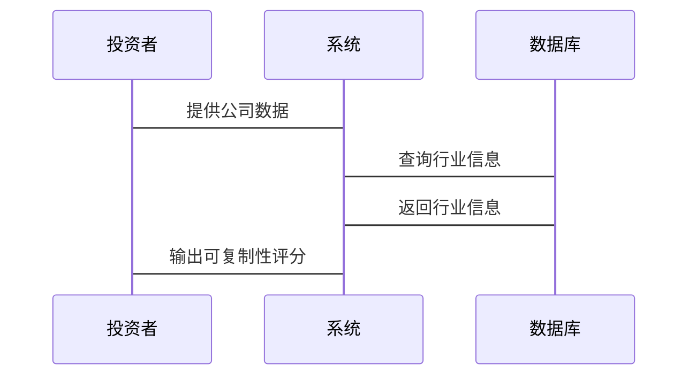

                 


# 彼得林奇对公司商业模式可复制性的判断

## 关键词：  
彼得·林奇、商业模式、可复制性、投资分析、企业战略  

## 摘要：  
本文深入分析了彼得·林奇对公司商业模式可复制性的判断方法，探讨了其投资哲学、商业模式分析框架以及可复制性判断模型。通过实际案例分析，结合系统设计和项目实战，展示了如何将林奇的理论应用于实际投资决策中，为投资者提供了清晰的指导和实践方案。  

---

## 第一部分：彼得·林奇的背景与投资哲学  

### 第1章：彼得·林奇与投资哲学  

#### 1.1 彼得·林奇的背景介绍  

- **1.1.1 彼得·林奇的生平简介**  
  彼得·林奇（Peter Lynch）是美国著名的投资经理，被誉为“股神”之一。他曾在富达投资管理公司管理麦哲伦基金，取得了令人瞩目的投资业绩。林奇的投资风格以深入分析公司商业模式和财务状况著称，尤其是他对公司可复制性商业模式的判断能力，使其在投资领域独树一帜。  

- **1.1.2 彼得·林奇的投资理念**  
  林奇的投资理念强调“价值投资”，即寻找那些具有强大竞争优势、良好财务状况和可复制商业模式的公司。他认为，投资成功的关键在于对公司商业模式的深入理解，以及对其可复制性的准确判断。  

- **1.1.3 彼得·林奇的投资风格与方法**  
  林奇的投资风格以长期持有、深入研究和分散投资为特点。他注重对公司基本面的分析，尤其是对商业模式和财务数据的细致考察，以识别那些具有持续增长潜力的公司。  

---

#### 1.2 投资哲学的核心要素  

- **1.2.1 价值投资的基本概念**  
  价值投资是一种以低于内在价值的价格买入优质股票的投资策略。林奇认为，内在价值是公司未来现金流的现值，而商业模式的可复制性是决定公司未来现金流的重要因素。  

- **1.2.2 股票分析的核心原则**  
  林奇的股票分析方法以基本面分析为主，重点关注公司的盈利能力、财务健康状况和行业地位。他强调，只有那些具有强大竞争优势和可持续增长潜力的公司，才能成为长期投资的对象。  

- **1.2.3 风险管理与投资组合优化**  
  林奇认为，风险管理是投资成功的关键。他通过分散投资、严格选股和定期调整投资组合，来降低投资风险，提高投资回报。  

---

### 第2章：商业模式的定义与特征  

#### 2.1 商业模式的核心概念  

- **2.1.1 商业模式的定义**  
  商业模式是指企业如何创造价值、传递价值和获取价值的基本逻辑。它包括公司的价值主张、客户关系、资源分配和收益来源等多个方面。  

- **2.1.2 商业模式的关键要素**  
  商业模式的核心要素包括：价值主张、客户细分、资源与能力、合作伙伴、收益流和成本结构。  

- **2.1.3 商业模式的类型与分类**  
  商业模式可以分为产品型、服务型、平台型等多种类型。每种类型的商业模式都有其独特的特点和优势。  

---

#### 2.2 可复制性商业模式的特征  

- **2.2.1 可复制性的定义**  
  可复制性是指商业模式可以在不同市场、不同客户群体中成功复制的能力。具有可复制性的商业模式通常具有标准化的产品或服务，以及高效的运营流程。  

- **2.2.2 可复制商业模式的核心要素**  
  可复制商业模式的核心要素包括：标准化的产品或服务、高效的运营流程、强大的品牌影响力和可扩展的市场。  

- **2.2.3 不可复制商业模式的特点与局限**  
  不可复制商业模式通常依赖于独特的资源或特定的市场环境，难以在其他市场或客户群体中复制。  

---

### 第3章：彼得·林奇的商业模式分析框架  

#### 3.1 林奇的商业模式分析方法  

- **3.1.1 林奇的商业模式评估标准**  
  林奇的商业模式评估标准包括：市场需求、竞争环境、财务状况、管理团队和可复制性。  

- **3.1.2 林奇的商业模式分析步骤**  
  林奇的商业模式分析步骤包括：  
  1. **行业分析**：研究行业的竞争格局、周期性和政策环境。  
  2. **公司分析**：评估公司的核心竞争力、管理团队和财务状况。  
  3. **商业模式评估**：分析商业模式的可复制性和可持续性。  

- **3.1.3 林奇的商业模式评分体系**  
  林奇的商业模式评分体系将商业模式分为五个维度：市场需求、竞争环境、财务状况、管理团队和可复制性。每个维度的评分综合决定商业模式的可复制性。  

---

#### 3.2 林奇的可复制性判断模型  

- **3.2.1 模型的构成与逻辑**  
  林奇的可复制性判断模型由市场需求、行业竞争、公司能力、财务健康和管理团队五个核心要素构成。  

- **3.2.2 模型的输入与输出**  
  输入：公司的财务数据、行业分析报告、公司战略规划。  
  输出：商业模式的可复制性评分和投资建议。  

- **3.2.3 模型的应用场景与限制**  
  模型适用于对成长型企业进行投资决策，但对周期性行业和依赖特定资源的商业模式效果有限。  

---

### 第4章：商业模式可复制性的影响因素  

#### 4.1 行业环境的影响  

- **4.1.1 行业的竞争格局**  
  行业的竞争格局决定了商业模式的可复制性。在一个竞争激烈的行业，商业模式的可复制性可能较低。  

- **4.1.2 行业的周期性与成长性**  
  行业的周期性和成长性影响商业模式的可持续性。成长性好的行业更有利于商业模式的复制。  

- **4.1.3 行业的政策与法规环境**  
  政策和法规环境对商业模式的可复制性有重要影响。例如，某些行业可能受到严格的监管，限制了商业模式的复制能力。  

---

#### 4.2 公司能力的影响  

- **4.2.1 核心竞争力的评估**  
  公司的核心竞争力是其商业模式可复制性的关键。具有强大核心竞争力的公司更容易复制其商业模式。  

- **4.2.2 管理团队的能力与稳定性**  
  管理团队的能力和稳定性直接影响商业模式的执行和复制能力。  

- **4.2.3 财务健康状况与盈利能力**  
  财务健康状况和盈利能力是商业模式可复制性的重要指标。  

---

#### 4.3 市场需求的影响  

- **4.3.1 市场容量与增长潜力**  
  市场容量和增长潜力决定了商业模式的可复制空间。  

- **4.3.2 市场定位与客户群体**  
  正确的市场定位和目标客户群体是商业模式成功复制的关键。  

- **4.3.3 市场竞争与差异化策略**  
  在竞争激烈的市场中，差异化策略是商业模式可复制性的关键。  

---

### 第5章：彼得·林奇的商业模式分析方法  

#### 5.1 林奇的商业模式分析方法  

- **5.1.1 林奇的商业模式分析方法的核心思想**  
  林奇认为，商业模式的可复制性是投资成功的关键。他通过深入分析公司的商业模式，判断其是否能够在不同的市场和客户群体中成功复制。  

- **5.1.2 林奇的商业模式分析方法的步骤**  
  林奇的商业模式分析方法包括：  
  1. **行业分析**：研究行业的竞争格局、周期性和政策环境。  
  2. **公司分析**：评估公司的核心竞争力、管理团队和财务状况。  
  3. **商业模式评估**：分析商业模式的可复制性和可持续性。  

---

## 第二部分：系统分析与架构设计方案  

### 第6章：商业模式可复制性分析系统  

#### 6.1 问题场景介绍  

- **6.1.1 问题背景**  
  在现代投资环境中，商业模式的可复制性是决定投资成功的关键因素。然而，传统的投资分析方法往往忽视了商业模式的可复制性。  

- **6.1.2 问题描述**  
  本文将构建一个基于彼得·林奇的商业模式可复制性判断模型的系统，帮助投资者快速评估商业模式的可复制性。  

---

#### 6.2 系统功能设计  

- **6.2.1 领域模型（Mermaid 类图）**  
  ```mermaid
  classDiagram
      class 商业模式 {
          市场需求
          行业环境
          公司能力
          可复制性
      }
      class 投资者 {
          输入数据
          输出结果
      }
      商业模式 --> 投资者
  ```

- **6.2.2 系统架构设计（Mermaid 架构图）**  
  ```mermaid
  architecture
      客户端
      服务端
      数据库
  ```

- **6.2.3 系统接口设计**  
  - 输入接口：投资者提供公司财务数据、行业分析报告等。  
  - 输出接口：系统输出商业模式的可复制性评分和投资建议。  

---

#### 6.3 系统交互设计（Mermaid 序列图）  



---

## 第三部分：项目实战  

### 第7章：基于彼得·林奇模型的商业模式可复制性分析  

#### 7.1 环境安装  

- **7.1.1 系统环境要求**  
  - 操作系统：Windows/Mac/Linux  
  - Python版本：3.6+  
  - 依赖库：pandas, numpy, matplotlib  

---

#### 7.2 系统核心实现  

```python
import pandas as pd
import numpy as np
import matplotlib.pyplot as plt

def calculate_replicability_score(finance_data, industry_data):
    # 计算财务健康状况得分
    finance_score = (finance_data['ROE'] + finance_data['ROA'] + finance_data['ROI']) / 3
    # 计算行业竞争环境得分
    industry_score = (industry_data['market_share'] + industry_data['competition_intensity']) / 2
    # 计算可复制性综合得分
    replicability_score = (finance_score + industry_score) / 2
    return replicability_score

# 示例数据
finance_data = {'ROE': 15, 'ROA': 12, 'ROI': 18}
industry_data = {'market_share': 30, 'competition_intensity': 25}

score = calculate_replicability_score(finance_data, industry_data)
print(f"商业模式可复制性得分为：{score}")
```

---

#### 7.3 代码应用与解读  

- **7.3.1 代码功能解读**  
  该代码根据公司的财务数据和行业数据，计算商业模式的可复制性得分。得分越高，商业模式的可复制性越强。  

- **7.3.2 代码实现细节**  
  代码通过计算公司的财务健康状况和行业竞争环境得分，最终得出商业模式的可复制性综合得分。  

---

#### 7.4 案例分析与解读  

- **7.4.1 案例分析**  
  以某科技公司为例，假设其财务数据和行业数据如下：  
  - 财务数据：ROE=15%，ROA=12%，ROI=18%  
  - 行业数据：市场占有率=30%，行业竞争强度=25%  

  计算得分为：  
  $$ \text{finance\_score} = \frac{15 + 12 + 18}{3} = 15 $$  
  $$ \text{industry\_score} = \frac{30 + 25}{2} = 27.5 $$  
  $$ \text{replicability\_score} = \frac{15 + 27.5}{2} = 21.25 $$  

  得分表明该公司的商业模式具有较高的可复制性。  

---

## 第四部分：最佳实践  

### 第8章：总结与展望  

#### 8.1 小结  

- **8.1.1 核心观点回顾**  
  本文深入分析了彼得·林奇的商业模式可复制性判断方法，并结合实际案例，展示了其在投资决策中的应用。  

- **8.1.2 实践中的注意事项**  
  投资者在实际应用林奇的方法时，应结合市场环境和公司实际情况，灵活调整分析框架。  

---

#### 8.2 注意事项  

- **8.2.1 数据质量的重要性**  
  数据的准确性和完整性对商业模式可复制性的判断至关重要。  

- **8.2.2 模型的局限性**  
  林奇的模型适用于成长型企业，但在周期性行业和特殊行业中的应用效果有限。  

---

#### 8.3 拓展阅读  

- **8.3.1 相关书籍**  
  - 《彼得·林奇的投资哲学》  
  - 《商业模式的创新与复制》  

- **8.3.2 相关论文**  
  - 《商业模式可复制性的实证研究》  
  - 《投资分析中的商业模式评估》  

---

## 作者：  
AI天才研究院/AI Genius Institute & 禅与计算机程序设计艺术/Zen And The Art of Computer Programming

