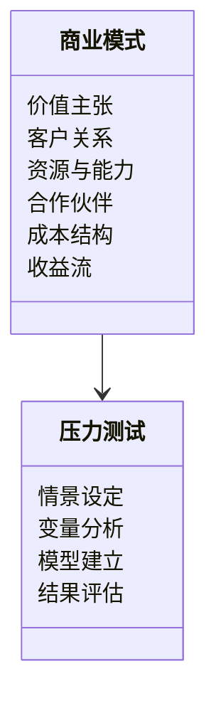
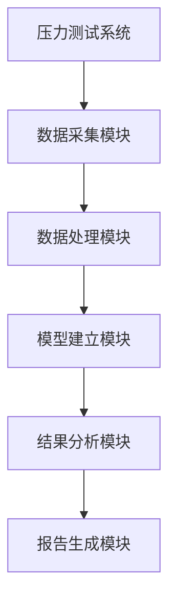
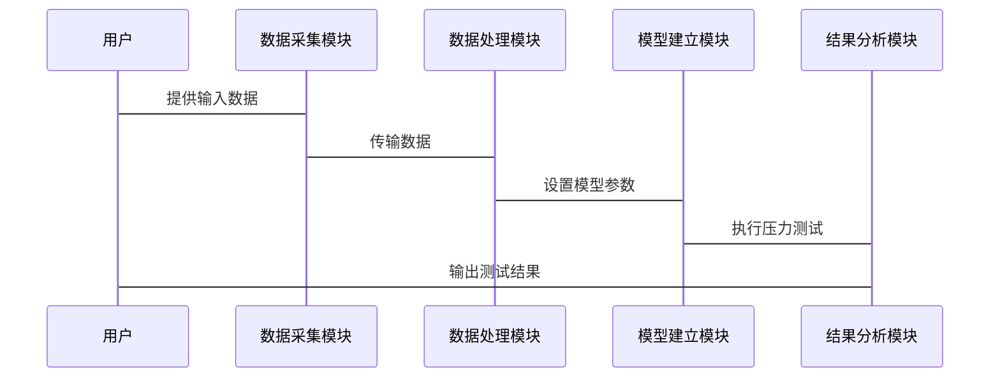

                 

<think>
好的，我需要撰写一篇关于《彼得林奇对公司商业模式适应性的压力测试方法》的技术博客文章。首先，我需要明确文章的核心内容和主题思想，然后按照目录结构逐步展开，确保逻辑清晰、结构紧凑，并且使用简单易懂的技术语言。

首先，我会从背景介绍开始，解释什么是压力测试，以及它在商业模式中的重要性。接着，我会详细阐述商业模式的核心要素，以及压力测试在其中的具体应用。然后，我会深入讲解压力测试的算法原理，包括情景分析、敏感性分析和蒙特卡洛模拟等方法，并通过mermaid流程图和数学公式来说明这些方法的实现过程。

接下来，我会设计一个实际的项目案例，展示如何将这些压力测试方法应用于实际的商业模式分析中。这包括项目介绍、系统功能设计、系统架构设计、接口设计和交互序列图等部分。通过具体的代码实现和案例分析，我将详细解读如何利用这些方法进行压力测试，并优化商业模式。

最后，我会总结压力测试在商业模式适应性中的最佳实践，提出一些注意事项和未来的拓展阅读方向，帮助读者更好地理解和应用这些方法。

在撰写过程中，我需要确保每个章节内容丰富、详细，同时使用清晰的逻辑结构，让读者能够一步步跟随我的思路，理解压力测试在商业模式适应性中的重要性及其具体实施方法。
</think>

# 彼得林奇对公司商业模式适应性的压力测试方法

---

## 关键词
- 彼得林奇
- 商业模式
- 压力测试
- 风险评估
- 战略规划
- 投资分析

---

## 摘要
本文深入探讨了彼得·林奇的压力测试方法在公司商业模式适应性评估中的应用。通过分析商业模式的核心要素、压力测试的原理和算法，结合实际案例，展示了如何利用压力测试方法优化商业模式，降低企业风险，提升企业竞争力。

---

## 第1章: 公司商业模式适应性压力测试的背景与概念

### 1.1 压力测试的基本概念
压力测试是一种通过模拟极端条件下的情景，评估系统或模型在承受压力时的适应性和稳定性。在商业模式中，压力测试用于评估企业在面对市场变化、经济波动等挑战时的应对能力。

#### 1.1.1 什么是压力测试
压力测试是一种主动的风险管理方法，通过模拟极端情况下的变量变化，评估系统或模型的稳健性。在商业模式中，压力测试用于评估企业在不同市场环境下的生存和盈利能力。

#### 1.1.2 压力测试的目的与意义
压力测试的目的是通过模拟极端情况，评估商业模式在不同环境下的适应能力。其意义在于帮助企业提前识别潜在风险，优化商业模式，提升企业抗风险能力。

#### 1.1.3 压力测试的分类与应用场景
压力测试可以分为定量压力测试和定性压力测试。定量压力测试通过数学模型评估具体变量变化对企业的影响；定性压力测试则通过情景分析和专家判断评估企业应对潜在风险的能力。

---

### 1.2 商业模式的核心要素
商业模式是企业实现价值创造和价值传递的逻辑框架。其核心要素包括价值主张、客户关系、资源与能力、合作伙伴、成本结构和收益流。

#### 1.2.1 什么是商业模式
商业模式是企业如何创造价值、传递价值和获取价值的逻辑框架。它描述了企业如何通过资源整合、价值传递和客户互动实现盈利。

#### 1.2.2 商业模式的关键构成要素
- **价值主张**：企业提供的产品或服务的核心价值。
- **客户关系**：企业与客户之间的互动方式和关系管理。
- **资源与能力**：企业拥有的核心资源和竞争优势。
- **合作伙伴**：企业与外部合作伙伴的关系和协作方式。
- **成本结构**：企业运营和生产的主要成本来源。
- **收益流**：企业通过销售产品或服务获得的收入来源。

#### 1.2.3 商业模式与企业绩效的关系
商业模式决定了企业的收入来源、成本结构和价值创造方式。一个有效的商业模式能够帮助企业实现可持续增长，提升企业绩效。

---

### 1.3 压力测试在商业模式中的应用
压力测试在商业模式中的应用可以帮助企业识别潜在风险，优化商业模式，提升企业竞争力。

#### 1.3.1 压力测试与商业模式适应性的关系
压力测试通过模拟极端市场条件，评估商业模式在不同环境下的适应能力。它帮助企业识别商业模式中的弱点，并提出改进建议。

#### 1.3.2 压力测试在商业模式优化中的作用
压力测试可以帮助企业发现商业模式中的潜在风险，优化资源配置，提升企业抗风险能力，确保商业模式的可持续性。

#### 1.3.3 压力测试的实施步骤与方法
压力测试的实施步骤包括：明确测试目标、选择测试方法、收集数据、建立模型、模拟情景、评估结果和优化调整。

---

## 第2章: 商业模式适应性压力测试的核心概念

### 2.1 压力测试的核心原理
压力测试的核心原理是通过模拟极端情景，评估系统或模型在承受压力时的适应能力。在商业模式中，压力测试用于评估企业在不同市场环境下的生存能力和盈利能力。

#### 2.1.1 压力测试的基本原理
压力测试的基本原理是通过设定不同的情景，模拟市场环境的变化，评估商业模式在这些情景下的表现。

#### 2.1.2 压力测试的数学模型
压力测试的数学模型通常包括概率分布、回归分析和蒙特卡洛模拟等方法。这些模型可以帮助企业量化不同变量变化对商业模式的影响。

#### 2.1.3 压力测试的实施方法
压力测试的实施方法包括情景分析、敏感性分析和蒙特卡洛模拟。这些方法可以帮助企业全面评估商业模式在不同情景下的表现。

---

### 2.2 商业模式适应性压力测试的模型构建

#### 2.2.1 模型框架
商业模式适应性压力测试的模型框架包括输入变量、模型结构和输出结果。输入变量包括市场变量、企业资源和客户行为等；模型结构包括情景模拟、变量分析和结果评估；输出结果包括企业绩效指标和风险评估结果。

#### 2.2.2 模型的输入变量与输出变量
- **输入变量**：市场变量（如市场需求、价格变化）、企业资源（如成本、资产）、客户行为（如购买意愿、忠诚度）。
- **输出变量**：企业绩效指标（如收入、利润）、风险评估结果（如破产概率、流动性风险）。

#### 2.2.3 模型的验证与优化
模型的验证与优化包括数据校准、情景测试和结果分析。通过不断优化模型，确保其能够准确反映商业模式在不同情景下的表现。

---

### 2.3 数据收集与分析方法

#### 2.3.1 数据收集的渠道与方法
数据收集的渠道包括内部数据（如企业财务数据、销售数据）和外部数据（如市场报告、行业趋势）。数据收集的方法包括问卷调查、访谈和数据分析。

#### 2.3.2 数据分析的基本步骤
数据分析的基本步骤包括数据清洗、数据建模和数据可视化。通过分析数据，识别商业模式中的潜在风险和优化机会。

#### 2.3.3 数据可视化与结果解读
数据可视化包括图表展示、趋势分析和风险地图。通过可视化数据，帮助企业更好地理解和应对潜在风险。

---

## 第3章: 商业模式适应性压力测试的算法原理

### 3.1 情景分析法

#### 3.1.1 情景分析法的定义与原理
情景分析法是一种通过设定不同的情景，评估商业模式在不同市场环境下的表现的方法。其原理是通过模拟极端情景，识别商业模式中的潜在风险和优化机会。

#### 3.1.2 情景分析法的实施步骤
1. **情景设定**：根据市场环境设定不同的情景，如市场需求下降、成本上升、竞争加剧等。
2. **变量分析**：分析不同情景下各变量对商业模式的影响。
3. **结果评估**：评估商业模式在不同情景下的表现，识别潜在风险和优化机会。

#### 3.1.3 情景分析法的优缺点
- **优点**：情景分析法能够帮助企业全面评估商业模式在不同市场环境下的表现。
- **缺点**：情景分析法的实施需要大量数据和专业知识支持，且情景设定具有一定的主观性。

---

### 3.2 敏感性分析法

#### 3.2.1 敏感性分析法的定义与原理
敏感性分析法是一种通过分析变量变化对商业模式的影响，识别关键变量的方法。其原理是通过量化变量变化对商业模式的影响程度，帮助企业优化资源配置。

#### 3.2.2 敏感性分析法的实施步骤
1. **变量选择**：选择影响商业模式的关键变量，如市场需求、成本、价格等。
2. **变量变化**：设定变量变化的范围，如市场需求下降10%、成本上升20%等。
3. **影响评估**：评估变量变化对商业模式的影响，识别关键变量和潜在风险。

#### 3.2.3 敏感性分析法的优缺点
- **优点**：敏感性分析法能够帮助企业识别关键变量，优化资源配置。
- **缺点**：敏感性分析法的实施需要准确的变量选择和变化范围设定，具有一定的局限性。

---

### 3.3 蒙特卡洛模拟法

#### 3.3.1 蒙特卡洛模拟法的定义与原理
蒙特卡洛模拟法是一种通过随机抽样和概率分析，评估商业模式在不同情景下的表现的方法。其原理是通过模拟大量随机情景，评估商业模式的稳健性。

#### 3.3.2 蒙特卡洛模拟法的实施步骤
1. **情景设定**：根据市场环境设定不同的情景，如市场需求、价格变化、成本上升等。
2. **随机抽样**：通过随机抽样生成大量情景，评估商业模式在不同情景下的表现。
3. **结果分析**：分析情景模拟结果，识别潜在风险和优化机会。

#### 3.3.3 蒙特卡洛模拟法的优缺点
- **优点**：蒙特卡洛模拟法能够全面评估商业模式在不同情景下的表现，帮助企业在不确定环境下做出决策。
- **缺点**：蒙特卡洛模拟法的实施需要大量的计算和数据支持，且结果具有一定的随机性。

---

## 第4章: 商业模式适应性压力测试的数学模型与公式

### 4.1 基础概率模型

#### 4.1.1 概率分布的定义与类型
概率分布是描述随机变量可能取值及其概率的函数。常见的概率分布类型包括正态分布、均匀分布和泊松分布。

#### 4.1.2 随机变量的期望与方差
随机变量的期望是其概率加权平均值，方差是其与期望的差的平方的期望值。公式如下：

$$
E(X) = \sum_{i=1}^{n} x_i p_i
$$

$$
Var(X) = E[(X - E[X])^2] = \sum_{i=1}^{n} (x_i - E[X])^2 p_i
$$

---

### 4.2 风险评估模型

#### 4.2.1 风险评估的数学公式
风险评估公式通过量化不同变量变化对商业模式的影响，评估潜在风险。公式如下：

$$
\text{风险评分} = \sum_{i=1}^{n} w_i \cdot r_i
$$

其中，\( w_i \) 是变量 \( i \) 的权重，\( r_i \) 是变量 \( i \) 的风险值。

---

### 4.3 情景分析模型

#### 4.3.1 不同情景下的变量关系
情景分析模型通过设定不同的情景，分析变量变化对商业模式的影响。例如，在市场需求下降的情景下，企业的收入和利润可能受到较大影响。

---

## 第5章: 项目实战与案例分析

### 5.1 项目介绍
本项目旨在通过压力测试方法，评估某公司的商业模式在不同市场环境下的适应能力。项目包括数据收集、模型建立、情景模拟和结果分析等步骤。

---

### 5.2 系统功能设计

#### 5.2.1 领域模型图
以下是商业模式适应性压力测试的领域模型图：



---

### 5.3 系统架构设计

#### 5.3.1 系统架构图
以下是商业模式适应性压力测试的系统架构图：



---

### 5.4 接口设计与交互序列图

#### 5.4.1 接口设计
压力测试系统的接口设计包括数据输入接口、模型参数设置接口和结果输出接口。

#### 5.4.2 交互序列图
以下是压力测试系统的交互序列图：



---

### 5.5 核心代码实现

#### 5.5.1 情景分析法的代码实现
以下是情景分析法的Python代码实现：

```python
import random

# 定义情景
scenarios = ["市场需求下降", "成本上升", "竞争加剧"]

# 定义变量
variables = ["收入", "成本", "利润"]

# 情景模拟
for scenario in scenarios:
    print(f"情景：{scenario}")
    for variable in variables:
        # 随机生成变量变化
        change = random.uniform(-0.2, 0.2)
        print(f"{variable}变化：{change}")
    print("-----")
```

---

## 第6章: 最佳实践与总结

### 6.1 最佳实践
1. **数据质量**：确保数据的准确性和完整性。
2. **模型选择**：根据具体情况选择合适的压力测试方法。
3. **情景设定**：合理设定情景，避免主观性过强。
4. **结果分析**：结合实际情况，全面解读测试结果。

---

### 6.2 小结
商业模式适应性压力测试是企业风险管理的重要工具。通过模拟极端情景，评估商业模式在不同环境下的适应能力，帮助企业识别潜在风险，优化商业模式，提升企业竞争力。

---

### 6.3 注意事项
1. **数据依赖性**：压力测试结果依赖于数据的准确性和完整性。
2. **模型局限性**：压力测试模型有一定的假设和简化，结果可能存在偏差。
3. **持续优化**：根据实际情况，持续优化压力测试模型和方法。

---

### 6.4 拓展阅读
1. **《彼得·林奇的投资哲学》**：深入了解彼得·林奇的投资理念和方法。
2. **《压力测试：金融风险的度量与管理》**：学习压力测试在金融领域的应用。
3. **《商业模式画布》**：系统学习商业模式的设计与优化。

---

## 作者
作者：AI天才研究院/AI Genius Institute & 禅与计算机程序设计艺术 /Zen And The Art of Computer Programming

