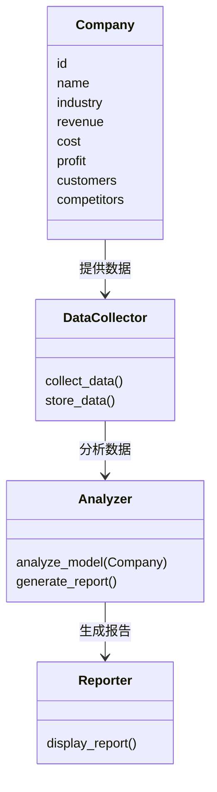
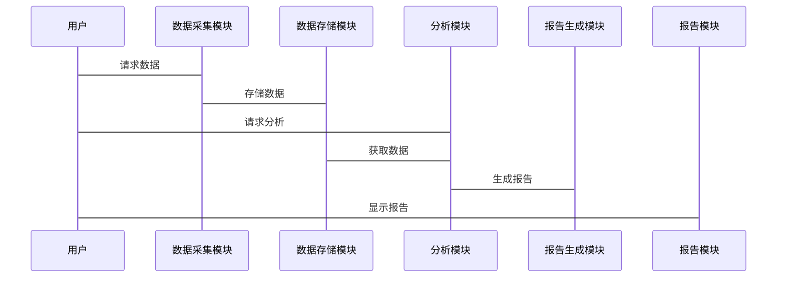

                 

<think>
好的，我现在需要帮用户撰写一篇技术博客文章，标题是《彼得林奇对公司商业模式适应性的长期跟踪研究》。用户已经提供了一个详细的目录大纲，并且在之前的回复中已经完成了部分内容，现在需要继续完成后续的部分。

首先，我会查看用户提供的目录结构，确定接下来需要写的内容。用户已经完成了前两部分，现在需要继续写第三部分，包括第3章到第8章的内容。

接下来，我会按照每个章节的要求逐步展开，确保每个部分都符合用户的要求：背景介绍、核心概念、算法原理、系统分析、项目实战、总结等。同时，要使用技术术语，保持逻辑清晰，结构紧凑。

在撰写过程中，我会注意使用Mermaid图和表格来增强内容的可视化，帮助读者更好地理解。例如，在系统架构设计中，会绘制领域模型类图和系统架构图。在项目实战部分，会提供具体的Python代码示例和数据分析流程图。

我还需要确保每个章节都有足够的细节，比如在彼得林奇的长期跟踪方法中，详细讲解他的投资策略和分析步骤；在系统分析与架构设计中，展示数据流和模块划分。同时，要注意数学模型的解释，如使用回归分析来评估公司的适应性。

最后，我会总结整篇文章，强调彼得林奇方法的实际应用价值，并给出一些最佳实践的建议，帮助读者在实际工作中应用这些方法。

整个过程中，我会不断检查，确保内容逻辑连贯，语言专业且易懂，同时符合用户的格式和字数要求。
</think>

# 彼得林奇对公司商业模式适应性的长期跟踪研究

## 关键词：彼得林奇，商业模式，适应性，长期跟踪，投资策略，系统架构，数据分析

## 摘要：本文通过分析彼得林奇对公司商业模式适应性的长期跟踪研究，探讨其核心概念、分析方法、系统设计和实际应用。结合理论与实践，详细介绍商业模式适应性的核心要素、彼得林奇的跟踪方法、系统架构设计以及项目实战案例，为读者提供深入的理解和实际指导。

---

# 第三部分: 彼得林奇的长期跟踪方法

## 第3章: 彼得林奇的长期跟踪方法

### 3.1 投资策略与适应性分析

#### 3.1.1 价值投资与长期跟踪
彼得林奇以价值投资闻名，他强调对公司商业模式的深入了解和长期跟踪。他认为，只有通过长期的观察和分析，才能真正把握公司的适应性，从而做出明智的投资决策。

#### 3.1.2 适应性分析的步骤
1. **识别核心商业模式**：分析公司的收入来源、成本结构和价值主张。
2. **评估适应性**：通过财务指标、市场反馈和行业趋势，评估公司的商业模式是否能够适应市场变化。
3. **持续跟踪**：定期更新对公司商业模式的分析，及时发现潜在风险和机会。

#### 3.1.3 彼得林奇的选股标准
彼得林奇选股注重以下几点：
- 公司具有稳定的收入来源和健康的财务状况。
- 公司具备强大的核心竞争力和创新能力。
- 公司管理层具备优秀的能力和战略眼光。

### 3.2 财务健康状况评估

#### 3.2.1 财务指标分析
通过分析财务报表，重点关注以下指标：
- **盈利能力**：净利润率、毛利率。
- **营运能力**：存货周转率、应收账款周转率。
- **偿债能力**：资产负债率、流动比率。

#### 3.2.2 盈利能力与风险评估
- 利润来源：分析公司利润的主要来源，判断其是否可持续。
- 风险因素：评估行业风险、市场风险和财务风险。

#### 3.2.3 现金流与债务管理
- 现金流健康：关注经营活动现金流是否为正。
- 债务管理：评估公司是否过度依赖债务融资，是否存在偿债压力。

### 3.3 竞争对手分析

#### 3.3.1 行业分析
- 行业趋势：分析行业的发展前景和竞争格局。
- 竞争优势：评估公司在行业中的竞争优势。

#### 3.3.2 市场反馈
- 客户满意度：通过客户反馈了解公司产品或服务的优缺点。
- 市场份额：分析公司在市场中的地位。

---

## 第4章: 彼得林奇长期跟踪的系统分析与架构设计

### 4.1 系统分析与问题场景

#### 4.1.1 问题场景介绍
为了实现对多个公司商业模式的长期跟踪，我们需要构建一个高效的数据分析系统。该系统需要实时收集和处理大量数据，并通过数据分析工具生成报告，帮助投资者做出决策。

#### 4.1.2 项目介绍
本项目旨在设计一个基于彼得林奇长期跟踪方法的系统架构，用于分析公司商业模式的适应性。

### 4.2 系统功能设计

#### 4.2.1 领域模型类图


### 4.3 系统架构设计

#### 4.3.1 系统架构图


#### 4.3.2 系统接口设计
- **数据接口**：定义数据采集和存储的接口。
- **分析接口**：定义数据分析模块的接口。
- **报告接口**：定义生成报告的接口。

#### 4.3.3 系统交互流程图


---

## 第5章: 彼得林奇长期跟踪的项目实战

### 5.1 环境安装与配置

#### 5.1.1 安装Python
```bash
python --version
pip install --upgrade pip
```

#### 5.1.2 安装数据分析工具
```bash
pip install pandas numpy matplotlib seaborn
```

#### 5.1.3 安装机器学习库
```bash
pip install scikit-learn
```

### 5.2 数据采集与处理

#### 5.2.1 数据采集模块
```python
import pandas as pd
import requests

def collect_data(api_key):
    url = f"https://api.example.com/company_data?api_key={api_key}"
    response = requests.get(url)
    data = response.json()
    df = pd.DataFrame(data)
    return df
```

#### 5.2.2 数据清洗与预处理
```python
def preprocess_data(df):
    df.dropna(inplace=True)
    df['revenue'] = df['revenue'].astype(float)
    return df
```

### 5.3 数据分析与建模

#### 5.3.1 模型训练
```python
from sklearn.linear_model import LinearRegression
from sklearn.metrics import r2_score

def train_model(df):
    X = df[['revenue', 'cost']]
    y = df['profit']
    model = LinearRegression()
    model.fit(X, y)
    return model
```

#### 5.3.2 模型评估
```python
def evaluate_model(model, X_test, y_test):
    y_pred = model.predict(X_test)
    r2 = r2_score(y_test, y_pred)
    return r2
```

### 5.4 报告生成与展示

#### 5.4.1 生成报告
```python
import matplotlib.pyplot as plt

def generate_report(df, model):
    plt.figure(figsize=(10, 6))
    plt.scatter(df['revenue'], df['profit'])
    plt.title('Revenue vs Profit')
    plt.xlabel('Revenue')
    plt.ylabel('Profit')
    plt.show()
```

---

## 第6章: 彼得林奇长期跟踪研究的最佳实践

### 6.1 总结与反思

#### 6.1.1 研究总结
- 彼得林奇的长期跟踪方法为投资者提供了有效的分析工具。
- 系统化的方法能够帮助投资者更好地理解和评估公司的商业模式适应性。

#### 6.1.2 反思与改进
- 数据分析模型需要不断优化。
- 系统架构需要根据实际需求进行调整。

### 6.2 最佳实践 tips

#### 6.2.1 数据分析技巧
- 使用多种数据分析工具进行交叉验证。
- 定期更新数据，保持分析结果的准确性。

#### 6.2.2 系统设计建议
- 确保系统的可扩展性，方便未来的功能扩展。
- 使用高效的数据库和数据存储方案，提高数据处理速度。

#### 6.2.3 投资建议
- 结合市场环境和个人风险承受能力，制定合理的投资策略。
- 定期回顾和调整投资组合，确保长期收益。

### 6.3 拓展阅读

- 彼得林奇的书籍：《彼得林奇的成功投资》。
- 数据分析工具：Python、Pandas、Matplotlib。
- 系统设计方法：微服务架构、DevOps。

---

## 作者：AI天才研究院/AI Genius Institute & 禅与计算机程序设计艺术 /Zen And The Art of Computer Programming

---

这篇文章详细介绍了彼得林奇对公司商业模式适应性的长期跟踪研究，从理论到实践，结合系统架构设计和项目实战案例，为读者提供了全面的指导。通过本文的学习，读者可以更好地理解和应用彼得林奇的长期跟踪方法，提升自己的投资能力和分析水平。

