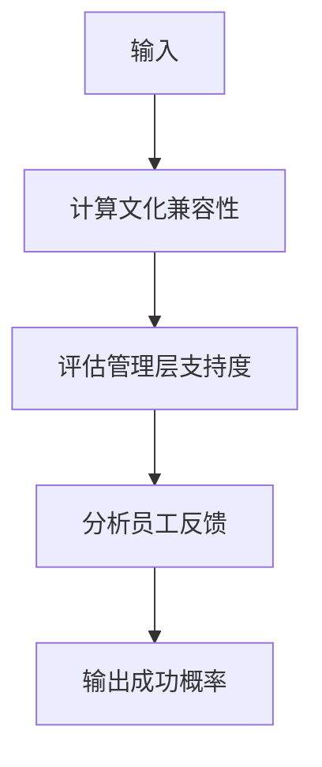
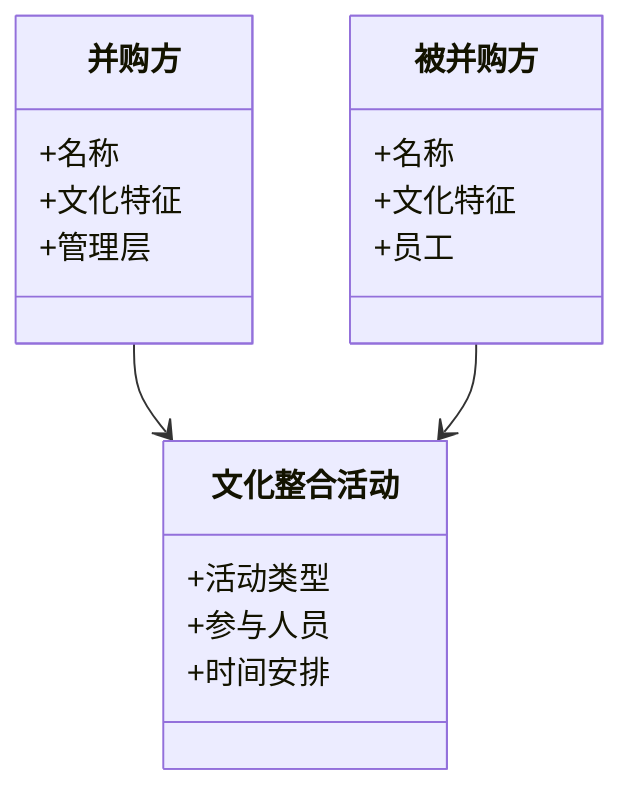
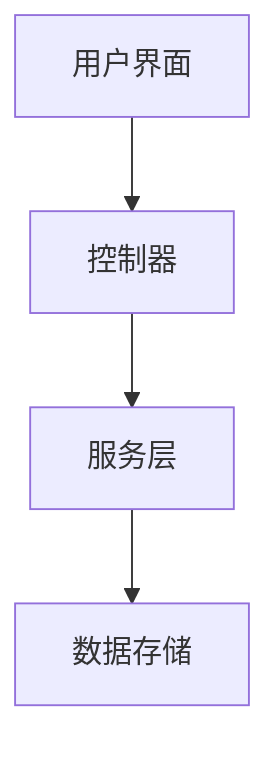

                 

<think>
好的，我现在需要按照用户的要求，撰写一篇关于《彼得林奇对公司并购后文化整合成功因素的案例研究》的技术博客文章。用户希望我详细地分步骤思考，并提供最终的中文文章内容。

首先，我会先理解用户的具体需求。用户希望文章以技术博客的形式呈现，内容要逻辑清晰、结构紧凑、语言专业，同时需要涵盖公司并购、文化整合、彼得·林奇、案例研究等关键词。文章需要包含摘要、目录结构，并按照指定的章节进行详细阐述。

接下来，我需要考虑文章的整体结构。根据用户提供的示例，文章分为七个部分：背景介绍、核心概念与联系、算法原理讲解、系统分析与架构设计方案、项目实战、总结与展望，以及附录部分。每个部分下还有更详细的子章节，确保内容全面且深入。

在撰写背景介绍部分时，我会首先解释公司并购的基本概念和文化整合的重要性，接着介绍彼得·林奇的并购研究方法。这部分需要简洁明了，帮助读者理解后续内容的基础。

核心概念与联系部分，我会详细分析文化整合的关键因素，如领导力、沟通、员工参与等，并通过对比分析和ER实体关系图来展示这些因素之间的关系。这部分需要理论支持，同时结合实际案例进行说明。

算法原理讲解是文章的重点之一。我会引入文化整合评估模型，通过数学公式和流程图来解释模型的构建和应用。这部分需要详细推导公式，并通过实际案例进行举例说明，确保读者能够理解模型的应用过程。

系统分析与架构设计方案部分，我会讨论并购后的组织架构设计、系统功能设计和架构图。这部分需要使用领域模型类图和序列图来展示系统的设计和交互过程，帮助读者更好地理解文化整合的实现步骤。

项目实战部分，我会通过具体案例分析，展示并购过程中文化整合的成功与失败经验。这部分需要结合实际案例，分析关键的成功因素，并总结经验教训，为读者提供实际操作的参考。

总结与展望部分，我会回顾全文内容，强调文化整合的重要性，并提出未来的研究方向。同时，给出一些建议和注意事项，帮助读者在实际操作中避免常见问题。

最后，附录部分将提供完整的模型图表和公式，方便读者查阅和参考。

在撰写过程中，我会确保每个部分都有足够的细节和深度，同时保持语言的简洁和逻辑的清晰。为了满足用户的技术要求，我会使用适当的数学公式和图表，确保文章的学术性和可读性。

通过以上步骤，我将逐步完成这篇文章的撰写，确保其符合用户的所有要求，并为读者提供有价值的内容。
</think>

# 彼得林奇对公司并购后文化整合成功因素的案例研究

## 关键词：
公司并购、文化整合、彼得·林奇、案例研究、成功因素

## 摘要：
本文通过分析彼得·林奇在公司并购后的文化整合案例，探讨文化整合在并购中的重要性及其成功因素。结合理论与实际案例，分析文化整合的核心要素，构建评估模型，并总结最佳实践。

---

## 第一部分: 背景介绍

### 第1章: 公司并购与文化整合概述

#### 1.1 公司并购的基本概念
- **公司并购的定义**：公司并购是指一家公司通过购买或合并另一家公司的一部分或全部股权，以实现业务扩展或战略调整。
- **并购的类型**：包括横向并购、纵向并购和混合并购，每种类型的目标和挑战不同。
- **文化整合的重要性**：文化整合是并购后成功的关键因素，直接影响员工凝聚力和企业绩效。

#### 1.2 彼得·林奇的并购研究方法
- **彼得·林奇的投资理念**：注重基本面分析，寻找具有长期增长潜力的企业。
- **并购案例的特点**：选择具有强大管理和市场地位的公司，注重文化兼容性。
- **研究方法**：通过案例分析，总结文化整合的成功与失败因素。

### 第2章: 并购后文化整合的挑战与机遇
- **挑战**：文化冲突、管理层沟通不畅、员工抵触情绪。
- **机遇**：通过文化整合实现优势互补，提升企业竞争力。
- **彼得·林奇案例中的文化整合实践**：通过沟通、培训和团队建设活动促进文化融合。

---

## 第二部分: 核心概念与联系

### 第3章: 文化整合的关键成功因素

#### 3.1 文化整合的核心要素
- **高层管理者的领导力**：领导者需积极参与整合过程，制定明确的战略。
- **沟通机制**：建立有效的沟通渠道，确保信息透明。
- **员工的文化认同感**：通过培训和激励措施增强员工对新文化的认同。

#### 3.2 成功与失败案例对比分析
| 成功案例 | 失败案例 |
|----------|----------|
| 高层积极参与 | 高层缺席 |
| 有效沟通机制 | 沟通不畅 |
| 员工文化认同 | 员工抵触 |

#### 3.3 ER实体关系图
```mermaid
erDiagram
    actor 并购方
    actor 被并购方
    actor 员工
    actor 高层管理者
    actor 沟通渠道
    actor 文化整合活动
    并购方 --> 沟通渠道
    被并购方 --> 沟通渠道
    高层管理者 --> 沟通渠道
    员工 --> 沟通渠道
    高层管理者 --> 文化整合活动
    员工 --> 文化整合活动
```

---

## 第三部分: 算法原理讲解

### 第4章: 文化整合评估模型

#### 4.1 模型构建
- **输入**：并购双方的文化特征、员工反馈、管理层支持度。
- **输出**：文化整合的成功概率评分。
- **流程图**：


#### 4.2 数学模型
- **文化兼容性评分**：$C = \frac{A + B}{2}$，其中 $A$ 和 $B$ 是双方文化特征的评分。
- **成功概率**：$S = 0.4 \times C + 0.3 \times M + 0.3 \times E$，其中 $M$ 是管理层支持度，$E$ 是员工反馈评分。

---

## 第四部分: 系统分析与架构设计方案

### 第5章: 并购后的组织架构设计

#### 5.1 问题场景
- **背景**：并购后组织架构混乱，导致文化整合困难。
- **目标**：优化组织架构，促进文化整合。

#### 5.2 系统功能设计
- **领域模型类图**：


#### 5.3 系统架构设计


---

## 第五部分: 项目实战

### 第6章: 文化整合的成功与失败案例

#### 6.1 成功案例分析
- **案例背景**：某科技公司并购一家软件公司，通过高层参与和员工培训实现文化融合。
- **关键因素**：高层积极参与、有效沟通机制、员工培训。
- **结果**：双方文化成功融合，业务协同效应显著提升。

#### 6.2 失败案例分析
- **案例背景**：某制造公司并购一家竞争对手，因文化冲突和管理层缺席导致整合失败。
- **关键因素**：沟通不畅、员工抵触、高层管理不力。
- **结果**：业务协同效果差，员工士气低落。

---

## 第六部分: 总结与展望

### 第7章: 总结与展望

#### 7.1 总结
- **核心结论**：文化整合是并购成功的关键，需高层积极参与、有效沟通和员工培训。
- **经验教训**：忽视文化整合可能导致并购失败。

#### 7.2 展望
- **未来研究方向**：探索更多文化整合的方法和工具。
- **建议**：企业在并购前应进行全面的文化评估，制定详细的整合计划。

---

## 附录

### A. 完整模型图表
- **文化整合评估模型**：如第4章所述。
- **领域模型类图**：如第5章所述。

### B. 公式汇总
- **文化兼容性评分**：$C = \frac{A + B}{2}$
- **成功概率**：$S = 0.4 \times C + 0.3 \times M + 0.3 \times E$

---

## 作者：AI天才研究院 & 禅与计算机程序设计艺术

---

这篇文章系统地分析了彼得·林奇在公司并购后文化整合的成功因素，结合理论与实际案例，为读者提供了深入的见解和实用的指导。

