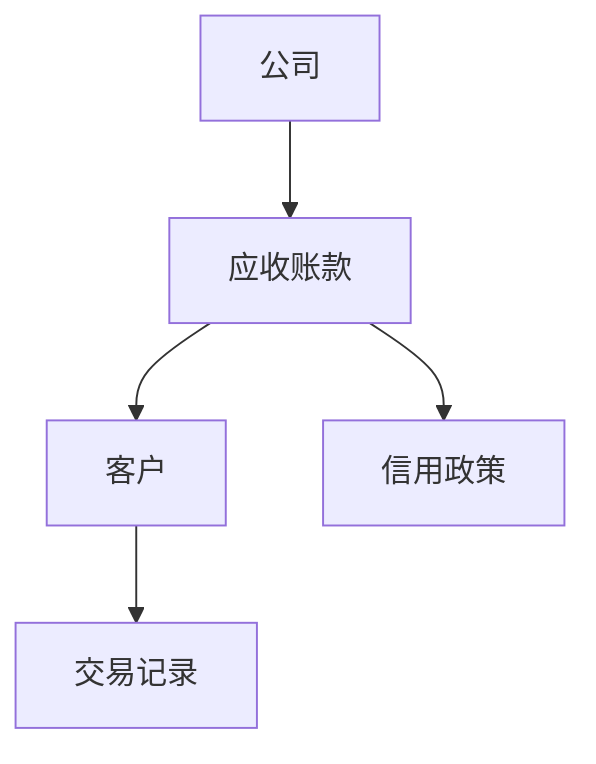
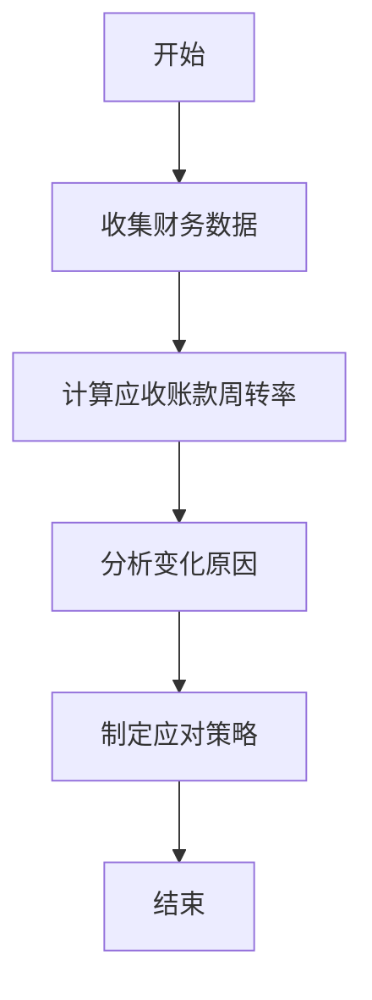

                 


# 彼得林奇对公司应收账款周转率变化的深入分析

> 关键词：彼得林奇，应收账款周转率，财务分析，投资评估，企业风险管理，现金流管理

> 摘要：本文深入分析了彼得林奇对上市公司应收账款周转率变化的关注与研究。通过对应收账款周转率的核心概念、计算公式、影响因素及其变化趋势的系统性探讨，结合实际案例和数学模型，揭示了应收账款周转率变化对企业财务健康状况、投资价值评估及风险控制的重要意义。同时，本文还介绍了基于统计分析和机器学习算法的应收账款周转率预测方法，并提供了完整的系统架构设计和实战项目指导。

---

## 第1章: 公司应收账款周转率变化的背景与重要性

### 1.1 应收账款周转率的定义与意义

#### 1.1.1 应收账款周转率的定义
应收账款周转率（Accounts Receivable Turnover Ratio）是衡量企业应收账款管理效率和资金流动性的重要财务指标。其计算公式为：

$$ \text{应收账款周转率} = \frac{\text{营业收入}}{\text{应收账款平均余额}} $$

#### 1.1.2 应收账款周转率在企业财务管理中的重要性
应收账款周转率反映了企业在一定时期内应收账款的周转效率。高周转率意味着企业能够快速收回账款，改善现金流，降低坏账风险。反之，低周转率可能表明企业存在收款困难，影响资金流动性。

#### 1.1.3 彼得·林奇对财务指标的关注与研究
彼得·林奇作为著名的投资经理和基金经理，长期关注企业的财务指标变化。他认为，应收账款周转率是评估企业运营效率和财务健康的重要指标，尤其是对于销售型和服务型公司。

### 1.2 应收账款周转率变化的背景分析

#### 1.2.1 经济周期对应收账款周转率的影响
经济周期波动直接影响企业的销售和收款能力。在经济繁荣时期，企业应收账款周转率通常较高；而在经济衰退时期，周转率可能下降。

#### 1.2.2 行业特性与企业规模对手应收账款周转率的影响
不同行业和企业规模的公司对应收账款周转率的影响不同。例如，零售行业通常应收账款周转率较高，而制造行业可能较低。此外，大型企业由于客户分散，应收账款周转率可能低于小型企业。

#### 1.2.3 公司内部管理与外部环境的交互作用
公司内部的信用政策、销售策略和应收账款管理能力，与外部经济环境、行业竞争格局共同作用，影响应收账款周转率的变化。

---

## 第2章: 应收账款周转率变化的核心概念与联系

### 2.1 应收账款周转率的核心概念

#### 2.1.1 应收账款周转率的计算公式
$$ \text{应收账款周转率} = \frac{\text{营业收入}}{\text{应收账款平均余额}} $$

#### 2.1.2 应收账款周转率与企业财务健康状况的关系
应收账款周转率高，表明企业资金流动性强，财务健康；反之，则可能面临资金链紧张的风险。

#### 2.1.3 应收账款周转率与企业信用政策的关联
信用政策直接影响应收账款的生成和回收速度。宽松的信用政策可能导致应收账款增加，周转率下降；严格的信用政策则可能减少应收账款，提高周转率。

### 2.2 应收账款周转率变化的核心要素与属性特征

#### 2.2.1 核心要素对比表格
| 核心要素       | 影响方向 | 示例情况                         |
|----------------|----------|---------------------------------|
| 营业收入       | 正向     | 收入增长，周转率提高             |
| 应收账款平均余额 | 负向     | 应收账款增加，周转率下降         |
| 信用政策       | 负向     | 放宽信用政策，应收账款增加       |
| 行业特性       | 不确定   | 零售业周转率高，制造业周转率低     |

#### 2.2.2 应收账款周转率变化的ER实体关系图


### 2.3 应收账款周转率变化的流程图


---

## 第3章: 应收账款周转率变化的统计分析方法

### 3.1 统计分析方法概述

#### 3.1.1 基础统计学概念
统计分析是研究应收账款周转率变化的重要方法。常用的统计指标包括均值、标准差、相关系数等。

#### 3.1.2 应收账款周转率变化的描述性统计分析
通过计算应收账款周转率的均值、标准差等指标，可以了解其波动情况。

#### 3.1.3 假设检验与置信区间
通过假设检验（如t检验）和置信区间分析，可以判断应收账款周转率变化是否具有统计意义。

### 3.2 应收账款周转率变化的回归分析

#### 3.2.1 线性回归模型
线性回归模型用于分析应收账款周转率与其他变量（如营业收入、应收账款平均余额）之间的关系。

$$ y = \beta_0 + \beta_1 x + \epsilon $$

其中，$y$为应收账款周转率，$x$为营业收入，$\beta_0$和$\beta_1$为回归系数，$\epsilon$为误差项。

#### 3.2.2 回归系数的解释与意义
回归系数$\beta_1$表示营业收入每增加1单位，应收账款周转率的预期变化。

#### 3.2.3 回归模型的验证与评估
通过R²值、F检验等方法评估回归模型的拟合优度和显著性。

---

## 第4章: 应收账款周转率变化的机器学习算法

### 4.1 常见机器学习算法简介

#### 4.1.1 线性回归
线性回归是最简单的回归算法，适用于线性关系的预测。

#### 4.1.2 支持向量机
支持向量机（SVM）适用于非线性关系的预测。

#### 4.1.3 随机森林
随机森林是一种基于决策树的集成算法，适用于高维数据的预测。

### 4.2 基于机器学习的应收账款周转率预测

#### 4.2.1 数据预处理
数据预处理包括缺失值处理、特征归一化等。

#### 4.2.2 模型训练与评估
通过训练数据训练模型，并使用测试数据评估模型性能。

#### 4.2.3 模型优化
通过调整超参数优化模型性能。

### 4.3 基于机器学习的应收账款周转率预测代码示例

```python
import pandas as pd
from sklearn.ensemble import RandomForestRegressor
from sklearn.model_selection import train_test_split
from sklearn.metrics import mean_squared_error

# 加载数据
data = pd.read_csv('receivables_turnover.csv')

# 数据预处理
X = data[['营业收入', '应收账款平均余额']]
y = data['应收账款周转率']

# 划分训练集和测试集
X_train, X_test, y_train, y_test = train_test_split(X, y, test_size=0.2, random_state=42)

# 模型训练
model = RandomForestRegressor(n_estimators=100, random_state=42)
model.fit(X_train, y_train)

# 模型预测
y_pred = model.predict(X_test)

# 模型评估
 mse = mean_squared_error(y_test, y_pred)
 print(f"均方误差: {mse}")
```

---

## 第5章: 应收账款周转率变化的系统分析与架构设计

### 5.1 问题场景介绍

#### 5.1.1 问题背景
企业需要实时监控应收账款周转率的变化，以便及时调整信用政策和财务策略。

#### 5.1.2 项目介绍
构建一个基于机器学习的应收账款周转率预测系统。

### 5.2 系统功能设计

#### 5.2.1 领域模型（mermaid类图）


#### 5.2.2 系统架构设计（mermaid架构图）


---

## 第6章: 应收账款周转率变化的项目实战

### 6.1 环境安装

#### 6.1.1 安装Python
```bash
pip install python
```

#### 6.1.2 安装机器学习库
```bash
pip install scikit-learn
```

### 6.2 系统核心实现源代码

#### 6.2.1 数据预处理代码
```python
import pandas as pd
import numpy as np

# 数据加载与清洗
data = pd.read_csv('receivables_turnover.csv')
data.dropna(inplace=True)
```

#### 6.2.2 模型实现代码
```python
from sklearn.ensemble import RandomForestRegressor
from sklearn.model_selection import train_test_split

# 划分数据集
X = data[['营业收入', '应收账款平均余额']]
y = data['应收账款周转率']

X_train, X_test, y_train, y_test = train_test_split(X, y, test_size=0.2, random_state=42)

# 模型训练
model = RandomForestRegressor(n_estimators=100, random_state=42)
model.fit(X_train, y_train)

# 模型预测
y_pred = model.predict(X_test)

# 模型评估
mse = mean_squared_error(y_test, y_pred)
print(f"均方误差: {mse}")
```

### 6.3 项目小结

#### 6.3.1 实战总结
通过项目实战，我们掌握了如何利用机器学习算法预测应收账款周转率的变化。

#### 6.3.2 经验与教训
数据质量直接影响模型性能，因此数据预处理至关重要。

---

## 第7章: 应收账款周转率变化的最佳实践

### 7.1 小结

#### 7.1.1 核心观点总结
应收账款周转率是衡量企业财务健康的重要指标，统计分析和机器学习算法可以有效预测其变化趋势。

#### 7.1.2 关键点回顾
- 统计分析：描述性统计、回归分析
- 机器学习：随机森林、支持向量机
- 系统设计：模块化设计、架构优化

### 7.2 注意事项

#### 7.2.1 数据质量控制
确保数据的准确性和完整性。

#### 7.2.2 模型选择与优化
根据数据特点选择合适的模型，并通过交叉验证优化参数。

### 7.3 拓展阅读

#### 7.3.1 推荐书籍
- 《彼得·林奇的投资哲学》
- 《财务报表分析与投资决策》

#### 7.3.2 推荐博客与资源
- [Kaggle - 财务数据分析](https://www.kaggle.com/)

---

## 作者信息

作者：AI天才研究院/AI Genius Institute & 禅与计算机程序设计艺术 /Zen And The Art of Computer Programming

