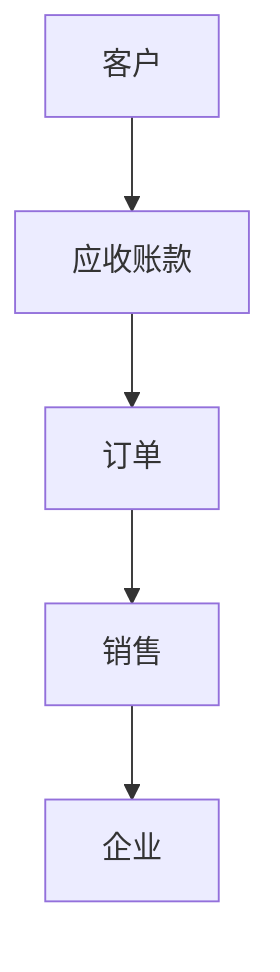
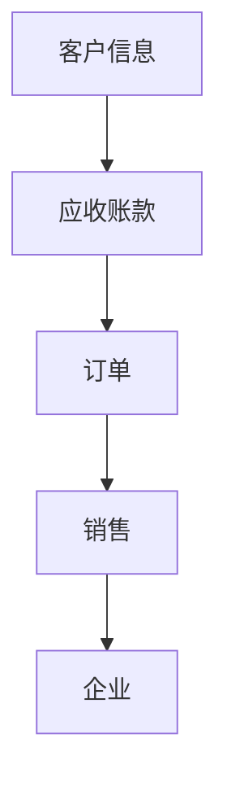

                 

<think>
嗯，用户希望我根据之前的对话，撰写一个关于彼得·林奇对公司应收账款管理看法的技术博客。首先，我需要明确彼得·林奇的投资风格和他如何看待应收账款管理。他注重基本面分析，尤其是成长型股票，所以他可能会关注应收账款的质量和周转率。

接下来，我需要考虑博客的结构。用户提供了大纲，包括背景介绍、核心概念、算法原理、系统分析等部分。我应该先写背景，解释应收账款的重要性，然后深入分析彼得·林奇的观点，接着用图表和示例来说明他的方法，最后总结应用这些观点的实际案例。

在撰写过程中，我可能会遗漏一些细节，比如具体的数据分析或者如何将应收账款管理与投资决策结合起来。我需要确保每个部分都有足够的例子和图表来支持论点，比如使用ER图和流程图来展示应收账款的生命周期。

此外，我应该注意文章的逻辑是否连贯，每个部分是否紧密相连，确保读者能够一步步理解彼得·林奇的思路。最后，总结部分要突出应收账款管理在投资中的重要性，并给出实际应用的建议。
</think>

# 彼得林奇对公司应收账款管理的看法

## 关键词：彼得·林奇，应收账款管理，投资决策，财务分析，现金流

## 摘要：  
彼得·林奇作为全球著名投资经理，以其独特的成长股投资策略闻名。本文从投资管理的角度，探讨彼得·林奇如何审视和管理公司应收账款。通过分析应收账款的核心概念、质量评估、对投资决策的影响，以及构建应收账款管理的分析模型，结合实际案例，深入解读彼得·林奇在应收账款管理中的独特见解和投资策略。

---

# 第一部分：彼得·林奇与应收账款管理的背景介绍

## 第1章：应收账款管理的核心概念

### 1.1 应收账款管理的定义与重要性

#### 1.1.1 应收账款的基本概念
应收账款是指企业在赊销商品或服务后，客户欠企业的款项。它是企业流动资产的重要组成部分，反映了企业与客户的信用交易关系。

#### 1.1.2 应收账款在企业中的作用
- **支持企业运营**：应收账款是企业资金流的重要来源，支持企业的日常运营和扩张。
- **评估企业信用政策**：应收账款的管理体现了企业的信用政策和风险控制能力。
- **影响财务健康**：应收账款的质量直接关系到企业的财务健康和投资价值。

#### 1.1.3 应收账款管理的核心目标
- **加快收款速度**：缩短应收账款周转天数，提高资金使用效率。
- **降低坏账风险**：通过科学的评估和管理，减少坏账损失。
- **优化现金流**：确保企业有足够的现金流支持运营和发展。

### 1.2 彼得·林奇与投资管理的关联

#### 1.2.1 彼得·林奇的投资风格概述
彼得·林奇是美国著名投资经理，管理富达麦哲伦基金期间取得了卓越的业绩。他注重成长股投资，关注企业的基本面和财务健康，尤其是企业的盈利能力和现金流情况。

#### 1.2.2 投资管理中的财务分析基础
彼得·林奇在投资决策中，常常通过分析企业的财务报表，尤其是资产负债表和利润表，来评估企业的财务健康和成长潜力。

#### 1.2.3 应收账款管理对投资决策的影响
应收账款是企业财务健康的重要指标。彼得·林奇会通过分析应收账款的质量和周转情况，判断企业的信用管理和资金流动性，进而评估企业的投资价值。

---

## 第2章：应收账款管理的背景与问题背景

### 2.1 应收账款管理的现状分析

#### 2.1.1 应收账款管理的常见问题
- **应收账款周转率低**：部分企业由于信用政策宽松，应收账款回收周期过长。
- **坏账风险高**：企业对应收账款的评估不够严格，导致坏账损失增加。
- **管理手段落后**：部分企业缺乏先进的应收账款管理系统，管理效率低下。

#### 2.1.2 企业应收账款管理的挑战
- **市场竞争加剧**：企业为了扩大销售，往往放宽信用政策，导致应收账款风险上升。
- **经济波动影响**：经济下行周期中，客户的还款能力下降，应收账款管理难度增加。
- **信息化管理不足**：部分企业未充分利用信息技术，难以实时监控应收账款状态。

#### 2.1.3 应收账款管理的边界与外延
应收账款管理不仅包括账款的回收，还涉及信用评估、风险控制和信息化管理等多个方面。其外延还包括企业与客户的关系管理，以及与企业整体财务战略的结合。

### 2.2 问题背景与问题描述

#### 2.2.1 应收账款管理中的主要问题
- **应收账款质量不佳**：部分应收账款账龄长、回收难度大。
- **坏账准备不足**：企业对应收账款的坏账计提比例过低，导致财务报表失真。
- **管理手段单一**：部分企业仍采用传统的手工管理方式，效率低下。

#### 2.2.2 问题解决的关键点
- **优化信用政策**：制定合理的信用政策，平衡销售增长与应收账款风险。
- **加强信息化管理**：引入先进的信息化管理系统，实时监控应收账款状态。
- **建立风险评估机制**：通过风险评估，识别高风险客户，降低坏账风险。

#### 2.2.3 应收账款管理的核心要素组成
- **信用评估**：对客户的信用状况进行评估，制定合理的赊销政策。
- **应收账款跟踪**：实时跟踪应收账款的回收情况，及时发现和解决问题。
- **坏账管理**：建立坏账计提和核销机制，确保财务报表的准确性。

---

## 第3章：应收账款管理的核心概念与联系

### 3.1 核心概念的原理分析

#### 3.1.1 应收账款的生命周期
应收账款从产生到回收，经历了信用评估、赊销、跟踪、收款等多个阶段，每个阶段都需要严格的管理和控制。

#### 3.1.2 应收账款与企业现金流的关系
应收账款的回收速度直接影响企业的现金流。加快应收账款周转速度，可以提高企业的流动性，增强企业的财务健康。

#### 3.1.3 应收账款管理的内在逻辑
通过科学的信用评估和严格的管理流程，确保应收账款的回收，降低坏账风险，从而提高企业的资金使用效率和财务健康。

### 3.2 核心概念的属性特征对比

#### 3.2.1 应收账款与应付账款的对比分析
| 属性       | 应收账款                | 应付账款                |
|------------|------------------------|-------------------------|
| 定义       | 企业应收取的款项        | 企业应支付的款项        |
| 归属       | 资产                    | 负债                    |
| 管理目标    | 加快回收                | 及时支付                |
| 风险       | 坏账风险                | 付款延迟风险            |

#### 3.2.2 应收账款与存货的对比分析
| 属性       | 应收账款                | 存货                    |
|------------|------------------------|-------------------------|
| 定义       | 应收客户款项            | 企业尚未售出的库存      |
| 归属       | 资产                    | 资产                    |
| 管理目标    | 加快回收                | 优化库存周转            |
| 风险       | 坏账风险                | 存货贬值风险            |

#### 3.2.3 应收账款与投资性资产的对比分析
| 属性       | 应收账款                | 投资性资产              |
|------------|------------------------|-------------------------|
| 定义       | 应收客户款项            | 投资产生的资产          |
| 归属       | 资产                    | 资产                    |
| 管理目标    | 加快回收                | 保值增值                |
| 风险       | 坏账风险                | 市场风险                |

### 3.3 ER实体关系图架构



---

## 第4章：应收账款管理的算法原理讲解

### 4.1 应收账款周转率计算

#### 4.1.1 公式
$$\text{应收账款周转率} = \frac{\text{营业收入}}{\text{应收账款平均余额}}$$

#### 4.1.2 计算步骤
1. 计算应收账款的平均余额：$$\text{应收账款平均余额} = \frac{\text{期初应收账款} + \text{期末应收账款}}{2}$$
2. 计算应收账款周转率：$$\text{应收账款周转率} = \frac{\text{营业收入}}{\text{应收账款平均余额}}$$

#### 4.1.3 示例分析
假设某企业2022年的营业收入为1000万元，期初应收账款为500万元，期末应收账款为600万元。
- 应收账款平均余额 = (500 + 600) / 2 = 550万元
- 应收账款周转率 = 1000 / 550 ≈ 1.82

---

## 第5章：应收账款管理的系统分析与架构设计

### 5.1 问题场景介绍

#### 5.1.1 应收账款管理的典型场景
- 客户赊购商品或服务，形成应收账款。
- 应收账款回收延迟，影响企业现金流。
- 客户出现财务问题，导致应收账款无法回收。

#### 5.1.2 系统功能需求概述
- **客户信用评估**：通过数据分析，评估客户的信用状况。
- **应收账款跟踪**：实时监控应收账款的回收情况。
- **坏账管理**：识别和处理坏账，计提坏账准备。

#### 5.1.3 系统目标与范围
- 优化应收账款管理流程，提高收款效率。
- 降低坏账风险，确保财务报表的准确性。
- 提供实时数据支持，辅助投资决策。

### 5.2 系统架构设计

#### 5.2.1 领域模型



---

## 第6章：项目实战

### 6.1 环境安装

#### 6.1.1 系统环境
- 操作系统：Windows 10 或更高版本
- 开发工具：Python 3.8 或更高版本，Jupyter Notebook
- 数据库：MySQL 8.0 或更高版本

### 6.2 系统核心实现源代码

#### 6.2.1 应收账款周转率计算代码

```python
def calculate_ar_turnover(revenue, ar_average):
    return revenue / ar_average
```

#### 6.2.2 坏账准备计提代码

```python
def calculate_bad_debt(ar_balance, bad_debt_ratio):
    return ar_balance * bad_debt_ratio
```

### 6.3 代码应用解读与分析

#### 6.3.1 应收账款周转率计算
通过上述代码，我们可以快速计算出应收账款的周转率，评估企业的收款效率。

#### 6.3.2 坏账准备计提
根据企业的坏账计提比例，我们可以计算出坏账准备金额，确保财务报表的准确性。

### 6.4 实际案例分析和详细讲解剖析

#### 6.4.1 案例背景
某制造企业2022年的营业收入为1000万元，期初应收账款为500万元，期末应收账款为600万元，坏账计提比例为2%。

#### 6.4.2 应收账款周转率计算
$$\text{应收账款周转率} = \frac{1000}{(500 + 600) / 2} = \frac{1000}{550} ≈ 1.82$$

#### 6.4.3 坏账准备计提
$$\text{坏账准备} = 600 \times 0.02 = 12 \text{万元}$$

---

## 第7章：总结与最佳实践

### 7.1 总结
彼得·林奇在投资管理中，非常重视企业的应收账款管理。通过分析应收账款的周转率和坏账准备，他能够准确评估企业的财务健康和投资价值。

### 7.2 最佳实践 tips
- **优化信用政策**：制定合理的信用政策，平衡销售增长与应收账款风险。
- **加强信息化管理**：引入先进的信息化管理系统，实时监控应收账款状态。
- **建立风险评估机制**：通过风险评估，识别高风险客户，降低坏账风险。

### 7.3 小结
应收账款管理是企业财务健康的重要组成部分，也是投资决策的重要依据。通过科学的管理和分析，企业可以有效降低坏账风险，提高资金使用效率，为投资决策提供有力支持。

### 7.4 注意事项
- **及时更新数据**：应收账款数据需要及时更新，确保分析结果的准确性。
- **加强内部审计**：定期进行内部审计，发现和解决应收账款管理中的问题。

### 7.5 拓展阅读
- 《彼得·林奇的投资哲学》
- 《财务报表分析与投资决策》
- 《企业应收账款管理实务》

---

## 作者：AI天才研究院/AI Genius Institute & 禅与计算机程序设计艺术 /Zen And The Art of Computer Programming

