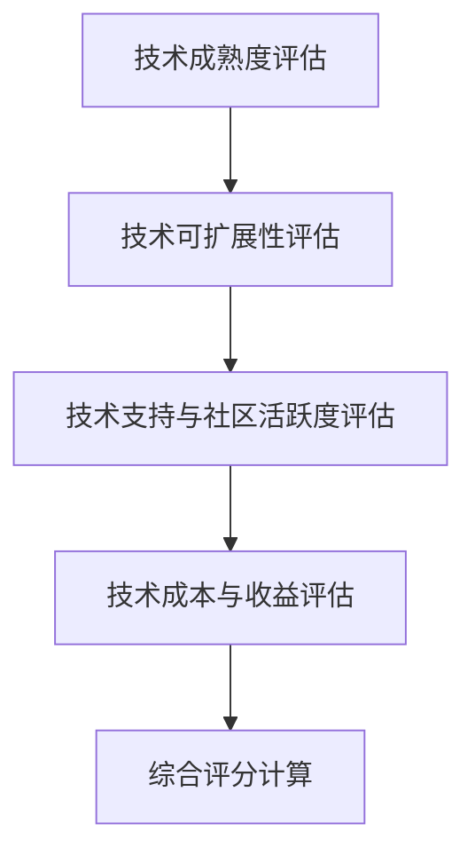
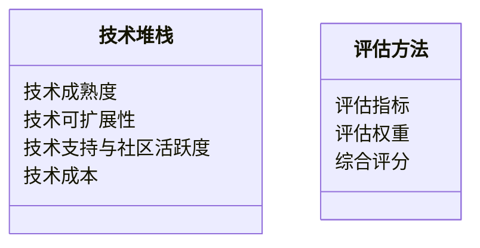
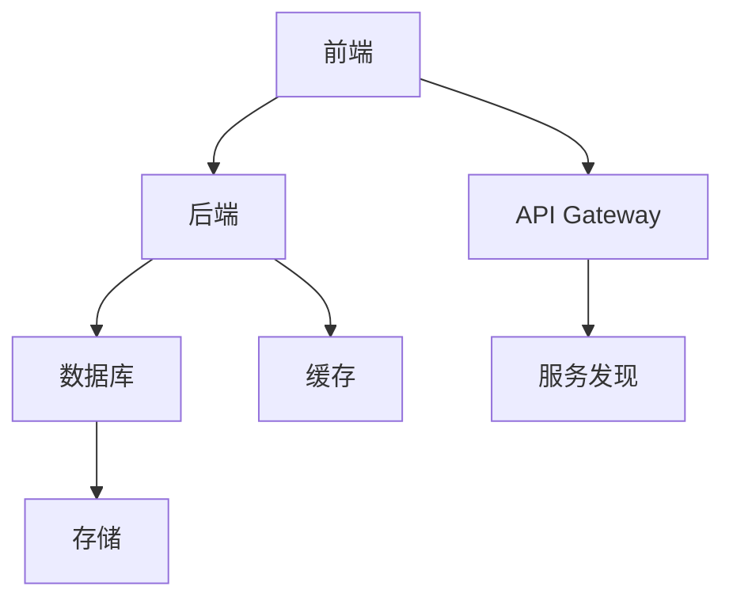

                 


# 彼得林奇对公司技术堆栈的评估方法

## 关键词：技术堆栈, 彼得·林奇, 评估方法, 算法原理, 系统架构, 项目实战

## 摘要：本文通过分析彼得·林奇的投资评估方法，探讨其在公司技术堆栈评估中的应用。文章详细介绍了技术堆栈的核心概念，分析了彼得·林奇评估方法的算法原理，并通过实际案例展示了如何将该方法应用于系统设计和项目实战中。最终，本文总结了最佳实践和注意事项，为技术人员和管理者提供了有价值的指导。

---

## 第一部分：技术堆栈与公司评估的背景介绍

### 第1章：技术堆栈的基本概念

#### 1.1 技术堆栈的定义与组成
- 技术堆栈是指构建一个软件系统所需的所有技术和工具的组合。
- 组成部分包括开发工具、编程语言、框架、数据库、服务器、云服务等。

#### 1.2 技术堆栈的核心要素
- 开发工具：如IDE、版本控制系统（Git）、构建工具（Jenkins、Gradle）。
- 编程语言：如Java、Python、JavaScript等。
- 框架：如Spring、Django、React等。
- 数据库：如MySQL、MongoDB、Redis等。
- 服务器和部署环境：如Apache、Nginx、Docker、Kubernetes等。

#### 1.3 技术堆栈的演进与发展趋势
- 技术堆栈随着软件开发方法的演进而变化，从传统的单体架构到微服务架构，从本地部署到云原生部署。
- 开源技术的普及和社区支持成为技术堆栈选择的重要因素。

### 第2章：公司技术堆栈评估的背景与意义

#### 2.1 技术堆栈评估的背景
- 公司在选择技术堆栈时，需要考虑技术的成熟度、可扩展性、成本、维护难度等因素。
- 技术堆栈的选择直接影响开发效率、系统性能和公司的长期发展。

#### 2.2 彼得·林奇方法在技术堆栈评估中的应用
- 彼得·林奇的投资方法强调对公司的基本面分析，注重长期价值。
- 将其应用于技术堆栈评估，可以帮助公司做出更明智的技术决策。

---

## 第二部分：彼得·林奇评估方法的核心概念

### 第3章：技术堆栈评估的核心要素

#### 3.1 技术成熟度
- 技术成熟度是指技术在市场上的普及程度和稳定性。
- 通过技术的发布时间、使用案例、社区支持等指标来评估。

#### 3.2 技术可扩展性
- 技术可扩展性是指技术在不同规模和复杂度下的适应能力。
- 通过技术的架构设计、支持的平台数量、可扩展的接口等指标来评估。

#### 3.3 技术支持与社区活跃度
- 技术支持包括官方文档、技术支持服务、社区帮助等。
- 社区活跃度可以通过GitHub仓库的star数、fork数、issue响应速度等指标来衡量。

#### 3.4 技术的成本与收益比
- 成本包括 licensing成本、维护成本、培训成本等。
- 收益包括提高开发效率、系统性能、用户体验等。

### 第4章：彼得·林奇评估方法的原理

#### 4.1 技术堆栈评估的逻辑框架
- 通过分析技术的成熟度、可扩展性、支持与社区活跃度、成本与收益比等维度，综合评估技术堆栈的优劣。
- 结合公司的具体需求和战略目标，选择最合适的技术堆栈。

#### 4.2 技术堆栈评估的流程
1. 确定评估目标：明确评估的核心需求和目标。
2. 收集数据：收集相关技术的信息，包括技术成熟度、可扩展性、社区支持等。
3. 综合评估：根据权重分配，计算技术堆栈的整体评分。
4. 优化调整：根据评估结果，优化技术堆栈，确保其与公司战略目标一致。

---

## 第三部分：算法原理与技术堆栈评估

### 第5章：技术堆栈评估的数学模型与公式

#### 5.1 技术成熟度的评估公式
$$ 成熟度 = \frac{代码仓库年龄 + 社区活跃度}{2} $$
- 代码仓库年龄：GitHub仓库的创建时间，单位为年。
- 社区活跃度：GitHub仓库的star数和fork数之和。

#### 5.2 技术可扩展性的评估公式
$$ 可扩展性 = \frac{支持的平台数量 + 第三方插件数量}{2} $$
- 支持的平台数量：技术在不同操作系统、云平台上的支持情况。
- 第三方插件数量：技术的生态系统中可扩展的插件数量。

#### 5.3 技术成本的评估公式
$$ 成本 = \frac{licensing成本 + 维护成本}{2} $$
- licensing成本：购买技术的许可证费用。
- 维护成本：技术维护和升级的费用。

### 第6章：技术堆栈评估的流程图


---

## 第四部分：系统分析与架构设计

### 第7章：问题场景介绍

#### 7.1 问题场景
- 某公司需要选择一种新的前端框架，用于构建其Web应用。
- 公司需求：高性能、易维护、社区支持好。

### 第8章：系统功能设计

#### 8.1 系统功能设计
- 需要实现一个基于React的前端框架，结合Node.js和MongoDB构建后端服务。
- 使用Docker进行容器化部署，结合Kubernetes进行 orchestration。

#### 8.2 领域模型设计


### 第9章：系统架构设计

#### 9.1 系统架构设计


---

## 第五部分：项目实战

### 第10章：环境安装与核心代码实现

#### 10.1 环境安装
- 安装Node.js、React、MongoDB、Docker、Kubernetes。

#### 10.2 核心代码实现
```javascript
// 前端React组件
function App() {
  const [data, setData] = useState([]);
  useEffect(() => {
    fetch('/api/data')
      .then(res => res.json())
      .then(data => setData(data));
  }, []);
  return (
    <div>
      <h1>技术堆栈评估</h1>
      <ul>
        {data.map(item => (
          <li key={item.id}>{item.name}</li>
        ))}
      </ul>
    </div>
  );
}
```

#### 10.3 代码应用解读
- React组件用于展示技术堆栈评估结果。
- API Gateway负责处理前端请求，后端服务负责数据处理和存储。

### 第11章：案例分析与详细解读

#### 11.1 案例分析
- 某公司选择了React作为前端框架，结合Node.js和MongoDB构建后端服务。
- 评估结果显示，React的技术成熟度高，社区支持好，可扩展性强。

#### 11.2 详细解读
- React的生态系统丰富，拥有大量的第三方插件和社区支持。
- Node.js的事件驱动架构适合高并发场景。
- MongoDB的NoSQL特性适合数据结构复杂的应用。

---

## 第六部分：总结与展望

### 第12章：最佳实践与注意事项

#### 12.1 最佳实践
- 定期评估技术堆栈，根据公司需求和市场变化进行调整。
- 选择开源技术时，关注社区活跃度和维护情况。
- 在评估技术成本时，考虑隐性成本（如培训成本、维护成本）。

#### 12.2 注意事项
- 避免盲目追求新技术，确保技术的成熟度和稳定性。
- 在选择技术堆栈时，结合公司的技术能力和团队资源。
- 定期进行技术培训和知识分享，提升团队的技术水平。

### 第13章：小结与展望

#### 13.1 小结
- 本文通过分析彼得·林奇的投资评估方法，探讨了其在技术堆栈评估中的应用。
- 提供了技术堆栈评估的核心要素、算法原理和实际案例分析。

#### 13.2 展望
- 未来，随着技术的不断发展，技术堆栈评估方法也将不断创新和优化。
- 建议技术人员和管理者结合公司实际情况，灵活运用技术堆栈评估方法，为公司创造更大的价值。

---

## 作者：AI天才研究院 & 禅与计算机程序设计艺术

