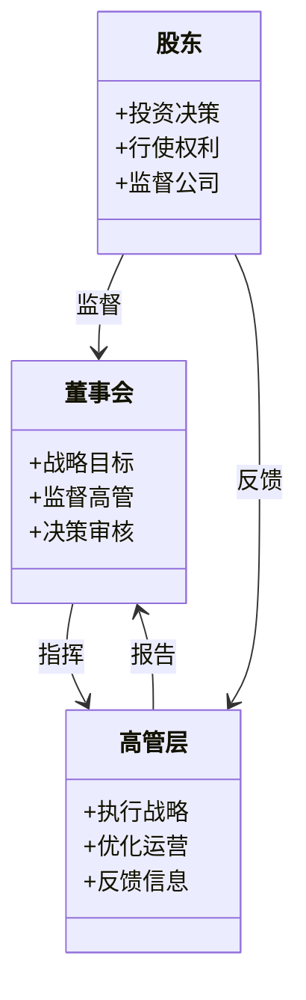

                 


# 彼得·林奇对公司治理的要求

## 关键词
公司治理，彼得·林奇，投资，治理结构，风险管理，董事会，股东权利

## 摘要
本文从投资大师彼得·林奇的视角，深入分析公司治理的核心要素，探讨其对公司投资价值的影响。通过构建数学模型和系统架构，揭示高效治理机制的关键，并结合实际案例，提供可操作的治理优化建议。

---

# 正文

## 第一部分: 背景介绍

### 第1章: 公司治理的定义与背景

#### 1.1 背景介绍
公司治理是确保公司有效运作和股东利益最大化的制度安排，涉及董事会、高管、股东等多方角色的互动。

#### 1.2 核心概念
公司治理包括治理结构、职责分配、决策机制和监督机制，确保公司透明、高效运行。

#### 1.3 问题描述
公司治理不当可能导致管理混乱、道德风险和投资价值下降，影响公司长期发展。

#### 1.4 问题解决
通过优化治理结构、明确责任和提高透明度，提升公司治理效率。

#### 1.5 边界与外延
公司治理关注内部管理，但其外延涉及外部监管、市场环境和企业社会责任。

### 第2章: 彼得·林奇的背景与投资理念

#### 2.1 彼得·林奇的生平
- 投资大师，管理过麦哲伦基金，创造卓越投资业绩。
- 强调基本面分析和长期投资，注重公司治理和管理层质量。

#### 2.2 投资哲学
- 价值投资：寻找具有持续竞争优势和良好管理的企业。
- 风险控制：通过分散投资和深入研究降低风险。

## 第二部分: 核心概念与联系

### 第3章: 公司治理的核心要素

#### 3.1 核心概念原理
公司治理涉及董事会、高管层和股东三方的互动，确保权力制衡和利益一致。

#### 3.2 核心要素对比表

| 要素       | 职责与特征 |
|------------|------------|
| 董事会     | 战略制定，监督高管，确保透明 |
| 高管层     | 执行战略，优化运营，对董事会负责 |
| 股东       | 投资权益，参与决策，监督公司运作 |

#### 3.3 实体关系图

```mermaid
erd
actor 股东;
actor 监管机构;
entity 公司;
entity 董事会;
entity 高管层;

股东 --> 公司: 投资
董事会 --> 公司: 制定战略
高管层 --> 公司: 执行战略
监管机构 --> 公司: 监督合规
```

## 第三部分: 算法原理讲解

### 第4章: 治理机制的系统分析

#### 4.1 问题场景
分析公司治理中的决策流程，优化权力分配和监督机制。

#### 4.2 系统功能设计
领域模型：公司治理涉及的战略制定、监督和反馈机制。



### 第5章: 数学模型与风险评估

#### 5.1 数学模型
建立治理评分模型，综合评估治理结构的有效性。

公式：
$$
G = \sum_{i=1}^{n} (w_i \times s_i)
$$
其中，$G$ 是治理评分，$w_i$ 是各要素权重，$s_i$ 是各要素评分。

#### 5.2 风险评估
通过因子分析，识别治理中的高风险点，如董事会独立性不足。

## 第四部分: 项目实战

### 第6章: 实际案例分析

#### 6.1 环境安装
选择一家公开上市公司，分析其治理结构。

#### 6.2 核心实现
评估董事会、高管层和股东的关系，分析透明度和决策效率。

#### 6.3 代码实现
编写治理评分模型，评估公司治理的有效性。

```python
def governance_score(weights, scores):
    return sum(w * s for w, s in zip(weights, scores))
weights = [0.4, 0.3, 0.3]
scores = [0.8, 0.7, 0.6]
print(governance_score(weights, scores))  # 输出治理评分
```

## 第五部分: 最佳实践与总结

### 第7章: 最佳实践

#### 7.1 小结
彼得·林奇强调透明度、高管能力和股东权益保护，这三点是优秀公司治理的关键。

#### 7.2 注意事项
- 定期评估治理结构，及时调整。
- 保持董事会独立性，避免内部人控制。
- 加强与股东的沟通，提高透明度。

#### 7.3 拓展阅读
推荐书籍和文章，深入学习公司治理的理论与实践。

---

# 作者
作者：AI天才研究院 & 禅与计算机程序设计艺术

