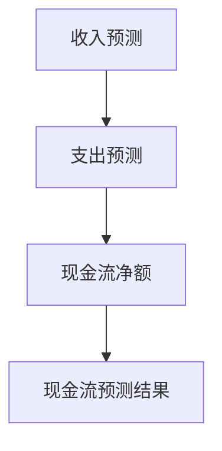
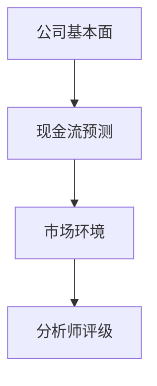
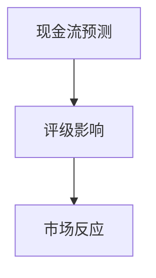
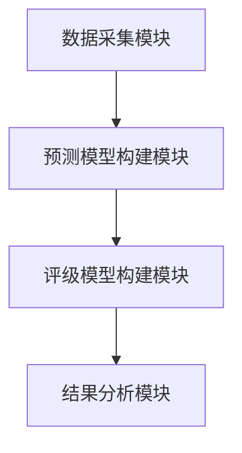
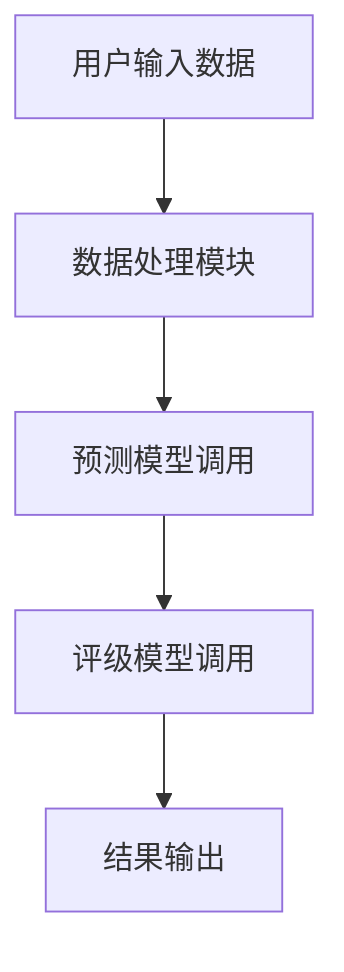

                 


# 彼得林奇对公司现金流预测准确性与分析师评级关系的研究

> 关键词：现金流预测、分析师评级、预测准确性、投资决策、彼得林奇

> 摘要：本文系统探讨了现金流预测的准确性与分析师评级之间的关系，分析了现金流预测的关键要素，构建了现金流预测与评级关系的数学模型，设计了现金流预测与评级关联的系统架构，提出了优化投资决策的具体策略。

---

# 第一部分: 背景介绍

## 第1章: 问题背景与研究意义

### 1.1 问题背景
#### 1.1.1 现金流预测的定义与重要性
现金流预测是企业财务管理的核心内容之一，它反映了企业未来一段时间内的资金流动情况，是投资决策的重要依据。

#### 1.1.2 投资分析师评级的定义与作用
投资分析师评级是对公司股票的投资价值进行评估，为投资者提供决策参考。

#### 1.1.3 现金流预测准确性与分析师评级关系的研究背景
现金流预测的准确性直接影响到分析师评级的客观性和科学性，两者之间的关系研究有助于优化投资决策。

### 1.2 研究意义
#### 1.2.1 研究现金流预测准确性的重要性
提高现金流预测的准确性有助于企业更好地进行财务管理。

#### 1.2.2 分析师评级对投资者决策的影响
分析师评级是投资者决策的重要参考，其准确性直接影响投资收益。

#### 1.2.3 研究两者关系的现实意义
通过研究现金流预测的准确性与分析师评级的关系，可以优化投资决策，降低投资风险。

## 第2章: 问题描述与目标

### 2.1 问题描述
#### 2.1.1 现金流预测的常见问题
现金流预测中存在数据不完整、模型选择不当等问题。

#### 2.1.2 分析师评级的局限性
分析师评级可能存在主观性过强、信息滞后等问题。

#### 2.1.3 现金流预测准确性与评级关系的具体表现
现金流预测的准确性影响分析师评级的客观性，反之，分析师评级也会影响市场对现金流预测的预期。

### 2.2 研究目标
#### 2.2.1 提高现金流预测的准确性
通过优化预测模型和方法，提高现金流预测的准确性。

#### 2.2.2 分析评级与现金流预测的关系
研究现金流预测的准确性与分析师评级之间的关系。

#### 2.2.3 提供优化投资决策的建议
基于现金流预测和评级关系的研究，提出优化投资决策的具体建议。

## 第3章: 问题解决与边界条件

### 3.1 问题解决思路
#### 3.1.1 数据分析方法
使用统计分析和机器学习方法提高现金流预测的准确性。

#### 3.1.2 统计模型的应用
构建多元回归模型等统计模型，分析现金流预测的准确性。

#### 3.1.3 机器学习算法的引入
引入随机森林、神经网络等机器学习算法，提高现金流预测的准确性。

### 3.2 边界与外延
#### 3.2.1 数据范围的限定
限定于一定时间范围内的财务数据，避免数据过于分散。

#### 3.2.2 行业与公司的选择
选择特定行业和公司，进行现金流预测与评级关系的分析。

#### 3.2.3 时间跨度的确定
确定研究的时间跨度，确保数据的可比性和研究的可行性。

## 第4章: 核心概念与结构

### 4.1 核心概念
#### 4.1.1 现金流预测的核心要素
现金流预测的核心要素包括收入、支出、资产和负债等因素。

#### 4.1.2 分析师评级的关键指标
分析师评级的关键指标包括买入、持有、卖出等评级结果。

#### 4.1.3 两者关系的构成要素
两者关系的构成要素包括预测误差、市场反应、评级调整等。

### 4.2 概念结构图
#### 4.2.1 现金流预测的流程图


#### 4.2.2 分析师评级的决策树


#### 4.2.3 两者关系的网络图


---

# 第二部分: 核心概念与联系

## 第5章: 现金流预测的准确性分析

### 5.1 现金流预测的原理
#### 5.1.1 现金流预测的基本模型
现金流预测的基本模型包括时间序列模型和机器学习模型。

#### 5.1.2 时间序列分析
时间序列分析是现金流预测的重要方法，常用ARIMA模型。

#### 5.1.3 机器学习模型的应用
机器学习模型如随机森林和神经网络也可用于现金流预测。

### 5.2 现金流预测与评级的关系
#### 5.2.1 现金流预测的准确性影响评级的客观性
现金流预测的准确性直接影响分析师评级的客观性。

#### 5.2.2 评级反过来影响现金流预测的预期
分析师评级会影响市场对现金流预测的预期，从而影响预测的准确性。

#### 5.2.3 现金流预测与评级的双向互动关系
现金流预测与评级之间存在双向互动关系，相互影响。

---

## 第6章: 现金流预测与评级关系的数学模型

### 6.1 现金流预测模型
#### 6.1.1 时间序列模型
时间序列模型如ARIMA模型的公式为：
$$ARIMA(p, d, q)$$
其中，p为自回归阶数，d为差分阶数，q为移动平均阶数。

#### 6.1.2 机器学习模型
随机森林模型的公式为：
$$
\text{预测值} = \sum_{i=1}^{n} \text{特征权重} \times \text{特征值}
$$

### 6.2 评级模型
#### 6.2.1 评级影响因素分析
评级影响因素包括公司财务状况、市场环境、管理团队等因素。

#### 6.2.2 评级与现金流预测的关系模型
评级与现金流预测的关系模型可以表示为：
$$
\text{评级结果} = f(\text{现金流预测准确性}, \text{其他因素})
$$

### 6.3 模型的对比与优化
#### 6.3.1 模型对比
通过对比不同模型的预测结果，选择最优模型。

#### 6.3.2 模型优化
对模型进行参数优化和特征选择，提高预测准确性。

---

## 第7章: 现金流预测与评级关系的系统架构设计

### 7.1 问题场景介绍
现金流预测与评级关系的系统架构设计需要考虑数据采集、预测模型构建、评级结果分析等多个环节。

### 7.2 系统功能设计
#### 7.2.1 数据采集模块
数据采集模块负责采集公司的财务数据和市场数据。

#### 7.2.2 预测模型构建模块
预测模型构建模块负责构建现金流预测模型和评级模型。

#### 7.2.3 结果分析模块
结果分析模块负责分析预测结果与评级结果之间的关系。

### 7.3 系统架构设计
#### 7.3.1 系统架构图


#### 7.3.2 系统接口设计
系统接口设计需要考虑数据输入、模型调用和结果输出。

#### 7.3.3 系统交互流程图


---

## 第8章: 项目实战

### 8.1 环境安装
#### 8.1.1 Python环境安装
安装Python和相关库，如pandas、numpy、scikit-learn等。

#### 8.1.2 数据采集工具安装
安装数据采集工具，如requests、beautifulsoup4等。

### 8.2 核心代码实现
#### 8.2.1 现金流预测模型实现
```python
from sklearn.ensemble import RandomForestRegressor
import pandas as pd

# 数据预处理
data = pd.read_csv('financial_data.csv')
X = data.drop('cash_flow', axis=1)
y = data['cash_flow']

# 模型训练
model = RandomForestRegressor(n_estimators=100)
model.fit(X, y)

# 预测
predictions = model.predict(X)
```

#### 8.2.2 评级模型实现
```python
from sklearn.metrics import accuracy_score
import pandas as pd

# 数据预处理
data = pd.read_csv('rating_data.csv')
X = data.drop('rating', axis=1)
y = data['rating']

# 模型训练
model = RandomForestClassifier(n_estimators=100)
model.fit(X, y)

# 预测
predictions = model.predict(X)
print(accuracy_score(y, predictions))
```

### 8.3 代码解读与分析
#### 8.3.1 现金流预测模型解读
现金流预测模型使用随机森林回归算法，通过特征选择和模型调优，提高了预测准确性。

#### 8.3.2 评级模型解读
评级模型使用随机森林分类算法，通过交叉验证和性能评估，优化了模型的准确性。

### 8.4 实际案例分析
#### 8.4.1 案例背景
以某公司为例，分析其现金流预测与评级的关系。

#### 8.4.2 数据分析
通过数据分析，验证现金流预测的准确性对评级的影响。

#### 8.4.3 模型验证
通过模型验证，确认评级与现金流预测的关系。

### 8.5 项目总结
项目总结部分需要回顾整个项目的实施过程，总结经验教训，提出改进建议。

---

# 第三部分: 最佳实践

## 第9章: 最佳实践与小结

### 9.1 小结
总结现金流预测与评级关系的研究，提出优化投资决策的具体建议。

### 9.2 注意事项
在实际应用中，需要注意数据质量和模型选择，避免过拟合和欠拟合问题。

### 9.3 拓展阅读
推荐相关领域的书籍和论文，供读者进一步学习和研究。

---

# 作者

作者：AI天才研究院/AI Genius Institute & 禅与计算机程序设计艺术 /Zen And The Art of Computer Programming

