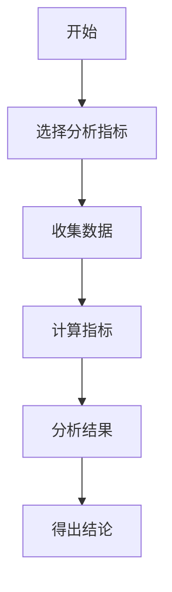
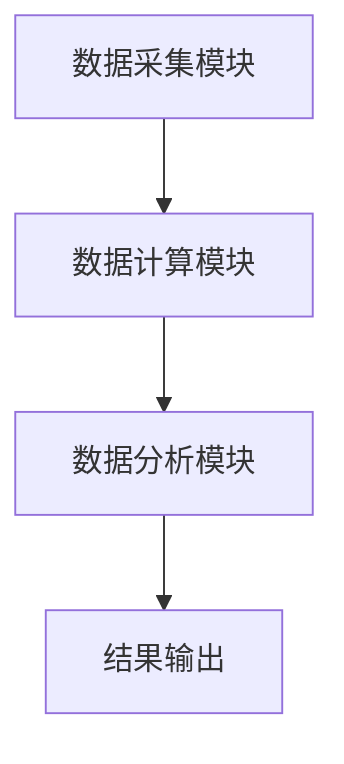
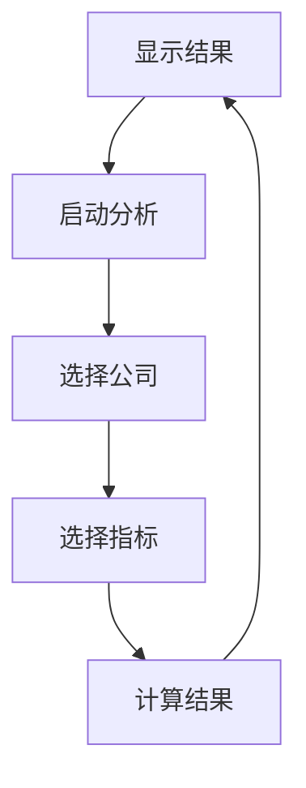

                 


```markdown
# 彼得林奇对公司盈利质量的分析方法

## 关键词：彼得林奇，盈利质量，投资分析，财务指标，投资策略

## 摘要：本文详细探讨了彼得·林奇对公司盈利质量的分析方法，从核心概念、数学模型到系统架构和项目实战，全面解析了如何通过盈利质量分析来评估公司财务健康状况和投资价值。文章结合理论与实践，提供了丰富的案例和代码示例，帮助读者掌握这一经典的金融分析方法。

---

# 第一部分: 盈利质量分析的背景与核心概念

## 第1章: 盈利质量分析的背景与意义

### 1.1 什么是盈利质量
#### 1.1.1 盈利质量的定义
盈利质量是指公司通过其经营活动中产生的利润的质量，包括利润的来源、稳定性、可持续性以及与公司资产和股东权益的匹配程度。它是衡量公司财务健康和投资价值的重要指标。

#### 1.1.2 盈利质量与公司财务健康的关系
盈利质量高的公司通常具有稳定的收入来源、高效的资产利用和良好的成本控制能力。这些公司能够在不同经济周期中保持较高的盈利能力，从而为股东创造长期价值。

#### 1.1.3 盈利质量对投资者的重要性
投资者通过分析公司的盈利质量，可以评估公司的盈利能力和成长潜力，从而做出更明智的投资决策。盈利质量高的公司通常具有较高的股价表现和较低的投资风险。

### 1.2 彼得·林奇投资方法概述
#### 1.2.1 彼得·林奇的投资理念
彼得·林奇是美国著名的投资经理，以其在富达投资管理公司的卓越表现而闻名。他强调长期投资、基本面分析和对公司盈利质量的深入研究。林奇认为，投资成功的秘诀在于选择那些具有强大盈利能力和良好管理的公司。

#### 1.2.2 林奇对盈利质量的重视
林奇在其投资生涯中，始终将盈利质量作为评估公司价值的核心指标。他认为，只有那些能够持续创造高利润的公司，才能为投资者带来长期回报。

#### 1.2.3 林奇盈利质量分析的核心思想
林奇的盈利质量分析方法注重对公司盈利能力的深度挖掘，包括对公司利润来源、资产回报率、股东权益回报率等指标的分析，从而判断公司的财务健康状况和投资价值。

---

## 第2章: 盈利质量分析的核心概念与联系

### 2.1 盈利质量的核心要素
#### 2.1.1 净利润
净利润是公司营业收入减去各项成本和费用后的最终利润，是衡量公司盈利能力的核心指标。

#### 2.1.2 每股收益
每股收益（EPS）是净利润与公司总股本的比率，反映了公司每股股票的盈利能力。

#### 2.1.3 资产回报率
资产回报率（ROA）是净利润与公司平均资产总额的比率，反映了公司资产的使用效率。

#### 2.1.4 股东权益回报率
股东权益回报率（ROE）是净利润与公司股东权益的比率，反映了公司股东投资的回报水平。

### 2.2 盈利质量与财务报表的关系
#### 2.2.1 利润表与盈利质量
利润表反映了公司的收入和支出情况，是计算净利润、每股收益等盈利质量指标的主要来源。

#### 2.2.2 资产负债表与盈利质量
资产负债表提供了公司资产、负债和股东权益的详细信息，是计算资产回报率和股东权益回报率的重要依据。

#### 2.2.3 现金流量表与盈利质量
现金流量表反映了公司现金的流入和流出情况，是评估公司盈利质量的重要补充信息。

### 2.3 盈利质量分析的框架
#### 2.3.1 盈利来源分析
分析公司利润的主要来源，判断其盈利的稳定性和可持续性。

#### 2.3.2 盈利可持续性分析
评估公司在不同经济周期中的盈利能力和抗风险能力。

#### 2.3.3 盈利能力的行业对比
将公司的盈利质量指标与行业平均水平进行对比，判断其在行业中的竞争力和地位。

---

## 第3章: 盈利质量分析的数学模型与公式

### 3.1 盈利质量的核心指标
#### 3.1.1 净利润率
净利润率是净利润与营业收入的比率，反映了公司每单位收入的盈利能力。

#### 3.1.2 资产回报率
资产回报率是净利润与平均资产总额的比率，反映了公司资产的使用效率。

#### 3.1.3 股东权益回报率
股东权益回报率是净利润与股东权益的比率，反映了公司股东投资的回报水平。

### 3.2 盈利质量分析的数学公式
#### 3.2.1 净利润率计算公式
$$ \text{净利润率} = \frac{\text{净利润}}{\text{营业收入}} \times 100\% $$

#### 3.2.2 资产回报率计算公式
$$ \text{资产回报率} = \frac{\text{净利润}}{\text{平均总资产}} \times 100\% $$

#### 3.2.3 股东权益回报率计算公式
$$ \text{股东权益回报率} = \frac{\text{净利润}}{\text{股东权益}} \times 100\% $$

### 3.3 盈利质量分析的流程图


---

## 第4章: 盈利质量分析的系统架构设计

### 4.1 问题场景介绍
为了实现对公司盈利质量的自动化分析，我们可以设计一个基于Python的分析系统。

### 4.2 系统功能设计
#### 4.2.1 数据采集模块
负责从财务报表中提取相关数据。

#### 4.2.2 数据计算模块
计算各项盈利质量指标。

#### 4.2.3 数据分析模块
对计算结果进行综合分析，得出结论。

### 4.3 系统架构设计


### 4.4 系统接口设计
定义了系统之间的交互接口，包括数据输入和结果输出。

### 4.5 系统交互图


---

## 第5章: 盈利质量分析的项目实战

### 5.1 环境安装
需要安装Python和相关的数据分析库，如Pandas和NumPy。

### 5.2 系统核心实现源代码
```python
import pandas as pd

def calculate_roe(net_income, shareholders_equity):
    return (net_income / shareholders_equity) * 100

# 示例数据
data = {
    '公司': ['公司A', '公司B', '公司C'],
    '净利润': [100, 150, 200],
    '股东权益': [500, 600, 700]
}

df = pd.DataFrame(data)

# 计算ROE
df['ROE'] = df.apply(lambda x: calculate_roe(x['净利润'], x['股东权益']), axis=1)

print(df)
```

### 5.3 代码应用解读与分析
上述代码展示了如何使用Python计算股东权益回报率（ROE），并将其应用到实际的财务数据分析中。

### 5.4 实际案例分析和详细讲解
以具体公司为例，展示如何通过代码计算和分析其盈利质量指标。

### 5.5 项目小结
总结项目实施的关键步骤和注意事项。

---

## 第6章: 盈利质量分析的最佳实践

### 6.1 最佳实践 tips
- 定期更新财务数据，保持分析的时效性。
- 结合行业背景，进行横向对比分析。
- 多指标结合，全面评估公司盈利质量。

### 6.2 小结
本文通过理论与实践相结合的方式，详细介绍了彼得·林奇盈利质量分析方法的核心思想和具体实施步骤。

### 6.3 注意事项
- 数据来源的可靠性是分析结果准确性的关键。
- 分析过程中要注意单位和比率的统一性。

### 6.4 拓展阅读
推荐相关书籍和文献，帮助读者深入理解盈利质量分析的方法和应用。

---

## 作者：AI天才研究院/AI Genius Institute & 禅与计算机程序设计艺术 /Zen And The Art of Computer Programming
```

