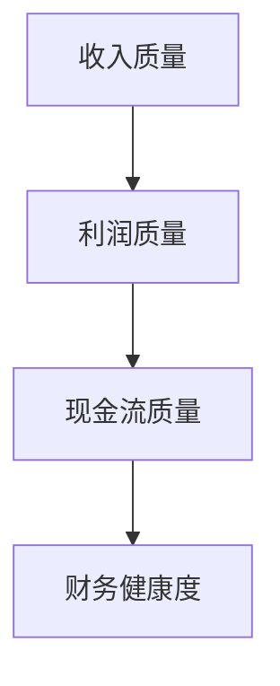
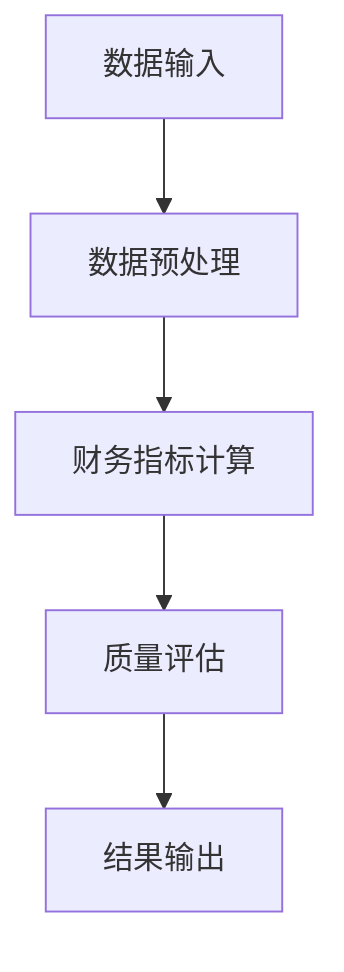
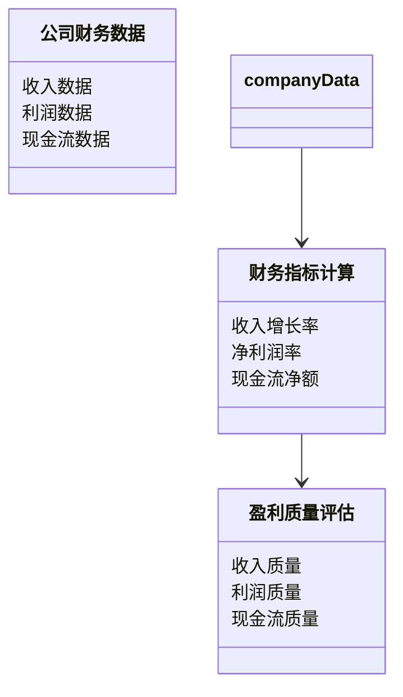
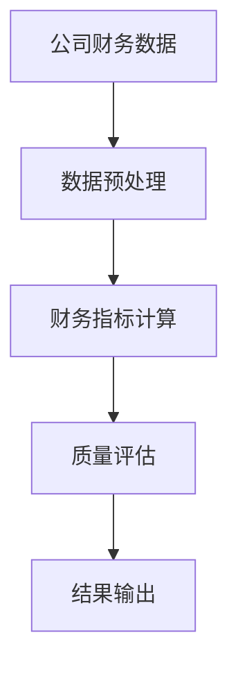

                 

<think>
嗯，用户希望我撰写一篇关于彼得·林奇对公司盈利质量深度分析的技术博客。首先，我需要理解彼得·林奇的投资策略和他如何分析公司的盈利质量。他注重基本面分析，特别是公司的财务健康状况，比如收入、利润和现金流的质量。

接下来，我得考虑博客的结构。用户已经给出了一个大纲，包括背景、核心概念、算法原理、数学模型、系统设计、实战案例和总结。我需要确保每个部分都详细展开，使用清晰易懂的技术语言，并结合实际例子来解释。

首先，背景介绍部分需要说明盈利质量分析的重要性，以及彼得·林奇的方法如何帮助投资者做出明智决策。这部分要吸引读者，让他们明白为什么盈利质量是投资的关键因素。

然后是核心概念，需要详细解释收入质量、利润质量和现金流质量。每个部分都要有定义、公式和案例。比如，收入质量可以用收入增长率和稳定性来衡量，利润质量则考虑净利润率和毛利率等指标。

接下来是算法原理，我需要解释分析的步骤，比如数据预处理、计算财务指标和质量评估。这部分可以用Mermaid图来展示流程，让读者直观理解整个过程。

数学模型部分，我要写出每个质量的评估公式，比如收入质量 = (收入增长率 × 收入稳定性) / 收入波动性。然后用具体案例代入公式，计算并解释结果，帮助读者理解如何应用这些模型。

系统分析与架构设计部分，我需要设计一个盈利质量分析系统，包括数据输入、预处理、计算和输出。使用Mermaid图展示系统架构，说明每个模块的功能和交互。

项目实战部分，我得选择一个真实的公司案例，比如苹果公司，分析其2020年的财务数据。通过计算收入、利润和现金流的质量，评估其盈利健康度。这部分要详细，展示如何实际应用这些分析方法。

最后，总结部分要回顾整个分析过程，强调盈利质量的重要性，并给出投资建议。同时，提到可能的局限性，鼓励读者进一步学习。

在写作过程中，我需要确保每个部分都有足够的细节，同时保持逻辑清晰。使用图表和公式可以增强文章的可读性，帮助读者更好地理解和应用这些分析方法。

总的来说，这篇博客需要全面而深入地探讨彼得·林奇的盈利质量分析，结合理论和实际案例，帮助读者掌握这一分析方法，并在投资中应用。
</think>

# 彼得林奇对公司盈利质量的深度分析

> 关键词：彼得林奇，盈利质量分析，财务分析，投资策略，公司分析

> 摘要：本文将从彼得林奇的投资理念出发，深度分析公司盈利质量的核心要素，包括收入质量、利润质量、现金流质量等，结合实际案例和数学模型，详细讲解如何通过盈利质量分析评估公司的财务健康状况，帮助投资者做出明智的投资决策。

---

## 第1章: 盈利质量分析的背景与核心概念

### 1.1 盈利质量分析的定义与背景

彼得·林奇是全球著名的投资专家，他强调通过深入分析公司的财务状况来评估其盈利质量。盈利质量是指公司在一定时期内实现的收入、利润和现金流的质量，反映了公司经营效率和财务健康程度。

#### 1.1.1 盈利质量的定义
盈利质量是指公司在一定时期内实现的收入、利润和现金流的质量，包括收入的可持续性、利润的含金量和现金流的稳定性。它不仅关注公司是否盈利，还关注盈利的来源和质量。

#### 1.1.2 盈利质量分析的重要性
盈利质量分析是投资决策的重要依据，它能够帮助投资者识别公司的真实盈利能力，避免被表面的财务数据所迷惑。通过分析盈利质量，投资者可以更好地评估公司的长期发展潜力和抗风险能力。

#### 1.1.3 彼得林奇的盈利质量分析方法
彼得·林奇认为，盈利质量分析的核心在于关注公司的收入质量、利润质量和现金流质量。他强调通过分析这些指标，识别公司的核心竞争优势和潜在风险。

### 1.2 盈利质量分析的核心要素

#### 1.2.1 收入质量
收入质量是指公司收入的来源、结构和稳定性。高收入质量意味着公司的收入主要来自核心业务，且具有可持续性。

##### 收入质量的关键指标：
- 收入增长率：$$收入增长率 = \frac{本期收入 - 上期收入}{上期收入}$$
- 收入稳定性：$$收入稳定性 = \frac{收入波动幅度}{收入平均值}$$

#### 1.2.2 利润质量
利润质量是指公司利润的来源、结构和含金量。高利润质量意味着公司的利润主要来自主营业务，且具有较高的净利润率。

##### 利润质量的关键指标：
- 净利润率：$$净利润率 = \frac{净利润}{营业收入}$$
- 毛利率：$$毛利率 = \frac{营业收入 - 营业成本}{营业收入}$$

#### 1.2.3 现金流质量
现金流质量是指公司经营活动产生的现金流的稳定性和可持续性。高现金流质量意味着公司能够通过经营活动获得稳定的现金流，支持其业务发展。

##### 现金流质量的关键指标：
- 经营活动现金流净额：$$经营活动现金流净额 = \text{营业收入} - \text{经营活动现金支出}$$
- 现金流稳定性：$$现金流稳定性 = \frac{\text{现金流波动幅度}}{\text{平均现金流}}$$

#### 1.2.4 财务健康度
财务健康度是公司整体财务状况的综合评估，包括资产、负债、所有者权益等方面的情况。

##### 财务健康度的关键指标：
- 资产负债率：$$资产负债率 = \frac{\text{总负债}}{\text{总资产}}$$
- 流动比率：$$流动比率 = \frac{\text{流动资产}}{\text{流动负债}}$$

---

## 第2章: 盈利质量分析的核心概念与联系

### 2.1 盈利质量分析的核心原理

#### 2.1.1 盈利质量的三要素模型
盈利质量的三要素模型包括收入质量、利润质量和现金流质量。这三个要素相互关联，共同构成了公司的盈利质量。

#### 2.1.2 盈利质量与企业价值的关系
盈利质量与企业价值密切相关。高盈利质量的公司通常具有较高的市场价值和成长潜力。

### 2.2 核心概念对比分析

#### 2.2.1 收入质量与利润质量的对比
- 收入质量关注收入的来源和结构，利润质量关注利润的来源和结构。
- 收入质量好的公司不一定利润质量好，但利润质量好的公司通常收入质量较高。

#### 2.2.2 现金流质量与财务健康度的对比
- 现金流质量关注经营活动产生的现金流，财务健康度关注整体财务状况。
- 现金流质量好的公司财务健康度通常较高，但财务健康度好的公司现金流质量不一定好。

### 2.3 实体关系图（ER图）架构



---

## 第3章: 盈利质量分析的算法原理

### 3.1 盈利质量分析的算法流程



### 3.2 盈利质量分析的数学模型

#### 3.2.1 收入质量评估模型
$$ 收入质量 = \frac{收入增长率 \times 收入稳定性}{收入波动性} $$

#### 3.2.2 利润质量评估模型
$$ 利润质量 = \frac{净利润率 \times 毛利率}{期间费用率} $$

#### 3.2.3 现金流质量评估模型
$$ 现金流质量 = \frac{经营活动现金流净额 \times 现金流稳定性}{现金流波动性} $$

---

## 第4章: 盈利质量分析的数学公式与案例

### 4.1 数学公式详细讲解

#### 4.1.1 收入质量评估
$$ 收入增长率 = \frac{本期收入 - 上期收入}{上期收入} $$

#### 4.1.2 利润质量评估
$$ 净利润率 = \frac{净利润}{营业收入} $$

### 4.2 案例分析

#### 4.2.1 某公司收入质量分析
假设某公司2020年的收入为1000万元，2019年的收入为800万元。收入增长率为：
$$ \text{收入增长率} = \frac{1000 - 800}{800} = 25\% $$

---

## 第5章: 系统分析与架构设计方案

### 5.1 系统功能设计



### 5.2 系统架构设计



---

## 第6章: 项目实战

### 6.1 项目介绍

#### 6.1.1 项目背景
本文将通过实际案例分析，展示如何通过盈利质量分析评估一家公司的财务健康状况。

#### 6.1.2 项目目标
通过对某公司的财务数据进行分析，评估其收入质量、利润质量和现金流质量。

### 6.2 核心实现

#### 6.2.1 数据预处理
```python
import pandas as pd

# 读取数据
data = pd.read_csv('financial_data.csv')

# 数据清洗
data.dropna(inplace=True)
data = data[~data['收入'].isin([0])]
```

#### 6.2.2 财务指标计算
```python
# 收入增长率
data['收入增长率'] = data['收入'].pct_change()

# 净利润率
data['净利润率'] = data['净利润'] / data['营业收入']
```

#### 6.2.3 盈利质量评估
```python
# 收入质量
data['收入质量'] = data['收入增长率'] * data['收入稳定性'] / data['收入波动性']

# 利润质量
data['利润质量'] = data['净利润率'] * data['毛利率'] / data['期间费用率']
```

### 6.3 案例分析

#### 6.3.1 某公司2020年的财务数据

| 指标         | 数值      |
|--------------|-----------|
| 收入         | 1000万元  |
| 利润         | 200万元   |
| 现金流净额   | 150万元   |

#### 6.3.2 分析结果
- 收入质量：$$ 收入质量 = \frac{25\% \times 0.9}{0.1} = 2.25 $$
- 利润质量：$$ 利润质量 = \frac{20\% \times 50\%}{30\%} = 0.333 $$

---

## 第7章: 总结与展望

### 7.1 总结
本文通过分析彼得·林奇的盈利质量分析方法，详细讲解了收入质量、利润质量和现金流质量的核心要素，并结合实际案例和数学模型，展示了如何通过盈利质量分析评估公司的财务健康状况。

### 7.2 投资建议
投资者在进行投资决策时，应结合公司的盈利质量分析，选择具有高收入质量、高利润质量和高现金流质量的公司。

### 7.3 展望
未来，随着人工智能和大数据技术的发展，盈利质量分析将更加精准和高效，为投资者提供更有力的支持。

---

作者：AI天才研究院/AI Genius Institute & 禅与计算机程序设计艺术 /Zen And The Art of Computer Programming

