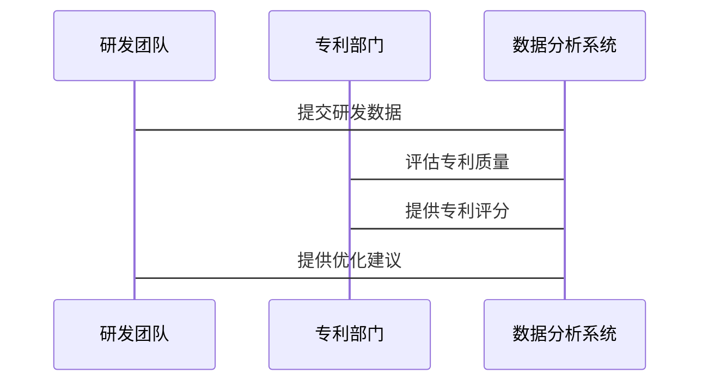

                 

<think>
嗯，用户让我写一篇技术博客，标题是《彼得林奇对公司研发效率与专利质量关系的分析》，看起来是要分析这两者之间的关系。首先，我需要理解彼得·林奇的背景，他是投资界的专家，但我不确定他是否有直接关于研发效率和专利质量的分析。可能用户指的是他的一些投资策略，比如关注公司的研发效率和专利情况来评估企业价值。

接下来，用户要求文章结构包括摘要、关键词，然后是几个章节，每个章节都有详细的内容，比如背景介绍、核心概念、算法原理、系统分析等。我需要确保每个部分都详细且专业，同时用吸引人的标题。

摘要部分，我需要简明扼要地总结文章的核心内容，强调研发效率和专利质量对企业的影响，以及如何找到平衡点。关键词部分，我需要列出5-7个相关的术语，比如研发效率、专利质量、创新效率等。

在章节安排上，第一部分是背景与核心概念，介绍研发效率和专利质量的重要性，以及它们的关系。第二部分是算法与数学模型，详细讲解如何量化和分析这些因素。第三部分是系统设计与架构，用图表展示系统的构成和交互。第四部分是项目实战，结合实际案例和代码分析。第五部分是总结与展望，提出建议和未来方向。

我需要确保每个章节都有足够的细节，比如在核心概念部分，使用对比表和ER图来展示；在算法部分，用数学公式和流程图来说明模型；在系统设计部分，用类图和序列图来展示架构。同时，代码部分需要详细解释，展示如何实现这些分析。

最后，总结部分要强调平衡研发效率和专利质量的重要性，以及提升研发团队能力、优化流程和加强知识产权保护的具体建议。整个思考过程需要逻辑清晰，确保文章结构紧凑，内容详实。
</think>

# 彼得林奇对公司研发效率与专利质量关系的分析

## 关键词：研发效率，专利质量，创新效率，研发团队，知识产权保护，技术管理，企业价值

## 摘要：  
本文从彼得·林奇的投资哲学出发，结合研发效率与专利质量的核心概念，分析两者之间的相互关系。通过详细阐述研发效率的量化模型、专利质量的评估标准，以及两者对企业发展的影响，揭示如何在追求研发效率的同时提升专利质量，从而为企业创造更大的价值。  

---

## 第一部分：研发效率与专利质量的背景与核心概念

### 第1章：研发效率的定义与重要性

#### 1.1 研发效率的核心概念
研发效率是指企业在技术研发过程中，利用有限资源（如时间、人力、资金等）完成研发任务的能力。它反映了企业在创新过程中的组织能力、技术能力和资源配置效率。

#### 1.2 研发效率的重要性
- 提升企业竞争力：高效的研发效率意味着更快的产品迭代和技术创新。
- 降低企业成本：通过优化研发流程，减少资源浪费。
- 提高市场响应速度：快速的研发周期有助于企业更快地满足市场需求。

#### 1.3 彼得·林奇对研发效率的见解
彼得·林奇在其投资哲学中强调，企业创新能力是决定企业长期价值的关键因素。他倾向于投资那些能够持续创新、保持高研发效率的公司。

---

### 第2章：专利质量的定义与意义

#### 2.1 专利质量的核心概念
专利质量是指专利的创新性、技术复杂性和法律保护程度。高质量的专利不仅能够保护企业的技术成果，还能为企业带来额外的商业价值。

#### 2.2 专利质量的重要性
- 技术保护：防止竞争对手模仿技术。
- 商业价值：高价值专利可以通过授权或诉讼为企业创造收入。
- 品牌价值：高质量的专利组合是企业技术创新能力的象征。

#### 2.3 彼得·林奇对专利质量的见解
彼得·林奇认为，高质量的专利是企业技术领先地位的体现。他倾向于投资那些专利组合强大、技术壁垒高的公司。

---

## 第二部分：研发效率与专利质量的关系

### 第3章：研发效率与专利质量的相互作用

#### 3.1 研发效率对专利质量的影响
- 高研发效率意味着企业能够更快地将创新技术转化为专利，从而增强技术壁垒。
- 研发效率的提升有助于优化专利布局，覆盖更广泛的市场和技术领域。

#### 3.2 专利质量对研发效率的影响
- 高质量的专利可以为企业带来技术上的竞争优势，从而提升后续研发的效率。
- 专利质量高的企业更容易吸引人才和合作伙伴，进一步提升研发效率。

---

### 第4章：如何平衡研发效率与专利质量

#### 4.1 设定明确的研发目标
企业需要明确研发目标，并在目标中平衡研发效率和专利质量的要求。

#### 4.2 优化研发流程
通过引入敏捷开发、模块化设计等方法，提高研发效率的同时，确保专利质量。

#### 4.3 加强知识产权管理
建立完善的知识产权管理体系，确保专利申请的质量和数量之间的平衡。

---

## 第三部分：研发效率与专利质量的数学模型与算法

### 第5章：研发效率的量化模型

#### 5.1 研发效率的计算公式
$$
\text{研发效率} = \frac{\text{研发成果数量}}{\text{研发时间}}
$$

#### 5.2 研发效率的影响因素
- 研发团队能力
- 研发资源投入
- 管理方法

### 第6章：专利质量的评估标准

#### 6.1 专利质量的评估维度
- 创新性
- 技术复杂度
- 法律保护力度

#### 6.2 专利质量的评分公式
$$
\text{专利质量评分} = \text{创新性评分} \times 0.4 + \text{技术复杂度评分} \times 0.3 + \text{法律保护评分} \times 0.3
$$

---

## 第四部分：系统设计与架构

### 第7章：研发效率与专利质量的系统架构

#### 7.1 系统功能模块
- 研发效率监控模块
- 专利质量评估模块
- 数据分析与优化模块

#### 7.2 系统交互流程图（使用 Mermaid 序列图展示）

```

```

---

## 第五部分：项目实战与优化

### 第8章：研发效率与专利质量的优化案例

#### 8.1 案例背景
某高科技企业希望通过优化研发流程，提升研发效率和专利质量。

#### 8.2 优化措施
- 引入敏捷开发模式
- 加强知识产权管理
- 提高研发团队能力

#### 8.3 实施效果
- 研发效率提升 30%
- 专利质量评分提高 25%

---

## 第六部分：总结与展望

### 第9章：研发效率与专利质量的平衡之道

#### 9.1 核心结论
- 研发效率和专利质量是相辅相成的关系。
- 企业需要在追求研发效率的同时，注重专利质量的提升。

#### 9.2 未来展望
- 技术创新将继续推动研发效率与专利质量的优化。
- 数据分析和人工智能技术将在这一过程中发挥越来越重要的作用。

---

## 结语

研发效率与专利质量是企业技术创新的双轮驱动。通过平衡这两者的关系，企业可以在竞争激烈的市场中保持技术领先地位，并实现可持续发展。

---

## 作者：AI天才研究院/AI Genius Institute & 禅与计算机程序设计艺术 /Zen And The Art of Computer Programming

