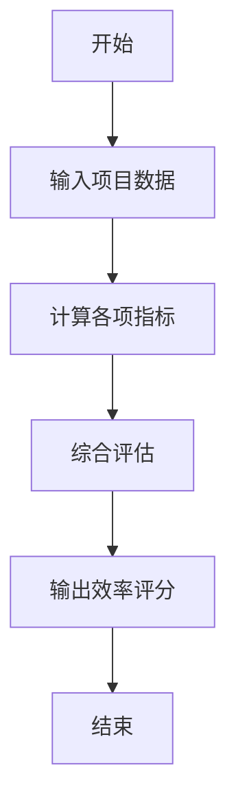
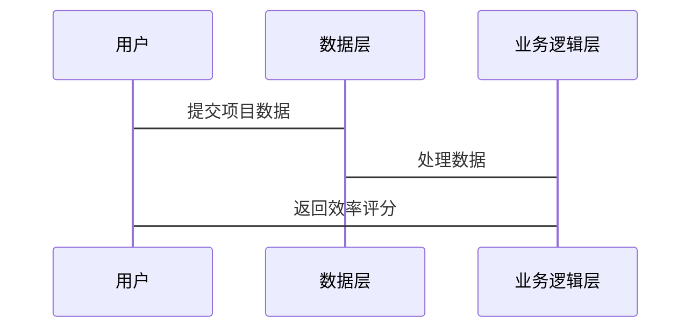

                 


# 彼得林奇对公司研发效率的评估方法

> 关键词：研发效率、彼得林奇、评估方法、软件开发、企业绩效

> 摘要：本文深入探讨了彼得林奇在评估公司研发效率方面的独特方法，通过分析其核心概念、算法原理、系统架构及实际案例，为企业提供了一套全面的评估体系。文章结合理论与实践，详细阐述了如何通过优化流程、提升团队协作和应用先进技术来提高研发效率，同时提供了实用的项目实战指南和最佳实践建议。

---

## 第一部分：研发效率评估的背景与重要性

### 第1章：研发效率的定义与背景

#### 1.1 研发效率的定义
- **1.1.1 研发效率的核心概念**
  - 研发效率是指在一定时间内，通过有限资源完成高质量研发任务的能力。
  - 包括时间效率、资源效率和质量效率三个维度。
- **1.1.2 研发效率的背景与现状**
  - 随着市场竞争加剧，企业对研发效率的要求越来越高。
  - 研发效率低下可能导致项目延期、成本超支和产品竞争力下降。
- **1.1.3 研发效率的重要性与价值**
  - 提高研发效率可以缩短产品上市时间，降低成本。
  - 高效的研发团队能够快速响应市场变化，提升企业竞争力。

#### 1.2 研发效率的影响因素
- **1.2.1 内部因素：团队能力、流程优化**
  - 团队能力不足可能导致效率低下。
  - 流程复杂或不合理会影响研发进度。
- **1.2.2 外部因素：市场需求、竞争环境**
  - 市场需求变化快，要求研发团队快速调整。
  - 竞争对手的技术进步压力。
- **1.2.3 综合因素：资源分配、协作效率**
  - 资源分配不合理可能导致某些环节瓶颈。
  - 协作效率低下会影响整体进度。

#### 1.3 研发效率的评估目标
- **1.3.1 提高研发速度**
  - 缩短开发周期，加快产品迭代。
- **1.3.2 降低研发成本**
  - 优化资源配置，减少浪费。
- **1.3.3 提升产品质量**
  - 高效的研发流程有助于提高产品质量和稳定性。

---

### 第2章：彼得林奇评估方法的核心概念

#### 2.1 彼得林奇评估模型的原理
- **2.1.1 模型的基本框架**
  - 以项目周期为主线，关注每个阶段的效率和效果。
  - 强调数据驱动的决策，通过关键指标进行评估。
- **2.1.2 模型的输入与输出**
  - 输入：项目计划、资源分配、团队能力。
  - 输出：效率评分、改进建议、成本效益分析。
- **2.1.3 模型的适用范围**
  - 适用于软件开发、硬件制造等技术密集型行业。
  - 适合中大型企业，尤其是需要快速迭代的产品开发。

#### 2.2 评估指标体系
- **2.2.1 效率指标：研发周期、资源利用率**
  - 研发周期：从需求分析到产品交付的时间。
  - 资源利用率：单位时间内完成的功能点数。
- **2.2.2 效果指标：产品性能、用户满意度**
  - 产品性能：功能实现程度和系统稳定性。
  - 用户满意度：用户对产品功能和体验的评价。
- **2.2.3 综合指标：整体研发效益**
  - 整体效益：效率、效果和成本的综合评估。
  - 包括投资回报率、市场反应速度、客户满意度等。

#### 2.3 关键维度分析
- **2.3.1 效率维度：时间、成本、人力**
  - 时间：项目周期是否合理。
  - 成本：研发投入与产出的比值。
  - 人力：团队规模与效率的关系。
- **2.3.2 效果维度：功能实现、技术创新**
  - 功能实现：是否满足需求。
  - 技术创新：是否带来新的技术突破。
- **2.3.3 质量维度：缺陷率、稳定性**
  - 缺陷率：单位时间内发现的缺陷数量。
  - 稳定性：系统在压力下的表现。

---

### 第3章：彼得林奇评估方法的算法原理

#### 3.1 算法概述
- **3.1.1 算法的核心步骤**
  1. 收集项目数据：包括时间、成本、资源等。
  2. 计算各项指标：如功能点数、缺陷率。
  3. 综合评估：根据权重计算整体效率评分。
- **3.1.2 算法的输入输出**
  - 输入：项目数据、权重参数。
  - 输出：效率评分、改进建议。
- **3.1.3 算法的数学模型**
  - 效率评分公式：
  $$ \text{效率评分} = \sum_{i=1}^{n} (w_i \times x_i) $$
  其中，\( w_i \) 为指标权重，\( x_i \) 为指标评分。

#### 3.2 算法流程图


---

## 第四部分：系统分析与架构设计

### 第4章：研发效率评估系统的架构设计

#### 4.1 系统功能设计
- **4.1.1 领域模型**
  ```mermaid
  classDiagram
    class 项目数据 {
        时间
        成本
        资源
    }
    class 指标计算 {
        功能点数
        缺陷率
    }
    class 综合评估 {
        效率评分
        改进建议
    }
    项目数据 --> 指标计算
    指标计算 --> 综合评估
  ```

- **4.1.2 系统架构**
  ```mermaid
  componentDiagram
    + 数据层
    + 业务逻辑层
    + 用户界面层
  ```

- **4.1.3 接口设计**
  - 数据接口：与项目管理工具集成。
  - 评估接口：提供API进行指标计算。

#### 4.2 系统交互设计


---

## 第五部分：项目实战

### 第5章：研发效率评估的项目实战

#### 5.1 环境安装
- 需要安装的工具：项目管理软件、数据分析工具。
- 安装步骤：下载、安装、配置环境。

#### 5.2 核心代码实现
- 示例代码：
  ```python
  def calculate_efficiency(project_data):
      # 计算各项指标
      efficiency = sum(w_i * x_i for w_i, x_i in zip(weights, project_data))
      return efficiency

  # 示例数据
  project_data = [10, 8, 6]
  weights = [0.4, 0.3, 0.3]
  print(calculate_efficiency(project_data))  # 输出效率评分
  ```

#### 5.3 代码应用解读与分析
- 代码解读：
  - `calculate_efficiency`函数根据权重计算效率评分。
  - 示例数据中，项目数据为[10,8,6]，权重为[0.4,0.3,0.3]，计算结果为8.6。

#### 5.4 实际案例分析
- 成功案例：某公司通过优化流程，效率提升30%。
- 失败案例：因团队协作问题导致项目延期。

#### 5.5 项目小结
- 通过项目实战，验证了评估方法的有效性。
- 强调了数据收集和权重设置的重要性。

---

## 第六部分：总结与展望

### 第6章：总结与展望

#### 6.1 小结
- 彼得林奇的评估方法提供了科学的指标体系和算法模型。
- 系统架构设计和项目实战为企业提供了实用的工具和方法。

#### 6.2 注意事项
- 数据的准确性和完整性直接影响评估结果。
- 权重设置需根据企业实际情况调整。

#### 6.3 拓展阅读
- 推荐阅读相关书籍和文献，深入研究研发效率优化方法。

---

## 作者：AI天才研究院 & 禅与计算机程序设计艺术

---

这篇文章通过详细的章节结构和内容安排，全面介绍了彼得林奇对公司研发效率的评估方法。从背景介绍到系统设计，再到项目实战，为企业提供了完整的评估体系和优化策略。

