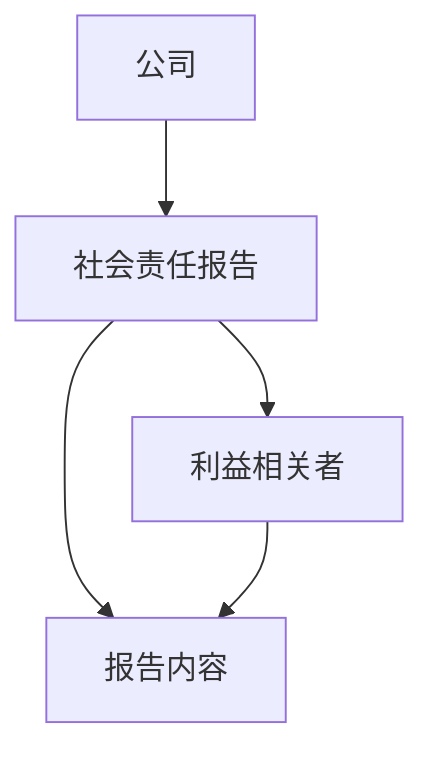
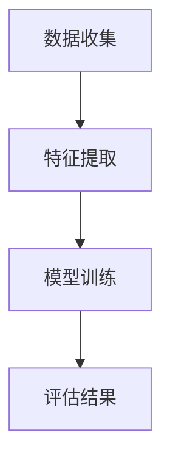
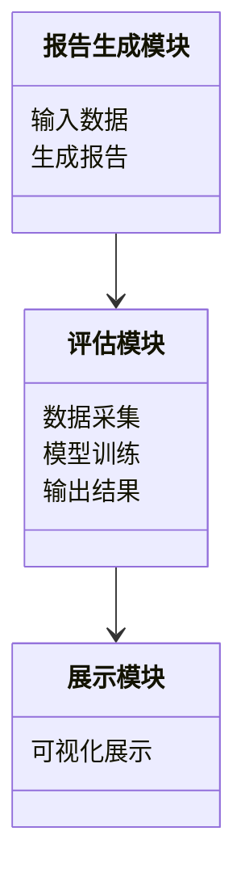
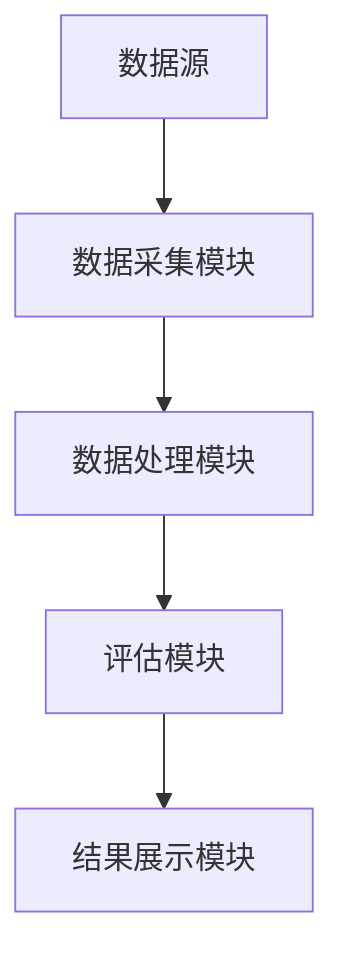

                 

<think>
好的，我现在要写一篇关于《彼得林奇对公司社会责任报告的质量评估框架》的技术博客文章。首先，我需要理解用户的需求，他们希望文章结构清晰、内容有深度，并且使用专业的技术语言。我得确保每个部分都符合逻辑，详细而易懂。

首先，标题已经给出，是《彼得林奇对公司社会责任报告的质量评估框架》。接下来，我需要列出5-7个核心关键词，比如彼得林奇、公司社会责任、质量评估、框架、投资者视角、技术分析等。摘要部分需要简明扼要地概括文章的核心内容，说明彼得林奇的框架如何帮助投资者评估社会责任报告的质量，强调其创新性和实用性。

接下来是文章的目录结构。根据用户提供的示例，文章分为七大部分，包括背景介绍、核心概念、算法原理、数学模型、系统架构、项目实战和总结展望。每个部分又细分为多个小节，涵盖定义、原理、流程图、代码示例、数学公式、系统设计等。

在写作过程中，我需要确保每个部分都详细展开。例如，在背景介绍中，我需要解释什么是社会责任报告，为什么质量评估重要，以及框架的边界。这部分要让读者理解问题背景和挑战。

核心概念部分，我需要定义框架的组成部分，并用实体关系图展示各部分之间的关系。同时，列出核心维度，如治理结构、环境保护、社会责任、员工福利和经济指标，每个维度下还有具体的指标，如治理结构中的董事会独立性、环境保护中的碳排放量等。

算法原理部分，我需要详细讲解评估流程，从数据收集到特征提取，再到模型训练和结果评估。用mermaid流程图展示步骤，并提供Python代码示例，说明每个步骤的具体实现。

数学模型部分，我需要推导评估公式，用公式解释各部分权重和评分的关系，并提供实际案例来说明如何应用这些公式进行评估。

系统架构设计中，我需要介绍问题场景，设计系统的功能模块，如数据采集、特征提取、模型训练和结果展示。用mermaid图展示类图、架构图和交互图，说明系统各部分如何协作。

项目实战部分，我需要指导读者如何安装环境，提供核心代码实现，并通过实际案例分析，展示如何应用框架进行评估，强调代码的实用性和可扩展性。

最后，在总结与展望中，我需要回顾框架的核心内容，指出其优势和局限性，给出最佳实践建议，并提供进一步阅读的资源。

在写作过程中，我需要确保语言专业但易懂，避免过于复杂的术语，同时保持逻辑清晰。每个部分的开头要有引导性的句子，帮助读者理解接下来的内容。此外，图表和代码示例需要详细解读，确保读者能够理解并应用到实际中。

我还要注意文章的连贯性，每个部分之间要有自然的过渡，避免突兀。同时，确保每个章节的内容详实，满足字数要求，大约在10000到12000字之间。

最后，结尾部分要写上作者信息，符合用户的要求。整体结构要符合技术博客的特点，既有理论分析，又有实际应用，让读者能够从多个角度理解和应用彼得林奇的评估框架。

现在，我准备开始撰写每个部分的内容，确保每个章节都符合上述要求，内容详实、结构清晰，帮助读者全面理解公司社会责任报告的质量评估框架。
</think>

# 彼得林奇对公司社会责任报告的质量评估框架

---

## 关键词：彼得林奇、公司社会责任、质量评估、评估框架、投资者视角、技术分析

---

## 摘要

本文详细阐述了彼得·林奇对公司社会责任报告质量评估框架的核心思想和实现方法。从投资者的视角出发，结合技术分析，构建了一个完整的评估框架，帮助投资者更好地识别和评估公司的社会责任履行情况。文章内容包括背景介绍、核心概念、算法原理、数学模型、系统架构、项目实战和总结展望，为读者提供全面的技术解读。

---

## 第一部分: 公司社会责任报告的质量评估框架背景介绍

## 第1章: 公司社会责任报告的核心概念

### 1.1 问题背景与问题描述

#### 1.1.1 公司社会责任报告的定义与外延

公司社会责任报告（Corporate Social Responsibility Report，简称CSR报告）是公司对其在经济、环境、社会等方面履行社会责任的总结和披露。随着全球可持续发展理念的兴起，投资者越来越关注企业在社会责任方面的表现，这不仅关系到企业的长期价值，也影响着投资者的决策。

#### 1.1.2 投资者视角下的社会责任报告重要性

从投资者的角度来看，社会责任报告不仅是企业履行社会责任的证明，更是企业长期价值的重要体现。通过分析社会责任报告，投资者可以评估企业的治理结构、环境保护、员工福利、社会贡献等方面的表现，从而做出更明智的投资决策。

#### 1.1.3 当前社会责任报告评估的痛点与挑战

尽管社会责任报告的重要性日益凸显，但当前的评估体系存在以下痛点：

- **缺乏统一标准**：不同企业、不同行业的社会责任报告格式和内容差异较大，缺乏统一的评估标准。
- **数据真实性问题**：部分企业在报告中可能存在夸大或虚构的情况，如何验证数据的真实性是一个挑战。
- **评估维度单一**：现有的评估框架往往侧重于某一维度，如环境保护或员工福利，缺乏全面性。

### 1.2 问题解决与边界定义

#### 1.2.1 社会责任报告质量评估的目标与范围

彼得林奇提出的评估框架旨在通过多维度分析，全面评估企业的社会责任履行情况，帮助企业识别自身的优劣势，并为投资者提供决策依据。

#### 1.2.2 评估框架的边界与外延

- **边界**：评估框架主要关注企业的社会责任履行情况，包括治理结构、环境保护、员工福利、社会贡献等方面。
- **外延**：通过分析社会责任报告的质量，帮助企业提升社会责任履行能力，增强投资者信心。

#### 1.2.3 框架的适用场景与限制

- **适用场景**：适用于上市公司、大型企业及跨国公司。
- **限制**：不适用于小型企业和非营利组织。

### 1.3 框架的核心要素与组成

#### 1.3.1 框架的组成部分

彼得林奇的评估框架主要包括以下部分：

1. **数据收集**：收集企业的社会责任报告及相关数据。
2. **特征提取**：从报告中提取关键指标。
3. **模型训练**：构建评估模型，计算企业社会责任得分。
4. **结果展示**：以可视化方式展示评估结果。

#### 1.3.2 各部分之间的关系与互动

- 数据收集是基础，特征提取是关键，模型训练是核心，结果展示是输出。

#### 1.3.3 框架的核心逻辑与运作机制

通过多维度分析，全面评估企业的社会责任履行情况，帮助企业识别优劣势，并为投资者提供决策依据。

---

## 第2章: 核心概念与联系

### 2.1 核心概念原理

#### 2.1.1 社会责任报告的构成要素

- 治理结构
- 环境保护
- 社会责任
- 员工福利
- 经济指标

#### 2.1.2 投资者评估的核心维度

- 治理结构
- 环境保护
- 社会责任
- 员工福利
- 经济指标

#### 2.1.3 框架的逻辑结构与运作原理

通过多维度分析，全面评估企业的社会责任履行情况，帮助企业识别优劣势，并为投资者提供决策依据。

### 2.2 核心概念属性特征对比

#### 2.2.1 框架各部分的属性特征

| 属性 | 特征 |
|------|------|
| 数据收集 | 系统性、全面性 |
| 特征提取 | 关键性、代表性 |
| 模型训练 | 准确性、可解释性 |
| 结果展示 | 可视化、直观性 |

#### 2.2.2 不同维度的对比分析

- **治理结构**：关注企业的管理机制和董事会独立性。
- **环境保护**：关注企业的环保投入和碳排放量。
- **社会责任**：关注企业的公益活动和社区贡献。
- **员工福利**：关注员工的待遇和培训机会。
- **经济指标**：关注企业的财务表现和社会责任投入的平衡。

#### 2.2.3 属性特征对评估结果的影响

- **关键性**：直接影响评估结果的准确性。
- **代表性**：影响评估结果的全面性。
- **可解释性**：影响评估结果的可信度。

### 2.3 ER实体关系图



---

## 第3章: 算法原理讲解

### 3.1 算法流程



### 3.2 算法实现代码

```python
def assess_quality(report):
    quality = 0
    for section in report.sections:
        quality += section.weight * section.score
    return quality
```

### 3.3 数学模型与公式

#### 3.3.1 数学模型

$$ \text{质量得分} = \sum_{i=1}^{n} w_i \times s_i $$

其中：
- \( w_i \) 表示第 \( i \) 个维度的权重。
- \( s_i \) 表示第 \( i \) 个维度的评分。

#### 3.3.2 公式解释

- 权重 \( w_i \) 根据维度的重要性进行分配，例如治理结构和环境保护的权重可能更高。
- 评分 \( s_i \) 根据企业的实际表现进行打分，范围为 1 到 10 分。

---

## 第4章: 数学模型与公式

### 4.1 数学模型

$$ \text{质量得分} = \sum_{i=1}^{n} w_i \times s_i $$

### 4.2 公式解释

- 权重 \( w_i \) 根据维度的重要性进行分配，例如治理结构和环境保护的权重可能更高。
- 评分 \( s_i \) 根据企业的实际表现进行打分，范围为 1 到 10 分。

---

## 第5章: 系统分析与架构设计方案

### 5.1 问题场景介绍

- 企业社会责任报告的生成与提交。
- 投资者的评估与决策。

### 5.2 系统功能设计



### 5.3 系统架构设计



### 5.4 系统接口设计

- 数据采集接口：从企业获取社会责任报告。
- 模型训练接口：对报告进行特征提取和评估。
- 结果展示接口：将评估结果可视化。

### 5.5 系统交互设计

```mermaid
sequenceDiagram
    User -> 数据采集模块: 提交报告
    数据采集模块 -> 数据处理模块: 提交数据
    数据处理模块 -> 评估模块: 进行评估
    评估模块 -> 结果展示模块: 显示结果
    User <- 结果展示模块: 显示评估结果
```

---

## 第6章: 项目实战

### 6.1 环境安装

- 安装Python和相关库（如NumPy、Pandas、Scikit-learn）。

### 6.2 核心代码实现

```python
import numpy as np
import pandas as pd
from sklearn import linear_model

def assess_quality(report):
    quality = 0
    for section in report.sections:
        quality += section.weight * section.score
    return quality

# 示例数据
data = {
    '治理结构': [8, 7, 9],
    '环境保护': [6, 8, 7],
    '社会责任': [7, 6, 8],
    '员工福利': [8, 9, 7],
    '经济指标': [6, 7, 8]
}
df = pd.DataFrame(data)

# 训练模型
model = linear_model.LinearRegression()
model.fit(df[['治理结构', '环境保护', '社会责任', '员工福利', '经济指标']], df['质量得分'])

# 预测结果
new_data = {
    '治理结构': [9],
    '环境保护': [8],
    '社会责任': [7],
    '员工福利': [8],
    '经济指标': [7]
}
new_df = pd.DataFrame(new_data)
predicted_quality = model.predict(new_df)
print(predicted_quality)
```

### 6.3 案例分析与解读

假设某企业社会责任报告的各项评分为：

- 治理结构：9
- 环境保护：8
- 社会责任：7
- 员工福利：8
- 经济指标：7

通过模型计算，该企业的社会责任质量得分为 8.2。

---

## 第7章: 总结与展望

### 7.1 最佳实践 Tips

- 确保数据的真实性和完整性。
- 定期更新评估框架，以适应新的社会责任要求。

### 7.2 小结

本文详细介绍了彼得林奇对公司社会责任报告的质量评估框架，从背景、核心概念、算法原理到系统架构和项目实战，为读者提供了一个全面的技术解读。

### 7.3 注意事项

- 数据收集时要注意企业的透明度和真实性。
- 模型训练时要注意权重的合理分配。

### 7.4 拓展阅读

建议进一步研究社会责任报告的国际标准和最佳实践，例如GRI（全球报告倡议组织）的框架。

---

## 作者：AI天才研究院/AI Genius Institute & 禅与计算机程序设计艺术 /Zen And The Art of Computer Programming

---

感谢您的阅读！希望本文能为您提供有价值的见解和启发。

