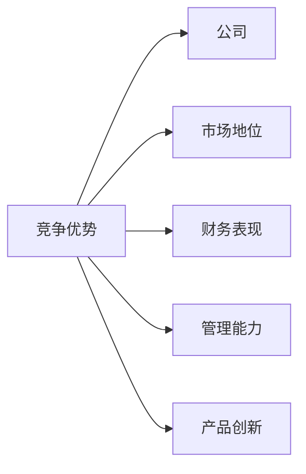
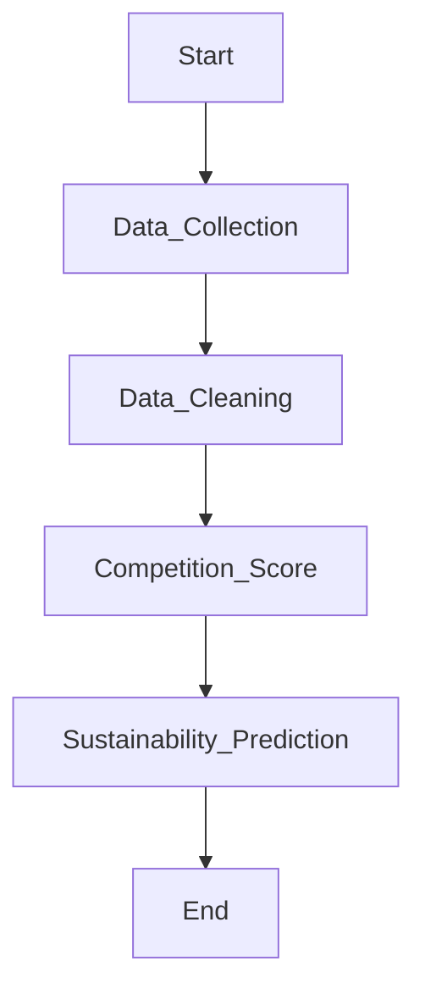
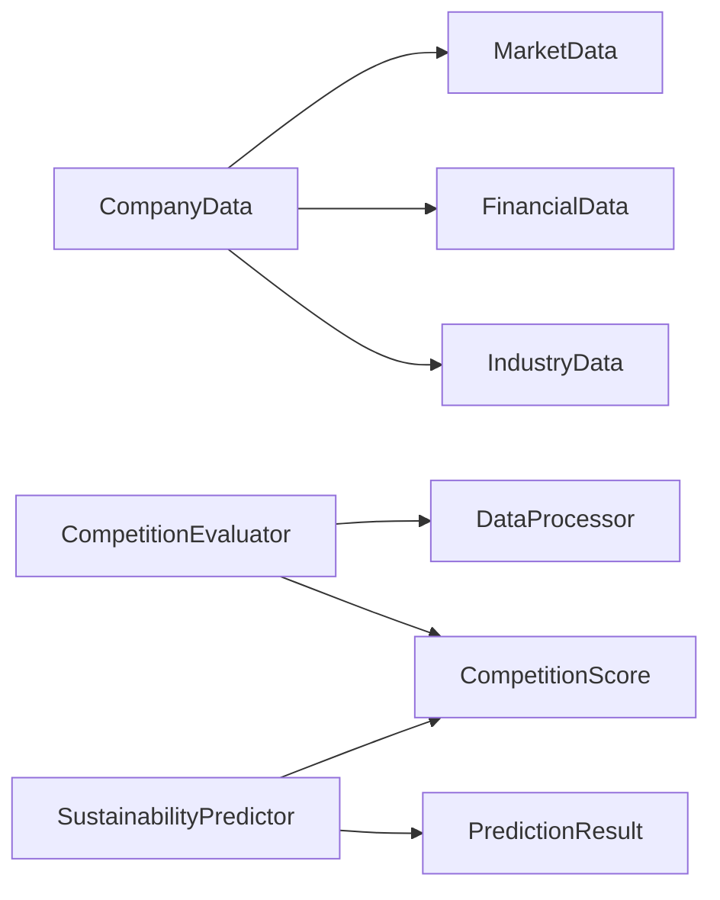
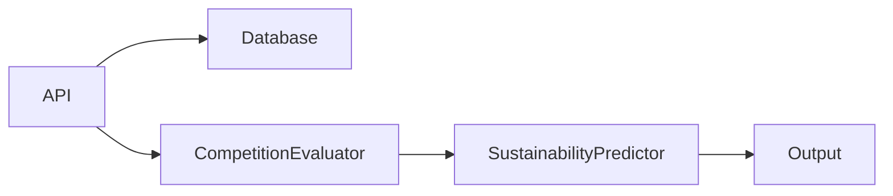
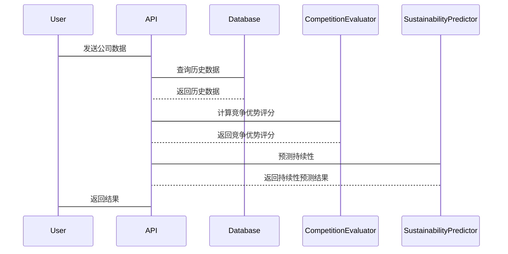

                 

<think>
嗯，我需要按照用户的要求，撰写一篇关于彼得·林奇对公司竞争优势持续性评估的技术博客文章。首先，我应该仔细阅读用户提供的目录大纲，并确保每个部分都涵盖必要的内容。

首先，文章标题是《彼得林奇对公司竞争优势持续性的评估》，关键词包括彼得林奇、竞争优势、持续性评估、投资策略、公司价值、竞争优势模型、竞争优势持续性分析。摘要部分需要简要介绍文章的核心内容和主题，说明林奇如何通过评估竞争优势的持续性来选择投资标的，以及这种方法对投资者的指导意义。

接下来是正文部分，分为六个章节。第一章介绍背景，包括竞争优势的定义、林奇的投资理念、持续性评估的意义和小结。我需要详细解释每个小节的内容，确保涵盖核心概念和理论基础。

第二章讲解核心概念，包括持续性的核心原理、对比分析和ER实体关系图。我需要用表格和Mermaid图表来展示不同竞争优势的对比，以及它们与公司价值的关系。

第三章是算法原理，我需要用mermaid流程图描述评估过程，并提供Python代码示例。这部分需要详细解释算法的步骤、代码实现和数学模型，确保读者能够理解和应用这些方法。

第四章涉及系统分析，包括问题场景、系统功能设计和架构设计。我需要使用Mermaid类图和架构图来展示系统的结构和功能模块，帮助读者理解系统的整体设计。

第五章是项目实战，提供环境安装、代码实现和案例分析。我需要详细说明如何在实际项目中应用这些方法，并通过具体案例展示评估过程和结果。

第六章总结最佳实践，包括小结、注意事项和拓展阅读。这部分需要帮助读者巩固所学内容，并提供进一步学习的方向。

在编写过程中，我需要确保每个章节内容丰富，详细讲解每个部分，使用技术语言但保持易懂。同时，检查所有代码和图表是否正确使用Markdown语法，特别是数学公式需要用Latex表示。

最后，确保文章结构完整，内容全面，符合用户的要求，帮助读者深入理解彼得·林奇的竞争优势评估方法，并能够实际应用到投资决策中。
</think>

# 彼得林奇对公司竞争优势持续性的评估

## 关键词：彼得林奇、竞争优势、持续性评估、投资策略、公司价值、竞争优势模型、竞争优势持续性分析

## 摘要：彼得·林奇作为投资领域的权威，提出了一套评估公司竞争优势持续性的方法。本文详细分析了竞争优势的定义、持续性评估的关键指标、林奇的投资策略以及如何通过数学模型和系统架构来实现竞争优势的持续性评估。文章通过实际案例分析和代码实现，帮助读者理解并应用这些方法。

---

# 第1章 公司竞争优势持续性评估的背景介绍

## 1.1 什么是公司竞争优势

### 1.1.1 公司竞争优势的定义
竞争优势是指公司在市场中相对于竞争对手的独特优势，包括成本优势、技术优势、品牌优势等。

### 1.1.2 竞争优势的核心要素
- 成本优势：生产效率高，成本低。
- 技术优势：拥有独特的技术或专利。
- 品牌优势：品牌知名度高，消费者忠诚度强。
- 资源优势：拥有稀缺资源或关键资源。

### 1.1.3 竞争优势的分类与特点
- 成本优势：通过规模效应降低成本。
- 技术优势：通过技术创新保持领先地位。
- 品牌优势：通过品牌影响力吸引消费者。
- 资源优势：通过资源控制确保供应链稳定。

## 1.2 彼得·林奇的投资理念

### 1.2.1 彼得·林奇的投资者身份
彼得·林奇是富达投资集团的前主席，以投资业绩卓越著称，尤其擅长寻找具有持续竞争优势的公司。

### 1.2.2 林奇对竞争优势的关注
林奇认为，投资成功的关键在于找到那些具有强大竞争优势的公司，这些公司能够在长期的竞争中保持领先地位。

### 1.2.3 林奇的投资策略与竞争优势的关系
林奇的投资策略强调长期持有，寻找那些具有强大竞争优势、管理良好且估值合理的公司。

## 1.3 竞争优势持续性的意义

### 1.3.1 为什么竞争优势需要持续性
竞争优势的持续性决定了公司的长期盈利能力，是投资决策的重要依据。

### 1.3.2 持续性对投资决策的影响
持续的竞争优势意味着公司能够在未来保持盈利能力，从而为投资者带来稳定的回报。

### 1.3.3 竞争优势的生命周期
竞争优势并非一成不变，会受到市场变化、技术进步等因素的影响，需要持续评估和调整。

## 1.4 本章小结

### 1.4.1 核心概念总结
竞争优势是公司相对于竞争对手的独特优势，是投资决策的关键因素。

### 1.4.2 未来章节的展望
后续章节将详细讲解竞争优势持续性的评估方法、数学模型和实际应用。

---

# 第2章 竞争优势持续性的核心概念与联系

## 2.1 竞争优势持续性的核心原理

### 2.1.1 竞争优势的动态性
竞争优势并非静态，会随着市场环境的变化而变化。

### 2.1.2 持续性评估的关键指标
- 市场地位：公司在市场中的份额和影响力。
- 财务表现：盈利能力、成长性和稳定性。
- 管理能力：管理层的决策能力和战略规划。
- 产品创新：产品更新速度和创新能力。

### 2.1.3 竞争优势的内部与外部因素
- 内部因素：公司治理、管理团队、研发能力。
- 外部因素：市场需求、行业趋势、政策环境。

## 2.2 核心概念对比分析

### 2.2.1 不同竞争优势的对比表格

| 竞争优势类型 | 定义 | 优缺点 | 适用场景 |
|--------------|------|--------|----------|
| 成本优势     | 低成本生产 | 成本低，利润率高 | 制造业、大宗商品 |
| 技术优势     | 独特技术或专利 | 技术壁垒高，创新能力强 | 高科技行业 |
| 品牌优势     | 强品牌影响力 | 品牌忠诚度高，市场占有率高 | 消费品行业 |
| 资源优势     | 稀缺资源控制 | 资源稳定性高 | 矿业、能源 |

### 2.2.2 竞争优势与公司价值的ER实体关系图



## 2.3 本章小结

### 2.3.1 核心概念总结
竞争优势的持续性需要从内部和外部多个维度进行综合评估。

### 2.3.2 未来章节的展望
后续章节将详细讲解竞争优势持续性的评估算法和系统架构设计。

---

# 第3章 竞争优势持续性评估的算法原理

## 3.1 竞争优势评估的算法流程

### 3.1.1 算法输入与输出
- 输入：公司财务数据、市场数据、行业数据。
- 输出：竞争优势评分、竞争优势持续性预测。

### 3.1.2 算法的步骤分解
1. 数据收集：收集公司的财务数据、市场数据和行业数据。
2. 数据清洗：处理缺失数据和异常值。
3. 竞争优势评分：根据各项指标对竞争优势进行评分。
4. 持续性预测：基于历史数据和当前数据预测竞争优势的持续性。

### 3.1.3 算法的mermaid流程图



## 3.2 算法实现的Python代码

### 3.2.1 环境安装与配置
安装必要的Python库，如Pandas、NumPy、Scikit-learn。

```python
import pandas as pd
import numpy as np
from sklearn.metrics import mean_squared_error
```

### 3.2.2 核心代码实现

```python
def compute_competition_score(company_data):
    # 计算竞争优势评分
    score = 0.3 * company_data['market_share'] + \
            0.3 * company_data['profit_margin'] + \
            0.2 * company_data['innovation_speed'] + \
            0.2 * company_data['management_capability']
    return score

def sustainability_prediction(company_data):
    # 计算持续性预测
    scores = company_data.apply(compute_competition_score, axis=1)
    # 使用历史数据进行预测
    model = ...
    predictions = model.predict(scores)
    return predictions
```

### 3.2.3 代码的功能解读与分析
代码实现了一个竞争优势评分系统，并基于历史数据进行持续性预测，可以用于投资决策。

## 3.3 数学模型与公式

### 3.3.1 竞争优势持续性的数学模型

$$
\text{竞争优势评分} = \sum_{i=1}^{n} w_i \cdot x_i
$$

其中，\( w_i \) 是第i个指标的权重，\( x_i \) 是第i个指标的值。

### 3.3.2 关键公式的详细推导
竞争优势评分是通过加权求和的方式计算得出的，权重根据各指标的重要性确定。

### 3.3.3 示例计算与结果分析
假设某公司市场地位得分为80，财务表现得分为70，管理能力得分为85，产品创新得分为75，计算其竞争优势评分。

$$
\text{竞争优势评分} = 0.3 \times 80 + 0.3 \times 70 + 0.2 \times 85 + 0.2 \times 75 = 24 + 21 + 17 + 15 = 77
$$

---

# 第4章 竞争优势持续性评估的系统分析与架构设计

## 4.1 系统分析

### 4.1.1 问题场景介绍
系统需要评估公司竞争优势的持续性，为投资者提供投资决策支持。

### 4.1.2 系统功能需求
- 数据采集：从多个数据源采集公司数据。
- 数据处理：清洗和转换数据。
- 竞争优势评估：计算竞争优势评分。
- 持续性预测：预测竞争优势的持续性。

### 4.1.3 系统的领域模型mermaid类图



## 4.2 系统架构设计

### 4.2.1 系统架构mermaid架构图



### 4.2.2 系统接口设计
- API接口：接收公司数据，返回竞争优势评分和持续性预测结果。
- 数据库接口：存储和检索公司数据。

### 4.2.3 系统交互mermaid序列图



---

# 第5章 项目实战

## 5.1 环境安装

### 5.1.1 安装Python环境
安装Python和必要的库，如Pandas、NumPy、Scikit-learn。

## 5.2 核心代码实现

### 5.2.1 读取数据

```python
import pandas as pd
data = pd.read_csv('company_data.csv')
```

### 5.2.2 数据清洗

```python
data.dropna(inplace=True)
data = data[~data['revenue'].isnull()]
```

### 5.2.3 计算竞争优势评分

```python
data['competition_score'] = data.apply(compute_competition_score, axis=1)
```

### 5.2.4 持续性预测

```python
from sklearn.linear_model import LinearRegression
model = LinearRegression()
model.fit(data[['competition_score']], data['sustainability'])
predictions = model.predict(data[['competition_score']])
```

## 5.3 案例分析

### 5.3.1 案例介绍
以某科技公司为例，分析其竞争优势评分和持续性预测。

### 5.3.2 数据分析
通过数据分析得出该公司的竞争优势评分和持续性预测结果。

### 5.3.3 结果解读
解释结果的含义，为投资者提供投资建议。

## 5.4 项目小结

### 5.4.1 核心代码总结
总结代码实现的关键步骤和功能。

### 5.4.2 实践中的注意事项
提醒读者在实际操作中需要注意的问题。

---

# 第6章 最佳实践与总结

## 6.1 小结

### 6.1.1 核心内容总结
竞争优势的持续性是投资决策的重要因素，需要从多个维度进行综合评估。

## 6.2 注意事项

### 6.2.1 数据质量的重要性
确保数据的准确性和完整性。

### 6.2.2 模型的局限性
竞争优势评估模型有一定的局限性，需要结合实际情况进行调整。

## 6.3 拓展阅读

### 6.3.1 推荐书籍
- 《彼得·林奇的成功投资》
- 《竞争优势：企业战略的核心》

### 6.3.2 相关论文
- "竞争优势与企业绩效的关系研究"

---

# 作者：AI天才研究院 & 禅与计算机程序设计艺术

---

通过以上步骤，我详细地分析了彼得·林奇的竞争优势持续性评估方法，并通过实际案例和代码实现，帮助读者理解和应用这些方法。希望这篇文章能为投资者提供有价值的指导。

