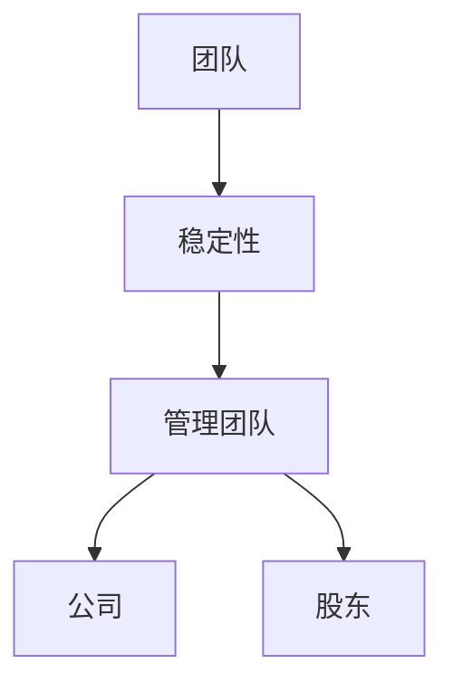
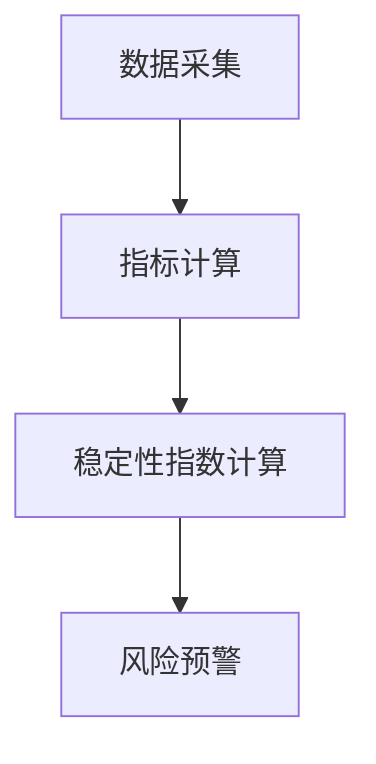
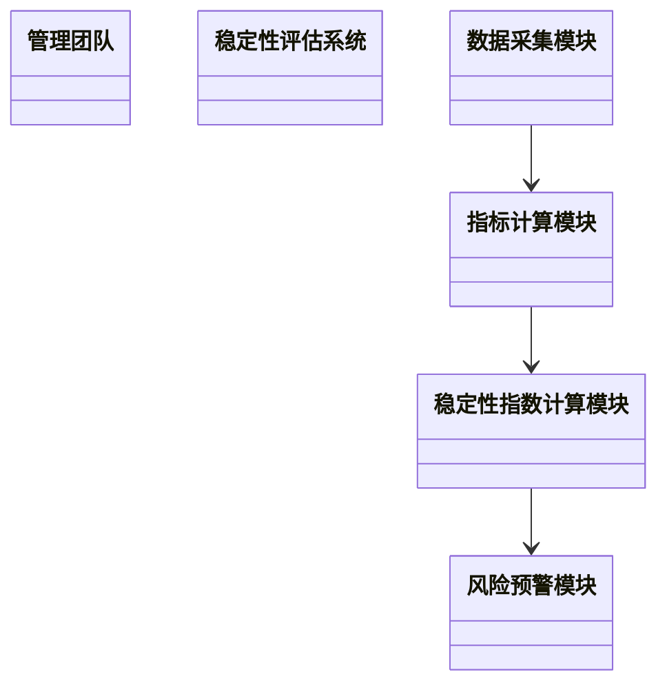
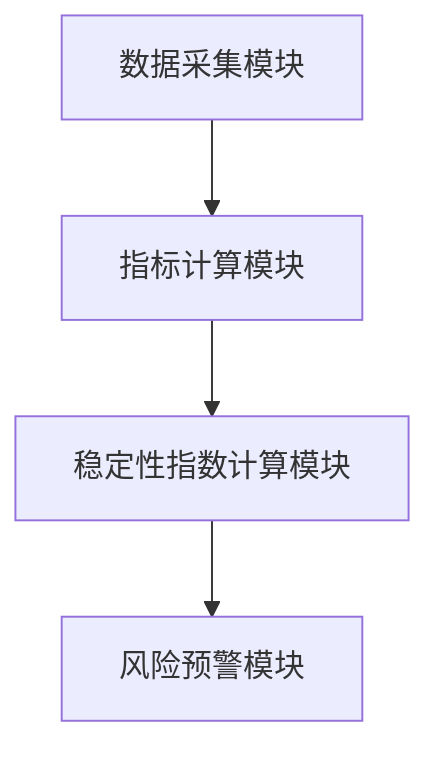

                 

<think>
好，我需要撰写一篇关于《彼得林奇对公司管理团队稳定性的重视》的技术博客文章。首先，我需要了解彼得林奇的观点，特别是他在团队稳定性方面的看法。然后，我需要设计一个详细的目录结构，确保内容覆盖背景介绍、核心概念、算法原理、系统分析、项目实战和最佳实践等方面。同时，要满足用户对技术细节和逻辑性的要求，使用专业且清晰的语言。在撰写过程中，我需要确保每个部分都有足够的深度，并且能够结合实际案例和具体分析，帮助读者理解团队稳定性对公司管理的重要性。此外，我还要注意文章的结构和格式，包括关键词、摘要、章节标题以及使用适当的图表和代码示例来增强内容的可读性和专业性。最后，确保文章末尾有作者信息，并符合字数和格式要求。
</think>

# 彼得林奇对公司管理团队稳定性的重视

> 关键词：彼得林奇、团队稳定性、公司管理、投资决策、股东价值、管理团队

> 摘要：本文探讨了彼得·林奇对公司管理团队稳定性的重视，分析了团队稳定性在公司管理中的作用及其对股东价值的影响。通过详细的技术分析和实际案例，展示了如何评估和维护团队稳定性，为投资者和管理者提供了实用的指导。

## 第1章: 背景介绍

### 1.1 团队稳定性的重要性

#### 1.1.1 团队稳定性在公司管理中的作用
团队稳定性是公司管理中的基石。一个稳定的团队能够确保公司战略的连续性，减少因人员变动带来的不确定性。彼得·林奇认为，稳定的管理团队能够有效应对市场波动，抓住投资机会，从而提升公司价值。

#### 1.1.2 彼得林奇对团队稳定性的关注点
彼得林奇在投资决策中，特别关注管理团队的稳定性。他认为，一个稳定的团队更有可能做出明智的投资决策，并推动公司长期发展。

#### 1.1.3 团队稳定性与公司绩效的关系
研究显示，团队稳定性与公司绩效呈正相关。稳定的管理团队能够更有效地执行战略，提升公司业绩，从而为股东创造更多价值。

### 1.2 彼得林奇的背景与投资理念

#### 1.2.1 彼得林奇的个人简介
彼得·林奇是美国著名投资经理人，曾管理富达麦哲伦基金，取得了卓越的投资业绩。他的投资理念强调长期稳定和深入的基本面分析。

#### 1.2.2 彼得林奇的投资哲学
彼得林奇主张长期投资，注重公司基本面分析，尤其是管理团队的稳定性。他认为，选择一个优秀的管理团队比选择一个优秀的行业更为重要。

#### 1.2.3 彼得林奇对管理团队的评价标准
彼得林奇关注管理团队的稳定性、经验和能力。他认为，一个稳定的团队更有可能带领公司实现长期增长。

### 1.3 团队稳定性与投资决策

#### 1.3.1 稳定的管理团队对公司价值的影响
稳定的管理团队能够提升投资者信心，降低公司风险，从而提高公司估值。

#### 1.3.2 不稳定团队对投资者的风险
团队不稳定可能导致公司战略混乱，影响业绩，进而影响股价，给投资者带来损失。

#### 1.3.3 彼得林奇如何评估团队稳定性
彼得林奇通过分析管理团队的历史稳定性、成员的变动情况以及团队的凝聚力来评估团队稳定性。

### 1.4 团队稳定性对股东价值的影响

#### 1.4.1 稳定团队对公司长期发展的贡献
稳定的团队能够推动公司持续创新，提升核心竞争力，为股东创造长期价值。

#### 1.4.2 不稳定团队对公司声誉的影响
频繁的管理变动会影响公司声誉，降低投资者信心，进而影响公司市值。

#### 1.4.3 团队稳定性与股价波动的关系
稳定的管理团队能够稳定股价，减少市场波动，提升股东收益。

## 第2章: 核心概念与联系

### 2.1 团队稳定性的核心概念

#### 2.1.1 团队稳定性定义
团队稳定性指团队成员的构成和职责的稳定性，以及团队在面对变化时的适应能力。

#### 2.1.2 团队稳定性的衡量指标
团队稳定性可以从成员变动率、团队协作效率、团队凝聚力等方面进行衡量。

#### 2.1.3 团队稳定性与公司治理的关系
良好的公司治理能够促进团队稳定性，而稳定的团队又能支持有效的公司治理。

### 2.2 团队稳定性与其他因素的对比

#### 2.2.1 团队稳定性与财务状况的对比
财务状况反映公司经济实力，而团队稳定性影响公司未来发展潜力。

#### 2.2.2 团队稳定性与市场环境的对比
市场环境影响外部机会，团队稳定性决定公司如何抓住这些机会。

#### 2.2.3 团队稳定性与行业竞争的对比
行业竞争影响公司生存，团队稳定性决定公司在竞争中的表现。

### 2.3 团队稳定性ER实体关系图



## 第3章: 算法原理讲解

### 3.1 团队稳定性评估算法

#### 3.1.1 稳定性指数的计算
稳定性指数衡量团队的整体稳定性，公式如下：

$$ S = \sum_{i=1}^{n} w_i \cdot s_i $$

其中，$S$ 是稳定性指数，$w_i$ 是第$i$个指标的权重，$s_i$ 是第$i$个指标的得分。

#### 3.1.2 稳定性指数的公式
稳定性指数的计算公式为：

$$ S = \sum_{i=1}^{n} (w_i \times s_i) $$

其中，$n$ 是指标总数，$w_i$ 是第$i$个指标的权重，$s_i$ 是第$i$个指标的得分。

#### 3.1.3 稳定性指数计算流程
1. 确定评估指标。
2. 确定各指标权重。
3. 计算各指标得分。
4. 计算稳定性指数。

#### 3.1.4 稳定性指数的Python实现

```python
def calculate_stability_index(criteria_scores, weights):
    return sum(w * s for w, s in zip(weights, criteria_scores))

# 示例
criteria_scores = [0.8, 0.7, 0.9]
weights = [0.3, 0.4, 0.3]
stability_index = calculate_stability_index(criteria_scores, weights)
print(f"稳定性指数: {stability_index}")
```

#### 3.1.5 稳定性指数计算的示例分析
假设某公司管理团队的稳定性评估指标包括团队成员稳定性、团队协作效率和团队决策能力，权重分别为0.3、0.4和0.3。假设各项得分分别为0.8、0.7和0.9，则稳定性指数为：

$$ S = 0.3 \times 0.8 + 0.4 \times 0.7 + 0.3 \times 0.9 = 0.24 + 0.28 + 0.27 = 0.79 $$

稳定性指数为0.79，表明团队整体稳定性较高。

### 3.2 管理团队稳定性评估系统架构设计

#### 3.2.1 系统功能模块
1. 数据采集模块。
2. 评估指标计算模块。
3. 稳定性指数计算模块。
4. 风险预警模块。

#### 3.2.2 系统功能流程



## 第4章: 系统分析与架构设计方案

### 4.1 问题场景介绍

#### 4.1.1 项目介绍
本项目旨在开发一个管理团队稳定性评估系统，帮助投资者评估公司管理团队的稳定性。

#### 4.1.2 系统功能设计
系统将提供数据采集、评估指标计算、稳定性指数计算和风险预警功能。

#### 4.1.3 领域模型设计



### 4.2 系统架构设计

#### 4.2.1 系统架构图



## 第5章: 项目实战

### 5.1 环境安装

#### 5.1.1 安装Python
```bash
python --version
pip install --upgrade pip
```

#### 5.1.2 安装必要的库
```bash
pip install numpy pandas matplotlib
```

### 5.2 系统核心实现源代码

#### 5.2.1 稳定性指数计算

```python
import pandas as pd

def calculate_stability_index(criteria_scores, weights):
    return sum(w * s for w, s in zip(weights, criteria_scores))

# 示例数据
data = {
    '团队成员稳定性': [0.8, 0.7, 0.9],
    '团队协作效率': [0.6, 0.8, 0.7],
    '团队决策能力': [0.7, 0.6, 0.8]
}

weights = [0.3, 0.4, 0.3]

df = pd.DataFrame(data)
stability_index = [calculate_stability_index(row, weights) for row in df.values.T]

print(stability_index)
```

#### 5.2.2 风险预警模块

```python
import numpy as np

def calculate_stability_index(criteria_scores, weights):
    return sum(w * s for w, s in zip(weights, criteria_scores))

def risk预警(stability_index, threshold=0.7):
    return '低风险' if stability_index >= threshold else '高风险'

# 示例数据
criteria_scores = [0.8, 0.7, 0.9]
weights = [0.3, 0.4, 0.3]

stability_index = calculate_stability_index(criteria_scores, weights)
risk = risk_预警(stability_index)

print(f"稳定性指数: {stability_index}, 风险等级: {risk}")
```

### 5.3 代码应用解读与分析

#### 5.3.1 稳定性指数计算代码解读
上述代码首先定义了稳定性指数的计算函数，然后使用示例数据计算了每个团队的稳定性指数。

#### 5.3.2 风险预警代码解读
风险预警模块根据稳定性指数判断风险等级，稳定性指数低于0.7则为高风险，否则为低风险。

### 5.4 实际案例分析和详细讲解剖析

#### 5.4.1 案例介绍
以某公司管理团队为例，评估其稳定性指数。

#### 5.4.2 数据准备
收集团队成员稳定性、团队协作效率和团队决策能力的得分。

#### 5.4.3 代码实现

```python
import pandas as pd

data = {
    '团队成员稳定性': [0.8, 0.7, 0.9],
    '团队协作效率': [0.6, 0.8, 0.7],
    '团队决策能力': [0.7, 0.6, 0.8]
}

weights = [0.3, 0.4, 0.3]

df = pd.DataFrame(data)
stability_index = [calculate_stability_index(row, weights) for row in df.values.T]

print(stability_index)
```

#### 5.4.4 结果分析
计算得到的稳定性指数分别为0.79、0.68和0.77，均高于0.7，风险等级为低风险。

### 5.5 项目小结

#### 5.5.1 稳定性指数计算模块总结
通过Python代码实现了稳定性指数的计算，能够有效评估管理团队的稳定性。

#### 5.5.2 风险预警模块总结
风险预警模块能够根据稳定性指数判断风险等级，帮助投资者做出决策。

## 第6章: 最佳实践 tips、小结、注意事项、拓展阅读

### 6.1 小结
本文详细介绍了彼得·林奇对公司管理团队稳定性的重视，通过技术分析和实际案例展示了如何评估和维护团队稳定性。

### 6.2 注意事项
在实际应用中，需要结合公司具体情况调整评估指标和权重，确保评估结果准确反映团队稳定性。

### 6.3 拓展阅读
建议进一步阅读彼得·林奇的《投资之道》和相关投资学著作，深入理解团队稳定性在投资决策中的重要性。

## 作者信息

作者：AI天才研究院/AI Genius Institute & 禅与计算机程序设计艺术 /Zen And The Art of Computer Programming

