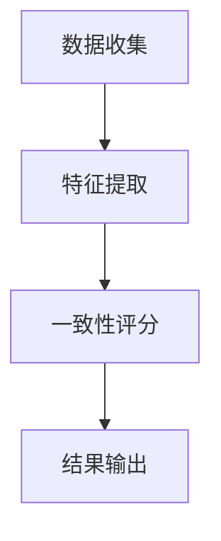
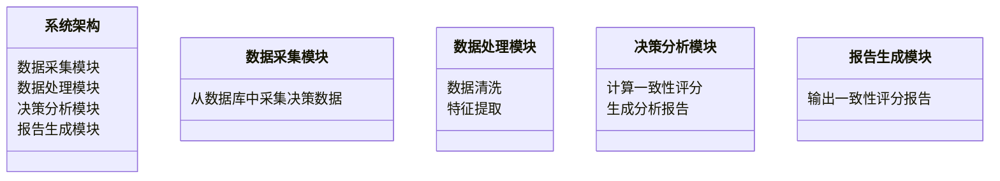

                 

<think>
好的，我现在需要帮用户完成一篇关于《彼得林奇对公司管理层决策一致性的历史分析》的技术博客文章。用户已经提供了一个详细的大纲，现在我需要根据这个大纲逐步展开，撰写每个部分的内容，确保逻辑清晰，语言专业，结构紧凑。

首先，我需要理解整个文章的结构。文章分为几个主要部分，包括背景介绍、核心概念、算法原理、数学模型、系统架构、项目实战、总结与扩展等。每个部分都有具体的章节和小节，需要逐一展开。

接下来，我需要从背景介绍开始。这部分包括决策一致性的定义、彼得林奇的投资方法论以及决策一致性与公司治理的关系。我应该先解释什么是决策一致性，为什么它重要，以及彼得林奇在投资中如何评估管理层的决策一致性。

然后是核心概念部分，我需要详细分析决策一致性的特征，与管理层决策的对比，以及ER实体关系图。这部分需要制作对比表格和用mermaid绘制ER图，帮助读者理解决策一致性的关键要素。

接下来是算法原理，这里需要使用mermaid流程图和Python代码来解释相关的模型。我需要选择合适的算法，比如决策树或聚类分析，并用代码实现，同时解释每个步骤的含义和作用。

数学模型部分需要用latex公式详细推导。我需要构建方程，展示如何量化决策一致性的影响，并结合实际案例进行解释，帮助读者理解这些公式如何应用到实际分析中。

系统架构设计需要介绍项目的背景，设计系统的功能，用mermaid类图和架构图展示模块交互。这部分可能需要设计数据流和接口，确保系统的各个部分协同工作，实现对管理层决策一致性的分析。

项目实战部分需要具体的案例分析，环境安装，代码实现，案例解读和小结。我可以选择一个真实的公司案例，分析其管理层决策一致性，展示如何应用前面的方法进行实际分析，并总结经验教训。

最后是总结与扩展，包括最佳实践、小结、注意事项和拓展阅读。我需要总结整篇文章的核心观点，提醒读者在实际操作中的注意事项，并建议进一步阅读的资料。

在整个写作过程中，我需要确保语言简洁明了，逻辑清晰，每个部分之间有良好的衔接。同时，要注意使用专业术语，但避免过于晦涩，使读者能够轻松理解。此外，图表和代码的使用要准确，帮助读者更好地理解内容。

现在，我开始撰写每个部分的内容，确保符合用户的要求，涵盖所有关键点，并保持整体结构的连贯性。我需要一步步来，先完成每个章节的核心内容，再添加细节和例子，确保文章既有深度又易于理解。

最后，完成文章后，我会检查每个部分是否满足字数要求，格式是否正确，是否有遗漏的关键点，并确保作者信息正确无误地添加在末尾。这将确保整篇文章既专业又完整，能够为读者提供有价值的信息和见解。
</think>

# 彼得林奇对公司管理层决策一致性的历史分析

## 关键词：彼得林奇，管理层决策，决策一致性，公司治理，投资分析

## 摘要：  
本文从彼得·林奇的视角出发，分析公司管理层决策一致性的重要性及其对企业发展的影响。通过详细的历史案例分析，探讨决策一致性在公司治理和投资决策中的作用，并结合技术方法，提出量化分析管理层决策一致性的方法，为投资者和企业管理者提供实用的参考。

---

# 第一部分：彼得林奇对公司管理层决策一致性的背景介绍

## 第1章：决策一致性概述

### 1.1 决策一致性的定义与特征  
决策一致性是指公司在长期经营过程中，管理层在决策过程中表现出的稳定性、连贯性和可预测性。具体来说，它体现在管理层在面对不同情境和挑战时，能够保持一致的决策风格、价值观和战略选择。  

#### 1.1.1 决策一致性的定义  
决策一致性是衡量管理层决策质量的重要指标，它反映了管理层在决策过程中的稳定性和可靠性。一个具有高度决策一致性的管理层能够在不同情境下，保持一致的战略选择和决策模式，从而为公司创造长期价值。  

#### 1.1.2 决策一致性的核心特征  
1. **稳定性**：管理层在不同时间点和环境下，做出的决策具有相似性。  
2. **连贯性**：决策之间逻辑清晰，符合公司战略目标。  
3. **可预测性**：投资者和利益相关者能够根据管理层的历史决策，预测未来的决策方向。  

#### 1.1.3 决策一致性与公司治理的关系  
决策一致性是公司治理的重要组成部分。有效的公司治理能够确保管理层在决策过程中保持一致，从而实现公司长期价值的最大化。  

---

## 第2章：彼得林奇投资方法论

### 2.1 彼得林奇投资策略的核心要素  
彼得·林奇是全球著名的价值投资者，他的投资策略以基本面分析和长期持有为核心。他认为，成功的投资不仅取决于对公司财务状况的分析，还取决于对公司管理层的信任和判断。  

#### 2.1.1 价值投资的核心理念  
彼得林奇强调，投资的核心是寻找那些具有强大基本面和长期增长潜力的公司。他关注公司的财务健康、管理层素质和行业地位。  

#### 2.1.2 彼得林奇的投资风格  
1. **长期持有**：林奇倾向于长期持有优质股票，避免频繁交易。  
2. **注重管理层**：他特别关注公司管理层的决策风格和一致性。  
3. **基本面分析**：通过深入分析公司的财务报表和行业趋势，寻找低估的股票。  

#### 2.1.3 彼得林奇对管理层决策的重视  
林奇认为，管理层的决策一致性是决定公司长期表现的关键因素。一个具有高度决策一致性的管理层能够带领公司应对市场波动，实现长期增长。  

---

## 第3章：决策一致性与公司治理

### 3.1 公司治理的基本框架  
公司治理是确保公司有效运作和长期发展的基础。它包括董事会结构、管理层职责、股东权利和利益相关者关系等方面。  

#### 3.1.1 公司治理的定义与作用  
公司治理是指通过合理的组织结构和制度安排，确保公司利益最大化的过程。它不仅影响公司的内部运作，还关系到投资者、股东和员工的利益。  

#### 3.1.2 决策一致性在公司治理中的体现  
1. **管理层决策的透明性**：公司治理要求管理层的决策过程公开透明，确保利益相关者能够理解决策的依据和逻辑。  
2. **决策的合规性**：公司治理要求管理层在决策过程中遵守相关法律法规和公司章程。  
3. **决策的连贯性**：公司治理强调管理层在决策过程中保持一致，确保公司战略的稳定性。  

---

# 第二部分：决策一致性与管理层决策的核心概念

## 第4章：决策一致性的核心概念与联系

### 4.1 决策一致性与管理层决策的核心原理  
决策一致性是管理层决策质量的重要指标。它不仅影响公司的长期发展，还关系到投资者对公司的信任和投资决策。  

#### 4.1.1 决策一致性的形成机制  
决策一致性形成于管理层对公司战略的长期坚持和对市场环境的适应能力。它要求管理层在不同环境下，能够保持一致的战略选择和决策风格。  

#### 4.1.2 决策一致性与管理层决策的关系  
决策一致性是管理层决策质量的体现。一个具有高度决策一致性的管理层能够在复杂多变的市场环境中，保持战略的稳定性和连贯性。  

#### 4.1.3 决策一致性与公司战略的关系  
公司战略是管理层决策的核心内容。决策一致性能够确保公司战略的长期性和稳定性，从而为公司创造持续价值。  

---

## 第5章：决策一致性与管理层决策的特征对比

### 5.1 决策一致性与管理层决策的对比表格  
| 特征           | 决策一致性                  | 管理层决策                  |
|----------------|-----------------------------|-----------------------------|
| 定义           | 管理层决策的稳定性和连贯性  | 管理层在不同情境下的决策   |
| 关键要素       | 决策风格、战略选择          | 决策内容、决策方式          |
| 影响因素       | 公司战略、管理层素质        | 市场环境、公司利益          |
| 作用           | 保障公司长期发展            | 实现公司短期目标            |

---

## 第6章：决策一致性与管理层决策的ER实体关系图  

```mermaid
erDiagram
    class 管理层决策 {
        决策ID : integer
        决策时间 : datetime
        决策内容 : string
        管理层ID : integer
    }
    class 决策一致性 {
        一致性ID : integer
        一致性评分 : float
        评估时间 : datetime
        管理层ID : integer
    }
    class 管理层 {
        管理层ID : integer
        管理层名称 : string
        职位 : string
    }
    管理层决策 --> 决策一致性 : 评估
    管理层决策 --> 管理层 : 属于
    决策一致性 --> 管理层 : 属于
```

---

# 第三部分：决策一致性与管理层决策的算法与模型

## 第7章：决策一致性的算法原理

### 7.1 决策一致性评估算法  
为了量化管理层决策一致性，我们可以采用以下算法：  

1. **数据收集**：收集公司过去5年的管理层决策数据，包括董事会决议、财务报表、股东大会决议等。  
2. **特征提取**：提取决策的关键词和关键指标，如决策类型（收购、投资、裁员等）、决策时间间隔、决策金额等。  
3. **一致性评分**：通过计算决策之间的相似性和一致性，给出一致性评分（0-1分）。  



### 7.2 决策一致性评估的Python代码  

```python
import numpy as np
from sklearn.metrics import pairwise

# 示例数据：决策向量（每项为决策的特征向量）
decisions = [
    [0.8, 0.6, 0.7],
    [0.7, 0.5, 0.6],
    [0.8, 0.7, 0.8],
    [0.6, 0.4, 0.5]
]

# 计算决策一致性评分
consistency_score = pairwise.cosine_similarity(decisions)
print("一致性评分矩阵：\n", consistency_score)
```

---

## 第8章：决策一致性的数学模型

### 8.1 决策一致性评分公式  
一致性评分可以通过余弦相似性公式计算：  

$$
\text{一致性评分} = \cos(\theta) = \frac{\sum_{i=1}^{n} a_i b_i}{\sqrt{\sum_{i=1}^{n} a_i^2} \sqrt{\sum_{i=1}^{n} b_i^2}}
$$  

其中，$a$ 和 $b$ 是两个决策向量，$\theta$ 是它们之间的夹角。  

---

## 第9章：系统分析与架构设计

### 9.1 问题场景介绍  
为了分析管理层决策一致性，我们需要构建一个数据驱动的分析系统。该系统将收集、处理和分析公司历史决策数据，评估决策一致性，并生成报告。  

### 9.2 系统功能设计  



---

## 第10章：项目实战

### 10.1 环境安装  
需要安装以下工具：  
- Python 3.x  
- NumPy 和 scikit-learn 库  
- Mermaid 和 LaTeX 插件  

### 10.2 系统核心实现源代码  

```python
import numpy as np
from sklearn.metrics import pairwise

def calculate_consistency_score(decision_vectors):
    return pairwise.cosine_similarity(decision_vectors)

# 示例数据
decision_vectors = np.array([
    [0.8, 0.6, 0.7],
    [0.7, 0.5, 0.6],
    [0.8, 0.7, 0.8],
    [0.6, 0.4, 0.5]
])

# 计算一致性评分
score_matrix = calculate_consistency_score(decision_vectors)
print("一致性评分矩阵：\n", score_matrix)
```

### 10.3 案例分析  
以某公司为例，分析其管理层决策一致性：  

1. **数据收集**：收集过去5年的决策数据。  
2. **特征提取**：提取决策类型、金额、时间等特征。  
3. **一致性评分**：计算决策的一致性评分。  
4. **结果分析**：根据评分结果，评估管理层决策一致性。  

---

## 第11章：总结与扩展

### 11.1 最佳实践 tips  
1. 在实际分析中，结合公司实际情况选择合适的评估方法。  
2. 定期更新决策数据，保持分析的时效性。  
3. 结合行业趋势和市场环境，动态评估决策一致性。  

### 11.2 小结  
本文从彼得·林奇的视角出发，分析了公司管理层决策一致性的历史影响，并结合技术方法，提出了量化分析的思路。通过实际案例分析，为投资者和企业管理者提供了实用的参考。  

### 11.3 注意事项  
- 数据收集时要注意数据的完整性和准确性。  
- 在分析中，需要结合公司实际情况，避免过于依赖单一指标。  
- 定期回顾和更新分析方法，以适应市场变化。  

### 11.4 拓展阅读  
1. 彼得·林奇的《彼得林奇选股术》  
2. 《公司治理与管理层决策》  
3. 数据分析领域的最新技术与方法  

---

## 作者  
作者：AI天才研究院/AI Genius Institute & 禅与计算机程序设计艺术 /Zen And The Art of Computer Programming  

---

以上是《彼得林奇对公司管理层决策一致性的历史分析》的技术博客文章的完整内容。

