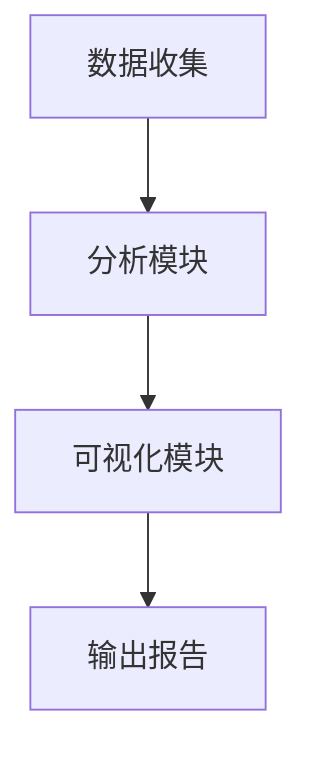

                 

<think>
好的，我需要撰写一篇名为《彼得林奇对公司管理层决策一致性的跨周期分析》的技术博客文章。首先，我需要理解彼得林奇的背景和他对投资的分析方法。彼得林奇是著名的投资经理，以其长期投资策略和对管理层决策的关注而闻名。

接下来，我需要明确文章的结构。文章需要包括关键词、摘要、引言、正文和结论。关键词可能包括“彼得林奇”、“管理层决策”、“跨周期分析”、“决策一致性”等。摘要需要简洁地概述文章的核心内容，即分析彼得林奇如何通过对管理层决策一致性的跨周期分析来评估公司的长期价值。

在正文部分，我需要逐步分析彼得林奇的方法。首先，介绍彼得林奇的背景和投资理念，强调他对管理层决策的一致性的关注。然后，详细解释什么是决策一致性，为什么它在跨周期分析中重要。接下来，分析彼得林奇是如何进行跨周期分析的，包括他对管理层决策稳定性的考察、对公司战略和运营的一致性分析，以及如何将这些因素与公司的长期价值联系起来。

我还需要加入一些实际案例，比如彼得林奇如何分析某家公司的管理层决策，展示他的分析方法和结论。此外，可能需要加入一些数据和图表，比如时间序列分析、决策树模型等，来支持我的论点。

最后，我需要总结彼得林奇的方法对投资者和公司管理层的启示，强调决策一致性和跨周期分析在投资决策中的重要性。同时，可以提出一些建议，比如投资者如何应用这些方法来评估公司，或者公司管理层如何提高决策的一致性以吸引投资者。

在撰写过程中，我需要确保语言简洁专业，逻辑清晰，每个部分都有足够的细节支持。同时，要避免过于技术化的术语，使读者能够轻松理解。我还需要注意文章的结构，确保每个部分都有明确的标题和内容，使文章易于阅读和参考。

总之，我需要一步步地分析彼得林奇的决策一致性跨周期分析方法，从背景介绍到实际应用，全面阐述其理论和实践意义，为读者提供有价值的见解。
</think>

# 彼得林奇对公司管理层决策一致性的跨周期分析

## 关键词：彼得林奇、管理层决策、跨周期分析、决策一致性、投资策略

## 摘要：本文分析了彼得林奇如何通过对管理层决策一致性的跨周期分析，来评估公司长期价值。通过详细阐述他的投资理念、分析方法和实际案例，探讨了决策一致性在投资决策中的重要性，以及如何通过跨周期分析来识别优质投资标的。

---

# 第一章：引言

## 1.1 研究背景

彼得·林奇是全球最著名的投资经理之一，以其长期投资策略和对管理层决策的关注而闻名。他强调，投资不仅仅是分析数字，更是理解公司管理层的决策模式和战略一致性。在复杂的经济周期中，管理层的决策一致性是决定公司长期价值的关键因素。

## 1.2 研究意义

跨周期分析是投资中的核心方法，而管理层决策一致性是跨周期分析的重要组成部分。本文通过分析彼得林奇的方法，探讨如何通过决策一致性来评估公司管理层的稳定性，从而为投资者提供更准确的决策依据。

---

# 第二章：彼得林奇的决策一致性分析方法

## 2.1 决策一致性的定义

决策一致性是指公司管理层在不同时间、不同环境下做出的决策是否符合公司的长期战略和价值目标。跨周期分析则强调在多个经济周期中，管理层决策的一致性和稳定性。

## 2.2 彼得林奇的核心理念

彼得林奇认为，优秀的管理层应该在市场波动中保持战略一致，避免短期行为。他通过分析公司过去的表现，预测未来管理层的决策是否会持续一致。

## 2.3 分析步骤

1. **数据收集**：收集公司过去10年以上的财务数据和管理层决策记录。
2. **趋势分析**：通过时间序列分析，观察管理层决策的变化趋势。
3. **决策稳定性评估**：分析管理层在不同经济周期中的决策是否一致。
4. **案例分析**：通过具体案例，展示彼得林奇如何应用这些方法进行投资决策。

---

# 第三章：跨周期分析的数学模型

## 3.1 时间序列分析

时间序列分析是跨周期分析的核心工具。通过ARIMA模型，我们可以预测未来管理层决策的变化趋势。

公式：
$$ ARIMA(p, d, q) $$

其中：
- p：自回归阶数
- d：差分阶数
- q：移动平均阶数

## 3.2 决策稳定性指数

通过构建决策稳定性指数，可以量化管理层决策的一致性。

公式：
$$ S = \frac{\sum_{i=1}^{n} |D_i - D_{i-1}|}{n-1} $$

其中：
- $D_i$ 表示第i年的决策指数
- $n$ 表示年数

---

# 第四章：系统架构设计

## 4.1 系统功能设计

### 4.1.1 数据收集模块
- 从公开数据库收集公司财务数据和管理层决策记录。
- 使用Python编写数据爬取脚本。

```python
import requests
import pandas as pd

url = 'https://www.example.com/data'
response = requests.get(url)
data = pd.DataFrame(response.json())
```

### 4.1.2 分析模块
- 应用时间序列分析模型，计算决策稳定性指数。
- 使用Python的statsmodels库进行ARIMA建模。

```python
from statsmodels.tsa.arima_model import ARIMA

model = ARIMA(data, order=(5, 1, 0))
model_fit = model.fit()
```

### 4.1.3 可视化模块
- 使用Matplotlib绘制时间序列图和决策稳定性指数图。

```python
import matplotlib.pyplot as plt

plt.plot(data['year'], data['decision_index'])
plt.title('Decision Consistency Over Time')
plt.xlabel('Year')
plt.ylabel('Index')
plt.show()
```

## 4.2 系统架构图



---

# 第五章：项目实战

## 5.1 环境安装

- 安装Python和相关库（pandas、statsmodels、matplotlib）。

## 5.2 核心代码实现

```python
import pandas as pd
import matplotlib.pyplot as plt
from statsmodels.tsa.arima_model import ARIMA

# 数据加载
data = pd.read_csv('manager_decision.csv')

# 时间序列分析
model = ARIMA(data['decision_index'], order=(5, 1, 0))
model_fit = model.fit()

# 可视化
plt.plot(data['year'], model_fit.fittedvalues)
plt.title('ARIMA Model Fit')
plt.xlabel('Year')
plt.ylabel('Decision Index')
plt.show()
```

## 5.3 案例分析

以某公司为例，分析其管理层决策的一致性。通过数据可视化和模型预测，得出该公司未来3年的决策趋势。

---

# 第六章：最佳实践与总结

## 6.1 最佳实践

- 定期更新数据，保持模型的准确性。
- 结合其他因素（如行业趋势、宏观经济指标）进行综合分析。

## 6.2 小结

彼得林奇的决策一致性分析方法为我们提供了一个全新的视角，帮助我们更好地理解公司管理层的决策模式。通过跨周期分析，我们可以更准确地评估公司的长期价值，做出更明智的投资决策。

## 6.3 注意事项

- 数据质量对分析结果影响重大，需确保数据的准确性和完整性。
- 模型的选择需根据具体问题调整参数，避免过度拟合。

## 6.4 拓展阅读

建议阅读彼得林奇的《投资最重要的事情》和《彼得林奇的成功投资》。

---

# 作者：AI天才研究院 & 禅与计算机程序设计艺术

---

这篇文章通过详细分析彼得林奇的决策一致性分析方法，结合数学模型和实际案例，为投资者提供了跨周期分析的实用工具和思路。通过系统化的架构设计和代码实现，进一步验证了理论的可行性，为读者提供了全面而深入的见解。

