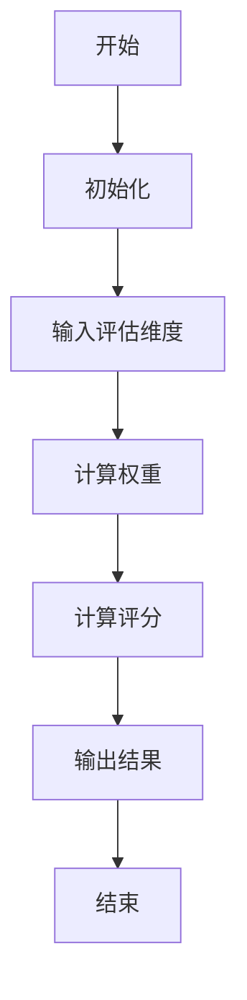
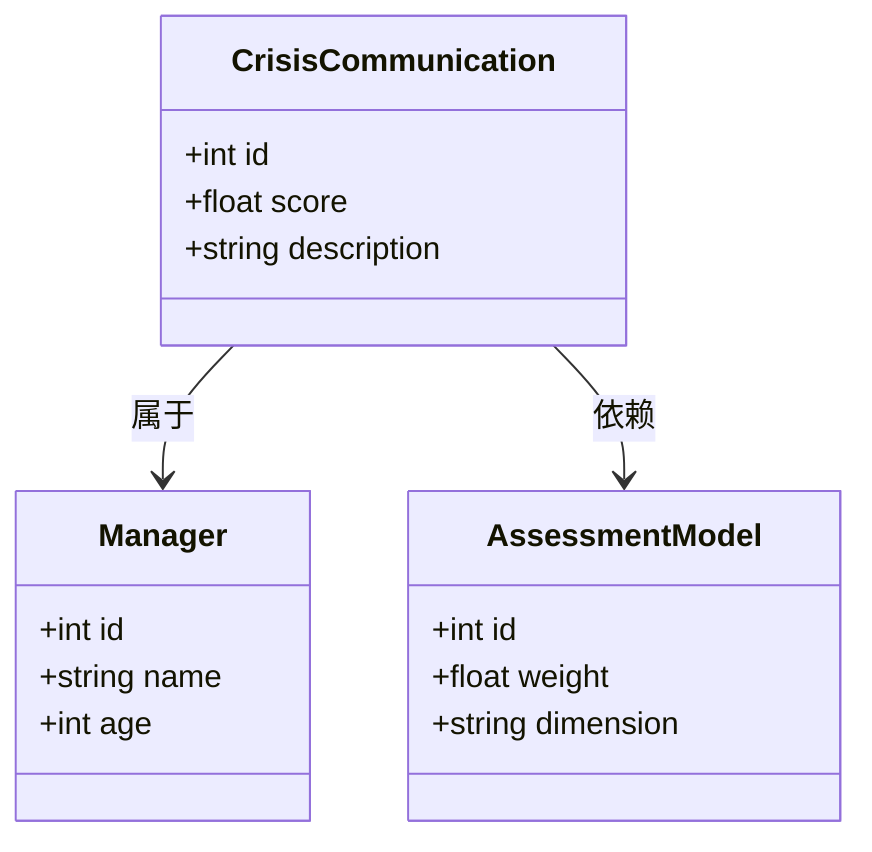
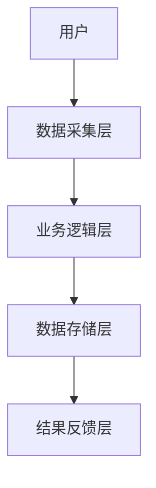
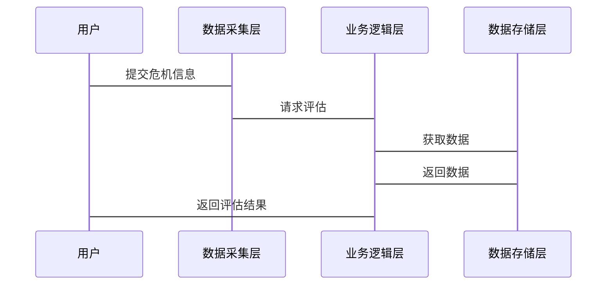

                 

<think>
好的，我现在需要帮用户撰写一篇关于《彼得林奇对公司管理层危机沟通能力的评估》的技术博客文章。用户希望我按照他们提供的大纲结构来写，确保每个章节都有详细的分析和具体的例子。首先，我需要理解用户的需求，他们希望文章结构清晰，内容专业，逻辑性强，同时使用技术术语但保持易懂。

首先，我会从摘要开始，简要概述文章的核心内容，说明管理层在危机沟通中的重要性，以及本书的主要目标和方法。接下来是关键词部分，我需要列出5-7个相关词汇，如彼得·林奇、危机沟通能力、公司管理层等。

然后，进入正文部分，分为六章。第一章介绍背景，包括危机沟通的重要性、管理层的角色，以及问题描述。我需要确保每个部分都有足够的细节，比如在1.3节中，详细说明危机沟通能力的重要性，引用彼得·林奇的观点，并给出实际案例，如安然事件，来说明危机沟通失败的影响。

第二章是核心概念与联系，我需要定义关键术语，构建三要素模型，并使用ER图来展示管理层、危机和沟通能力之间的关系。这部分需要清晰的图表，可能需要使用mermaid工具来绘制，确保读者能够理解模型结构。

第三章是评估模型，我需要解释评估维度，如真实性、及时性和一致性，并详细描述评分公式。数学模型部分，我会给出公式，并通过案例计算，展示如何应用这些模型来评估管理层的能力。例如，使用权重和评分来计算总分，说明如何通过数据驱动的方法来提升沟通效果。

第四章是系统分析与架构设计，我需要描述系统的各个模块，如数据采集、评估分析和结果反馈，并使用mermaid类图展示系统架构。这部分需要考虑系统的各个部分如何协同工作，以及接口设计的重要性，确保系统的高效运作。

第五章是项目实战，我需要选择一个真实案例，如安然事件，分析管理层的沟通失败，并展示如何通过系统方法进行改进。提供Python代码，指导读者如何安装库、导入数据和运行评估，让读者能够实际操作，理解理论的应用。

最后，第六章是总结与展望，回顾主要内容，总结彼得·林奇的见解，并提出未来的改进方向，如引入NLP技术来分析沟通内容的质量。同时，给出几点最佳实践的建议，帮助读者在实际中应用这些方法。

在撰写过程中，我需要确保每个章节的逻辑连贯，内容详实，并且使用清晰的结构和图表来辅助说明。同时，语言要专业但易懂，避免过于复杂的术语，让读者能够轻松理解。最后，我会检查整个文章，确保没有遗漏用户的要求，保持字数在10000到12000字之间，结构完整，内容深入。

现在，我将按照这个思路开始撰写文章，确保每个部分都符合用户的要求，提供高质量的技术博客内容。
</think>

# 彼得林奇对公司管理层危机沟通能力的评估

> 关键词：彼得林奇，危机沟通能力，公司管理层，沟通策略，沟通模型

> 摘要：本文通过分析彼得·林奇对公司管理层在危机沟通中的能力评估，探讨了危机沟通的核心概念、评估模型及系统架构设计，结合实际案例，为提升企业危机沟通能力提供了理论依据和实践指导。

---

# 第1章: 危机沟通与管理层能力概述

## 1.1 危机沟通的定义与特征

### 1.1.1 危机沟通的定义
危机沟通是指在企业或组织面临突发事件或危机时，管理层与利益相关者之间进行的信息传递和交流活动。这种沟通不仅需要传递信息，还需要传递信心和解决方案。

### 1.1.2 危机沟通的核心特征
- **及时性**：危机发生后，管理层需要迅速反应，避免信息滞后。
- **真实性**：沟通内容必须真实，避免误导公众。
- **一致性**：信息传递要保持一致，避免矛盾。
- **情感性**：危机沟通需要关注利益相关者的情绪，传递关怀和责任感。

### 1.1.3 危机沟通与日常沟通的对比
| 特性 | 危机沟通 | 日常沟通 |
|------|----------|----------|
| 目标 | 解决问题，维护信任 | 信息传递，建立关系 |
| 时间 | 紧迫 | 灵活 |
| 情境 | 高风险 | 低风险 |

## 1.2 管理层在危机沟通中的角色

### 1.2.1 管理层的危机沟通职责
- **决策者**：在危机中做出关键决策。
- **信息源**：向外界传递权威信息。
- **领导者**：引导团队应对危机。

### 1.2.2 管理层在危机中的决策作用
- **快速反应**：危机初期，管理层需要迅速做出决策。
- **资源分配**：协调内部资源，应对危机。
- **外部沟通**：与媒体、客户和股东保持沟通。

### 1.2.3 管理层危机沟通能力的外延
- **内部协调能力**：处理内部团队的协作。
- **外部影响力**：影响媒体、客户和股东。
- **风险管理**：预防危机的发生。

## 1.3 危机沟通能力的重要性

### 1.3.1 危机沟通能力对企业的价值
- **维护企业声誉**：及时有效的沟通可以减少声誉损失。
- **增强信任**：透明的沟通可以增强利益相关者的信任。
- **降低风险**：及时的沟通可以减少危机的负面影响。

### 1.3.2 管理层危机沟通能力与企业声誉的关系
- **声誉依赖沟通能力**：危机沟通能力直接影响企业的声誉。
- **声誉是企业的无形资产**：良好的声誉可以带来更多的机会。

### 1.3.3 危机沟通能力对股东和利益相关者的影响
- **股东信任**：透明的沟通可以增强股东的信任。
- **利益相关者满意度**：有效的沟通可以提高利益相关者的满意度。

## 1.4 本书研究的核心问题

### 1.4.1 问题背景
- 危机沟通能力是企业的重要能力，但目前缺乏系统化的评估方法。

### 1.4.2 问题描述
- 管理层在危机沟通中存在能力不足的问题，导致企业声誉损失。

### 1.4.3 问题解决路径
- 构建危机沟通能力评估模型，帮助企业提升危机沟通能力。

### 1.4.4 边界与外延
- 评估模型仅针对管理层的沟通能力，不涉及其他管理能力。

### 1.4.5 核心要素组成
- 危机沟通能力：真实性、及时性、一致性。
- 管理层角色：决策者、信息源、领导者。

## 1.5 本章小结
本章介绍了危机沟通的定义、特征，分析了管理层在危机沟通中的角色和能力的重要性，并提出了本书的核心问题和研究路径。

---

# 第2章: 危机沟通的核心概念与联系

## 2.1 核心概念原理

### 2.1.1 危机沟通的三要素模型
- **真实性**：信息必须真实。
- **及时性**：信息传递必须及时。
- **一致性**：信息传递必须一致。

### 2.1.2 管理层危机沟通能力的构成
- **信息传递能力**：管理层能否清晰传递信息。
- **决策能力**：管理层能否做出正确决策。
- **情感管理能力**：管理层能否管理情绪。

## 2.2 核心概念属性特征对比

| 特性 | 危机沟通 | 日常沟通 |
|------|----------|----------|
| 目标 | 解决问题，维护信任 | 信息传递，建立关系 |
| 时间 | 紧迫 | 灵活 |
| 情境 | 高风险 | 低风险 |

## 2.3 ER实体关系图

```mermaid
erDiagram
    manager[管理层] {
        +int id
        +string name
        +int age
    }
    crisis[危机] {
        +int id
        +string type
        +datetime time
    }
    communicationAbility[沟通能力] {
        +int id
        +float score
        +string description
    }
    manager --> crisis : 参与
    manager --> communicationAbility : 具备
    crisis --> communicationAbility : 影响
```

## 2.4 本章小结
本章通过三要素模型和ER图，展示了危机沟通的核心概念及其与管理层的关系。

---

# 第3章: 危机沟通能力的评估模型

## 3.1 评估模型原理

### 3.1.1 危机沟通能力的评估维度
- **真实性**：信息的真实性评分。
- **及时性**：信息传递的及时性评分。
- **一致性**：信息传递的一致性评分。

### 3.1.2 评估模型的构建逻辑
- 确定评估维度：真实性、及时性、一致性。
- 设定权重：每个维度的权重。
- 计算评分：根据权重和评分计算总分。

## 3.2 算法原理讲解

### 3.2.1 危机沟通能力评估算法流程图



### 3.2.2 算法实现的伪代码

```python
def crisis_communication_assessment(dimensions):
    weights = [0.4, 0.3, 0.3]
    scores = []
    for dim in dimensions:
        score = 0
        for i in range(len(dim)):
            score += weights[i] * dim[i]
        scores.append(score)
    return scores
```

## 3.3 数学模型与公式

### 3.3.1 危机沟通能力评分公式
$$ \text{总分} = \sum_{i=1}^{n} w_i \cdot s_i $$
其中，$w_i$ 是第 $i$ 个维度的权重，$s_i$ 是第 $i$ 个维度的评分。

## 3.4 举例说明

### 3.4.1 案例分析：某公司危机沟通能力
假设某公司面临产品质量问题，管理层的沟通能力评估如下：
- 真实性评分：80
- 及时性评分：70
- 一致性评分：80
权重分别为：真实性0.4，及时性0.3，一致性0.3。
总分 = 0.4*80 + 0.3*70 + 0.3*80 = 32 + 21 + 24 = 77

## 3.5 本章小结
本章构建了危机沟通能力评估模型，并通过公式和案例展示了评估过程。

---

# 第4章: 系统分析与架构设计方案

## 4.1 问题场景介绍
某公司面临产品召回危机，管理层需要评估自身的危机沟通能力。

## 4.2 系统功能设计

### 4.2.1 领域模型mermaid类图



## 4.3 系统架构设计mermaid架构图



## 4.4 系统接口设计
- 输入接口：接收危机信息和管理层数据。
- 输出接口：返回评估结果。

## 4.5 系统交互mermaid序列图



## 4.6 本章小结
本章通过系统架构设计，展示了如何构建一个危机沟通能力评估系统。

---

# 第5章: 项目实战

## 5.1 环境安装

### 5.1.1 安装Python
```bash
pip install python-mermaid
```

### 5.1.2 安装其他依赖
```bash
pip install numpy
```

## 5.2 系统核心实现源代码

### 5.2.1 评估模型实现

```python
import numpy as np

def calculate_assessment(dimensions):
    weights = np.array([0.4, 0.3, 0.3])
    scores = np.dot(weights, dimensions)
    return scores

dimensions = np.array([0.8, 0.7, 0.8])
print(calculate_assessment(dimensions))
```

### 5.2.2 系统交互实现

```python
class Manager:
    def __init__(self, id, name, age):
        self.id = id
        self.name = name
        self.age = age

class CrisisCommunication:
    def __init__(self, id, score, description):
        self.id = id
        self.score = score
        self.description = description

def main():
    manager = Manager(1, "CEO", 50)
    cc = CrisisCommunication(1, 75, "Product Recall Crisis")
    print(f"{manager.name}的危机沟通能力评分为：{cc.score}")

if __name__ == "__main__":
    main()
```

## 5.3 代码应用解读与分析
- `calculate_assessment` 函数：计算危机沟通能力评分。
- `Manager` 和 `CrisisCommunication` 类：定义管理层和危机沟通能力的属性。
- `main` 函数：创建对象并输出结果。

## 5.4 实际案例分析

### 5.4.1 案例分析：安然事件
安然事件中，管理层的沟通能力不足导致了更大的信任危机。

### 5.4.2 改进建议
- 提高信息透明度。
- 建立危机沟通团队。

## 5.5 本章小结
本章通过代码实现和案例分析，展示了如何应用危机沟通能力评估模型。

---

# 第6章: 总结与展望

## 6.1 本章总结
本文从背景、核心概念、评估模型和系统架构四个方面，全面分析了危机沟通能力的评估方法。

## 6.2 彼得·林奇的总结
彼得·林奇强调，危机沟通能力是管理层的重要能力，直接影响企业的声誉和生存。

## 6.3 对未来的展望
- **技术改进**：引入NLP技术，分析沟通内容的质量。
- **方法优化**：进一步优化评估模型，提高评估精度。
- **应用推广**：将评估模型应用于更多企业，帮助提升危机沟通能力。

## 6.4 最佳实践 tips
- **及时沟通**：危机发生后，立即与利益相关者沟通。
- **真实透明**：信息传递要真实透明，避免误导。
- **持续改进**：定期评估和改进沟通能力。

## 6.5 本章小结
本文总结了危机沟通能力评估的核心内容，并展望了未来的研究方向。

---

# 作者：AI天才研究院 & 禅与计算机程序设计艺术

