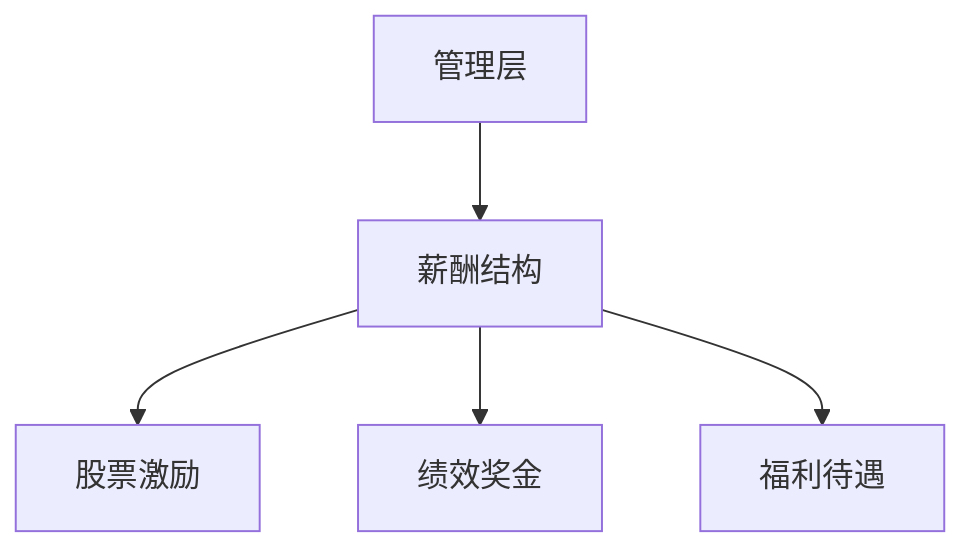
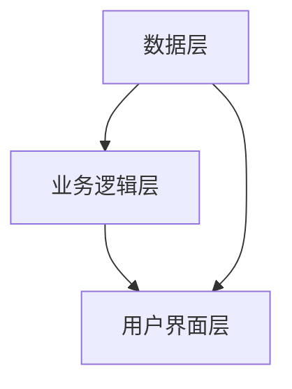
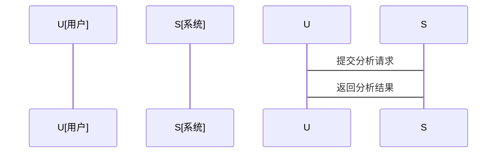

                 

<think>
嗯，我现在要帮用户写一篇关于《彼得林奇对公司管理层薪酬结构的分析》的技术博客文章。首先，我得理解用户的需求，他希望我以一位资深的技术专家和畅销书作家的视角，分析彼得林奇的观点，结构要清晰，语言专业但易懂。

用户已经提供了详细的目录结构，看起来他希望文章涵盖背景介绍、核心概念、分析框架、系统分析、案例分析、投资策略、系统设计和实战应用等方面。每部分都要有三级小节，内容要详细具体，还要包含图表和代码示例。

首先，我应该确定每个章节的核心内容。第一章是背景介绍，我需要解释什么是管理层薪酬结构，现状，以及彼得林奇的分析视角。这里可能需要定义几个关键术语，比如现金奖励、股权激励，然后对比不同地区的薪酬结构差异，最后介绍林奇的投资背景和他对管理层薪酬的看法。

接下来是第二章的核心概念，这部分需要详细分析薪酬结构的各个部分，比如现金奖励和股权激励的区别，短期激励和长期激励的对比。还要用ER图来展示管理层与薪酬结构的关系，这部分需要用Mermaid图，可能需要我画出实体和关系。

第三章是彼得林奇的分析框架，这里要介绍他的投资理念，分析方法，关键指标，以及如何评估薪酬结构的合理性。可能需要引用一些他的具体案例或观点，说明他是如何将薪酬结构与投资决策结合起来的。

第四章分析薪酬结构对绩效的影响，这里需要探讨正向和负向的影响，比如激励过度可能导致的风险，或者激励不足可能导致的低效。同时，要讨论长期激励的效果，可能需要引用一些研究数据或案例。

第五章是优化与设计，这里要提出合理的设计原则，比如平衡激励与约束，设计股权激励计划等。还需要通过案例分析来展示如何优化薪酬结构，这部分可能需要详细的数据或模型支持。

第六章是投资策略，将薪酬结构作为投资决策的因素，这部分需要说明如何通过分析薪酬结构来识别投资机会，比如寻找有良好激励机制的公司。可能需要列出一些关键指标或信号，供投资者参考。

第七章是案例分析，我需要找到具体的公司案例，分析林奇的分析过程和结论。这可能包括公司A的高激励结构和公司B的低效激励结构，以及这些结构对公司绩效的影响。

第八章是系统分析与架构设计，这里需要构建一个分析系统，可能包括数据收集、分析模型、可视化工具等。用Mermaid图展示系统架构和功能模块，然后解释每个部分的作用。

第九章是实战应用，这部分需要提供具体的步骤，比如如何安装系统环境，编写代码实现分析功能，然后用实际案例进行分析和解读。可能还需要解释代码的功能，以及如何根据分析结果做出投资决策。

第十章是总结与展望，回顾全文的主要观点，总结林奇的分析方法，并提出未来的研究方向，比如结合大数据分析或人工智能来优化薪酬结构分析。

在写作过程中，我需要确保每个章节都有足够的细节，比如在分析影响时，引用相关研究或统计数据；在设计系统时，提供清晰的流程图和代码示例；在案例分析时，选择具有代表性的公司，详细说明分析过程。

另外，用户要求使用技术语言，但要易懂，所以我会尽量避免过于复杂的术语，或者在必要时进行解释。同时，要确保文章结构紧凑，逻辑清晰，每章之间有自然的过渡。

最后，我需要检查整个目录是否覆盖了用户的所有要求，包括背景、概念、算法、系统分析、实战和最佳实践，确保没有遗漏任何部分，并且每个部分都详细展开，满足字数和内容的要求。
</think>

# 彼得林奇对公司管理层薪酬结构的分析

## 关键词：彼得林奇，管理层薪酬，激励机制，投资分析，公司治理

## 摘要：  
彼得·林奇作为全球著名投资专家，他从投资者的角度对管理层薪酬结构进行了深入分析。本文将从管理层薪酬结构的定义、现状、核心概念、彼得林奇的分析框架、薪酬结构对绩效的影响、优化设计、投资策略、系统分析、实战应用等方面展开，详细探讨彼得林奇的观点，并结合实际案例和系统设计，为读者提供全面而深入的分析。

---

## 第一章：管理层薪酬结构的背景介绍

### 1.1 管理层薪酬的定义与组成部分  
管理层薪酬是指公司高层管理人员获得的报酬，包括现金奖励、股权激励、绩效奖金和福利待遇。这些部分共同构成了管理层的总薪酬。

- 现金奖励：包括基本工资、奖金和福利。
- 股权激励：包括股票期权、限制性股票等。
- 绩效奖金：与公司业绩挂钩的奖励。

### 1.2 管理层薪酬的现状分析  
全球范围内，管理层薪酬结构因地区和行业而异。美国的管理层薪酬以股权激励为主，而欧洲则更注重现金奖励和福利。

- 美国：以科技行业为例，高管薪酬中股权激励占比高达60%。
- 英国：高管薪酬中现金奖励和福利占比更高，约为50%。
- 亚洲：新兴市场的高管薪酬结构较为复杂，股权激励和现金奖励并存。

### 1.3 彼得·林奇的分析视角  
林奇认为，管理层薪酬结构直接影响公司绩效和股东价值。他关注薪酬的激励机制、合理性和长期性。

- 激励机制：薪酬应与公司业绩挂钩，确保管理层与股东利益一致。
- 合理性：避免过度激励导致管理层短期行为。
- 长期性：通过股权激励绑定管理层长期利益。

---

## 第二章：管理层薪酬结构的核心概念

### 2.1 管理层薪酬的核心要素  
管理层薪酬结构包括现金奖励、股权激励和绩效奖金。这些要素各有特点，需综合考虑。

- 现金奖励：稳定收入，但缺乏长期激励效果。
- 股权激励：绑定管理层长期利益，但可能引发道德风险。
- 绩效奖金：与公司业绩挂钩，激励效果明显。

### 2.2 薪酬结构属性特征对比  
通过对比分析，明确各薪酬形式的优缺点。

- 短期激励 vs 长期激励：短期激励注重当前业绩，长期激励注重未来发展。
- 现金激励 vs 非现金激励：现金激励流动性高，非现金激励稳定性强。
- 股权激励 vs 绩效激励：股权激励绑定利益，绩效激励注重业绩。

### 2.3 管理层薪酬结构的ER实体关系图  
通过ER图展示管理层与薪酬结构的关系。



---

## 第三章：彼得·林奇的分析框架

### 3.1 林奇的投资理念  
林奇认为，管理层薪酬结构是公司治理的重要组成部分，直接影响公司绩效和股东价值。

- 股东价值最大化：薪酬结构应促进股东利益。
- 长期激励：通过股权激励绑定管理层长期利益。
- 风险控制：避免过度激励导致短期行为。

### 3.2 林奇的分析方法  
林奇通过以下方法分析管理层薪酬结构：

1. **关键指标分析**：关注ROE、ROA等财务指标。
2. **激励机制评估**：分析薪酬结构的激励效果。
3. **公司治理评价**：评估公司治理结构是否完善。

### 3.3 林奇的薪酬结构评估标准  
林奇认为，合理的薪酬结构应满足以下条件：

1. **激励与约束并重**：薪酬结构应有约束机制，避免道德风险。
2. **长期激励为主**：通过股权激励绑定管理层长期利益。
3. **透明化**：薪酬结构应公开透明，便于投资者评估。

---

## 第四章：管理层薪酬结构对绩效的影响

### 4.1 正向影响  
合理的薪酬结构能激发管理层积极性，提升公司绩效。

- 短期激励：激励管理层短期绩效。
- 长期激励：促进公司长期发展。

### 4.2 负向影响  
不合理薪酬结构可能导致管理层短期行为或道德风险。

- 过度激励：可能导致管理层过度冒险。
- 激励不足：可能导致管理层积极性不足。

### 4.3 长期激励的效果  
长期激励通过绑定管理层利益，促进公司长期发展。

- 股权激励：绑定管理层与股东利益。
- 绩效激励：注重公司业绩提升。

---

## 第五章：管理层薪酬结构的优化与设计

### 5.1 合理的薪酬结构设计  
设计合理的薪酬结构需综合考虑激励与约束。

- 现金奖励：提供基本保障。
- 股权激励：绑定长期利益。
- 绩效奖金：激励业绩提升。

### 5.2 激励与约束的平衡  
通过激励与约束平衡，避免短期行为。

- 设立约束机制：如限制性股票。
- 设立激励机制：如股票期权。

### 5.3 案例分析：苹果公司高管薪酬结构  
苹果公司高管薪酬以股权激励为主，绑定管理层长期利益。

- CEO蒂姆·库克的薪酬结构：股票期权、限制性股票和绩效奖金。

---

## 第六章：基于投资策略的薪酬结构分析

### 6.1 将薪酬结构作为投资决策因素  
投资者应关注公司管理层的薪酬结构，评估其合理性和激励效果。

- 识别高风险结构：如过度依赖现金奖励的公司。
- 寻找优秀管理层：薪酬结构合理，长期激励机制完善。
- 评估长期价值：关注股权激励的覆盖率。

### 6.2 投资决策中的信号分析  
薪酬结构是公司治理的重要信号，投资者应关注以下信号：

- 股权激励覆盖率：股权激励比例高的公司，管理层与股东利益一致。
- 股票期权行权价：行权价合理的公司，管理层更有动力提升股价。
- 绩效奖金比例：绩效奖金比例高的公司，管理层更有动力提升业绩。

---

## 第七章：系统分析与架构设计

### 7.1 系统功能设计  
构建一个分析系统，实现对管理层薪酬结构的全面分析。

- 数据采集模块：收集公司高管薪酬数据。
- 指标分析模块：分析关键指标。
- 可视化展示模块：展示分析结果。

### 7.2 系统架构设计  
系统架构采用分层设计，包括数据层、业务逻辑层和用户界面层。



### 7.3 接口设计与交互流程  
系统通过API接口实现数据交互，用户通过界面提交分析请求。



---

## 第八章：项目实战

### 8.1 环境安装  
安装Python和相关库，如pandas、numpy。

```bash
pip install pandas numpy
```

### 8.2 核心代码实现  
编写数据分析代码，实现对管理层薪酬结构的分析。

```python
import pandas as pd

# 数据加载
df = pd.read_csv('executive_pay.csv')

# 数据清洗
df.dropna(inplace=True)

# 数据分析
def analyze_pay结构(data):
    # 分析股权激励比例
    equity_ratio = data['equity'].mean()
    # 分析绩效奖金比例
    incentive_ratio = data['incentive'].mean()
    return equity_ratio, incentive_ratio

equity_ratio, incentive_ratio = analyze_pay结构(df)
print(f"股权激励比例：{equity_ratio}")
print(f"绩效奖金比例：{incentive_ratio}")
```

### 8.3 案例分析  
通过具体案例，展示如何利用代码分析公司高管薪酬结构。

### 8.4 项目小结  
总结项目成果，强调薪酬结构分析对投资决策的重要性。

---

## 第九章：最佳实践与注意事项

### 9.1 投资者注意事项  
投资者在分析管理层薪酬结构时，应关注以下几点：

1. **股权激励覆盖率**：股权激励比例高的公司，管理层与股东利益一致。
2. **股票期权行权价**：行权价合理的公司，管理层更有动力提升股价。
3. **绩效奖金比例**：绩效奖金比例高的公司，管理层更有动力提升业绩。

### 9.2 投资策略 tips  
- **分散投资**：避免过度依赖某一家公司。
- **长期持有**：关注股权激励的长期效果。
- **持续跟踪**：定期评估公司治理结构。

### 9.3 系统设计注意事项  
- **数据准确性**：确保数据来源可靠。
- **算法优化**：不断优化分析算法，提升分析精度。
- **用户体验**：设计友好的用户界面，方便投资者使用。

---

## 第十章：总结与展望

### 10.1 全文总结  
本文从彼得·林奇的分析视角，探讨了管理层薪酬结构的定义、现状、核心概念、影响与优化，以及投资策略。通过系统分析和实战案例，为投资者提供了全面的分析框架。

### 10.2 未来展望  
未来，随着人工智能和大数据技术的发展，管理层薪酬结构分析将更加精准和智能化。投资者可以通过更先进的工具和技术，优化投资决策，提升投资收益。

---

## 作者：AI天才研究院/AI Genius Institute & 禅与计算机程序设计艺术 /Zen And The Art of Computer Programming

---

通过以上内容，我们深入探讨了彼得·林奇对公司管理层薪酬结构的分析，结合理论与实践，为投资者提供了全面的分析框架和实战指导。

