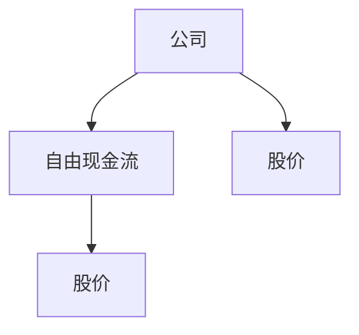
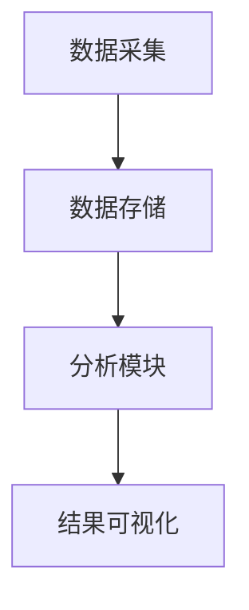

                 


# 彼得林奇对公司自由现金流与股价相关性的动态分析

> 关键词：自由现金流，股价相关性，彼得·林奇，动态分析，投资策略，时间序列分析，回归模型，系统设计

> 摘要：本文深入探讨了彼得·林奇的投资理念与公司自由现金流及股价相关性的动态分析方法。通过分析自由现金流与股价的动态关系，结合数学模型和算法，提出了一种系统化的方法来评估和预测股价走势，帮助投资者做出更明智的投资决策。文章从背景介绍、核心概念、算法原理、系统设计、项目实战到最佳实践，全面阐述了这一主题。

---

# 第1章：自由现金流与股价相关性背景介绍

## 1.1 自由现金流的核心概念

### 1.1.1 自由现金流的定义与特点

自由现金流（Free Cash Flow，FCF）是公司在支付了所有运营费用、税费和资本支出后的剩余现金流量。它反映了公司实际产生的现金流，是评估企业财务健康状况的重要指标。

- **定义**：FCF = 经营活动现金流 - 资本支出
- **特点**：
  - 真实性：反映公司实际的盈利能力和现金流情况。
  - 可持续性：持续的正自由现金流表明公司具备持续增长的能力。

### 1.1.2 自由现金流与传统财务指标的区别

| 指标 | 定义 | 用途 |
|------|------|------|
| 净利润 | 欧几里得算法：净利润 = 收入 - 成本 - 税费 | 衡量公司盈利能力 |
| 每股收益（EPS） | 净利润 / 总股本 | 衡量每股盈利能力 |
| 自由现金流（FCF） | 经营活动现金流 - 资本支出 | 衡量公司现金流健康 |

### 1.1.3 自由现金流在投资分析中的重要性

自由现金流是评估公司内在价值的核心指标。高且稳定的自由现金流意味着公司具备较强的盈利能力和分红能力。

## 1.2 股价相关性与投资分析

### 1.2.1 股价波动的核心驱动因素

- **公司基本面**：净利润、收入增长、自由现金流。
- **市场情绪**：投资者情绪、市场波动。
- **宏观经济**：利率、GDP增长率、通货膨胀。

### 1.2.2 自由现金流与股价的相关性分析

股价与自由现金流呈正相关关系。自由现金流越高，股价通常越高。

## 1.3 彼得·林奇投资理念与自由现金流分析

### 1.3.1 彼得·林奇的投资哲学

- **价值投资**：寻找被市场低估的优质股票。
- **深入研究**：分析公司的财务状况、竞争优势和管理团队。

### 1.3.2 自由现金流在彼得·林奇投资策略中的地位

彼得·林奇认为，自由现金流是衡量公司财务健康状况的重要指标。他偏好那些自由现金流稳定增长的公司。

### 1.3.3 股价与自由现金流动态关系的分析框架

通过分析自由现金流的变化趋势，预测股价的波动。

---

# 第2章：自由现金流与股价相关性的核心概念

## 2.1 自由现金流与股价相关性分析的基本原理

### 2.1.1 自由现金流与股价的动态关系模型

股价与自由现金流的动态关系可以通过回归分析和时间序列分析来建模。

## 2.2 自由现金流与股价相关性的影响因素

### 2.2.1 公司基本面因素

- **收入增长**：收入增长带来更高的自由现金流。
- **利润率**：高利润率公司通常具有更高的自由现金流。

### 2.2.2 市场情绪与宏观经济因素

- **市场情绪**：投资者情绪影响股价波动。
- **宏观经济**：利率和经济周期影响股价。

## 2.3 自由现金流与股价相关性的数学模型

### 2.3.1 自由现金流与股价的回归模型

使用线性回归模型分析自由现金流与股价的关系：

$$ y = \beta_0 + \beta_1 x + \epsilon $$

其中，y为股价，x为自由现金流。

### 2.3.2 时间序列分析模型

使用ARIMA模型预测自由现金流和股价的未来走势。

## 2.4 自由现金流与股价相关性的对比分析

### 2.4.1 自由现金流与股价的属性特征对比表格

| 属性 | 自由现金流 | 股价 |
|------|------------|------|
| 类型 | 流量指标 | 价格指标 |
| 时间性 | 当期现金流 | 现时股价 |

### 2.4.2 自由现金流与股价的ER实体关系图



---

# 第3章：自由现金流与股价相关性的算法原理

## 3.1 自由现金流与股价相关性分析的算法流程

### 3.1.1 数据预处理

- **数据清洗**：处理缺失值、异常值。
- **数据标准化**：归一化处理。

### 3.1.2 关系建模

- **回归分析**：建立自由现金流与股价的回归模型。
- **时间序列分析**：使用ARIMA模型预测未来走势。

### 3.1.3 模型验证

- **模型评估**：使用R平方值评估模型拟合度。
- **交叉验证**：验证模型的稳定性和准确性。

## 3.2 自由现金流与股价相关性分析的数学模型

### 3.2.1 自由现金流与股价的线性回归模型

$$ \hat{y} = \beta_0 + \beta_1 x $$

### 3.2.2 时间序列分析模型

$$ y_t = \phi_1 y_{t-1} + \phi_2 y_{t-2} + \theta_1 \epsilon_{t-1} + \epsilon_t $$

## 3.3 自由现金流与股价相关性分析的Python实现

### 3.3.1 数据清洗与处理

```python
import pandas as pd

# 加载数据
df = pd.read_csv('data.csv')

# 处理缺失值
df.dropna(inplace=True)

# 标准化处理
from sklearn.preprocessing import StandardScaler

scaler = StandardScaler()
scaled_df = scaler.fit_transform(df[['free_cash_flow', 'price']])
```

### 3.3.2 模型训练与验证

```python
from sklearn.linear_model import LinearRegression
from sklearn.metrics import r2_score

model = LinearRegression()
model.fit(scaled_df[:, 0].reshape(-1, 1), scaled_df[:, 1])

y_pred = model.predict(scaled_df[:, 0].reshape(-1, 1))
print(r2_score(scaled_df[:, 1], y_pred))
```

---

# 第4章：自由现金流与股价相关性分析的系统设计

## 4.1 系统分析与设计概述

### 4.1.1 问题场景介绍

分析公司自由现金流与股价的相关性，预测股价走势。

### 4.1.2 系统功能设计

- **数据采集模块**：采集公司财务数据和股价数据。
- **分析模块**：建立回归模型和时间序列模型。
- **可视化模块**：展示分析结果。

### 4.1.3 系统架构设计



## 4.2 系统实现细节

### 4.2.1 数据采集模块

使用爬虫技术采集公司财务数据和股价数据。

### 4.2.2 分析模块

- **回归分析**：使用线性回归模型。
- **时间序列分析**：使用ARIMA模型。

### 4.2.3 可视化模块

使用Matplotlib绘制股价与自由现金流的走势图。

---

# 第5章：自由现金流与股价相关性分析的项目实战

## 5.1 环境安装与配置

安装必要的Python库，如Pandas、Matplotlib、Scikit-learn。

## 5.2 数据清洗与分析

加载数据，处理缺失值和异常值。

## 5.3 模型训练与结果分析

训练回归模型，评估模型性能。

## 5.4 实际案例分析

分析具体公司的自由现金流与股价的相关性，预测股价走势。

## 5.5 项目小结

总结项目经验，提出改进建议。

---

# 第6章：最佳实践与注意事项

## 6.1 小结

总结全文内容，强调自由现金流与股价相关性分析的重要性。

## 6.2 注意事项

- 数据质量：确保数据准确无误。
- 模型选择：选择合适的模型进行分析。
- 风险管理：控制投资风险。

## 6.3 未来研究方向

- 更复杂的时间序列模型。
- 结合机器学习进行预测。

## 6.4 拓展阅读

推荐相关书籍和论文，供读者深入学习。

---

# 作者

作者：AI天才研究院/AI Genius Institute & 禅与计算机程序设计艺术/Zen And The Art of Computer Programming

---

通过以上目录，我们可以系统地分析自由现金流与股价的相关性，结合彼得·林奇的投资理念，利用数学模型和算法进行动态分析，帮助投资者做出更明智的投资决策。

