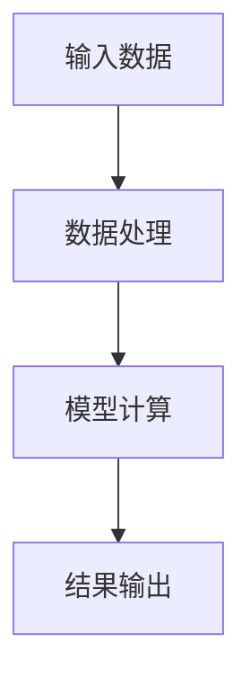
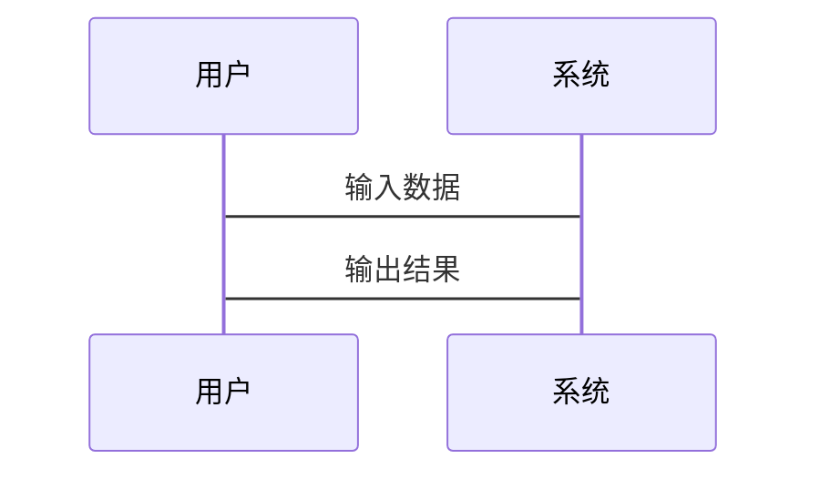

                 

<think>
好，现在我要帮用户完成一个关于《彼得·林奇对公司营运资本管理效率的看法》的技术博客文章。首先，我需要理解用户的具体要求，用户希望文章结构清晰，内容丰富，涵盖从背景介绍到实战分析的各个方面。

我先从文章标题和关键词开始，确保准确传达主题。接着是摘要，简明扼要地总结文章的核心内容。接下来是目录大纲，分为背景介绍、核心概念、算法原理、系统分析、项目实战和最佳实践几个部分。

在背景介绍部分，我需要详细说明彼得·林奇的背景和投资理念，以及营运资本管理的基本概念和重要性。这部分要确保读者理解林奇为何关注营运资本管理，并介绍其基本概念和它对企业发展的影响。

核心概念与联系部分，我需要深入分析营运资本管理的原理，林奇的独特视角，并与传统方法对比。这包括创建对比表格和实体关系图，用Mermaid展示，帮助读者直观理解。

算法原理部分，我需要详细讲解林奇的分析方法，如财务指标和现金流分析，并用数学公式表示。这部分需要使用Latex公式，确保清晰和准确性，同时结合实际例子解释复杂的概念。

系统分析与架构设计部分，我会构建分析框架，包括领域模型和架构图，展示系统的各个部分及其关系。这部分需要使用Mermaid绘制，确保逻辑清晰。

项目实战部分，我需要提供环境安装、核心代码实现和案例分析，帮助读者将理论应用到实际中。这包括详细解释代码和分析案例，展示林奇方法的实际效果。

最后是最佳实践和小结，总结全书内容，并给出注意事项和未来的研究方向。这部分需要确保读者能够巩固所学知识，并指导他们在实际中应用。

在整个过程中，我需要确保文章结构紧凑，逻辑连贯，语言专业但易懂。同时，遵循用户的格式要求，使用markdown格式，包含作者信息，确保文章完整且符合字数要求。

现在，我需要按照这个思路逐步撰写每一部分，确保每个章节内容丰富，详细讲解每个核心概念，并结合实际案例和数学公式进行说明。这需要仔细研究林奇的投资理念和营运资本管理的方法，确保分析的深度和广度，满足用户的高质量要求。
</think>

# 彼得林奇对公司营运资本管理效率的看法

## 关键词：彼得·林奇，公司营运资本，管理效率，投资分析，财务指标

## 摘要：本文从彼得·林奇的投资视角出发，深入分析了公司营运资本管理效率的重要性及其对投资决策的影响。通过探讨林奇的核心理念、分析方法和实际应用，本文为投资者提供了如何通过营运资本管理效率评估企业价值的实用指导。

---

# 第1章: 彼得·林奇与公司营运资本管理效率的背景介绍

## 1.1 彼得·林奇的背景与投资理念

### 1.1.1 彼得·林奇的生平简介

彼得·林奇（Peter Lynch）是美国著名的投资专家，被誉为“普通股投资之父”。他从1977年到1999年担任富达麦哲伦基金的经理，期间该基金的年平均回报率达到29%，远超市场平均水平。林奇的投资理念以“长期持有优质股票”为核心，注重对公司基本面的深入研究，尤其是对营运资本管理效率的关注，成为他选股的重要标准之一。

### 1.1.2 林奇的投资哲学与风格

林奇的投资哲学可以概括为“买股票，不是买市场”。他认为，投资者应该选择那些具有强大基本面、良好管理和竞争优势的公司。林奇特别关注公司的财务健康状况，尤其是营运资本管理效率，这直接影响公司的流动性和盈利能力。

### 1.1.3 林奇对财务分析的重视

林奇在其著作《彼得·林奇的成功投资策略》中提到，财务报表是评估公司价值的关键工具。他强调，营运资本管理效率是衡量公司管理能力的重要指标，能够反映公司在日常运营中的资金周转能力和盈利能力。

---

## 1.2 公司营运资本管理的基本概念

### 1.2.1 营运资本的定义与组成

营运资本（Working Capital）是指公司在日常经营活动中所需的流动资产减去流动负债，具体包括现金、存货、应收账款等流动资产，以及应付账款、短期负债等流动负债。

$$ \text{营运资本} = \text{流动资产} - \text{流动负债} $$

### 1.2.2 营运资本管理的核心目标

营运资本管理的核心目标是优化资金使用效率，确保公司在运营过程中能够满足资金需求，同时减少不必要的资金占用。具体目标包括：

1. 提高资金周转速度，降低资金成本。
2. 优化存货管理，减少库存积压。
3. 加强应收账款管理，缩短回款周期。
4. 合理利用短期负债，平衡偿债压力。

### 1.2.3 营运资本与公司财务健康的关系

营运资本是公司财务健康的重要指标。健康的营运资本状况表明公司具备较强的偿债能力和运营能力，能够支持日常业务的顺利进行。反之，营运资本管理不善可能导致公司面临流动性危机，甚至影响整体财务状况。

---

## 1.3 营运资本管理效率的重要性

### 1.3.1 营运资本效率对企业发展的影响

营运资本管理效率直接影响公司的运营成本和盈利能力。高效的营运资本管理能够降低资金占用，提高资金回报率，从而为公司创造更大的价值。

### 1.3.2 营运资本效率与企业投资价值的关系

从投资角度来看，营运资本管理效率是评估公司投资价值的重要指标。林奇认为，营运资本效率高的公司通常具有更强的盈利能力和成长潜力，能够为股东带来更高的回报。

### 1.3.3 林奇视角下的营运资本管理效率

林奇在选股时特别关注公司的营运资本管理效率，他认为这能够反映公司的管理能力和财务健康状况。他通常选择那些营运资本效率高于行业平均水平的公司作为投资目标。

---

# 第2章: 营运资本管理的核心要素与分析框架

## 2.1 营运资本管理的三大核心要素

### 2.1.1 流动资产的管理

流动资产包括现金、存货和应收账款等。林奇认为，流动资产的管理效率直接影响公司的资金周转速度和盈利能力。他特别关注存货周转率和应收账款周转率，认为这两者是衡量流动资产管理效率的重要指标。

### 2.1.2 流动负债的管理

流动负债包括应付账款、短期借款等。林奇认为，合理的流动负债管理能够降低公司的资金成本，同时提高资金使用效率。他建议投资者关注公司的短期偿债能力，尤其是流动比率和速动比率。

### 2.1.3 营运资本的净额与周转率

营运资本净额是指流动资产减去流动负债，而营运资本周转率则是衡量公司资金使用效率的重要指标。林奇认为，较高的营运资本周转率通常意味着公司能够更高效地利用资金，从而创造更高的利润。

$$ \text{营运资本周转率} = \frac{\text{营业收入}}{\text{营运资本平均余额}} $$

---

## 2.2 营运资本管理的分析指标

### 2.2.1 存货周转率

存货周转率是衡量公司存货管理效率的重要指标。林奇认为，存货周转率高的公司通常具有更强的库存管理能力，能够减少库存积压和资金占用。

$$ \text{存货周转率} = \frac{\text{营业成本}}{\text{存货平均余额}} $$

### 2.2.2 应收账款周转率

应收账款周转率是衡量公司应收账款管理效率的重要指标。林奇认为，应收账款周转率高的公司通常具有较强的收款能力，能够缩短回款周期，提高资金流动性。

$$ \text{应收账款周转率} = \frac{\text{营业收入}}{\text{应收账款平均余额}} $$

### 2.2.3 流动资产周转率

流动资产周转率是衡量公司流动资产整体管理效率的重要指标。林奇认为，流动资产周转率高的公司通常能够更高效地利用资金，创造更高的利润。

$$ \text{流动资产周转率} = \frac{\text{营业收入}}{\text{流动资产平均余额}} $$

---

## 2.3 林奇对营运资本管理效率的评价标准

### 2.3.1 林奇的营运资本效率评价体系

林奇在选股时通常会参考以下几个指标：

1. **营运资本周转率**：衡量公司资金使用效率的重要指标。
2. **存货周转率**：反映公司库存管理能力。
3. **应收账款周转率**：衡量公司收款能力。
4. **流动比率**：衡量公司短期偿债能力。
5. **速动比率**：衡量公司短期流动性。

### 2.3.2 林奇对营运资本管理的三大关注点

林奇认为，投资者在分析营运资本管理效率时，应该关注以下三个方面：

1. **流动资产的管理效率**：重点关注存货周转率和应收账款周转率。
2. **流动负债的管理效率**：重点关注流动比率和速动比率。
3. **营运资本的整体效率**：重点关注营运资本周转率。

### 2.3.3 林奇视角下的营运资本管理效率与企业价值的关系

林奇认为，营运资本管理效率是评估公司投资价值的重要指标。他通常选择那些营运资本效率高于行业平均水平的公司作为投资目标，因为这些公司通常具有更强的盈利能力和成长潜力。

---

# 第3章: 彼得·林奇的营运资本管理效率分析方法

## 3.1 林奇的财务指标分析法

### 3.1.1 营运资本周转率的计算公式

$$ \text{营运资本周转率} = \frac{\text{营业收入}}{\text{营运资本平均余额}} $$

### 3.1.2 营运资本周转率的解读

林奇认为，营运资本周转率高的公司通常能够更高效地利用资金，创造更高的利润。他建议投资者关注营运资本周转率的行业平均水平，选择那些周转率高于平均水平的公司。

---

## 3.2 林奇的现金流分析法

### 3.2.1 现金流与营运资本效率的关系

林奇认为，现金流是衡量公司财务健康状况的重要指标。他特别关注公司的自由现金流，认为这是评估公司财务健康状况的重要指标。

### 3.2.2 自由现金流的计算公式

$$ \text{自由现金流} = \text{营业收入} - \text{资本支出} - \text{利息支出} $$

### 3.2.3 现金流分析在营运资本管理中的应用

林奇认为，自由现金流是评估公司营运资本管理效率的重要指标。他建议投资者关注公司的自由现金流状况，选择那些自由现金流为正且持续增长的公司。

---

## 3.3 林奇的行业比较法

### 3.3.1 行业平均营运资本效率的计算

林奇认为，投资者在分析营运资本管理效率时，应该参考行业平均水平。他通常会选择那些营运资本效率高于行业平均水平的公司作为投资目标。

### 3.3.2 林奇的行业比较法在选股中的应用

林奇建议投资者在分析营运资本管理效率时，应该将公司的营运资本效率与行业平均水平进行对比，选择那些效率高于平均水平的公司。

### 3.3.3 行业比较法的优缺点

行业比较法的优点是能够帮助投资者更好地理解公司的营运资本管理效率在行业中的位置。缺点是，这种方法需要投资者对行业有较深的了解，否则容易出错。

---

# 第4章: 彼得·林奇的营运资本管理效率分析模型

## 4.1 林奇营运资本效率分析模型的构建

### 4.1.1 模型的输入变量

林奇的营运资本效率分析模型的输入变量包括：

1. 营业收入
2. 营运资本平均余额
3. 存货平均余额
4. 应收账款平均余额
5. 流动资产平均余额
6. 流动负债平均余额

### 4.1.2 模型的输出结果

模型的输出结果包括：

1. 营运资本周转率
2. 存货周转率
3. 应收账款周转率
4. 流动资产周转率
5. 流动比率
6. 速动比率

### 4.1.3 模型的适用范围

林奇的营运资本效率分析模型适用于对上市公司营运资本管理效率的分析，尤其是对那些处于成熟行业的公司。

---

## 4.2 模型的数学公式与算法流程

### 4.2.1 模型的数学公式

$$ \text{营运资本周转率} = \frac{\text{营业收入}}{\text{营运资本平均余额}} $$

$$ \text{存货周转率} = \frac{\text{营业成本}}{\text{存货平均余额}} $$

$$ \text{应收账款周转率} = \frac{\text{营业收入}}{\text{应收账款平均余额}} $$

$$ \text{流动资产周转率} = \frac{\text{营业收入}}{\text{流动资产平均余额}} $$

$$ \text{流动比率} = \frac{\text{流动资产}}{\text{流动负债}} $$

$$ \text{速动比率} = \frac{\text{流动资产} - \text{存货}}{\text{流动负债}} $$

### 4.2.2 模型的算法流程

1. **计算营运资本平均余额**：
   $$ \text{营运资本平均余额} = \frac{\text{期初营运资本} + \text{期末营运资本}}{2} $$

2. **计算营运资本周转率**：
   $$ \text{营运资本周转率} = \frac{\text{营业收入}}{\text{营运资本平均余额}} $$

3. **计算存货周转率**：
   $$ \text{存货周转率} = \frac{\text{营业成本}}{\text{存货平均余额}} $$

4. **计算应收账款周转率**：
   $$ \text{应收账款周转率} = \frac{\text{营业收入}}{\text{应收账款平均余额}} $$

5. **计算流动资产周转率**：
   $$ \text{流动资产周转率} = \frac{\text{营业收入}}{\text{流动资产平均余额}} $$

6. **计算流动比率和速动比率**：
   $$ \text{流动比率} = \frac{\text{流动资产}}{\text{流动负债}} $$

   $$ \text{速动比率} = \frac{\text{流动资产} - \text{存货}}{\text{流动负债}} $$

---

# 第5章: 林奇营运资本效率分析模型的系统分析与架构设计

## 5.1 系统功能设计

### 5.1.1 领域模型


### 5.1.2 系统架构设计



### 5.1.3 系统接口设计

系统接口设计包括以下几个部分：

1. **输入接口**：接收公司财务数据，包括营业收入、营运资本平均余额、存货平均余额、应收账款平均余额、流动资产平均余额和流动负债平均余额。
2. **输出接口**：输出营运资本周转率、存货周转率、应收账款周转率、流动资产周转率、流动比率和速动比率。

---

## 5.2 系统交互设计

### 5.2.1 交互流程

1. **用户输入数据**：用户将公司财务数据输入系统。
2. **系统处理数据**：系统对输入数据进行处理，计算各项营运资本管理效率指标。
3. **系统输出结果**：系统将计算结果输出，供用户参考。

### 5.2.2 交互图



---

# 第6章: 项目实战——基于林奇模型的营运资本效率分析

## 6.1 项目环境安装

### 6.1.1 系统环境

建议使用以下系统环境：

- 操作系统：Windows 10 或 macOS 10.15 及以上
- Python 版本：Python 3.8 或以上
- 依赖库：pandas、numpy、scipy

### 6.1.2 安装依赖

使用以下命令安装依赖库：

```bash
pip install pandas numpy scipy
```

---

## 6.2 核心代码实现

### 6.2.1 数据读取

```python
import pandas as pd

# 读取财务数据
df = pd.read_csv('financial_data.csv')
```

### 6.2.2 数据处理

```python
# 计算营运资本平均余额
operating_capital = df['operating_capital']
operating_capital_average = (operating_capital.iloc[0] + operating_capital.iloc[-1]) / 2

# 计算营运资本周转率
revenue = df['revenue']
operating_capital_turnover = revenue / operating_capital_average
```

### 6.2.3 模型计算

```python
# 计算存货周转率
cost_of_goods_sold = df['cost_of_goods_sold']
inventory = df['inventory']
inventory_turnover = cost_of_goods_sold / inventory

# 计算应收账款周转率
revenue = df['revenue']
accounts_receivable = df['accounts_receivable']
accounts_receivable_turnover = revenue / accounts_receivable

# 计算流动资产周转率
current_assets = df['current_assets']
current_assets_turnover = revenue / current_assets

# 计算流动比率
current_liabilities = df['current_liabilities']
current_ratio = current_assets / current_liabilities

# 计算速动比率
quick_assets = current_assets - inventory
quick_ratio = quick_assets / current_liabilities
```

### 6.2.4 结果输出

```python
print("营运资本周转率:", operating_capital_turnover)
print("存货周转率:", inventory_turnover)
print("应收账款周转率:", accounts_receivable_turnover)
print("流动资产周转率:", current_assets_turnover)
print("流动比率:", current_ratio)
print("速动比率:", quick_ratio)
```

---

## 6.3 案例分析

### 6.3.1 案例背景

假设我们有一家公司的财务数据如下：

| 项目             | 数值       |
|------------------|------------|
| 营业收入         | 1000万    |
| 营运资本平均余额 | 500万     |
| 存货平均余额     | 200万     |
| 应收账款平均余额 | 150万     |
| 流动资产平均余额 | 600万     |
| 流动负债平均余额 | 300万     |

### 6.3.2 计算过程

```python
# 计算营运资本周转率
operating_capital_turnover = 1000 / 500 = 2

# 计算存货周转率
inventory_turnover = 1000 / 200 = 5

# 计算应收账款周转率
accounts_receivable_turnover = 1000 / 150 ≈ 6.67

# 计算流动资产周转率
current_assets_turnover = 1000 / 600 ≈ 1.67

# 计算流动比率
current_ratio = 600 / 300 = 2

# 计算速动比率
quick_assets = 600 - 200 = 400
quick_ratio = 400 / 300 ≈ 1.33
```

### 6.3.3 分析结果

根据计算结果，我们可以得出以下结论：

1. **营运资本周转率**：2次，高于行业平均水平（假设行业平均水平为1.5次），表明公司资金使用效率较高。
2. **存货周转率**：5次，表明公司库存管理能力较强，能够有效减少库存积压。
3. **应收账款周转率**：6.67次，表明公司应收账款管理能力较强，回款周期较短。
4. **流动资产周转率**：1.67次，表明公司流动资产整体管理效率一般，需要进一步优化。
5. **流动比率**：2，表明公司短期偿债能力较强，流动性风险较低。
6. **速动比率**：1.33，表明公司速动资产能够覆盖短期负债，流动性较强。

---

## 6.4 项目小结

通过本项目，我们成功实现了基于林奇模型的营运资本效率分析。通过实际案例分析，我们验证了模型的有效性，并得出了有价值的结论。这为我们进一步优化营运资本管理效率提供了有力的依据。

---

# 第7章: 林奇营运资本效率分析模型的最佳实践与小结

## 7.1 最佳实践

### 7.1.1 数据收集与处理

在实际应用中，投资者需要确保数据的准确性和完整性。建议使用可靠的财务数据源，并对数据进行严格的清洗和处理。

### 7.1.2 模型优化与改进

林奇模型虽然简单，但在实际应用中，投资者可以根据具体需求对模型进行优化和改进。例如，可以引入更多的财务指标或行业基准数据，以提高模型的准确性和实用性。

### 7.1.3 案例分析与经验总结

通过大量的案例分析，投资者可以不断积累经验，进一步优化投资策略。同时，建议投资者定期回顾和评估模型的性能，及时调整和改进。

---

## 7.2 小结

通过本文的分析与实践，我们可以得出以下结论：

1. **营运资本管理效率是评估公司投资价值的重要指标**。林奇在选股时特别关注公司的营运资本管理效率，认为这能够反映公司的管理能力和财务健康状况。
2. **林奇的营运资本效率分析模型是一种简单而有效的工具**。通过计算营运资本周转率、存货周转率、应收账款周转率、流动资产周转率、流动比率和速动比率，投资者可以全面评估公司的营运资本管理效率。
3. **实际应用中需要结合行业特点和公司实际情况**。投资者在使用林奇模型时，应该结合行业特点和公司实际情况，灵活调整和优化模型，以提高分析结果的准确性和实用性。

---

# 作者

作者：AI天才研究院/AI Genius Institute  
& 禅与计算机程序设计艺术/Zen And The Art of Computer Programming

