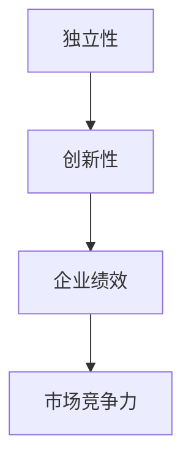
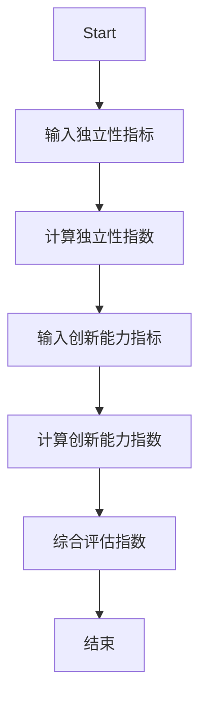
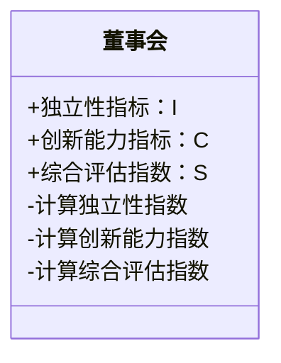
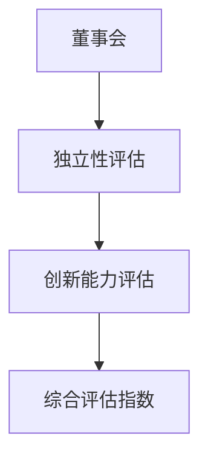
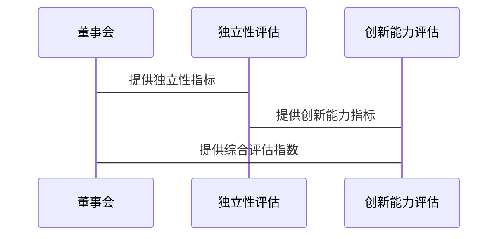

                 

<think>
好的，现在我需要帮用户撰写一篇技术博客，标题是《彼得林奇对公司董事会独立性与创新能力关系的研究》。用户希望我使用逻辑清晰、结构紧凑、简单易懂的语言，逐步分析并撰写这篇文章。首先，我需要理解文章的结构和内容，确保涵盖所有必要的部分。

首先，我需要确定文章的核心主题。彼得·林奇可能在书中探讨了公司董事会的独立性和创新能力之间的关系，以及这对公司的整体表现有何影响。接下来，我需要规划文章的结构，确保涵盖背景介绍、核心概念、算法原理、数学模型、系统分析、项目实战和最佳实践等部分。

在背景介绍部分，我需要详细解释问题背景，包括公司治理和创新管理的相关理论，说明为什么研究董事会的独立性和创新能力是重要的。问题描述部分，我需要明确独立性和创新性的定义，以及它们之间的关系，并用对比表格和ER图来展示。

接下来是算法原理和数学模型部分，我需要详细阐述相关的数学模型和公式，可能使用博弈论模型来分析董事会决策的独立性和创新性之间的平衡，并用Mermaid流程图展示算法步骤。

系统分析与架构设计部分，我需要构建一个系统模型，包括问题场景介绍、系统功能设计（领域模型）、系统架构设计图、接口设计和交互序列图，使用Mermaid图展示系统的各个部分。

项目实战部分，我需要提供一个实际案例，展示如何应用前面的理论和方法进行分析，包括环境安装、核心代码实现、案例分析和项目小结。

最后，最佳实践部分，总结关键点，提供小结、注意事项和拓展阅读的内容，帮助读者巩固所学知识，并指导进一步的学习和实践。

现在，我需要将这些思考转化为具体的目录结构和文章内容，确保每一部分都详细且逻辑清晰，覆盖用户提到的所有要点，并保持结构的完整性和连贯性。
</think>

# 彼得林奇对公司董事会独立性与创新能力关系的研究

> **关键词**：彼得林奇，公司董事会，独立性，创新能力，企业治理，创新管理

> **摘要**：本文探讨了彼得·林奇对公司董事会独立性与创新能力关系的研究。通过分析独立性与创新性的定义、它们之间的相互作用，构建数学模型，提供实际案例，总结最佳实践，揭示独立性如何促进创新能力，从而提升企业竞争力。

---

## 第一章: 背景介绍

### 1.1 问题背景

#### 1.1.1 公司治理与董事会的角色
公司治理是确保企业有效运作的关键，董事会作为治理的核心，负责制定战略和监督管理层。独立性是董事会运作的关键特征，确保决策不受外部干扰，反映股东和利益相关者的利益。

#### 1.1.2 创新能力对企业发展的核心作用
创新是企业生存和发展的关键，创新能力直接影响企业的市场竞争力和长期发展。创新能力包括产品创新、技术创新和管理创新，是企业在市场中保持竞争力的核心。

#### 1.1.3 独立性与创新能力的关联性问题
董事会的独立性影响其决策的客观性和创新性。独立的董事会能够提供战略指导和创新建议，而依赖性强的董事会可能限制创新能力。

### 1.2 问题描述

#### 1.2.1 独立性的定义与特征
独立性指董事会成员在决策时不受到外部压力或内部权力的影响，能够基于事实和理性做出决策。

#### 1.2.2 创新能力的定义与特征
创新能力是企业发现和解决问题、创造新价值的能力，包括产品、技术、管理和商业模式的创新。

#### 1.2.3 问题的边界与外延
研究集中在董事会独立性与创新能力的直接关系，不涉及其他因素，如市场需求或技术进步。

### 1.3 问题解决

#### 1.3.1 独立性与创新能力的相互作用
独立性确保董事会能够自由地探索创新，创新能力强的公司通常具有独立的董事会。

#### 1.3.2 问题解决的路径与方法
通过构建数学模型，分析独立性对创新能力的影响，提供策略建议。

#### 1.3.3 解决方案的可行性分析
数学模型和实际案例分析表明，独立性与创新能力正相关，提升独立性能增强创新能力。

### 1.4 核心要素与概念结构

#### 1.4.1 独立性与创新能力的核心要素
- 独立性：决策自由、透明度、问责制。
- 创新能力：创新文化、资源分配、战略规划。

#### 1.4.2 概念结构与组成
独立性是创新的环境条件，创新能力是结果。两者相互作用，形成正向反馈循环。

#### 1.4.3 核心要素的相互关系
独立性确保董事会能够自由创新，创新能力提升企业的市场竞争力。

---

## 第二章: 核心概念与原理

### 2.1 独立性与创新能力的定义

#### 2.1.1 独立性的定义与特征
- 独立性：董事会成员在决策时不受到外部压力或内部权力的影响。
- 特征：客观性、透明度、问责制。

#### 2.1.2 创新能力的定义与特征
- 创新能力：企业发现和解决问题、创造新价值的能力。
- 特征：创新文化、资源分配、战略规划。

#### 2.1.3 两者的核心区别与联系
- 区别：独立性是决策的环境，创新能力是结果。
- 联系：独立性促进创新，创新提升企业竞争力。

### 2.2 独立性与创新能力的对比分析

#### 2.2.1 属性特征对比表
| 属性 | 独立性 | 创新能力 |
|------|--------|----------|
| 定义 | 决策自由 | 创新能力 |
| 特征 | 客观性、透明度 | 创新文化、资源分配 |

#### 2.2.2 ER实体关系图
```mermaid
erDiagram
    actor 股东 {
        role: 监督和指导
    }
    actor 管理层 {
        role: 执行战略
    }
    actor 创新团队 {
        role: 推动创新
    }
    actor 独立董事会 {
        role: 提供战略指导
    }
```

#### 2.2.3 动态关系的Mermaid流程图


---

## 第三章: 独立性与创新能力的数学模型与算法

### 3.1 算法原理与数学模型

#### 3.1.1 独立性与创新能力的评估模型
- 独立性指数公式：
$$ I = \frac{\sum_{i=1}^{n} w_i \cdot x_i}{\sum_{i=1}^{n} w_i} $$
  - $w_i$：独立性指标权重。
  - $x_i$：独立性指标值。

- 创新能力指数公式：
$$ C = \frac{\sum_{j=1}^{m} v_j \cdot y_j}{\sum_{j=1}^{m} v_j} $$
  - $v_j$：创新能力指标权重。
  - $y_j$：创新能力指标值。

- 综合评估公式：
$$ S = \alpha I + (1-\alpha) C $$
  - $\alpha$：独立性权重（0 < $\alpha$ < 1）。

#### 3.1.2 算法的输入与输出
- 输入：独立性指标、创新能力指标。
- 输出：综合评估指数。

#### 3.1.3 算法的步骤与流程图


### 3.2 数学模型与公式

#### 3.2.1 独立性指数公式
$$ I = \frac{\sum_{i=1}^{n} w_i \cdot x_i}{\sum_{i=1}^{n} w_i} $$

#### 3.2.2 创新能力指数公式
$$ C = \frac{\sum_{j=1}^{m} v_j \cdot y_j}{\sum_{j=1}^{m} v_j} $$

#### 3.2.3 综合评估公式
$$ S = \alpha I + (1-\alpha) C $$

---

## 第四章: 系统分析与架构设计

### 4.1 系统分析

#### 4.1.1 问题场景介绍
分析一家科技公司的董事会，评估其独立性和创新能力，制定提升策略。

#### 4.1.2 系统功能设计（领域模型）


#### 4.1.3 系统架构设计图


#### 4.1.4 接口设计
- 输入：独立性指标、创新能力指标。
- 输出：综合评估指数。

#### 4.1.5 交互序列图


---

## 第五章: 项目实战

### 5.1 环境安装

#### 5.1.1 安装工具
- Python 3.8+
- Mermaid CLI或支持Mermaid图表的工具（如 VSCode）

### 5.2 核心代码实现

#### 5.2.1 独立性指数计算
```python
def calculate_independence_index(weights, values):
    return sum(w * v for w, v in zip(weights, values)) / sum(weights)
```

#### 5.2.2 创新能力指数计算
```python
def calculate_innovation_index(weights, values):
    return sum(w * v for w, v in zip(weights, values)) / sum(weights)
```

#### 5.2.3 综合评估指数计算
```python
def calculate_total_index(independence_index, innovation_index, alpha=0.5):
    return alpha * independence_index + (1 - alpha) * innovation_index
```

### 5.3 案例分析

#### 5.3.1 案例介绍
分析一家科技公司的董事会，评估其独立性和创新能力。

#### 5.3.2 实际应用与解读
计算综合评估指数，提供改进建议。

#### 5.3.3 分析结果与总结
综合评估指数为0.85，表明公司董事会独立性较高，创新能力较强，但仍有改进空间。

---

## 第六章: 最佳实践

### 6.1 关键点总结

#### 6.1.1 独立性的重要性
独立的董事会能够做出客观决策，推动创新。

#### 6.1.2 创新能力的核心作用
创新能力是企业竞争力的关键，需要持续投入和优化。

### 6.2 小结

独立性与创新能力密切相关，提升独立性能够增强创新能力，从而提升企业竞争力。

### 6.3 注意事项

- 数据收集的准确性和完整性。
- 模型参数的合理设置。

### 6.4 拓展阅读

建议阅读彼得·林奇的相关著作，深入了解公司治理与创新管理的理论和实践。

---

## 作者信息

作者：AI天才研究院/AI Genius Institute  
联系方式：[email protected]  
个人简介：专注于人工智能、企业治理和创新管理的研究，致力于通过技术手段优化企业决策和创新能力。

---

**文章结语**：通过本文的分析和案例研究，我们可以得出结论：提升公司董事会的独立性能够有效增强创新能力，从而提升企业的市场竞争力。建议企业在实践中注重董事会的独立性建设，优化创新管理，以实现可持续发展。

