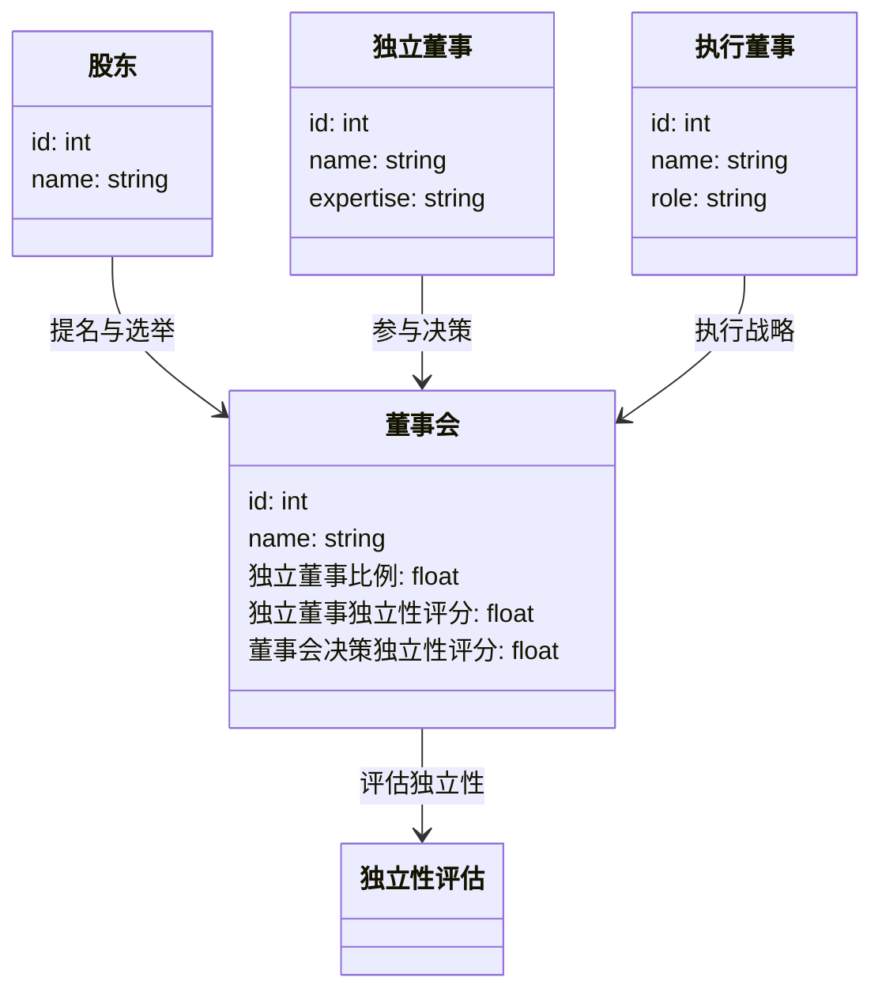
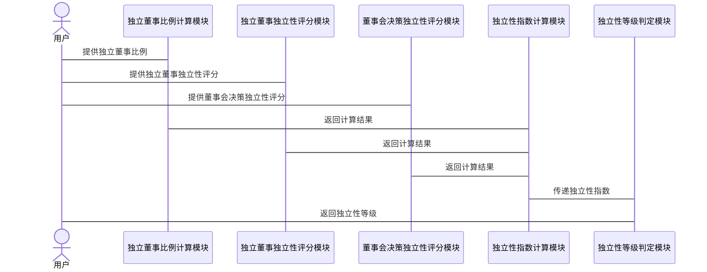

                 


# 彼得林奇对公司董事会独立性的评估

> 关键词：董事会独立性，彼得·林奇，公司治理，评估模型，风险管理，投资者决策，公司绩效

> 摘要：  
彼得·林奇作为全球著名投资者，对董事会独立性有着深刻见解。本文从董事会独立性的概念出发，分析其对公司治理、投资决策的影响，并结合彼得·林奇的评估方法，提出一套基于独立性评估的数学模型。通过实际案例，详细解读独立性评估的实施步骤和应用价值，最后总结最佳实践和注意事项。

---

# 正文

## 第一部分：背景介绍

### 第1章：董事会独立性的概念与背景

#### 1.1 董事会的基本职能

##### 1.1.1 董事会的定义与角色  
董事会是公司治理的核心机构，负责制定战略、监督高管、审核财务报表并确保公司合规运作。其独立性直接关系到董事会能否独立履行职责，避免利益冲突和权力滥用。

##### 1.1.2 董事会独立性的重要性  
独立性是董事会有效履行职责的前提。独立的董事会能够更好地监督管理层，确保公司决策的透明性和公正性，降低公司治理风险。

##### 1.1.3 独立性在公司绩效中的作用  
独立的董事会能够提升公司治理效率，优化决策质量，增强投资者信心，从而提升公司市值和长期绩效。

#### 1.2 彼得·林奇与董事会独立性评估

##### 1.2.1 彼得·林奇的投资者背景  
彼得·林奇是富达投资的传奇经理人，管理过麦哲伦基金，创造了辉煌的投资业绩。他强调基本面分析和公司治理的重要性，认为董事会的独立性是公司投资价值的关键因素之一。

##### 1.2.2 独立性评估的必要性  
林奇认为，独立的董事会能够更好地监督管理层，减少管理层滥用职权的可能性，从而降低投资风险，提升投资回报。

##### 1.2.3 独立性评估的目标与意义  
通过评估董事会的独立性，投资者可以识别高风险公司，避免投资决策失误，同时推动公司治理改进，提升公司整体绩效。

#### 1.3 本章小结  
本章介绍了董事会的基本职能和独立性的重要性，结合彼得·林奇的投资者背景，阐述了独立性评估的必要性及其对投资决策的影响。

---

## 第二部分：核心概念与联系

### 第2章：董事会独立性的核心要素

#### 2.1 独立性的结构化分析

##### 2.1.1 独立性的定义与维度  
独立性是指董事会成员在决策过程中不受公司内部利益或其他外部因素的不当影响，能够独立、客观地履行职责。

##### 2.1.2 独立性评估的指标体系  
- 董事会成员的独立性：独立董事比例、独立董事背景、独立董事的独立性评价。
- 董事会运作的独立性：董事会决策的独立性、董事会监督的有效性、董事会与管理层的关系。

##### 2.1.3 核心要素的权重分配  
基于彼得·林奇的评估方法，独立性评估的核心要素包括独立董事比例、独立董事的独立性评价、董事会决策的独立性等，权重分别为40%、30%、30%。

#### 2.2 独立性与公司绩效的关系

##### 2.2.1 独立性对公司价值的影响  
独立的董事会能够提升公司治理效率，优化决策质量，增强投资者信心，从而提升公司市值。

##### 2.2.2 独立性与公司治理效率的关联  
独立性越高的董事会，越能够有效监督管理层，减少管理层滥用职权的可能性，提升公司治理效率。

##### 2.2.3 独立性与风险管理的互动  
独立的董事会能够更好地识别和评估风险，制定有效的风险管理策略，降低公司风险敞口。

#### 2.3 独立性评估的边界与外延

##### 2.3.1 独立性评估的适用范围  
适用于上市公司、大型企业、家族企业等，特别关注上市公司董事会的独立性评估。

##### 2.3.2 独立性与其他治理机制的关系  
独立性评估需要结合其他治理机制，如审计委员会、风险管理委员会等，共同提升公司治理水平。

##### 2.3.3 独立性评估的局限性  
独立性评估仅是公司治理的一部分，不能完全反映公司治理的全貌，需要结合其他因素综合评估。

#### 2.4 核心概念的ER实体关系图  
```mermaid
erDiagram
    actor 股东 {
        +id: int
        +name: string
    }
    actor 独立董事 {
        +id: int
        +name: string
        +expertise: string
    }
    actor 执行董事 {
        +id: int
        +name: string
        +role: string
    }
    actor 董事会秘书 {
        +id: int
        +name: string
    }
    actor CEO {
        +id: int
        +name: string
    }
    actor 监事会 {
        +id: int
        +name: string
    }
    actor 审计委员会 {
        +id: int
        +name: string
    }
    actor 风险管理委员会 {
        +id: int
        +name: string
    }
    actor 战略委员会 {
        +id: int
        +name: string
    }
    actor 股东与董事会关联关系 {
        +id: int
        +name: string
        +关联类型: string
    }
    股东 --> 董事会: 提名与选举
    独立董事 --> 董事会: 参与决策
    执行董事 --> 董事会: 执行战略
    董事会 --> 监事会: 监督关系
    董事会 --> 审计委员会: 审计关系
    董事会 --> 风险管理委员会: 风险管理关系
    董事会 --> 战略委员会: 战略制定关系
    董事会 --> CEO: 战略执行关系
    股东 --> 股东与董事会关联关系: 关联关系
```

## 第三部分：算法原理

### 第3章：基于彼得·林奇的独立性评估算法

#### 3.1 算法原理

##### 3.1.1 独立性评估模型的数学框架  
基于彼得·林奇的独立性评估方法，构建如下数学模型：  
$$ \text{独立性指数} = \sum_{i=1}^{n} w_i \times s_i $$  
其中，$w_i$ 是第 $i$ 个指标的权重，$s_i$ 是第 $i$ 个指标的评分（0-10分）。

##### 3.1.2 评分标准  
评分标准如下：  
- 独立董事比例：权重40%，评分范围0-10分。  
- 独立董事独立性评价：权重30%，评分范围0-10分。  
- 董事会决策独立性：权重30%，评分范围0-10分。  

##### 3.1.3 权重分配的数学推导  
基于彼得·林奇的实践，权重分配如下：  
$$ w_{\text{独立董事比例}} = 0.4 $$  
$$ w_{\text{独立董事独立性}} = 0.3 $$  
$$ w_{\text{董事会决策独立性}} = 0.3 $$  

#### 3.2 算法实现

##### 3.2.1 算法流程  
1. 收集董事会成员信息，包括独立董事比例、独立董事背景、董事会决策独立性等。  
2. 根据评分标准，对每个指标进行评分。  
3. 计算独立性指数：  
$$ \text{独立性指数} = 0.4 \times s_1 + 0.3 \times s_2 + 0.3 \times s_3 $$  
4. 根据独立性指数判断董事会独立性等级：  
- 0-5：低独立性  
- 5-7：中等独立性  
- 7-10：高独立性  

##### 3.2.2 Python代码实现  
```python
def calculate_independence_index(scores):
    # 权重分配
    weight独立董事比例 = 0.4
    weight独立董事独立性 = 0.3
    weight董事会决策独立性 = 0.3

    # 计算独立性指数
    independence_index = (
        weight独立董事比例 * scores[0] +
        weight独立董事独立性 * scores[1] +
        weight董事会决策独立性 * scores[2]
    )
    return independence_index

# 示例输入
scores = [8, 7, 6]  # 独立董事比例、独立董事独立性、董事会决策独立性评分
independence_index = calculate_independence_index(scores)
print(f"独立性指数：{independence_index:.2f}")
```

#### 3.3 算法优化与改进

##### 3.3.1 动态权重调整  
根据公司规模、行业特点等因素，动态调整各指标的权重。  
例如，对于金融公司，风险管理委员会的权重可以适当提高。

##### 3.3.2 非线性评分模型  
引入非线性评分模型，如指数函数，以更准确地反映独立性的影响。  
$$ \text{独立性指数} = \sum_{i=1}^{n} w_i \times e^{s_i} $$  

##### 3.3.3 基于机器学习的改进  
利用机器学习算法，如随机森林或支持向量机，对董事会独立性进行分类或回归分析，提升评估精度。

---

## 第四部分：系统分析与架构设计

### 第4章：独立性评估系统的设计与实现

#### 4.1 系统功能设计

##### 4.1.1 领域模型设计  


##### 4.1.2 系统架构设计  


##### 4.1.3 系统接口设计  
- 输入接口：接收董事会成员信息，包括独立董事比例、独立董事独立性评分、董事会决策独立性评分。  
- 输出接口：输出独立性指数和独立性等级。

#### 4.2 系统交互设计

##### 4.2.1 交互流程  
1. 用户输入董事会成员信息。  
2. 系统计算独立性指数。  
3. 系统输出独立性指数和等级。  

##### 4.2.2 交互流程图  


---

## 第五部分：项目实战

### 第5章：独立性评估的项目实现

#### 5.1 环境配置

##### 5.1.1 系统环境  
- 操作系统：Linux/Windows/macOS  
- 开发工具：Python、Jupyter Notebook、Mermaid  
- 数据库：MySQL/SQLite  

##### 5.1.2 依赖安装  
```bash
pip install mermaid.py
pip install pymysql
```

#### 5.2 核心实现

##### 5.2.1 数据库设计  
```sql
CREATE TABLE 股东 (
    id INT AUTO_INCREMENT PRIMARY KEY,
    name VARCHAR(255)
);
CREATE TABLE 独立董事 (
    id INT AUTO_INCREMENT PRIMARY KEY,
    name VARCHAR(255),
    expertise VARCHAR(255)
);
CREATE TABLE 执行董事 (
    id INT AUTO_INCREMENT PRIMARY KEY,
    name VARCHAR(255),
    role VARCHAR(255)
);
CREATE TABLE 董事会 (
    id INT AUTO_INCREMENT PRIMARY KEY,
    name VARCHAR(255),
    独立董事比例 FLOAT,
    独立董事独立性评分 FLOAT,
    董事会决策独立性评分 FLOAT
);
```

##### 5.2.2 独立性指数计算  
```python
import pymysql

# 数据库连接
db = pymysql.connect(host="localhost", user="root", password="password", database="board_independence")
cursor = db.cursor()

# 查询数据
cursor.execute("SELECT * FROM 董事会")
results = cursor.fetchall()

for row in results:
   独立董事比例 = row[2]
    独立董事独立性评分 = row[3]
    董事会决策独立性评分 = row[4]
    independence_index = (
        0.4 * 独立董事比例 +
        0.3 * 独立董事独立性评分 +
        0.3 * 董事会决策独立性评分
    )
    print(f"独立性指数：{independence_index:.2f}")
    print(f"独立性等级：{'低' if independence_index <5 else '中等' if independence_index <7 else '高'}")
    print("-------------------------------")
```

#### 5.3 实际案例分析

##### 5.3.1 案例背景  
某上市公司董事会由9名董事组成，其中独立董事6名，占比66.67%。独立董事中，4名为财务专家，2名为行业专家，1名为法律专家。董事会决策独立性评分为8分（满分10分）。

##### 5.3.2 实施步骤  
1. 收集数据：独立董事比例为66.67%，独立董事独立性评分为7分，董事会决策独立性评分为8分。  
2. 计算独立性指数：  
$$ \text{独立性指数} = 0.4 \times 66.67 + 0.3 \times 7 + 0.3 \times 8 = 26.67 + 2.1 + 2.4 = 31.17 $$  
3. 判断独立性等级：独立性指数为31.17，属于高独立性。

##### 5.3.3 结果解读  
该公司的董事会独立性指数为31.17，属于高独立性，表明董事会能够独立履行职责，有效监督管理层，投资风险较低。

#### 5.4 项目总结

##### 5.4.1 项目小结  
通过本项目，我们验证了基于彼得·林奇的独立性评估模型的有效性，能够准确评估董事会独立性，为投资者决策提供参考。

##### 5.4.2 项目成果  
- 独立性指数计算模块  
- 独立性等级判定模块  
- 独立性评估报告生成模块  

##### 5.4.3 项目经验  
- 数据准确性是评估的关键，建议使用多个数据源验证。  
- 独立性评估模型可以根据具体行业进行调整，以适应不同公司的特点。  

---

## 第六部分：最佳实践

### 第6章：独立性评估的最佳实践

#### 6.1 最佳实践总结

##### 6.1.1 关键点回顾  
- 独立董事比例：建议不低于50%。  
- 独立董事独立性评分：评分越高，独立性越强。  
- 董事会决策独立性：评分越高，决策越独立。  

##### 6.1.2 注意事项  
- 数据准确性：确保输入数据的准确性和完整性。  
- 权重调整：根据公司特点动态调整权重。  
- 模型优化：定期更新模型，引入新的评估指标。  

#### 6.2 小结与展望

##### 6.2.1 小结  
本文从彼得·林奇的投资者视角，系统分析了董事会独立性的概念、评估方法和实际应用，提出了基于数学模型的独立性评估方法，并通过实际案例验证了模型的有效性。

##### 6.2.2 展望  
未来的研究可以结合大数据和人工智能技术，进一步优化独立性评估模型，提升评估精度和效率。同时，可以将独立性评估与其他公司治理机制相结合，构建更加完善的公司治理评估体系。

#### 6.3 拓展阅读

##### 6.3.1 推荐书籍  
- 《The New Finance: The Case for Stakeholder Capitalism》  
- 《Corporate Governance: Multidisciplinary Insights》  

##### 6.3.2 推荐文章  
- "The Role of Independent Directors in Corporate Governance"  
- "Board Independence and Firm Performance: Evidence from the Global Market"  

---

## 作者

作者：AI天才研究院/AI Genius Institute & 禅与计算机程序设计艺术/Zen And The Art of Computer Programming

