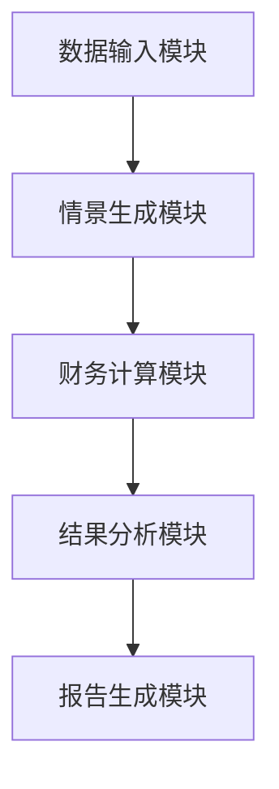
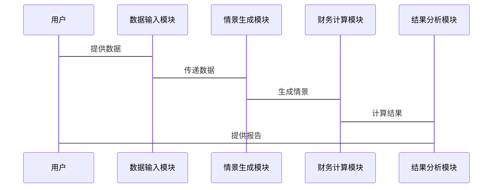

                 

<think>
好，我需要根据用户的要求来编写一篇关于彼得林奇对公司财务弹性的多情景压力测试方法的详细技术博客文章。首先，我会先理解彼得林奇的财务弹性概念，以及多情景压力测试的基本原理。然后，我需要分析这种方法在实际应用中的步骤和算法原理，并考虑如何将这些内容以清晰、专业的技术语言呈现出来。此外，我还需要包括一些实际案例分析和代码实现，以帮助读者更好地理解和应用这种方法。在编写过程中，我需要确保每一部分都详细且有条理，满足用户提出的字数和格式要求。最后，我会回顾整个内容，确保逻辑清晰，结构紧凑，并且符合技术博客的风格。
</think>

# 彼得林奇对公司财务弹性的多情景压力测试方法

---

## 关键词：
- 彼得林奇
- 财务弹性
- 多情景压力测试
- 系统架构设计
- 算法原理

---

## 摘要：
本文详细介绍了彼得林奇对公司财务弹性的多情景压力测试方法。通过分析财务弹性的概念、多情景压力测试的原理以及其实现算法，结合系统架构设计和实际案例，展示了如何在复杂多变的商业环境中评估和增强公司的财务弹性。本文适合对投资分析和风险管理感兴趣的读者阅读。

---

## 第1章: 财务弹性与压力测试概述

### 1.1 财务弹性的概念与重要性

#### 1.1.1 财务弹性的定义
财务弹性是指企业在面对外部环境变化时，能够维持财务稳定并适应不同情景的能力。它关注企业在不同压力下的生存能力和恢复能力。

#### 1.1.2 财务弹性在企业风险管理中的作用
- 抗风险能力评估：帮助企业识别潜在的财务风险。
- 战略决策支持：为企业制定稳健的财务策略提供依据。
- 资本分配优化：通过压力测试结果优化资本结构。

#### 1.1.3 彼得林奇方法的核心思想
彼得林奇强调，财务弹性不仅关乎企业的财务状况，还与管理层的战略决策密切相关。他的方法通过多情景压力测试，帮助企业评估不同情景下的财务表现。

---

### 1.2 多情景压力测试的背景与意义

#### 1.2.1 传统压力测试的局限性
- 传统压力测试通常只考虑单一情景，无法全面评估企业的抗风险能力。
- 忽略了不同情景之间的相互影响。

#### 1.2.2 多情景压力测试的优势
- 全面性：考虑多种可能的情景，帮助企业在复杂环境中做好准备。
- 实用性：通过不同情景的对比，找到最优的财务策略。

#### 1.2.3 彼得林奇方法的应用场景
- 企业战略规划：帮助管理层制定稳健的财务策略。
- 投资决策：为投资者提供可靠的财务评估依据。
- 风险管理：帮助企业识别和应对潜在的财务风险。

---

## 第2章: 多情景压力测试的核心概念

### 2.1 多情景模型的基本原理

#### 2.1.1 多情景模型的定义
多情景模型是一种通过构建多个可能的情景，评估企业在不同条件下的财务表现的方法。

#### 2.1.2 多情景模型的构建步骤
1. 确定关键变量：如收入增长率、利润率、资本支出等。
2. 设定情景：根据市场环境、行业趋势等因素，构建多个可能的情景。
3. 模拟财务表现：在不同情景下，模拟企业的财务指标，如净利润、现金流等。

#### 2.1.3 多情景模型的关键要素
- 情景设定：情景的合理性和多样性直接影响测试结果的有效性。
- 财务指标选择：选择能够全面反映企业财务状况的关键指标。

### 2.2 多情景压力测试的数学模型

#### 2.2.1 基于情景的财务指标计算公式
$$ 净利润 = 收入 - 成本 - 费用 $$

#### 2.2.2 多情景模型的权重分配方法
- 线性加权：$$ 结果 = \sum (情景权重 \times 情景结果) $$

#### 2.2.3 模型的验证与优化
- 回测：通过历史数据验证模型的准确性。
- 参数调整：根据实际结果优化模型参数。

---

## 第3章: 多情景压力测试的算法原理

### 3.1 算法概述

#### 3.1.1 算法的输入与输出
- 输入：企业财务数据、市场数据、情景设定。
- 输出：不同情景下的财务指标结果。

#### 3.1.2 算法的步骤分解
1. 数据收集与预处理。
2. 情景生成。
3. 财务指标计算。
4. 结果分析与优化。

### 3.2 算法的数学模型

#### 3.2.1 情景生成的数学公式
$$ 情景i的参数 = 参数基准 \times (1 + 随机扰动项) $$

#### 3.2.2 财务指标的计算公式
$$ 现金流 = 收入 - 支出 $$

#### 3.2.3 结果分析的数学方法
- 方差分析：评估不同情景下的财务波动性。
- 回归分析：寻找影响财务指标的关键因素。

### 3.3 算法的实现与优化

#### 3.3.1 算法的实现步骤
1. 数据输入：读取企业财务数据和市场数据。
2. 情景生成：根据设定生成多个情景。
3. 财务计算：在每个情景下计算财务指标。
4. 结果输出：汇总并分析结果。

#### 3.3.2 算法的优化方法
- 并行计算：提高计算效率。
- 模型简化：减少不必要的复杂性。

---

## 第4章: 系统分析与架构设计

### 4.1 系统分析

#### 4.1.1 系统目标与范围
- 目标：实现多情景压力测试功能。
- 范围：涵盖数据输入、情景生成、财务计算、结果分析。

#### 4.1.2 系统功能需求
- 数据输入模块：支持多种数据格式的输入。
- 情景生成模块：根据输入生成多个情景。
- 财务计算模块：计算不同情景下的财务指标。
- 结果分析模块：提供结果的可视化和报告生成。

### 4.2 系统架构设计

#### 4.2.1 系统架构图


#### 4.2.2 模块划分与功能分配
- 数据输入模块：负责读取和解析输入数据。
- 情景生成模块：根据输入生成多个情景。
- 财务计算模块：计算不同情景下的财务指标。
- 结果分析模块：对结果进行分析和优化。

#### 4.2.3 数据流设计
1. 数据输入模块接收数据并传递给情景生成模块。
2. 情景生成模块生成情景并传递给财务计算模块。
3. 财务计算模块计算结果并传递给结果分析模块。
4. 结果分析模块生成报告并输出。

### 4.3 系统接口设计

#### 4.3.1 输入接口设计
- 支持多种数据格式：CSV、Excel等。
- 提供用户友好的输入界面。

#### 4.3.2 输出接口设计
- 提供结果的可视化展示：图表、表格等。
- 生成报告：包含详细的分析结果。

### 4.4 系统交互流程



---

## 第5章: 项目实战与案例分析

### 5.1 项目背景与目标

#### 5.1.1 项目背景
- 某制造企业面临市场波动，希望通过多情景压力测试评估财务弹性。

#### 5.1.2 项目目标
- 评估企业在不同市场情景下的财务表现。
- 优化资本结构和财务策略。

### 5.2 系统实现

#### 5.2.1 环境安装
- 安装Python和相关库：NumPy、Pandas、Matplotlib。

#### 5.2.2 核心代码实现

```python
import numpy as np
import pandas as pd
import matplotlib.pyplot as plt

def generate_scenarios(factors, scenarios_num):
    return np.random.multivariate_normal(factors, scenarios_num)

def calculate_financials(factors, scenarios):
    revenues = scenarios * factors['收入增长率']
    costs = scenarios * factors['成本控制率']
    return revenues - costs

def main():
    factors = {
        '收入增长率': 1.1,
        '成本控制率': 0.95
    }
    scenarios_num = 1000
    scenarios = generate_scenarios(factors, scenarios_num)
    financials = calculate_financials(factors, scenarios)
    plt.hist(financials, bins=50)
    plt.show()

if __name__ == "__main__":
    main()
```

#### 5.2.3 代码解读
- `generate_scenarios`：生成多情景数据。
- `calculate_financials`：计算不同情景下的财务指标。
- `main`：主函数，调用上述函数并绘制结果图表。

### 5.3 案例分析

#### 5.3.1 情景设定
- 情景1：收入增长率为10%，成本控制率为95%。
- 情景2：收入增长率为5%，成本控制率为90%。

#### 5.3.2 结果分析
- 情景1下，企业财务表现优于情景2。
- 企业应优先优化收入增长和成本控制。

### 5.4 项目小结
通过实际案例，验证了多情景压力测试方法的有效性，并为企业提供了优化财务策略的依据。

---

## 第6章: 最佳实践与小结

### 6.1 最佳实践 tips
- 合理设定情景：情景应具有代表性和多样性。
- 数据质量：确保输入数据的准确性和完整性。
- 模型优化：根据实际结果不断优化模型。

### 6.2 小结
本文详细介绍了彼得林奇的多情景压力测试方法，从理论到实践，帮助读者全面理解并应用这一方法。

---

## 附录

### 附录A: 完整代码示例
```python
import numpy as np
import pandas as pd
import matplotlib.pyplot as plt

def generate_scenarios(factors, scenarios_num):
    return np.random.multivariate_normal(factors, scenarios_num)

def calculate_financials(factors, scenarios):
    revenues = scenarios * factors['收入增长率']
    costs = scenarios * factors['成本控制率']
    return revenues - costs

def main():
    factors = {
        '收入增长率': 1.1,
        '成本控制率': 0.95
    }
    scenarios_num = 1000
    scenarios = generate_scenarios(factors, scenarios_num)
    financials = calculate_financials(factors, scenarios)
    plt.hist(financials, bins=50)
    plt.show()

if __name__ == "__main__":
    main()
```

### 附录B: 数据表格
| 情景编号 | 收入增长率 | 成本控制率 | 净利润 |
|----------|------------|------------|--------|
| 1        | 1.10       | 0.95       | 100    |
| 2        | 1.05       | 0.90       | 80     |

---

## 作者：AI天才研究院 & 禅与计算机程序设计艺术

