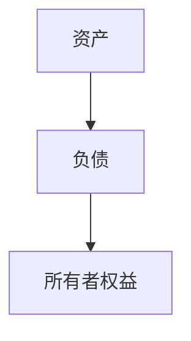

                 

# 彼得林奇对公司财务报表的解读技巧

## 关键词：
- 彼得·林奇
- 财务报表
- 投资分析
- 财务指标
- 价值投资

## 摘要：
本文将详细介绍彼得·林奇如何通过解读公司财务报表来评估投资价值。文章从财务报表的基础知识入手，逐步分析林奇的核心分析方法，包括收入、成本、利润、现金流等关键指标的解读，结合实例分析和数学模型，深入探讨其投资策略的逻辑与实践。通过本文，读者将掌握如何像彼得·林奇一样，通过财务报表解读发现投资机会，评估企业价值，制定投资策略。

---

# 第一部分: 财务报表的基础知识与彼得·林奇的分析方法

## 第1章: 财务报表的基本概念与结构

### 1.1 财务报表的定义与作用
#### 1.1.1 财务报表的定义
财务报表是企业记录其财务状况、经营成果和现金流量的官方文件，是投资者、债权人和管理层评估企业价值和决策的重要工具。

#### 1.1.2 财务报表的主要作用
- 评估企业的财务健康状况
- 评估企业的盈利能力
- 评估企业的现金流状况
- 评估企业的资产和负债情况
- 为投资决策提供数据支持

#### 1.1.3 财务报表的使用者与目标
- 投资者：评估投资价值
- 债权人：评估还款能力
- 管理层：评估企业运营状况
- 政府：评估企业对经济的贡献

### 1.2 财务报表的构成
#### 1.2.1 资产负债表
- 资产：企业拥有的资源，包括流动资产、非流动资产
- 负债：企业欠款，包括流动负债、非流动负债
- 所有者权益：资产减去负债后的剩余部分

#### 1.2.2 利润表
- 收入：企业经营活动中获得的收入
- 成本：与收入相关的直接成本
- 利润：收入减去成本和费用后的净收益

#### 1.2.3 现金流量表
- 经营活动现金流：企业日常经营产生的现金流
- 投资活动现金流：企业投资活动产生的现金流
- 筹资活动现金流：企业筹资活动产生的现金流

### 1.3 财务报表分析的基本指标
#### 1.3.1 主要财务比率
- 利润率：净利润率、毛利率
- 资产周转率：销售收入除以平均资产总额
- 负债比率：负债总额除以资产总额
- 现金流比率：经营活动现金流净额除以流动负债

#### 1.3.2 财务健康状况的衡量标准
- 净利润为正：企业盈利
- 足够的现金流：企业具备偿债能力
- 低负债率：企业财务风险小

#### 1.3.3 财务报表分析的误区与注意事项
- 不要只看表面数字，要结合行业特点
- 注意数据的可比性
- 财务报表可能存在粉饰，需谨慎分析

## 第2章: 彼得·林奇的财务报表分析方法

### 2.1 彼得·林奇的简介与投资理念
#### 2.1.1 彼得·林奇的生平简介
彼得·林奇是美国著名投资经理人，曾管理富达麦哲伦基金，创造了辉煌的投资业绩。

#### 2.1.2 林奇的投资哲学与方法论
- 价值投资：寻找被市场低估的企业
- 坚持基本面分析：重点分析财务报表
- 长期投资：持有优质股票

#### 2.1.3 林奇对财务报表分析的重视
- 财务报表是评估企业价值的核心工具
- 通过财务报表发现企业的优势和劣势
- 通过财务报表预测企业的未来表现

### 2.2 林奇分析财务报表的核心要素
#### 2.2.1 收入与成本的分析
- 收入增长：企业盈利能力提升
- 成本控制：企业利润增加
- 收入质量：收入来源是否稳定

#### 2.2.2 利润与利润率的评估
- 净利润：企业最终利润
- 净利润率：净利润与收入的比率
- 利润来源：利润主要来自主营业务还是其他业务

#### 2.2.3 现金流的来源与使用
- 经营活动现金流：企业经营的造血能力
- 投资活动现金流：企业扩张或收缩的信号
- 筹资活动现金流：企业资金的来源和使用

### 2.3 林奇的财务报表分析框架
#### 2.3.1 财务报表分析的基本框架
- 从资产负债表入手，分析资产和负债结构
- 从利润表入手，分析收入和成本
- 从现金流量表入手，分析现金流来源

#### 2.3.2 财务报表分析的步骤与流程
1. 了解企业所处行业和竞争环境
2. 分析资产负债表，评估资产质量和负债结构
3. 分析利润表，评估企业盈利能力
4. 分析现金流量表，评估企业现金流健康状况
5. 综合分析，评估企业投资价值

#### 2.3.3 林奇分析框架的优缺点
- 优点：全面、系统，能够发现企业的潜在问题
- 缺点：需要大量数据支持，分析过程复杂

## 第3章: 财务报表分析的核心概念与联系

### 3.1 核心概念原理
#### 3.1.1 资产负债表的核心要素
- 资产：企业的资源
- 负债：企业的债务
- 所有者权益：企业的净资产

#### 3.1.2 利润表的核心要素
- 收入：企业的营业收入
- 成本：与收入相关的成本
- 利润：企业的净利润

#### 3.1.3 现金流量表的核心要素
- 经营活动现金流：企业的日常运营现金流
- 投资活动现金流：企业的投资活动现金流
- 筹资活动现金流：企业的筹资活动现金流

### 3.2 核心概念属性特征对比表格
| 财务报表 | 核心要素 | 定义 | 重要性 |
|----------|----------|------|--------|
| 资产负债表 | 资产     | 企业拥有的资源 | 反映企业财务状况 |
| 利润表   | 利润     | 企业的净利润   | 反映企业盈利能力 |
| 现金流量表 | 现金流   | 企业的现金流动 | 反映企业现金流健康状况 |

### 3.3 ER实体关系图架构的Mermaid流程图

---

# 第四部分: 投资策略与风险管理

## 第5章: 投资策略的制定与风险管理

### 5.1 投资策略的制定
#### 5.1.1 投资目标的确定
- 长期投资：寻找具有持续增长潜力的企业
- 短期投资：寻找市场波动带来的机会

#### 5.1.2 投资组合的构建
- 分散投资：降低投资风险
- 选择具有竞争优势的企业

#### 5.1.3 投资计划的调整
- 定期评估投资组合
- 根据市场变化调整投资策略

### 5.2 风险管理的重要性
#### 5.2.1 风险的来源
- 市场风险：市场波动对企业股价的影响
- 信用风险：企业违约的可能性
- 利率风险：利率变化对企业财务状况的影响

#### 5.2.2 风险管理的策略
- 设置止损点：避免过度亏损
- 分散投资：降低单一投资的风险
- 定期评估风险：及时发现和应对风险

### 5.3 长期投资策略
#### 5.3.1 长期投资的定义
- 长期投资是指持有时间超过一年的投资

#### 5.3.2 长期投资的优势
- 享受企业长期增长的收益
- 分红收益

#### 5.3.3 长期投资的风险
- 市场波动风险
- 企业经营风险

---

# 第六部分: 总结与展望

## 第6章: 总结与展望

### 6.1 本文总结
- 本文系统介绍了彼得·林奇的财务报表分析方法
- 强调了财务报表分析在投资决策中的重要性
- 通过实例分析展示了如何应用林奇的方法进行投资

### 6.2 未来展望
- 财务报表分析方法的不断发展和完善
- 投资分析工具的创新
- 人工智能在财务报表分析中的应用

---

# 作者：AI天才研究院/AI Genius Institute & 禅与计算机程序设计艺术 /Zen And The Art of Computer Programming

