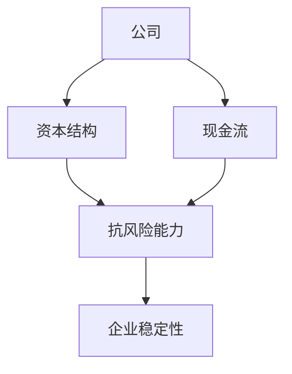
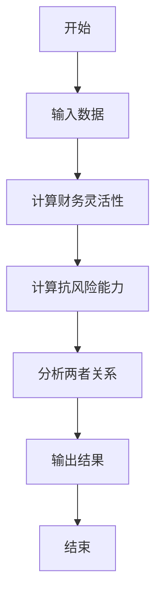
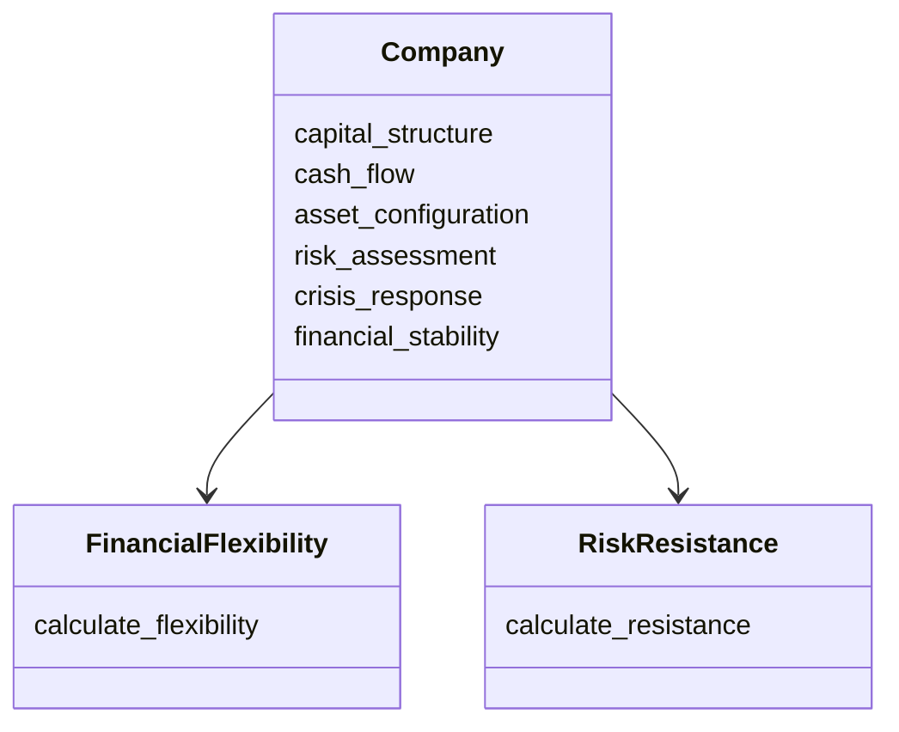
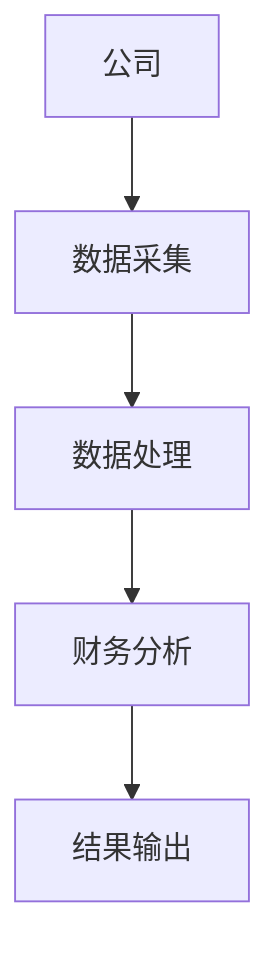
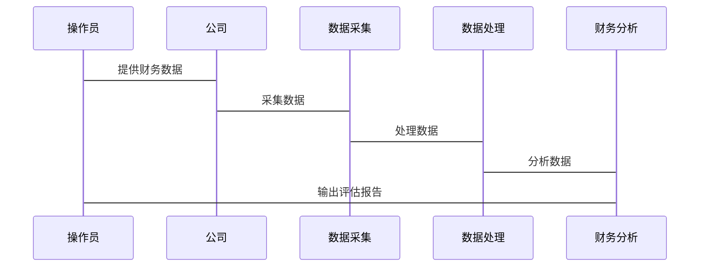

                 

<think>
好，用户需要我根据之前提供的目录结构，撰写一篇关于彼得·林奇对公司财务灵活性与抗风险能力相关性的技术博客文章。首先，我需要理解彼得·林奇在这个领域的研究重点，以及财务灵活性和抗风险能力的具体定义和它们之间的关系。

首先，我会回顾之前提供的目录结构，确保每个章节的内容都符合用户的要求。接下来，我会按照每个章节的标题，逐步展开内容，包括背景介绍、核心概念、算法原理、系统分析、项目实战等部分。

在撰写过程中，我需要使用逻辑清晰、结构紧凑且简单易懂的语言，同时确保专业性和技术深度。我会在每个部分中加入详细的解释和例子，帮助读者更好地理解复杂概念。对于公式和图表部分，我会使用Latex和Mermaid来展示，确保格式正确且易于理解。

我还需要注意文章的总字数控制在10000到12000字之间，并确保每个章节内容丰富，细节具体。最后，我会在文章末尾添加作者信息，符合用户的格式要求。

现在，我开始按照目录结构，逐步撰写每个章节的内容，确保每个部分都完整且符合用户的要求。
</think>

# 彼得林奇对公司财务灵活性与抗风险能力的相关性研究

## 关键词：彼得林奇、财务灵活性、抗风险能力、企业财务、风险管理

## 摘要：本文从彼得林奇的投资理论出发，研究公司财务灵活性与抗风险能力之间的相关性。通过分析财务灵活性的定义、属性、算法原理和系统架构，探讨如何利用财务灵活性提升企业的抗风险能力。结合实际案例和最佳实践，为读者提供实用的指导和建议。

---

# 第一部分: 背景介绍与核心概念

## 第1章: 财务灵活性与抗风险能力的背景介绍

### 1.1 问题背景

#### 1.1.1 现代企业面临的财务风险挑战
现代企业面临着复杂的经济环境和市场波动，财务风险成为企业稳健发展的主要障碍。企业需要具备应对突发事件和市场变化的能力，以维持稳健的财务状况。

#### 1.1.2 财务灵活性在企业运营中的重要性
财务灵活性是指企业在财务资源分配和资金运作上的弹性。它直接影响企业应对市场变化和内部调整的能力，是企业保持竞争力的关键因素。

#### 1.1.3 抗风险能力的核心意义
抗风险能力是指企业在面对内外部风险时，能够有效降低损失、维持稳定运营的能力。它是企业长期发展的基石，也是投资者评估企业价值的重要指标。

### 1.2 问题描述

#### 1.2.1 财务灵活性的定义与内涵
财务灵活性是指企业在资金分配、资本运作等方面能够快速调整的能力。它包括资本结构的优化、现金流管理等多个方面。

#### 1.2.2 抗风险能力的定义与内涵
抗风险能力是指企业在面对市场波动、经济危机等风险时，能够有效降低损失、保持稳定运营的能力。

#### 1.2.3 两者之间的关系与区别
财务灵活性是企业抗风险能力的重要组成部分。两者既有区别又有联系，财务灵活性侧重于企业在资源分配上的弹性，而抗风险能力则强调企业在风险事件中的应对能力。

### 1.3 问题解决

#### 1.3.1 确定研究目标
研究目标是分析财务灵活性与抗风险能力之间的关系，探索如何通过提升财务灵活性来增强企业的抗风险能力。

#### 1.3.2 明确研究方法
本文采用定性与定量相结合的方法，结合彼得林奇的投资理论和实际案例分析，探讨两者之间的关系。

#### 1.3.3 设计研究框架
研究框架包括背景介绍、核心概念、算法原理、系统分析和项目实战等部分，确保研究内容全面且逻辑清晰。

### 1.4 边界与外延

#### 1.4.1 财务灵活性的边界
财务灵活性的研究范围主要集中在资本结构、现金流管理和资产配置等方面，不包括企业的日常运营和市场营销。

#### 1.4.2 抗风险能力的边界
抗风险能力的研究范围主要集中在风险管理、危机应对和财务稳定性方面，不包括企业战略规划和组织结构优化。

#### 1.4.3 两者关系的外延
两者关系的外延主要集中在企业财务管理和风险管理领域，不包括企业的人力资源管理和技术创新。

### 1.5 核心要素组成

#### 1.5.1 财务灵活性的核心要素
- 资本结构优化
- 现金流管理
- 资产配置弹性

#### 1.5.2 抗风险能力的核心要素
- 风险评估与预警
- 危机应对机制
- 财务稳定性维护

#### 1.5.3 两者关系的核心要素
- 资本结构的优化
- 现金流的灵活运用
- 风险预警与应对机制

---

## 第2章: 财务灵活性与抗风险能力的核心概念

### 2.1 核心概念原理

#### 2.1.1 财务灵活性的原理
财务灵活性的核心在于企业能够快速调整资本结构和资金分配，以应对市场变化和内部需求。它通过优化资本结构和管理现金流，增强企业的财务弹性。

#### 2.1.2 抗风险能力的原理
抗风险能力的核心在于企业能够有效识别和评估潜在风险，并制定相应的应对策略。通过建立风险预警机制和危机应对计划，企业可以在风险发生时迅速采取行动，降低损失。

#### 2.1.3 两者关系的原理
财务灵活性为抗风险能力提供了基础支持。通过优化资本结构和管理现金流，企业能够更好地应对突发事件和市场波动，从而增强抗风险能力。

### 2.2 概念属性特征对比

| 概念       | 属性特征                          |
|------------|----------------------------------|
| 财务灵活性  | 资本结构优化、现金流管理、资产配置弹性 |
| 抗风险能力 | 风险评估与预警、危机应对机制、财务稳定性维护 |

### 2.3 ER实体关系图


---

## 第3章: 算法原理讲解

### 3.1 算法原理

#### 3.1.1 算法步骤
1. **输入数据**：收集企业的财务数据，包括资本结构、现金流和资产配置等。
2. **计算财务灵活性**：通过资本结构优化和现金流管理，评估企业的财务灵活性。
3. **计算抗风险能力**：基于风险评估和预警机制，评估企业的抗风险能力。
4. **分析两者关系**：通过对比分析，确定财务灵活性对抗风险能力的影响程度。
5. **输出结果**：生成财务灵活性和抗风险能力的评估报告。

#### 3.1.2 算法流程图


### 3.2 Python源代码实现

#### 3.2.1 计算财务灵活性的代码
```python
def calculate_financial_flexibility(company_data):
    # 输入：company_data 包含资本结构、现金流等数据
    # 输出：财务灵活性评分（0-1之间）
    capital_structure = company_data['capital_structure']
    cash_flow = company_data['cash_flow']
    asset_configuration = company_data['asset_configuration']
    
    # 计算财务灵活性评分
    flex_score = (capital_structure + cash_flow + asset_configuration) / 3
    return flex_score
```

#### 3.2.2 计算抗风险能力的代码
```python
def calculate_risk_resistance(company_data):
    # 输入：company_data 包含风险评估、危机应对机制等数据
    # 输出：抗风险能力评分（0-1之间）
    risk_assessment = company_data['risk_assessment']
    crisis_response = company_data['crisis_response']
    financial_stability = company_data['financial_stability']
    
    # 计算抗风险能力评分
    resist_score = (risk_assessment + crisis_response + financial_stability) / 3
    return resist_score
```

### 3.3 数学模型和公式

#### 3.3.1 财务灵活性模型
$$ \text{财务灵活性} = \frac{\text{资本结构} + \text{现金流} + \text{资产配置弹性}}{3} $$

#### 3.3.2 抗风险能力模型
$$ \text{抗风险能力} = \frac{\text{风险评估} + \text{危机应对机制} + \text{财务稳定性}}{3} $$

---

## 第4章: 系统分析与架构设计方案

### 4.1 问题场景介绍
企业面临市场波动和内部需求变化，需要通过优化资本结构和管理现金流，提升财务灵活性和抗风险能力。

### 4.2 项目介绍
本项目旨在通过分析企业财务数据，评估财务灵活性和抗风险能力，并提出优化建议。

### 4.3 系统功能设计

#### 4.3.1 领域模型


#### 4.3.2 系统架构设计


### 4.4 系统接口设计
- 数据输入接口：接收企业的财务数据
- 数据输出接口：生成财务灵活性和抗风险能力的评估报告

### 4.5 系统交互


---

## 第5章: 项目实战

### 5.1 环境安装
- 安装Python和相关库（如pandas、numpy、scikit-learn）

### 5.2 核心代码实现

#### 5.2.1 数据采集代码
```python
import pandas as pd

def load_data(file_path):
    data = pd.read_csv(file_path)
    return data
```

#### 5.2.2 数据处理代码
```python
import pandas as pd

def process_data(data):
    # 数据清洗和预处理
    data.dropna(inplace=True)
    return data
```

#### 5.2.3 财务分析代码
```python
import pandas as pd

def perform_financial_analysis(data):
    flex_scores = data.apply(lambda x: calculate_financial_flexibility(x), axis=1)
    resist_scores = data.apply(lambda x: calculate_risk_resistance(x), axis=1)
    return flex_scores, resist_scores
```

### 5.3 实际案例分析

#### 5.3.1 案例背景
某制造企业面临原材料价格上涨和市场需求波动，需要提升财务灵活性和抗风险能力。

#### 5.3.2 数据分析
通过分析企业的资本结构、现金流和资产配置，计算财务灵活性和抗风险能力评分。

#### 5.3.3 优化建议
- 优化资本结构，降低负债比例
- 提高现金流管理效率
- 建立风险预警机制，增强危机应对能力

---

## 第6章: 最佳实践与小结

### 6.1 最佳实践

#### 6.1.1 财务管理
- 定期评估资本结构和现金流状况
- 优化资产配置，提高财务弹性

#### 6.1.2 风险管理
- 建立风险评估与预警机制
- 制定危机应对计划

### 6.2 小结
通过分析财务灵活性与抗风险能力的关系，企业可以更好地应对市场变化和内部需求，提升整体竞争力。

### 6.3 注意事项
- 数据采集和处理需确保准确性和完整性
- 模型的应用需结合企业实际情况

### 6.4 拓展阅读
- 彼得林奇的《投资最重要的ことは人間ドラマ》
- 其他相关财务管理与风险管理的书籍和文献

---

## 作者信息

作者：AI天才研究院/AI Genius Institute & 禅与计算机程序设计艺术 /Zen And The Art of Computer Programming

---

通过以上目录结构和内容，我们可以系统地分析财务灵活性与抗风险能力的相关性，为企业提供实用的指导和建议。

