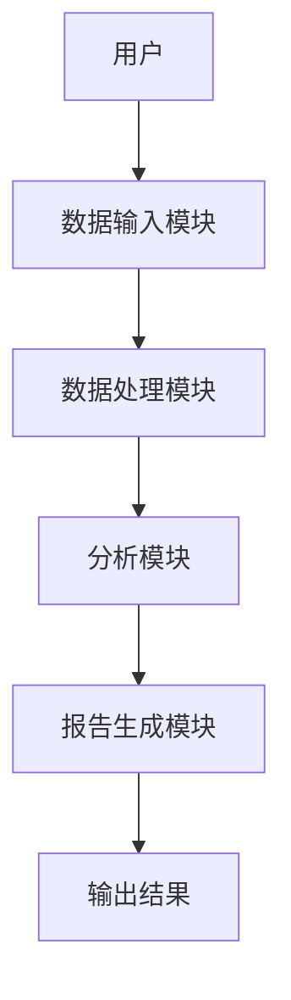

                 

# 彼得林奇对公司资产负债表质量的深度分析

## 关键词：资产负债表分析，彼得·林奇，财务健康，投资决策，财务比率

## 摘要：  
本文深入探讨了彼得·林奇对公司资产负债表质量的分析方法。通过详细讲解资产负债表的核心要素、财务比率分析、风险识别与优化策略，结合实际案例分析，帮助读者理解如何通过资产负债表评估公司的财务健康状况，从而做出明智的投资决策。

---

# 第1章：彼得·林奇与资产负债表分析

## 1.1 彼得·林奇及其投资理念  
彼得·林奇是全球著名投资专家，以其对财务报表的深刻理解和独特见解闻名。他认为，资产负债表是评估公司财务健康状况的核心工具，能够揭示企业的潜在风险和投资价值。

## 1.2 资产负债表的基本概念  
资产负债表是反映企业在某一特定时期内资产、负债和所有者权益的财务报表。它分为资产、负债和所有者权益三大板块，三者之间满足“资产=负债+所有者权益”的基本关系。

---

# 第2章：资产负债表的核心要素

## 2.1 资产分析  
资产是企业拥有的资源，分为流动资产和非流动资产。流动资产包括现金、应收账款和存货等，而非流动资产则包括长期投资和固定资产。

### 资产质量评估的关键指标  
- **应收账款周转率**：衡量企业收账效率。  
- **存货周转率**：反映企业库存管理效率。

## 2.2 负债分析  
负债是企业对外部债权人欠款的总和，包括流动负债和非流动负债。流动负债如短期借款和应付账款，非流动负债如长期借款。

### 负债对财务健康的影响  
- 高比例的流动负债可能增加企业的短期偿债压力。  
- 非流动负债有助于企业优化资本结构。

## 2.3 所有者权益分析  
所有者权益是企业在扣除负债后的剩余部分，包括实收资本、资本公积和未分配利润等。

### 净资产收益率（ROE）  
$$ROE = \frac{\text{净利润}}{\text{所有者权益}}$$  
ROE越高，说明企业利用股东资金的效率越高。

---

# 第3章：财务比率分析

## 3.1 偿债能力比率  
- **流动比率**：$$\text{流动比率} = \frac{\text{流动资产}}{\text{流动负债}}$$  
- **速动比率**：$$\text{速动比率} = \frac{\text{流动资产 - 存货}}{\text{流动负债}}$$  

## 3.2 营运能力比率  
- **应收账款周转率**：$$\text{应收账款周转率} = \frac{\text{营业收入}}{\text{应收账款}}$$  
- **存货周转率**：$$\text{存货周转率} = \frac{\text{营业成本}}{\text{平均存货}}$$  

## 3.3 盈利能力比率  
- **净利率**：$$\text{净利率} = \frac{\text{净利润}}{\text{营业收入}}$$  
- **资产回报率（ROA）**：$$\text{ROA} = \frac{\text{净利润}}{\text{总资产}}$$  

---

# 第4章：财务风险识别与优化策略

## 4.1 财务风险的定义与分类  
财务风险包括偿债风险和流动性风险。高负债率的企业面临较大的偿债压力，而流动性不足的企业可能难以应对短期债务。

## 4.2 资产负债表中的风险信号  
- 过高的流动负债比例：可能导致短期偿债压力大。  
- 过低的速动比率：可能表明企业缺乏足够的流动性。

## 4.3 财务风险的量化分析  
- **负债率**：$$\text{负债率} = \frac{\text{总负债}}{\text{总资产}}$$  
- **财务杠杆**：$$\text{财务杠杆} = \frac{\text{资产总额}}{\text{所有者权益}}$$  

## 4.4 资产负债表优化策略  
- **资产结构优化**：减少低效资产，增加高回报资产。  
- **负债结构优化**：调整短期和长期负债的比例，降低偿债压力。  
- **所有者权益管理**：通过盈利和资本公积增加所有者权益，降低财务杠杆。

---

# 第5章：数学模型与算法

## 5.1 净资产收益率（ROE）的计算  
$$\text{ROE} = \frac{\text{净利润}}{\text{所有者权益}}$$  
ROE越高，说明企业利用股东资金的效率越高。

## 5.2 财务风险评分模型  
$$\text{财务风险评分} = 0.5 \times \text{流动比率} + 0.3 \times \text{速动比率} + 0.2 \times \text{负债率}$$  

---

# 第6章：系统分析与架构设计

## 6.1 系统功能模块划分  
- 数据输入与处理模块：采集和清洗资产负债表数据。  
- 分析模块：计算各项财务比率，识别风险信号。  
- 报告生成模块：输出分析结果和投资建议。

## 6.2 系统架构设计  

---

# 第7章：项目实战

## 7.1 实际案例分析  
以某制造公司为例，分析其资产负债表，计算各项财务比率，评估财务健康状况。

## 7.2 投资建议  
根据分析结果，提出优化资产负债表的建议，如调整负债结构或提高资产周转率。

---

# 第8章：总结与最佳实践

## 8.1 最佳实践  
- 定期分析资产负债表，及时发现潜在风险。  
- 结合其他财务报表，如利润表和现金流量表，进行综合分析。

## 8.2 小结  
通过深入分析资产负债表，投资者可以准确评估企业的财务健康状况，做出明智的投资决策。

---

作者：AI天才研究院 & 禅与计算机程序设计艺术

