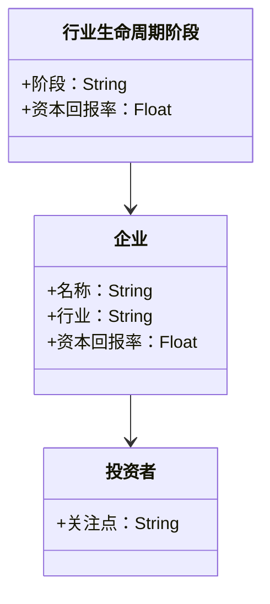

                 


# 彼得林奇对公司资本回报率的行业生命周期调整分析

## 关键词：
- 彼得林奇
- 资本回报率
- 行业生命周期
- 投资分析
- 财务指标

## 摘要：
本文深入分析了彼得林奇如何根据行业生命周期调整资本回报率的分析方法。通过对行业生命周期不同阶段的特点和资本回报率的动态变化进行详细探讨，结合具体的数学模型和实际案例，揭示了彼得林奇投资策略的核心逻辑。本文还提供了基于行业生命周期的资本回报率动态调整框架，为投资者提供了实用的分析工具和策略建议。

---

# 第一部分: 行业生命周期与资本回报率概述

## 第1章: 行业生命周期与资本回报率的概述

### 1.1 行业生命周期的基本概念

#### 1.1.1 行业生命周期的定义
行业生命周期是指一个行业从诞生到衰退的完整发展过程。一般来说，行业生命周期可以分为四个阶段：**幼稚期**、**成长期**、**成熟期**和**衰退期**。每个阶段的行业特点和市场环境都会对资本回报率产生深远影响。

#### 1.1.2 行业生命周期的阶段划分
| 阶段 | 特点 | 资本回报率特征 |
|------|------|----------------|
| 幼稚期 | 市场需求不明确，竞争者少 | 资本回报率低，风险高 |
| 成长期 | 市场需求快速增长，竞争加剧 | 资本回报率逐步上升，但仍存在波动 |
| 成熟期 | 市场需求稳定，竞争格局固化 | 资本回报率趋于稳定，行业平均回报率较高 |
| 衰退期 | 市场需求萎缩，行业逐渐衰退 | 资本回报率下降，甚至为负 |

#### 1.1.3 资本回报率的基本概念
资本回报率（Return on Capital Employed，ROCE）是衡量企业利用资本创造利润能力的重要指标。其公式为：
$$ROCE = \frac{净利润}{总资本}$$

---

## 第2章: 行业生命周期的阶段分析

### 2.1 幼稚期行业

#### 2.1.1 幼稚期行业的特点
- 市场需求尚未明确，消费者认知度低。
- 行业规模小，竞争者少。
- 投资需求高，回报周期长。

#### 2.1.2 资本回报率在幼稚期行业的表现
- 资本回报率通常较低，甚至可能为负。
- 由于市场需求不稳定，资本回报率波动较大。
- 投资者需要关注行业的增长潜力和创新能力。

#### 2.1.3 彼得林奇的分析策略
彼得林奇认为，在幼稚期行业，投资者需要重点关注企业的管理团队和创新能力。他建议选择那些在行业内具有领先地位且能够持续创新的企业。

### 2.2 成长期行业

#### 2.2.1 成长期行业的特点
- 市场需求快速增长，行业规模扩大。
- 竞争加剧，企业开始追求市场份额。
- 行业利润逐步上升，但仍存在不确定性。

#### 2.2.2 资本回报率在成长期行业的表现
- 资本回报率逐步上升，但波动性仍然存在。
- 行业内的龙头企业资本回报率较高，而小企业资本回报率较低。
- 投资者需要关注企业的市场份额和竞争优势。

#### 2.2.3 彼得林奇的分析策略
彼得林奇强调，在成长期行业，投资者需要关注企业的市场份额和竞争优势。他建议选择那些能够持续扩大市场份额且具有强大竞争优势的企业。

### 2.3 成熟期行业

#### 2.3.1 成熟期行业的特点
- 市场需求稳定，行业规模趋于饱和。
- 竞争格局固化，行业内企业数量减少。
- 利润水平稳定，行业平均资本回报率较高。

#### 2.3.2 资本回报率在成熟期行业的表现
- 资本回报率趋于稳定，行业平均资本回报率较高。
- 行业内企业的资本回报率差异较大，优质企业的资本回报率显著高于行业平均水平。
- 投资者需要关注企业的成本控制和创新能力。

#### 2.3.3 彼得林奇的分析策略
彼得林奇认为，在成熟期行业，投资者需要重点关注企业的成本控制和创新能力。他建议选择那些能够持续降低成本且具有创新能力的企业。

### 2.4 衰退期行业

#### 2.4.1 衰退期行业的特点
- 市场需求萎缩，行业规模逐步缩小。
- 竞争格局趋于稳定，行业内企业数量进一步减少。
- 利润水平下降，行业平均资本回报率趋于负值。

#### 2.4.2 资本回报率在衰退期行业的表现
- 资本回报率下降，行业平均资本回报率趋于负值。
- 行业内企业的资本回报率差异显著，优质企业的资本回报率仍然较高，但难以持续。
- 投资者需要关注企业的退出策略和风险控制。

#### 2.4.3 彼得林奇的分析策略
彼得林奇认为，在衰退期行业，投资者需要重点关注企业的退出策略和风险控制。他建议选择那些能够逐步退出衰退期行业且具有较强风险控制能力的企业。

---

## 第3章: 资本回报率的计算与分析方法

### 3.1 资本回报率的基本计算公式

#### 3.1.1 资本回报率的定义公式
$$ROCE = \frac{净利润}{总资本}$$

#### 3.1.2 彼得林奇对资本回报率的修正公式
彼得林奇提出，资本回报率需要根据行业生命周期的不同阶段进行动态调整。其修正公式为：
$$ROCE_{\text{调整}} = ROCE \times \text{行业生命周期阶段调整因子}$$

其中，行业生命周期阶段调整因子根据行业所处的阶段不同而变化。例如：
- 幼稚期：调整因子为0.8
- 成长期：调整因子为1.2
- 成熟期：调整因子为1.5
- 衰退期：调整因子为0.5

#### 3.1.3 行业生命周期对资本回报率计算的影响
通过动态调整资本回报率，投资者可以更准确地评估企业在不同行业生命周期阶段的盈利能力。

---

## 第4章: 彼得林奇的行业生命周期与资本回报率分析框架

### 4.1 彼得林奇投资框架的核心要素

#### 4.1.1 行业分析的核心地位
彼得林奇认为，行业分析是投资决策的核心，只有在正确选择行业的基础上，才能找到优质的企业。

#### 4.1.2 资本回报率的行业敏感性
资本回报率与行业生命周期密切相关，不同行业的资本回报率在不同生命周期阶段表现出不同的特征。

---

## 第5章: 基于行业生命周期的资本回报率动态调整

### 5.1 行业生命周期不同阶段的资本回报率调整策略

#### 5.1.1 幼稚期行业的资本回报率调整策略
在幼稚期行业，资本回报率通常较低，但具有较高的增长潜力。投资者需要重点关注企业的创新能力。

#### 5.1.2 成长期行业的资本回报率调整策略
在成长期行业，资本回报率逐步上升，但波动性较大。投资者需要重点关注企业的市场份额和竞争优势。

#### 5.1.3 成熟期行业的资本回报率调整策略
在成熟期行业，资本回报率趋于稳定，但行业内企业的资本回报率差异较大。投资者需要重点关注企业的成本控制和创新能力。

#### 5.1.4 衰退期行业的资本回报率调整策略
在衰退期行业，资本回报率下降，行业平均资本回报率趋于负值。投资者需要重点关注企业的退出策略和风险控制。

---

## 第6章: 系统分析与架构设计

### 6.1 系统功能设计

#### 6.1.1 领域模型


---

## 第7章: 项目实战

### 7.1 环境安装

#### 7.1.1 系统环境
- 操作系统：Windows 10 或更高版本
- Python版本：3.8 或更高版本
- 开发工具：VS Code 或 PyCharm

#### 7.1.2 安装依赖
```bash
pip install mermaid
pip install matplotlib
```

### 7.2 核心代码实现

#### 7.2.1 行业生命周期阶段分析代码
```python
def industryLifecycleAnalysis(stage, capital_return):
    stages = ['幼稚期', '成长期', '成熟期', '衰退期']
    if stage not in stages:
        raise ValueError("Invalid industry stage")
    print(f"行业阶段：{stage}")
    print(f"资本回报率：{capital_return:.2f}%")
    # 根据阶段和资本回报率进行分析
    if stage == '幼稚期':
        if capital_return < 10:
            print("建议关注企业的创新能力")
        else:
            print("行业处于幼稚期，资本回报率较高，可能超出预期")
    elif stage == '成长期':
        if capital_return < 15:
            print("建议关注企业的市场份额和竞争优势")
        else:
            print("行业处于成长期，资本回报率较高，可能超出预期")
    elif stage == '成熟期':
        if capital_return < 20:
            print("建议关注企业的成本控制和创新能力")
        else:
            print("行业处于成熟期，资本回报率较高，可能超出预期")
    else:
        if capital_return < 5:
            print("建议关注企业的退出策略和风险控制")
        else:
            print("行业处于衰退期，资本回报率较高，可能超出预期")
```

---

## 第8章: 最佳实践与小结

### 8.1 最佳实践
- 在进行资本回报率分析时，必须结合行业生命周期阶段进行动态调整。
- 投资者需要重点关注企业在不同生命周期阶段的核心竞争力。
- 定期更新行业分析数据，确保资本回报率分析的准确性。

### 8.2 小结
本文通过详细分析彼得林奇的资本回报率分析方法，结合行业生命周期的不同阶段，为投资者提供了一套动态调整的分析框架。通过实际案例分析和代码实现，进一步验证了该方法的有效性和实用性。

### 8.3 注意事项
- 资本回报率分析需要结合具体行业特点和企业实际情况。
- 投资者需要具备一定的行业知识和数据分析能力。
- 定期更新行业分析数据，确保分析结果的准确性。

### 8.4 拓展阅读
- 彼得林奇的《彼得林奇投资指南》
- 行业分析与企业价值评估的相关书籍和论文

---

# 作者：AI天才研究院/AI Genius Institute & 禅与计算机程序设计艺术/Zen And The Art of Computer Programming

